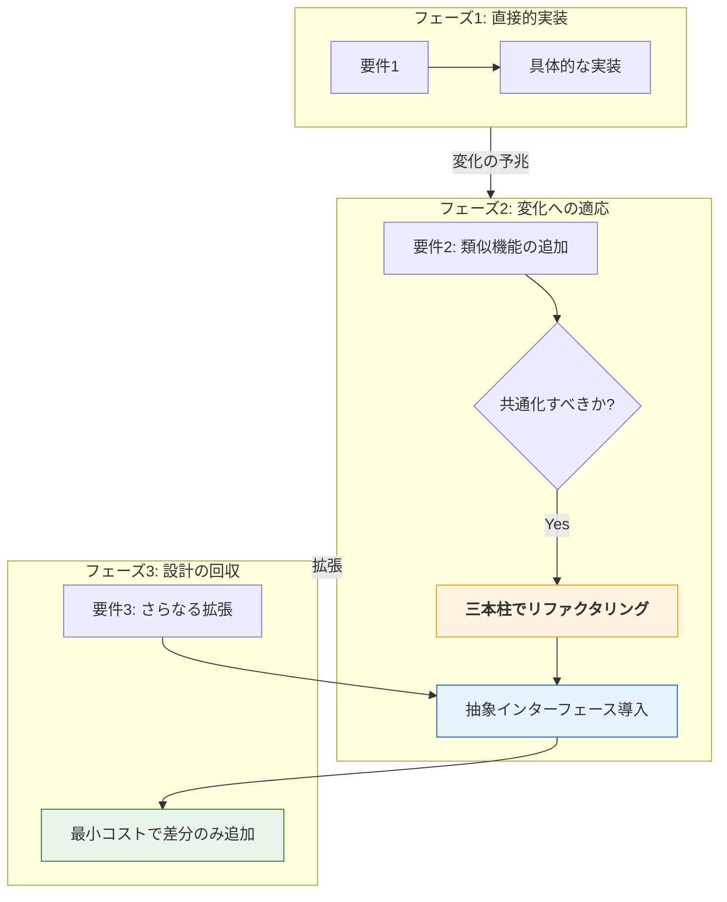

# 第2部 第15章：SOLID原則を「使える思考」にする

## 本章の位置づけ

第13章・第14章の「統合実践」で見たように、原則は単独で存在するものではなく、常にトレードオフの中にあります。本章では、現場で迷ったときに立ち返るべき「設計の三本柱」と、過剰設計を避けるための「適用戦略」について整理します。 **SOLID原則を「日々の開発で使える判断基準」として定着させること** を目的としています。

## 1. SOLIDを支える「三本柱」

本書を通じて、私たちは「C言語の道具」を使い、「SOLID原則」というガイドに従って、設計の **三本柱** を組み上げてきました。これらは以下のように密接に連動しています。

迷ったときは、個別の原則名よりも、まずこの三点を確認してください。

| 設計の柱 | 関連するSOLID原則 | 目的（究極の価値） |
| --- | --- | --- |
|  **責任 (Responsibility)**  |  **SRP**  |  **保守性** : 変更の影響範囲を1箇所に閉じ込める |
|  **契約 (Contract)**  |  **LSP / ISP**  |  **信頼性** : 利用側への保証を最小かつ堅牢にする |
|  **依存 (Dependency)**  |  **OCP / DIP**  |  **拡張性** : 既存コードを壊さずに振る舞いを変える |

SOLID原則は、これら三本柱の「強度」を高めるための具体的な **チェックリストです。** SRPが責任の所在をはっきりさせ、ISP/LSPが契約の品質を担保し、OCP/DIPが依存の向きを制御します。

この連鎖が起きたとき、C言語のコードは初めて「システム」としての柔軟性を獲得します。

## 2. 実務の迷いを断つ「自分への問いかけ」

「S・O・L・I・D」という難しい名前を思い出すのが億劫なときは、次のような「シンプルな問いかけ」を自分に投げかけてみてください。これらは、複雑な設計迷路から抜け出すためのチェックリストとなります。

#### SRP（単一責任原則）

 **問い：「別のタイミングで変わりそうなことが、混在していない？」**   **チェック** : 計算ロジックとログ出力など、変更の動機が異なるものが混在しているなら、分割の合図です。

#### OCP（開放閉鎖原則）

 **問い：「中身を改造しなくても、外から部品を『交換』するだけで済まないかな？」**   **チェック** : 機能追加のたびに `switch-case` を修正しているなら、VTableによる分岐（多態性）の導入を検討します。

#### LSP（リスコフ置換原則）

 **問い：「抽象（インターフェース）が約束した『当たり前』を、具象が裏切っていない？」**   **チェック** : 「呼ぶ前に必ず初期化が必要」といった隠れた制約は、利用者を混乱させます。

#### ISP（インターフェース分離原則）

 **問い：「その人に関係のない道具まで、一つの箱に詰め込んで渡していない？」**   **チェック** : 不要な関数が見えていると、誤用や不要な再コンパイルの原因になります。

相手に必要な最小限の窓口だけを見せましょう。

#### DIP（依存性逆転原則）

 **問い：「安定させたい上位のロジックが、変化の激しい下位（ハード・外部ライブラリ）の都合に振り回されていない？」**   **チェック** : 特定のハードウェアに依存してビジネスロジックが汚染されているなら、インターフェースを挟んで依存の矢印を逆転させます。

## 3. 実務で設計するための思考プロセス

コードを書く前、あるいはリファクタリングの際に、以下のステップで思考を整理してください。原則を適用する「順序」が重要です。

 **変化の予兆** : 何が変わりそうで、何が変わらないのか？  **影響範囲** : その変化は誰（どのモジュール）に波及するのか？

 **カプセル化** : 影響を隠すために、どこに境界線を引くべきか？  **インターフェース** : その境界線で、どのような「契約」を交わすべきか？

このプロセスが自分の中でカチッと噛み合ったとき、あなたのプログラミングはもっと自由で、見通しの良いものに変わるはずです。

## 4. 「あえてやらない」という戦略（YAGNI）

SOLID原則を使えばコードの品質は上がりますが、同時に「抽象化のコスト」も発生します。VTableや不透明ポインタによる抽象化には、以下のコストが伴います。

-  **コードの記述量が増える** （ボイラープレート）
-  **関数ジャンプによる僅かな性能低下** 
-  **コードを追う際のジャンプの手間** （可読性の低下）

もし、その箇所が「今後数年間、絶対に仕様が変わらない」と確信できるなら、あえてベタ書き（密結合）のままにしておくのが正解かもしれません。実務において最も重要な戦略は、 **「抽象化は、必要になったその瞬間に導入する」** ことです。

「いつか使うかも」と先回りして作った構造（Over Engineering）は、負債になることが大半だからです。

#### 段階的な適用のイメージ

以下のように、変更の兆候が見えた段階でリファクタリングを行うのが、コストと柔軟性のバランスが取れた現実的なアプローチです。

#### リファクタリングのフェーズ

ソフトウェアの成長に合わせて、段階的に設計を進化させていくプロセスです。

これがYAGNI（You Aren't Gonna Need It）の実践です。

 **フェーズ1** : 最初はベタ書き（密結合）でも構いません。最速で価値を届けます。  
 **フェーズ2** : 類似の変更要求が来たとき、初めて「三本柱」を意識して抽象化を導入します。  
 **フェーズ3** : 抽象化済みなので、以降の変更は最小コストで受け入れられます。 

迷ったときは、具体的な実装（DIや複雑なComposite）の導入は、二つ目の具象が必要になった瞬間まで「寝かせておきます」。この  **「遅延された設計判断」**  こそが、過剰設計を防ぎつつ、SOLIDの恩恵を最大化する実務家の知恵です。

## 5. 設計は、もっと自由でいい

C言語は、ポインタやメモリ管理など、自分たちの手で泥臭く積み上げなければならない言語です。でもだからこそ、設計の原則という「道標」があれば、これほど面白い言語はありません。

 **「責任・契約・依存」** という設計の三本柱を、C言語の道具とSOLID原則によって制御します。
この思考プロセスが自分の中でカチッと噛み合ったとき、あなたのプログラミングはもっと自由で、ワクワクするものに変わるはずです。さあ、いよいよ最後の旅へ向かいましょう。

[[20_おわりに|おわりに]]。
