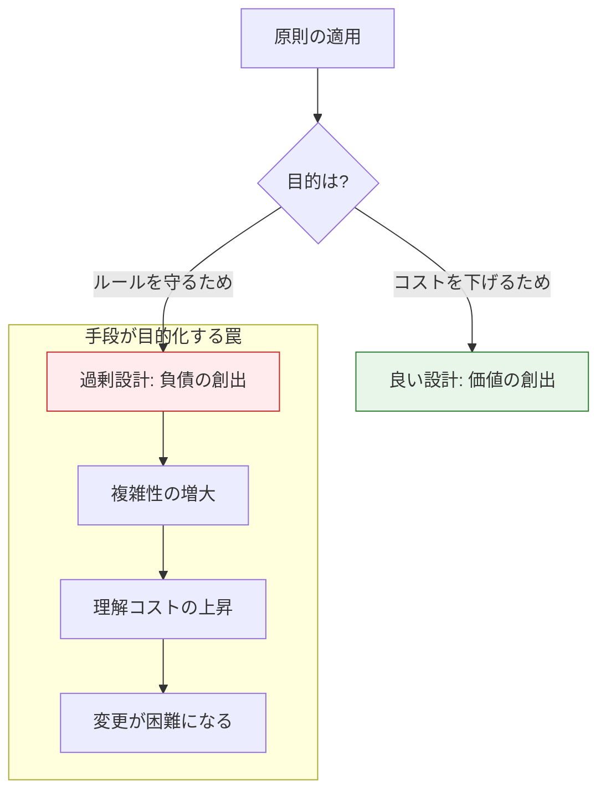

# おわりに

**原則は目的ではなく、価値を生むための手段である**

本書を最後まで読み進めたエンジニアの皆様は、C言語によるソフトウェア開発のために多くの原則・構造・実装技法を習得しました。第1部で「道具」を手にし、第2部で「指針（SOLID）」を学び、それらを統合的に活用する術を身につけました。

最後に、本書が最も強調したいメッセージを記します。それは、**「原則を守ること」自体がゴールになってはいけない**ということです。

## 設計原則の「罠」に、はまらないために

真面目なエンジニアほど、「本に書いてあったから」とルールを厳格に適用しようとしがちです。しかし、目的を忘れた適用は、かえってコードを複雑にし、開発の足を引っ張ることになります。

### 手段と目的の分離

**この図が示すもの**:
同じ「原則の適用」でも、その動機によって結果が「良い設計」になるか「負債」になるかが分かれる分岐点です。

**注目ポイント**:

* **目的の確認**: 常に「なぜやるのか（Why）」を問い続けることが、過剰設計（手段の目的化）を防ぐ唯一の方法です。

良い設計 **とは**、単にルールを遵守することではなく、**「明日の自分や仲間が、楽に変更できる状態を作ること」**です。その本来の目的を見失わないよう、常に「これは本当に必要か？」「これで読みやすくなるか？」を自らに問い続けてください。

## 正解のない世界で「自分の軸」を持つ

設計という行為に、唯一無二の正解はありません。あるのは、その時々の状況における「最適解」と「トレードオフ」だけです。

本書で示したのは、あくまで一つの地図に過ぎません。これからは、あなた自身の現場での経験を積み上げ、**「自分なりの設計の基準」**を確立してください。

* 「今回のプロジェクトの規模感では、このレベルの抽象化が最もメンテナンスしやすかった」
* 「この依存の切り方が、チームにとって一番理解しやすかった」

そうした実体験に基づく「軸」を持つことが、設計者としての真の強みになります。本書の内容をそのまま守る必要はありません。本書を土台にして、あなた自身の設計哲学を築き上げてください。

## 最後に ―― 設計という冒険を楽しもう

本書で紹介したあらゆる設計原則は、すべて **あなたを助けるための道具** です。

道具に振り回されるのではなく、道具を使いこなし、素晴らしいソフトウェアを作り上げてください。思い通りに、軽やかに変更できる設計ができたときの楽しさや嬉しさは、エンジニアにとって何物にも代えがたい報酬です。

その楽しさを、ぜひ現場の最前線で体感してください。
あなたがこれから作るソフトウェアが、あなた自身と、それに関わる人々に喜びをもたらし、長く愛されるものになることを確信しています。

設計を楽しみましょう。あなたの挑戦を応援しています。

## 著者について

**花島 弘明（Hiroaki Hanajima）**

ソフトウェア開発に携わって20年以上になりますが、私の設計もまだまだ「道半ば」です。昨日書いた自分のコードを見て、「なんでもっと綺麗に書けなかったんだ……」と頭を抱える毎日は、新人の頃とあまり変わりません。
でも、その「もっと良くできるはず」という試行錯誤こそが、エンジニアという仕事の面白さだと考えています。
C言語という、何もしなければ泥臭いままの言語において、あえてSOLID原則を一つずつ手作業で組み立てていく。このプロセスを通じて、私は「設計の本質」とは何かを改めて問い直すことができました。
本書は、そんな私の「試行錯誤の記録」でもあります。
設計という正解のない海を旅する一人のエンジニアとして、本書が皆様の航路を照らす一助となれば、これほど嬉しいことはありません。

## 著書紹介

**[SOLID原則で実践するC言語ソフトウェア設計](https://www.google.com/url?sa=E&source=gmail&q=https://www.amazon.co.jp/dp/B0FR4FNM67)**

**「明日の自分のために、コードを美しく保つ」**

設計に悩むすべてのエンジニアへ贈る一冊です。本書が、あなたの開発現場における「変化」を恐れない勇気の一助となることを願っています。