Gemini

LSP: 契約と置換可能性の保証
チャットを新規作成
作成したもの
Gem

Kindle本の校正担当

コーディング パートナー
チャット
Manusの強みとKindle本作成
LSP: 契約と置換可能性の保証
Unity AIエージェント開発のステップ
Obsidian Kindle執筆：章連携管理
Gemini API利用料金と無料枠
LSP: C言語での契約と実装
AntiGravityの日本語設定方法
レビューガイドラインの最適化
ラップバトル 挑戦状！
Anti-GravityによるMarkdownファイル自動修正
開放閉鎖原則（OCP）の実践
ヘッダ設計による依存関係最適化
Kindle本執筆の複数ファイル集約
C言語設計原則と実践ガイド
C言語設計入門：道具・原則・価値
C言語設計原則と実践
C言語設計原則と実践ガイド
C言語設計の基礎と原則
校正AIスタンバイ、原稿入力待ち
C言語設計原則と実践の統合
C言語設計の普遍的理由と実践
C言語ヘッダ設計と依存最小化
単一責任原則：C言語での実装
C言語設計原則の学習フレームワーク
C言語設計原則と実践の書
テキスト抽出・Markdown保存スクリプト
キー入力でAI処理をスキップ
C言語設計原則と実践の書
ガイドライン修正：全文出力・省略禁止
C言語設計入門：トーン＆マナー修正
校正ガイドラインの確定と作業開始
「あるある」表現の修正提案
校正Gemプロンプトの構造統一指示
C言語設計原則と実践の書

設定とヘルプ
Gemini との会話
--- 処理対象ファイル: 14_第2部 第10章 リスコフ置換原則 (LSP) 多態性の安全性と契約の保証_01.md ---


# 第2部 第10章 リスコフ置換原則 (LSP): 多態性の安全性と契約の保証


この章の主題は、設計の三本柱のうち**「契約」**の柱です。LSPを適用することで、抽象インターフェースが定義した**「利用法」**と**「変更耐性」**を具象実装が厳格に保証し、**多態性の安全性**を確保します。


この原則を実現するための具体的な**道具（技術）** として、**第1部 第4章 不透明型と不透明ポインタ**による隠蔽と、**第1部 第6章 エラーハンドリングパターン**による契約の遵守を参照します。これらの道具がどのようにして、**多態性の安全な実現**という設計目標を達成するのかを詳細に学びます。


## 1. 原則の哲学と本質


### 1.1. LSPの本質は「置換可能性」


**リスコフ置換原則**（Liskov Substitution Principle、以下 **LSP**）は、開放閉鎖原則（OCP）と対になる原則です。OCPが「どのように拡張するか（**構造**）」を定義するのに対し、LSPは「その拡張が既存のシステムを壊さないことを、どのように保証するか（**品質**）」を定義します。


いわば、OCPが「新しいプラグインを差し込めるソケット」を作る設計図だとすれば、LSPは「そこに差し込むプラグインが満たすべき電圧や形状の規格」を定めるものです。


### 1.2. LSPの定義：厳格かつシンプルなルール


LSPは、計算機科学者バーバラ・リスコフによって以下のように定義されました。


> 「プログラム中の型  のオブジェクトにおいて、その派生型  のオブジェクトで置換したとしても、プログラムの性質（正しさ）が変わらないこと」


つまり、クライアントコードが抽象インターフェース  に依存している場合、どの具象実装（）が渡されたとしても、クライアント側は一切の修正を必要とせず、かつ予期せぬ挙動に怯えることなく動作し続けなければならない、という原則です。


### 1.3. ソケットとプラグの比喩：契約と違反


以下の図は、リスコフの置換原則（LSP）における **「契約（約束事）」と「信頼」**の関係を、コンセントの差し込み口（ソケット）とプラグに例えて表現しています。


### 契約と実装の適合イメージ


**この図が示すもの**:

抽象インターフェース（ソケット）に対して、LSPを満たす実装（プラグA, B）と、LSPに違反する実装（プラグC）の違いを可視化しています。


**注目ポイント**:


* **ソケット（契約）**: 「どんなアドレスでも受け入れる」という広い契約を提示。

* **プラグA, B（遵守）**: 契約通り、あるいは内部で調整して動作するため「OK」。

* **プラグC（違反）**: 「特定の条件しか受け付けない」という**事後条件の強化（制約の追加）**を行っているため「NG」。


**読み方のガイド**:


* 二重線（===）: 契約に基づく正常な接続

* 点線（-.-）: 期待に反する不正な接続

* NGノード: クライアントコードにバグを引き起こす箇所


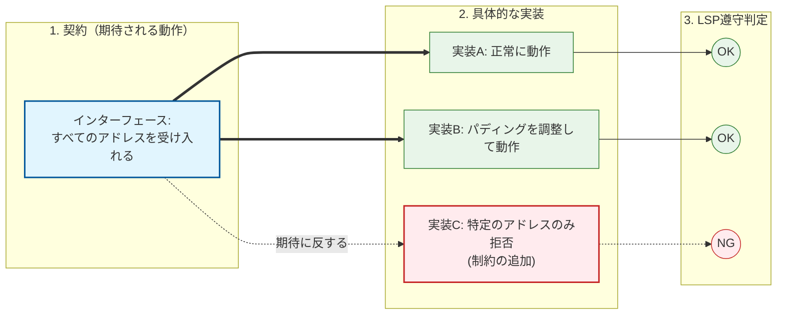
```mermaid

graph LR

    %% 1. 共通契約層

    subgraph Contract ["1. 契約（期待される動作）"]

        Socket["インターフェース:<br/>すべてのアドレスを受け入れる"]

    end


    %% 2. 実装層

    subgraph Impls ["2. 具体的な実装"]

        PlugA["実装A: 正常に動作"]

        PlugB["実装B: パディングを調整して動作"]

        PlugC["実装C: 特定のアドレスのみ拒否<br/>(制約の追加)"]

    end


    %% 3. 判定結果層

    subgraph Results ["3. LSP遵守判定"]

        OK1(("OK"))

        OK2(("OK"))

        NG1(("NG"))

    end


    %% 接続関係（水平ラインを強制）

    Socket ===> PlugA ---> OK1

    Socket ===> PlugB ---> OK2

    Socket -.->|"期待に反する"| PlugC -.-> NG1


    %% スタイル設定

    style Socket fill:#e1f5fe,stroke:#01579b,stroke-width:2px

    style PlugA fill:#e8f5e9,stroke:#2e7d32

    style PlugB fill:#e8f5e9,stroke:#2e7d32

    style PlugC fill:#ffebee,stroke:#c62828,stroke-width:2px

    style OK1 fill:#e8f5e9,stroke:#2e7d32

    style OK2 fill:#e8f5e9,stroke:#2e7d32

    style NG1 fill:#ffebee,stroke:#c62828


```


#### なぜプラグCはダメなのか？


このような「勝手なルール」を持つ実装が一つでも混じると、利用者は不安になります。「今度の相手は特殊なルールがあるかも？」と疑い、コードの中に「もし相手がCなら……」という余計なチェックを書き足さなければならなくなります。


**「後から参加するメンバー（実装）は、共通のルール（契約）を勝手に厳しくしてはいけない」**


これが、この原則の核心です。


### 1.4. 契約の3要素：LSPを構成する要件


LSPをC言語の実装レベルで理解するために、契約を**「前提条件」「事後条件」「不変条件」**の3つに分解して考える。これらを破る実装は、すべてLSP違反である。


#### 契約の構造


**この図が示すもの**:

関数の呼び出しから終了までの流れの中で、どのタイミングでどの条件が満たされている必要があるかを示します。


**用語の定義**:


* **前提条件**: 関数を呼ぶ前に**呼び出し側**が守るべきルール（引数の範囲など）。

* **不変条件**: 処理中も常に維持されるべきシステムの整合性ルール。

* **事後条件**: 関数が戻る際に**実装側**が保証すべき結果（戻り値の状態など）。


```mermaid

graph LR

    Pre["前提条件<br/>(Precondition)<br/>呼び出し側の義務"]

    Inv["不変条件<br/>(Invariant)<br/>常に維持されるルール"]

    Post["事後条件<br/>(Postcondition)<br/>提供側の保証"]

    

    Pre -->|"契約の入口"| Inv

    Inv -->|"処理中の保証"| Post

    Post -->|"契約の出口"| Result[正しい結果]

    

    style Pre fill:#e1f5fe,stroke:#01579b,stroke-width:2px

    style Inv fill:#fff3e0,stroke:#e65100,stroke-width:2px

    style Post fill:#e8f5e9,stroke:#2e7d32,stroke-width:2px

    style Result fill:#f3e5f5,stroke:#4a148c


```


### 1.4.1. 前提条件（Precondition）：呼び出し側の義務を増やさない


**「具象実装は、前提条件を強化してはならない」**


インターフェースが「引数に0以上の値を受け取る」と定義しているなら、具象実装が勝手に「私は10以上の値しか受け付けない」と条件を厳しくしてはならない。


#### **ケース1：ストレージドライバの整列制約**


抽象インターフェース `write(addr, data)` において、仕様上は「任意のアドレス」への書き込みが可能とされている。しかし、特定の安価なフラッシュメモリの実装が「書き込みアドレスは4バイト境界（4の倍数）でなければならない」という制約を独自に追加し、それ以外でエラーを返すようにした。


**なぜ問題か：** クライアントは「任意のアドレスに書ける」と信じて設計されている。特定の実装のために、クライアント側ですべてのデータ配置を4バイト境界に揃える修正が必要になり、多態性の恩恵が失われる。


#### **ケース2：ファイルシステムのパス長**


共通インターフェースで「最大256文字のパスを受け付ける」となっているが、新しいSDカード実装が「独自のFAT制限により8文字までしか受け付けない」とした場合、既存の長いファイル名を扱う上位モジュールはすべてクラッシュするか、動作不能になる。


### 1.4.2. 事後条件（Postcondition）：戻り値の保証を弱めない


**「具象実装は、事後条件を弱化してはならない」**


インターフェースが「処理成功時には必ず有効なポインタを返す」と約束しているなら、具象実装が「時々NULLを返すかもしれない」といった曖昧な振る舞いをしてはならない。


#### **ケース1：センサーデータの単位変換**


インターフェース `get_temperature()` が、「摂氏（℃）単位の浮動小数点を返す」と定義されているとする。ところが、新しい高精度センサーの実装が、精度を優先するあまり「華氏（℉）」で値を返してしまった。


**なぜ問題か：** クライアントは返ってきた値を「摂氏」として処理（例：30度以上ならアラーム）する。単位が変わるという「事後条件の変更」は、システム全体に誤動作を引き起こす。


#### **ケース2：エラーコードの私物化**


インターフェースが「失敗時は負の値を返す」と定めている。しかし、ある実装が「成功だがデータが空の場合、特殊な正の値 100 を返す」とした。


**なぜ問題か：** クライアントが `if (result < 0)` でエラー判定をしていた場合、この「100」を見逃し、不正なデータを正常として処理してしまう。


### 1.4.3. 不変条件（Invariant）：不変のルールを破壊しない


**「具象実装は、システムが維持すべき不変のルールを破壊してはならない」**


例えば、「通信セッション中は必ず接続状態（Connected）を維持する」というルールがある場合、具象実装の内部処理で勝手に切断してはならない。


#### **ケース1：読み取り専用リストの内部ソート**


リスト構造のインターフェースに `get_count()` がある。ある具象実装（キャッシュ機能付きリスト）が、内部の高速化のために `get_count()` を呼ぶたびに内部データを勝手に並び替えてしまった。


**なぜ問題か：** もしクライアントが「リストの順序は不変である」という前提でループを回していた場合、単に件数を確認しただけで順序が変わると、処理結果が支離滅裂になる。


#### **ケース2：共有リソースの排他制御**


「この関数を抜けるときは、必ずミューテックスを解放した状態でなければならない」という不変条件がある。しかし、特定の異常系処理でリターンする際に、ミューテックスを保持したまま終了する実装を追加してしまった。


**なぜ問題か：** 次にそのリソースにアクセスするクライアントが永久にデッドロックし、システムが停止する。


### 1.5. 三つの裏切りをしない：LSPの要約


リスコフの置換原則（LSP）を要約すると、**「インターフェースの仕様（入力・処理・出力）を絶対に裏切らない」**という、信頼関係の維持に尽きます。


ただ、「文法（型）」を守るだけでなく、**「相手（利用者）の期待」まで守る**という点が、この原則の深みです。


利用者は、インターフェースという「窓口」を見てコードを書きます。その窓口に書かれていない**「独自のマイルール」**を具象側で勝手に追加してしまうのがLSP違反です。


整理すると、以下の「3つの裏切り」をしないことと言えます。


#### 1. 入力の裏切り（前提条件の強化）


* **約束**: 「誰でも入っていいですよ」

* **違反**: 「実は、青い服の人以外は立ち入り禁止です」

* **実務**: インターフェースでは「どのアドレスでもOK」なのに、具象側が「4の倍数以外はエラー」にするなど。利用者は「えっ、わざわざ相手に合わせて服（データ）を着替えなきゃいけないの？」と困惑します。


#### 2. 出力の裏切り（事後条件の弱化）


* **約束**: 「成功したら、必ず品物を渡します」

* **違反**: 「成功したけど、品物（ポインタ）はNULLです。中身は空っぽです」

* **実務**: 「成功時は有効な値を返す」はずが、特定の具象だけ「成功だけど意味が違う値」を返すなど。利用者は「成功って言ったのに、中身が使えないじゃないか！」と怒ります。


#### 3. 振る舞いの裏切り（不変条件の破壊）


* **約束**: 「中身はいじりません。見るだけです」

* **違反**: 「見たついでに、こっそり中身を並び替えちゃいました」

* **実務**: 単なるデータ取得関数のはずが、内部で勝手に状態を変えてしまう。利用者は「ちょっと見ただけなのに、次に見たら順番が変わってる！」とパニックになります。


#### なぜ「当然のこと」が原則になるのか？


「仕様を守るなんて当然」と思えますが、開発現場では**「この新しいデバイス（具象）は特殊だから、少しだけ仕様を変えてもいいよね？」**という誘惑が常にあります。


しかし、その「少しの書き換え」を許すと、利用者は全てのコードに対して：

`if (相手がデバイスAなら) ... else if (相手がデバイスBなら) ...`

と、**相手の顔色を伺う「分岐」を激増**させることになります。


**「相手が誰であっても、窓口の言葉（インターフェース）だけを信じていれば、絶対に大丈夫」**

この100%の安心感を保証することが、LSPの最大の目的なのです。


## 2. C言語での実現手段と設計要素


C言語には言語レベルでの `interface` キーワードがないため、LSPを守るには**「第1部の技術」**を規律を持って適用する必要がある。


### 2.1. LSP遵守の三つの処方箋


#### 1. **不透明ポインタ（第4章）の活用**


具象構造体の中身を隠蔽し、クライアントが具象の型に依存した「型キャスト」を行えないようにする。これにより、「特定の型だけ特別扱いする」という誘惑を物理的に断つ。


#### 2. **厳格なエラーハンドリング（第6章）**


インターフェースヘッダに、その関数が返しうるエラーコードの範囲を明記する。具象実装は、その範囲外の「自分勝手なエラーコード」を返してはならない。


#### 3. **ユニットテストによる契約検証**


新しい具象実装を作成した際は、共通のインターフェーステストスイートを通す。どの子クラスも同じテスト（同じ入力に対して同じ期待値）をパスすることを保証する。


### 2.2. 抽象インターフェースの契約定義


OCPで解説した**VTableパターン**によって抽象インターフェースを定義することが、LSP実現の土台となる。VTableの関数ポインタのシグネチャと、それらが満たすべき**契約コメント**を厳密に記述する。

C言語では**ヘッダファイルそのものが契約書**となるため、ここで定義されたルール（コメント含む）を守ることがLSP適用の第一歩となる。


#### **IFileStream.h（抽象インターフェースのVTable定義）**


```c

#ifndef IFILE_STREAM_H

#define IFILE_STREAM_H


#include <stddef.h>

#define MAX_READ_SIZE 4096


/* エラーコードの定義（契約の一部） */

#define SUCCESS 0

#define ERROR_EOF -1

#define ERROR_TEMPORARY -2

#define ERROR_FATAL -3


/**

 * @brief 抽象ストリームインターフェースが満たすべき契約（VTable）。

 * すべての具象実装は、以下の契約を厳守しなければならない。

 */

typedef struct {

    /**

     * @brief データ読み込み関数。

     * * [前提条件] 

     * - size > 0 かつ size <= MAX_READ_SIZE であること

     * - context != NULL, error_code != NULL

     * * [事後条件] 

     * - 成功時: 非NULLを返し、*error_code = SUCCESS

     * - 失敗時: NULLを返し、*error_codeに以下のいずれかをセット:

     * * ERROR_EOF: データ終端に到達

     * * ERROR_TEMPORARY: 一時的なエラー（リトライ可能）

     * * ERROR_FATAL: 致命的なエラー（リトライ不可）

     * * [不変条件] 

     * - contextポインタとerror_codeポインタの指す先は変更されない

     * - 返却されるデータは、次の読み込みまで有効である

     */

    void* (*read_data)(void* context, size_t size, int* error_code);

    

    /**

     * @brief ストリームのクローズ。

     * * [前提条件] context != NULL

     * [事後条件] SUCCESS or ERROR_FATAL を返す

     * [不変条件] 一度closeしたストリームは再度openできない

     */

    int (*close)(void* context);

    

} IFileStreamVTable;


/* 抽象型（クライアントが依存する型） */

typedef struct {

    const IFileStreamVTable* vtable;

    void* context;

} IFileStream;


/* ラッパー関数 */

static inline void* file_stream_read(IFileStream* stream, size_t size, int* error_code) {

    return stream->vtable->read_data(stream->context, size, error_code);

}


static inline int file_stream_close(IFileStream* stream) {

    return stream->vtable->close(stream->context);

}

#endif


```


### 2.3. 不完全型と`void* context`による具象データからの隔離


C言語においてLSPを実現する上で重要なのが、**具象実装の内部データ構造（構造体）をクライアントから完全に隠蔽**することである。


* **不完全型 (`struct Concrete;`)**: 具象データ型の定義をヘッダから排除することで、クライアントは具象構造体のサイズやフィールドの存在を知ることができない。

* **`void* context`**: VTableのメソッドは、第1引数として具象データへの不透明なポインタ (`void* context`) を受け取る。これにより、クライアントコードは具象データへの**静的な依存**を断ち切れる。


具象実装が隠蔽されていれば、具象実装内でデータを追加・変更しても、抽象型 (`IFileStream`) を使うクライアントのコードは影響を受けず、「**修正に対して閉じている**」状態が維持され、LSPの置換可能性が担保される。


#### 依存関係と隠蔽の構造


**この図が示すもの**:

クライアントが「抽象」のみに依存し、具象実装の「詳細」から物理的に隔離されている様子を示します。


**注目ポイント**:


* **クライアント層**: 具象クラス（`ConcreteA`, `ConcreteB`）を知らず、`VTable` という契約のみを知っています。

* **void* context**: このポインタを経由することで、型情報を漏らさずに具象データを操作します。


**読み方のガイド**:


* 矢印: 依存の方向

* 点線: 実行時の動的な参照


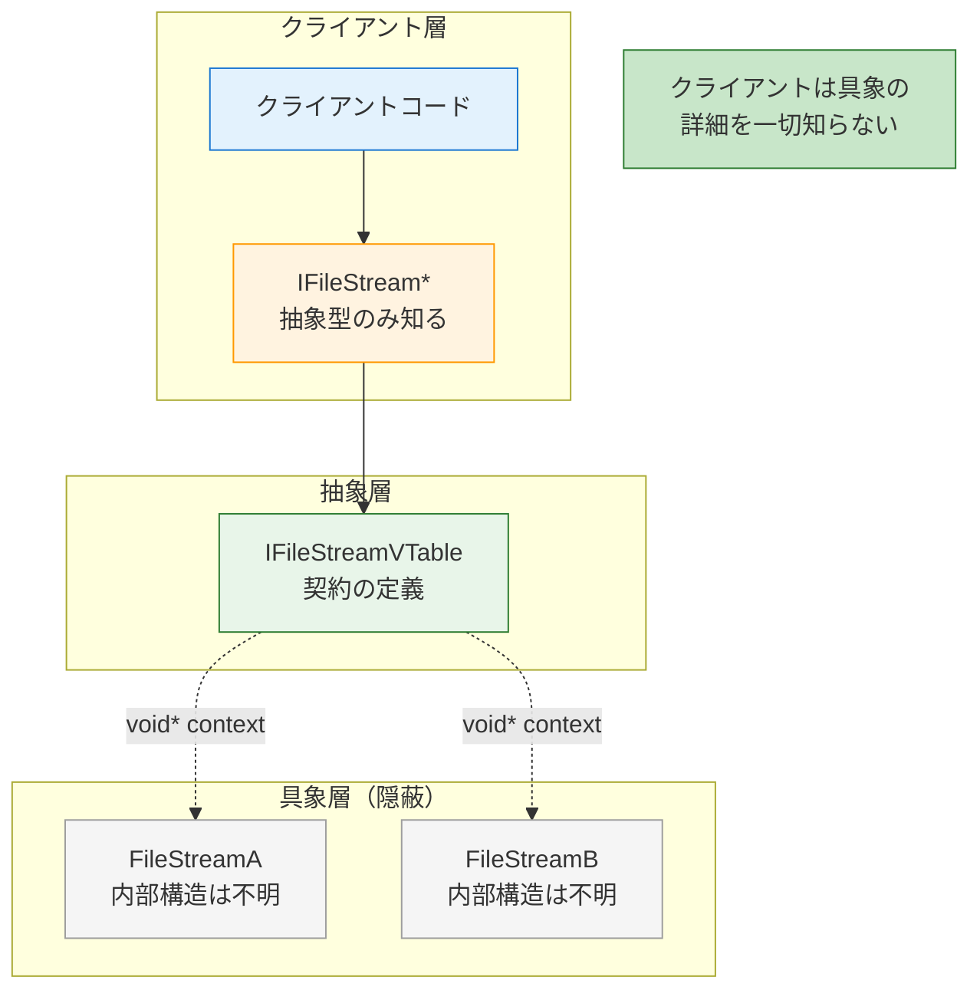
```mermaid

graph TD

    subgraph "クライアント層"

        Client[クライアントコード]

        Abstract[IFileStream*<br/>抽象型のみ知る]

    end

    

    subgraph "抽象層"

        VTable[IFileStreamVTable<br/>契約の定義]

    end

    

    subgraph "具象層（隠蔽）"

        ConcreteA[FileStreamA<br/>内部構造は不明]

        ConcreteB[FileStreamB<br/>内部構造は不明]

    end

    

    Client --> Abstract

    Abstract --> VTable

    VTable -.->|"void* context"| ConcreteA

    VTable -.->|"void* context"| ConcreteB

    

    style Client fill:#e3f2fd,stroke:#1976d2

    style Abstract fill:#fff3e0,stroke:#ff9800

    style VTable fill:#e8f5e9,stroke:#2e7d32

    style ConcreteA fill:#f5f5f5,stroke:#9e9e9e

    style ConcreteB fill:#f5f5f5,stroke:#9e9e9e

    

    Note[クライアントは具象の<br/>詳細を一切知らない]

    style Note fill:#c8e6c9,stroke:#2e7d32


```


この構造により、クライアントは抽象型（`IFileStream`）と契約（VTable）のみに依存し、具象実装の詳細からは完全に分離されます。新しい具象実装を追加しても、既存のクライアントコードは一切変更する必要がなく、OCPとLSPの両方が同時に実現されるのです。


## 3. 実践パターン：LSPを実現する三つの型


リスコフ置換原則（LSP）をC言語で実現するためには、実装者が「インターフェースという契約書」のどの項目を遵守すべきかを正しく理解する必要がある。ここでは、**前提条件・不変条件・事後条件**の三つの視点から、具体的な実践パターンを解説する。


### 3.1. 実践パターン1：前提条件の管理（呼び出し側の義務を増やさない）


インターフェースが「どんな入力でも受け付ける（例：int型なら何でも）」と約束している場合、特定の具象実装が「私は負の値は嫌いだ」「私は特定のサイズしか扱えない」と入力を拒むことは許されない。


#### ❌ 原則適用前：前提条件の強化（LSP違反）


抽象契約では「任意のサイズの書き込み」を許可している。しかし、ある通信ドライバの実装が「ハードウェアの制約で4バイト単位でしか送れない」という理由から、4の倍数以外のサイズをエラーにしてしまうケース。


#### 違反時の構造と問題点


**この図が示すもの**:

具象実装が勝手な制約（4バイト境界）を追加したことで、クライアントが予期せぬエラーに直面し、システムが破綻する流れを示します。


**注目ポイント**:


* **LSP違反**: インターフェースの約束（任意サイズOK）を具象側が破っています。

* **結末**: 特定の実装のためだけに、クライアントコードの修正が必要になってしまいます。


**読み方のガイド**:


* 赤い矢印とノード: エラーの発生とシステムの破綻

* 3段目（Impl）: ここで「自分勝手なルール」が追加されています


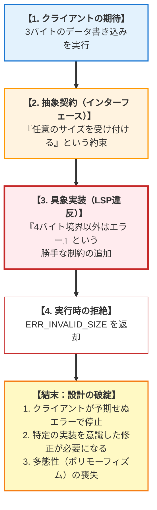
```mermaid

graph TD

    %% 1. 期待される契約

    Client["<b>【1. クライアントの期待】</b><br/>3バイトのデータ書き込みを実行"]

    

    Interface["<b>【2. 抽象契約（インターフェース）】</b><br/>『任意のサイズを受け付ける』という約束"]


    %% 2. 契約違反の実装

    Impl["<b>【3. 具象実装（LSP違反）】</b><br/>『4バイト境界以外はエラー』という<br/>勝手な制約の追加"]


    %% 3. 発生する問題

    Error["<b>【4. 実行時の拒絶】</b><br/>ERR_INVALID_SIZE を返却"]


    %% 4. 結末

    Problem["<b>【結末：設計の破綻】</b><br/>1. クライアントが予期せぬエラーで停止<br/>2. 特定の実装を意識した修正が必要になる<br/>3. 多態性（ポリモーフィズム）の喪失"]


    %% 接続（太い矢印で縦の流れを強調）

    Client ==> Interface

    Interface ==> Impl

    Impl ==> Error

    Error ==> Problem


    %% スタイル設定

    style Client fill:#e3f2fd,stroke:#1976d2,stroke-width:2px

    style Interface fill:#fff3e0,stroke:#ff9800,stroke-width:2px

    style Impl fill:#ffebee,stroke:#c62828,stroke-width:3px

    style Error fill:#ffffff,stroke:#c62828

    style Problem fill:#fff9c4,stroke:#f57f17,stroke-width:2px


```


#### **契約の比較表**


| 項目 | 抽象インターフェース（契約） | 具象実装（違反状態） | 判定と理由 |

| --- | --- | --- | --- |

| **前提条件** | 1バイト単位で指定可能 | **4の倍数サイズのみ許可** | **強化（違反）**: 入力条件を厳しくしている |

| **クライアントの負担** | 自由にサイズを指定できる | **「4の倍数か？」を毎回気にする必要がある** | **置換可能性の喪失** |

| **多態性の破壊** | どの実装でも同じように使える | **この実装だけ特別扱いが必要** | **OCPの破壊** |


#### **istorage.h (抽象契約の定義)**


```c

#ifndef ISTORAGE_H

#define ISTORAGE_H


#include <stddef.h>


#define SUCCESS 0

#define ERR_INVALID_SIZE -1


// ハードウェア操作のモック（本来は別ヘッダ）

int hardware_send(int fd, const void* data, size_t size);


#endif


```


#### **UnalignedStorage.c(LSP違反の実装)**


```c

#include "istorage.h"

#include <string.h>


typedef struct {

    // ハードウェア固有のデータ

    int hardware_fd;

} UnalignedStorage_Data;


/* LSP VIOLATION: 具象側のハードウェア都合をクライアントに押し付けている */

static int unaligned_write_impl(void* self, const void* data, size_t size) {

    UnalignedStorage_Data* storage = (UnalignedStorage_Data*)self;

    

    /* * 【違反】契約では1バイト単位のはずが、具象都合で4の倍数以外をエラーにしている

     * クライアントはこのエラーを想定していない可能性がある

     */

    if (size % 4 != 0) {

        return ERR_INVALID_SIZE; // 契約にない独自エラー

    }

    

    return hardware_send(storage->hardware_fd, data, size);

}


```


#### **この設計の何が「罪」なのか**


1. **契約違反**: インターフェースは「任意サイズ」を約束しているのに、特定実装が拒否している

2. **クライアントの負担増**: この実装を使う場合だけ、クライアント側でアライメントチェックが必要

3. **置換不可能**: 他の実装から切り替えると、突然エラーが発生する

4. **多態性の破壊**: `if (storage->type == UNALIGNED_TYPE)` のような型チェックが必要になる


#### ✅ 原則適用後：具象側での制約の吸収（LSP準拠）


#### **解決策**


もし具象側（ハードウェア）に制約があるなら、**具象実装の中でパディング（余白埋め）などの処置を行い、クライアントには「成功した」と見せかける**のがLSPの正しいあり方です。


#### 遵守時の構造とメリット


**この図が示すもの**:

具象実装が「賢く」振る舞い、内部で制約を解決することで、クライアントとハードウェアの両方の要求を満たす様子を示します。


**注目ポイント**:


* **制約の吸収**: 具象実装（`AlignedStorage`）が中継役となり、パディング処理を行うことで制約を解決しています。

* **Win-Win**: クライアントは自由なサイズで書き込め、ハードウェアは正しい形式でデータを受け取れます。


**読み方のガイド**:


* 緑色（Impl）: 問題を解決している「賢い」実装

* 下段（Benefit）: 設計が正しく機能した結果得られるメリット


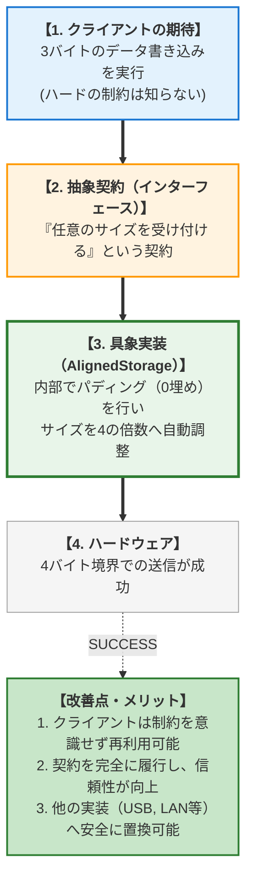
```mermaid

graph TD

    %% 1. クライアントの操作

    Client["<b>【1. クライアントの期待】</b><br/>3バイトのデータ書き込みを実行<br/>(ハードの制約は知らない)"]

    

    %% 2. 抽象契約

    Interface["<b>【2. 抽象契約（インターフェース）】</b><br/>『任意のサイズを受け付ける』という契約"]


    %% 3. 賢い具象実装（LSP準拠）

    Impl["<b>【3. 具象実装（AlignedStorage）】</b><br/>内部でパディング（0埋め）を行い<br/>サイズを4の倍数へ自動調整"]


    %% 4. ハードウェアへの送信

    HW["<b>【4. ハードウェア】</b><br/>4バイト境界での送信が成功"]


    %% 5. メリットのまとめ

    Benefit["<b>【改善点・メリット】</b><br/>1. クライアントは制約を意識せず再利用可能<br/>2. 契約を完全に履行し、信頼性が向上<br/>3. 他の実装（USB, LAN等）へ安全に置換可能"]


    %% 接続

    Client ==> Interface

    Interface ==> Impl

    Impl ==> HW

    HW -.->|"SUCCESS"| Benefit


    %% スタイル設定（成功を示す緑を基調に）

    style Client fill:#e3f2fd,stroke:#1976d2,stroke-width:2px

    style Interface fill:#fff3e0,stroke:#ff9800,stroke-width:2px

    style Impl fill:#e8f5e9,stroke:#2e7d32,stroke-width:3px

    style HW fill:#f5f5f5,stroke:#9e9e9e

    style Benefit fill:#c8e6c9,stroke:#2e7d32,stroke-width:2px


```


#### 内部処理の詳細フロー（パディング処理）


**この図が示すもの**:

3バイトのデータ書き込み要求が来た際、具象実装内部で何が行われているかの時系列フローです。


**注目ポイント**:


* **透過的な処理**: クライアント（`C`）と抽象契約（`I`）の間では `3byte` のやり取りですが、実装（`S`）とハードウェア（`H`）の間では `4byte` に変換されています。

* **責任の所在**: パディングという「面倒な仕事」の責任を、クライアントではなく具象実装が負っています。


**読み方のガイド**:


* `S->>S`: 自己呼び出しによる内部データの調整（パディング）

* メッセージ引数の変化（3byte -> 4byte）に注目


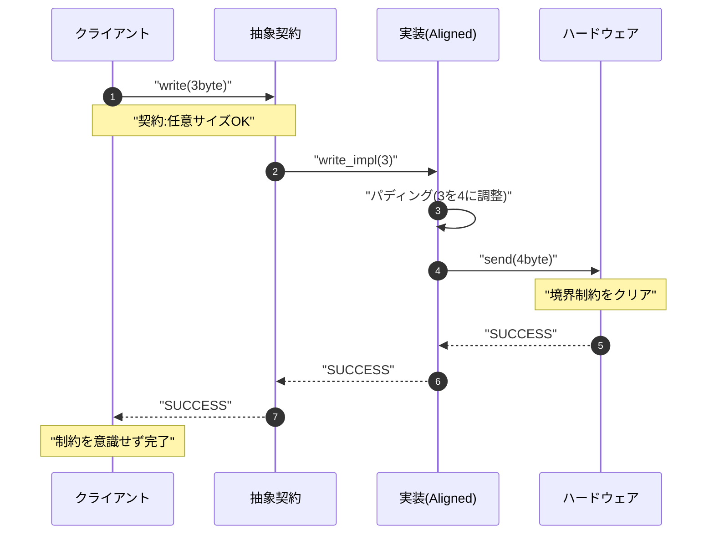
```mermaid

sequenceDiagram

    autonumber

    participant C as クライアント

    participant I as 抽象契約

    participant S as 実装(Aligned)

    participant H as ハードウェア


    C->>I: "write(3byte)"

    Note over C,I: "契約:任意サイズOK"

    

    I->>S: "write_impl(3)"

    

    S->>S: "パディング(3を4に調整)"

    

    S->>H: "send(4byte)"

    Note over H: "境界制約をクリア"

    

    H-->>S: "SUCCESS"

    S-->>I: "SUCCESS"

    I-->>C: "SUCCESS"

    

    Note over C: "制約を意識せず完了"


```


#### **契約の比較表**


| 項目 | 抽象インターフェース（契約） | 具象実装（準拠状態） | 判定と理由 |

| --- | --- | --- | --- |

| **前提条件** | 1バイト単位で指定可能 | **どんなサイズでも受け入れる** | **遵守**: 契約通りの広さを維持 |

| **具象側の処置** | 特になし | **不足分を内部で補完して送信する** | **隠蔽**: 複雑さを具象に閉じ込める |

| **クライアントの視点** | 自由にサイズ指定 | **何も変わらず自由に指定できる** | **置換可能性の維持** |


#### **AlignedStorage.c(LSP準拠の実装)**


```c

#include "istorage.h"

#include <string.h>

#include <stdint.h> // uint8_t用


#define MAX_PACKET 4096


typedef struct {

    int hardware_fd;

} AlignedStorage_Data;


/* LSP COMPLIANT: 具象側の制約は、具象側で安全に解決する */

static int aligned_write_impl(void* self, const void* data, size_t size) {

    AlignedStorage_Data* storage = (AlignedStorage_Data*)self;

    

    // 1. 共通の前提条件チェック（契約の範囲内）

    if (size > MAX_PACKET) return ERR_INVALID_SIZE;


    // もともと4の倍数ならそのまま送信

    if (size % 4 == 0) {

        return hardware_send(storage->hardware_fd, data, size);

    }


    // 2. 内部での制約吸収（LSPの真骨頂）

    uint8_t temp_buf[MAX_PACKET];

    

    // サイズを4バイト境界に切り上げ（例: 3 -> 4, 5 -> 8）

    size_t padded_size = (size + 3) & ~3;

    

    memcpy(temp_buf, data, size);

    // 余った部分を0で埋める（パディング）

    memset(temp_buf + size, 0, padded_size - size);


    return hardware_send(storage->hardware_fd, temp_buf, padded_size);

}


```


#### **設計のポイント**


* **契約の履行**: クライアントが期待する「任意サイズ」を完全にサポート

* **複雑さの隠蔽**:4バイト境界という制約は具象実装の内部で吸収

* **置換可能性**: 他の実装から切り替えても、クライアントコードは無修正で動作

* **テスト容易性**: 3バイト、5バイトなど、様々なサイズでテスト可能

Kindle本の校正担当
カスタム Gem
修正概要と理由
[修正範囲: # 第2部 第10章 〜 3.1. 実践パターン1（本ファイル末尾）]

定義文における欠落の補完 (1.2. LSPの定義): バーバラ・リスコフの定義引用文において、型を示す変数（T および S）が欠落しており、文意が通らなくなっていたため補完しました。

用語と図の不一致解消 (2.3. 不完全型とvoid* context...): 解説文中で使用されていた仮のクラス名（ConcreteA, ConcreteB）を、直後のMermaid図で使用されている名称（FileStreamA, FileStreamB）に統一しました。

用語のコンテキスト適合 (2.1. LSP遵守の三つの処方箋): 「子クラス」というオブジェクト指向用語を、本書のC言語コンテキストに合わせて「具象実装」に修正しました。

コードコメント形式の修正 (3.1. 実践パターン1): UnalignedStorage.c 内のコメント開始記号に誤り（/* *）があったため、標準的な形式（/*）に修正しました。

▼▼▼▼▼ ここからコピペ用データ ▼▼▼▼▼

第2部 第10章 リスコフ置換原則 (LSP): 多態性の安全性と契約の保証
この章の主題は、設計の三本柱のうち**「契約」の柱です。LSPを適用することで、抽象インターフェースが定義した「利用法」と「変更耐性」**を具象実装が厳格に保証し、多態性の安全性を確保します。

この原則を実現するための具体的な道具（技術） として、第1部 第4章 不透明型と不透明ポインタによる隠蔽と、第1部 第6章 エラーハンドリングパターンによる契約の遵守を参照します。これらの道具がどのようにして、多態性の安全な実現という設計目標を達成するのかを詳細に学びます。

1. 原則の哲学と本質
1.1. LSPの本質は「置換可能性」
リスコフ置換原則（Liskov Substitution Principle、以下 LSP）は、開放閉鎖原則（OCP）と対になる原則です。OCPが「どのように拡張するか（構造）」を定義するのに対し、LSPは「その拡張が既存のシステムを壊さないことを、どのように保証するか（品質）」を定義します。

いわば、OCPが「新しいプラグインを差し込めるソケット」を作る設計図だとすれば、LSPは「そこに差し込むプラグインが満たすべき電圧や形状の規格」を定めるものです。

1.2. LSPの定義：厳格かつシンプルなルール
LSPは、計算機科学者バーバラ・リスコフによって以下のように定義されました。

「プログラム中の型 T のオブジェクトにおいて、その派生型 S のオブジェクトで置換したとしても、プログラムの性質（正しさ）が変わらないこと」

つまり、クライアントコードが抽象インターフェース T に依存している場合、どの具象実装（S）が渡されたとしても、クライアント側は一切の修正を必要とせず、かつ予期せぬ挙動に怯えることなく動作し続けなければならない、という原則です。

1.3. ソケットとプラグの比喩：契約と違反
以下の図は、リスコフの置換原則（LSP）における **「契約（約束事）」と「信頼」**の関係を、コンセントの差し込み口（ソケット）とプラグに例えて表現しています。

契約と実装の適合イメージ
この図が示すもの: 抽象インターフェース（ソケット）に対して、LSPを満たす実装（プラグA, B）と、LSPに違反する実装（プラグC）の違いを可視化しています。

注目ポイント:

ソケット（契約）: 「どんなアドレスでも受け入れる」という広い契約を提示。

プラグA, B（遵守）: 契約通り、あるいは内部で調整して動作するため「OK」。

プラグC（違反）: 「特定の条件しか受け付けない」という**事後条件の強化（制約の追加）**を行っているため「NG」。

読み方のガイド:

二重線（===）: 契約に基づく正常な接続

点線（-.-）: 期待に反する不正な接続

NGノード: クライアントコードにバグを引き起こす箇所

コード スニペット
graph LR
    %% 1. 共通契約層
    subgraph Contract ["1. 契約（期待される動作）"]
        Socket["インターフェース:<br/>すべてのアドレスを受け入れる"]
    end

    %% 2. 実装層
    subgraph Impls ["2. 具体的な実装"]
        PlugA["実装A: 正常に動作"]
        PlugB["実装B: パディングを調整して動作"]
        PlugC["実装C: 特定のアドレスのみ拒否<br/>(制約の追加)"]
    end

    %% 3. 判定結果層
    subgraph Results ["3. LSP遵守判定"]
        OK1(("OK"))
        OK2(("OK"))
        NG1(("NG"))
    end

    %% 接続関係（水平ラインを強制）
    Socket ===> PlugA ---> OK1
    Socket ===> PlugB ---> OK2
    Socket -.->|"期待に反する"| PlugC -.-> NG1

    %% スタイル設定
    style Socket fill:#e1f5fe,stroke:#01579b,stroke-width:2px
    style PlugA fill:#e8f5e9,stroke:#2e7d32
    style PlugB fill:#e8f5e9,stroke:#2e7d32
    style PlugC fill:#ffebee,stroke:#c62828,stroke-width:2px
    style OK1 fill:#e8f5e9,stroke:#2e7d32
    style OK2 fill:#e8f5e9,stroke:#2e7d32
    style NG1 fill:#ffebee,stroke:#c62828
なぜプラグCはダメなのか？
このような「勝手なルール」を持つ実装が一つでも混じると、利用者は不安になります。「今度の相手は特殊なルールがあるかも？」と疑い、コードの中に「もし相手がCなら……」という余計なチェックを書き足さなければならなくなります。

「後から参加するメンバー（実装）は、共通のルール（契約）を勝手に厳しくしてはいけない」

これが、この原則の核心です。

1.4. 契約の3要素：LSPを構成する要件
LSPをC言語の実装レベルで理解するために、契約を**「前提条件」「事後条件」「不変条件」**の3つに分解して考える。これらを破る実装は、すべてLSP違反である。

契約の構造
この図が示すもの: 関数の呼び出しから終了までの流れの中で、どのタイミングでどの条件が満たされている必要があるかを示します。

用語の定義:

前提条件: 関数を呼ぶ前に呼び出し側が守るべきルール（引数の範囲など）。

不変条件: 処理中も常に維持されるべきシステムの整合性ルール。

事後条件: 関数が戻る際に実装側が保証すべき結果（戻り値の状態など）。

コード スニペット
graph LR
    Pre["前提条件<br/>(Precondition)<br/>呼び出し側の義務"]
    Inv["不変条件<br/>(Invariant)<br/>常に維持されるルール"]
    Post["事後条件<br/>(Postcondition)<br/>提供側の保証"]
    
    Pre -->|"契約の入口"| Inv
    Inv -->|"処理中の保証"| Post
    Post -->|"契約の出口"| Result[正しい結果]
    
    style Pre fill:#e1f5fe,stroke:#01579b,stroke-width:2px
    style Inv fill:#fff3e0,stroke:#e65100,stroke-width:2px
    style Post fill:#e8f5e9,stroke:#2e7d32,stroke-width:2px
    style Result fill:#f3e5f5,stroke:#4a148c
1.4.1. 前提条件（Precondition）：呼び出し側の義務を増やさない
「具象実装は、前提条件を強化してはならない」

インターフェースが「引数に0以上の値を受け取る」と定義しているなら、具象実装が勝手に「私は10以上の値しか受け付けない」と条件を厳しくしてはならない。

ケース1：ストレージドライバの整列制約
抽象インターフェース write(addr, data) において、仕様上は「任意のアドレス」への書き込みが可能とされている。しかし、特定の安価なフラッシュメモリの実装が「書き込みアドレスは4バイト境界（4の倍数）でなければならない」という制約を独自に追加し、それ以外でエラーを返すようにした。

なぜ問題か： クライアントは「任意のアドレスに書ける」と信じて設計されている。特定の実装のために、クライアント側ですべてのデータ配置を4バイト境界に揃える修正が必要になり、多態性の恩恵が失われる。

ケース2：ファイルシステムのパス長
共通インターフェースで「最大256文字のパスを受け付ける」となっているが、新しいSDカード実装が「独自のFAT制限により8文字までしか受け付けない」とした場合、既存の長いファイル名を扱う上位モジュールはすべてクラッシュするか、動作不能になる。

1.4.2. 事後条件（Postcondition）：戻り値の保証を弱めない
「具象実装は、事後条件を弱化してはならない」

インターフェースが「処理成功時には必ず有効なポインタを返す」と約束しているなら、具象実装が「時々NULLを返すかもしれない」といった曖昧な振る舞いをしてはならない。

ケース1：センサーデータの単位変換
インターフェース get_temperature() が、「摂氏（℃）単位の浮動小数点を返す」と定義されているとする。ところが、新しい高精度センサーの実装が、精度を優先するあまり「華氏（℉）」で値を返してしまった。

なぜ問題か： クライアントは返ってきた値を「摂氏」として処理（例：30度以上ならアラーム）する。単位が変わるという「事後条件の変更」は、システム全体に誤動作を引き起こす。

ケース2：エラーコードの私物化
インターフェースが「失敗時は負の値を返す」と定めている。しかし、ある実装が「成功だがデータが空の場合、特殊な正の値 100 を返す」とした。

なぜ問題か： クライアントが if (result < 0) でエラー判定をしていた場合、この「100」を見逃し、不正なデータを正常として処理してしまう。

1.4.3. 不変条件（Invariant）：不変のルールを破壊しない
「具象実装は、システムが維持すべき不変のルールを破壊してはならない」

例えば、「通信セッション中は必ず接続状態（Connected）を維持する」というルールがある場合、具象実装の内部処理で勝手に切断してはならない。

ケース1：読み取り専用リストの内部ソート
リスト構造のインターフェースに get_count() がある。ある具象実装（キャッシュ機能付きリスト）が、内部の高速化のために get_count() を呼ぶたびに内部データを勝手に並び替えてしまった。

なぜ問題か： もしクライアントが「リストの順序は不変である」という前提でループを回していた場合、単に件数を確認しただけで順序が変わると、処理結果が支離滅裂になる。

ケース2：共有リソースの排他制御
「この関数を抜けるときは、必ずミューテックスを解放した状態でなければならない」という不変条件がある。しかし、特定の異常系処理でリターンする際に、ミューテックスを保持したまま終了する実装を追加してしまった。

なぜ問題か： 次にそのリソースにアクセスするクライアントが永久にデッドロックし、システムが停止する。

1.5. 三つの裏切りをしない：LSPの要約
リスコフの置換原則（LSP）を要約すると、**「インターフェースの仕様（入力・処理・出力）を絶対に裏切らない」**という、信頼関係の維持に尽きます。

ただ、「文法（型）」を守るだけでなく、「相手（利用者）の期待」まで守るという点が、この原則の深みです。

利用者は、インターフェースという「窓口」を見てコードを書きます。その窓口に書かれていない**「独自のマイルール」**を具象側で勝手に追加してしまうのがLSP違反です。

整理すると、以下の「3つの裏切り」をしないことと言えます。

1. 入力の裏切り（前提条件の強化）
約束: 「誰でも入っていいですよ」

違反: 「実は、青い服の人以外は立ち入り禁止です」

実務: インターフェースでは「どのアドレスでもOK」なのに、具象側が「4の倍数以外はエラー」にするなど。利用者は「えっ、わざわざ相手に合わせて服（データ）を着替えなきゃいけないの？」と困惑します。

2. 出力の裏切り（事後条件の弱化）
約束: 「成功したら、必ず品物を渡します」

違反: 「成功したけど、品物（ポインタ）はNULLです。中身は空っぽです」

実務: 「成功時は有効な値を返す」はずが、特定の具象だけ「成功だけど意味が違う値」を返すなど。利用者は「成功って言ったのに、中身が使えないじゃないか！」と怒ります。

3. 振る舞いの裏切り（不変条件の破壊）
約束: 「中身はいじりません。見るだけです」

違反: 「見たついでに、こっそり中身を並び替えちゃいました」

実務: 単なるデータ取得関数のはずが、内部で勝手に状態を変えてしまう。利用者は「ちょっと見ただけなのに、次に見たら順番が変わってる！」とパニックになります。

なぜ「当然のこと」が原則になるのか？
「仕様を守るなんて当然」と思えますが、開発現場では**「この新しいデバイス（具象）は特殊だから、少しだけ仕様を変えてもいいよね？」**という誘惑が常にあります。

しかし、その「少しの書き換え」を許すと、利用者は全てのコードに対して： if (相手がデバイスAなら) ... else if (相手がデバイスBなら) ... と、相手の顔色を伺う「分岐」を激増させることになります。

「相手が誰であっても、窓口の言葉（インターフェース）だけを信じていれば、絶対に大丈夫」 この100%の安心感を保証することが、LSPの最大の目的なのです。

2. C言語での実現手段と設計要素
C言語には言語レベルでの interface キーワードがないため、LSPを守るには**「第1部の技術」**を規律を持って適用する必要がある。

2.1. LSP遵守の三つの処方箋
1. 不透明ポインタ（第4章）の活用
具象構造体の中身を隠蔽し、クライアントが具象の型に依存した「型キャスト」を行えないようにする。これにより、「特定の型だけ特別扱いする」という誘惑を物理的に断つ。

2. 厳格なエラーハンドリング（第6章）
インターフェースヘッダに、その関数が返しうるエラーコードの範囲を明記する。具象実装は、その範囲外の「自分勝手なエラーコード」を返してはならない。

3. ユニットテストによる契約検証
新しい具象実装を作成した際は、共通のインターフェーステストスイートを通す。どの具象実装も同じテスト（同じ入力に対して同じ期待値）をパスすることを保証する。

2.2. 抽象インターフェースの契約定義
OCPで解説したVTableパターンによって抽象インターフェースを定義することが、LSP実現の土台となる。VTableの関数ポインタのシグネチャと、それらが満たすべき契約コメントを厳密に記述する。 C言語ではヘッダファイルそのものが契約書となるため、ここで定義されたルール（コメント含む）を守ることがLSP適用の第一歩となる。

IFileStream.h（抽象インターフェースのVTable定義）
C
#ifndef IFILE_STREAM_H
#define IFILE_STREAM_H

#include <stddef.h>
#define MAX_READ_SIZE 4096

/* エラーコードの定義（契約の一部） */
#define SUCCESS 0
#define ERROR_EOF -1
#define ERROR_TEMPORARY -2
#define ERROR_FATAL -3

/**
 * @brief 抽象ストリームインターフェースが満たすべき契約（VTable）。
 * すべての具象実装は、以下の契約を厳守しなければならない。
 */
typedef struct {
    /**
     * @brief データ読み込み関数。
     * * [前提条件] 
     * - size > 0 かつ size <= MAX_READ_SIZE であること
     * - context != NULL, error_code != NULL
     * * [事後条件] 
     * - 成功時: 非NULLを返し、*error_code = SUCCESS
     * - 失敗時: NULLを返し、*error_codeに以下のいずれかをセット:
     * * ERROR_EOF: データ終端に到達
     * * ERROR_TEMPORARY: 一時的なエラー（リトライ可能）
     * * ERROR_FATAL: 致命的なエラー（リトライ不可）
     * * [不変条件] 
     * - contextポインタとerror_codeポインタの指す先は変更されない
     * - 返却されるデータは、次の読み込みまで有効である
     */
    void* (*read_data)(void* context, size_t size, int* error_code);
    
    /**
     * @brief ストリームのクローズ。
     * * [前提条件] context != NULL
     * [事後条件] SUCCESS or ERROR_FATAL を返す
     * [不変条件] 一度closeしたストリームは再度openできない
     */
    int (*close)(void* context);
    
} IFileStreamVTable;

/* 抽象型（クライアントが依存する型） */
typedef struct {
    const IFileStreamVTable* vtable;
    void* context;
} IFileStream;

/* ラッパー関数 */
static inline void* file_stream_read(IFileStream* stream, size_t size, int* error_code) {
    return stream->vtable->read_data(stream->context, size, error_code);
}

static inline int file_stream_close(IFileStream* stream) {
    return stream->vtable->close(stream->context);
}
#endif
2.3. 不完全型とvoid* contextによる具象データからの隔離
C言語においてLSPを実現する上で重要なのが、具象実装の内部データ構造（構造体）をクライアントから完全に隠蔽することである。

不完全型 (struct Concrete;): 具象データ型の定義をヘッダから排除することで、クライアントは具象構造体のサイズやフィールドの存在を知ることができない。

void* context: VTableのメソッドは、第1引数として具象データへの不透明なポインタ (void* context) を受け取る。これにより、クライアントコードは具象データへの静的な依存を断ち切れる。

具象実装が隠蔽されていれば、具象実装内でデータを追加・変更しても、抽象型 (IFileStream) を使うクライアントのコードは影響を受けず、「修正に対して閉じている」状態が維持され、LSPの置換可能性が担保される。

依存関係と隠蔽の構造
この図が示すもの: クライアントが「抽象」のみに依存し、具象実装の「詳細」から物理的に隔離されている様子を示します。

注目ポイント:

クライアント層: 具象実装（FileStreamA, FileStreamB）を知らず、VTable という契約のみを知っています。

void context*: このポインタを経由することで、型情報を漏らさずに具象データを操作します。

読み方のガイド:

矢印: 依存の方向

点線: 実行時の動的な参照

コード スニペット
graph TD
    subgraph "クライアント層"
        Client[クライアントコード]
        Abstract[IFileStream*<br/>抽象型のみ知る]
    end
    
    subgraph "抽象層"
        VTable[IFileStreamVTable<br/>契約の定義]
    end
    
    subgraph "具象層（隠蔽）"
        ConcreteA[FileStreamA<br/>内部構造は不明]
        ConcreteB[FileStreamB<br/>内部構造は不明]
    end
    
    Client --> Abstract
    Abstract --> VTable
    VTable -.->|"void* context"| ConcreteA
    VTable -.->|"void* context"| ConcreteB
    
    style Client fill:#e3f2fd,stroke:#1976d2
    style Abstract fill:#fff3e0,stroke:#ff9800
    style VTable fill:#e8f5e9,stroke:#2e7d32
    style ConcreteA fill:#f5f5f5,stroke:#9e9e9e
    style ConcreteB fill:#f5f5f5,stroke:#9e9e9e
    
    Note[クライアントは具象の<br/>詳細を一切知らない]
    style Note fill:#c8e6c9,stroke:#2e7d32
この構造により、クライアントは抽象型（IFileStream）と契約（VTable）のみに依存し、具象実装の詳細からは完全に分離されます。新しい具象実装を追加しても、既存のクライアントコードは一切変更する必要がなく、OCPとLSPの両方が同時に実現されるのです。

3. 実践パターン：LSPを実現する三つの型
リスコフ置換原則（LSP）をC言語で実現するためには、実装者が「インターフェースという契約書」のどの項目を遵守すべきかを正しく理解する必要がある。ここでは、前提条件・不変条件・事後条件の三つの視点から、具体的な実践パターンを解説する。

3.1. 実践パターン1：前提条件の管理（呼び出し側の義務を増やさない）
インターフェースが「どんな入力でも受け付ける（例：int型なら何でも）」と約束している場合、特定の具象実装が「私は負の値は嫌いだ」「私は特定のサイズしか扱えない」と入力を拒むことは許されない。

❌ 原則適用前：前提条件の強化（LSP違反）
抽象契約では「任意のサイズの書き込み」を許可している。しかし、ある通信ドライバの実装が「ハードウェアの制約で4バイト単位でしか送れない」という理由から、4の倍数以外のサイズをエラーにしてしまうケース。

違反時の構造と問題点
この図が示すもの: 具象実装が勝手な制約（4バイト境界）を追加したことで、クライアントが予期せぬエラーに直面し、システムが破綻する流れを示します。

注目ポイント:

LSP違反: インターフェースの約束（任意サイズOK）を具象側が破っています。

結末: 特定の実装のためだけに、クライアントコードの修正が必要になってしまいます。

読み方のガイド:

赤い矢印とノード: エラーの発生とシステムの破綻

3段目（Impl）: ここで「自分勝手なルール」が追加されています

コード スニペット
graph TD
    %% 1. 期待される契約
    Client["<b>【1. クライアントの期待】</b><br/>3バイトのデータ書き込みを実行"]
    
    Interface["<b>【2. 抽象契約（インターフェース）】</b><br/>『任意のサイズを受け付ける』という約束"]

    %% 2. 契約違反の実装
    Impl["<b>【3. 具象実装（LSP違反）】</b><br/>『4バイト境界以外はエラー』という<br/>勝手な制約の追加"]

    %% 3. 発生する問題
    Error["<b>【4. 実行時の拒絶】</b><br/>ERR_INVALID_SIZE を返却"]

    %% 4. 結末
    Problem["<b>【結末：設計の破綻】</b><br/>1. クライアントが予期せぬエラーで停止<br/>2. 特定の実装を意識した修正が必要になる<br/>3. 多態性（ポリモーフィズム）の喪失"]

    %% 接続（太い矢印で縦の流れを強調）
    Client ==> Interface
    Interface ==> Impl
    Impl ==> Error
    Error ==> Problem

    %% スタイル設定
    style Client fill:#e3f2fd,stroke:#1976d2,stroke-width:2px
    style Interface fill:#fff3e0,stroke:#ff9800,stroke-width:2px
    style Impl fill:#ffebee,stroke:#c62828,stroke-width:3px
    style Error fill:#ffffff,stroke:#c62828
    style Problem fill:#fff9c4,stroke:#f57f17,stroke-width:2px
契約の比較表
項目	抽象インターフェース（契約）	具象実装（違反状態）	判定と理由
前提条件	1バイト単位で指定可能	4の倍数サイズのみ許可	強化（違反）: 入力条件を厳しくしている
クライアントの負担	自由にサイズを指定できる	「4の倍数か？」を毎回気にする必要がある	置換可能性の喪失
多態性の破壊	どの実装でも同じように使える	この実装だけ特別扱いが必要	OCPの破壊
istorage.h (抽象契約の定義)
C
#ifndef ISTORAGE_H
#define ISTORAGE_H

#include <stddef.h>

#define SUCCESS 0
#define ERR_INVALID_SIZE -1

// ハードウェア操作のモック（本来は別ヘッダ）
int hardware_send(int fd, const void* data, size_t size);

#endif
UnalignedStorage.c(LSP違反の実装)
C
#include "istorage.h"
#include <string.h>

typedef struct {
    // ハードウェア固有のデータ
    int hardware_fd;
} UnalignedStorage_Data;

/* LSP VIOLATION: 具象側のハードウェア都合をクライアントに押し付けている */
static int unaligned_write_impl(void* self, const void* data, size_t size) {
    UnalignedStorage_Data* storage = (UnalignedStorage_Data*)self;
    
    /* 【違反】契約では1バイト単位のはずが、具象都合で4の倍数以外をエラーにしている
     * クライアントはこのエラーを想定していない可能性がある
     */
    if (size % 4 != 0) {
        return ERR_INVALID_SIZE; // 契約にない独自エラー
    }
    
    return hardware_send(storage->hardware_fd, data, size);
}
この設計の何が「罪」なのか
契約違反: インターフェースは「任意サイズ」を約束しているのに、特定実装が拒否している

クライアントの負担増: この実装を使う場合だけ、クライアント側でアライメントチェックが必要

置換不可能: 他の実装から切り替えると、突然エラーが発生する

多態性の破壊: if (storage->type == UNALIGNED_TYPE) のような型チェックが必要になる

✅ 原則適用後：具象側での制約の吸収（LSP準拠）
解決策
もし具象側（ハードウェア）に制約があるなら、具象実装の中でパディング（余白埋め）などの処置を行い、クライアントには「成功した」と見せかけるのがLSPの正しいあり方です。

遵守時の構造とメリット
この図が示すもの: 具象実装が「賢く」振る舞い、内部で制約を解決することで、クライアントとハードウェアの両方の要求を満たす様子を示します。

注目ポイント:

制約の吸収: 具象実装（AlignedStorage）が中継役となり、パディング処理を行うことで制約を解決しています。

Win-Win: クライアントは自由なサイズで書き込め、ハードウェアは正しい形式でデータを受け取れます。

読み方のガイド:

緑色（Impl）: 問題を解決している「賢い」実装

下段（Benefit）: 設計が正しく機能した結果得られるメリット

コード スニペット
graph TD
    %% 1. クライアントの操作
    Client["<b>【1. クライアントの期待】</b><br/>3バイトのデータ書き込みを実行<br/>(ハードの制約は知らない)"]
    
    %% 2. 抽象契約
    Interface["<b>【2. 抽象契約（インターフェース）】</b><br/>『任意のサイズを受け付ける』という契約"]

    %% 3. 賢い具象実装（LSP準拠）
    Impl["<b>【3. 具象実装（AlignedStorage）】</b><br/>内部でパディング（0埋め）を行い<br/>サイズを4の倍数へ自動調整"]

    %% 4. ハードウェアへの送信
    HW["<b>【4. ハードウェア】</b><br/>4バイト境界での送信が成功"]

    %% 5. メリットのまとめ
    Benefit["<b>【改善点・メリット】</b><br/>1. クライアントは制約を意識せず再利用可能<br/>2. 契約を完全に履行し、信頼性が向上<br/>3. 他の実装（USB, LAN等）へ安全に置換可能"]

    %% 接続
    Client ==> Interface
    Interface ==> Impl
    Impl ==> HW
    HW -.->|"SUCCESS"| Benefit

    %% スタイル設定（成功を示す緑を基調に）
    style Client fill:#e3f2fd,stroke:#1976d2,stroke-width:2px
    style Interface fill:#fff3e0,stroke:#ff9800,stroke-width:2px
    style Impl fill:#e8f5e9,stroke:#2e7d32,stroke-width:3px
    style HW fill:#f5f5f5,stroke:#9e9e9e
    style Benefit fill:#c8e6c9,stroke:#2e7d32,stroke-width:2px
内部処理の詳細フロー（パディング処理）
この図が示すもの: 3バイトのデータ書き込み要求が来た際、具象実装内部で何が行われているかの時系列フローです。

注目ポイント:

透過的な処理: クライアント（C）と抽象契約（I）の間では 3byte のやり取りですが、実装（S）とハードウェア（H）の間では 4byte に変換されています。

責任の所在: パディングという「面倒な仕事」の責任を、クライアントではなく具象実装が負っています。

読み方のガイド:

S->>S: 自己呼び出しによる内部データの調整（パディング）

メッセージ引数の変化（3byte -> 4byte）に注目

コード スニペット
sequenceDiagram
    autonumber
    participant C as クライアント
    participant I as 抽象契約
    participant S as 実装(Aligned)
    participant H as ハードウェア

    C->>I: "write(3byte)"
    Note over C,I: "契約:任意サイズOK"
    
    I->>S: "write_impl(3)"
    
    S->>S: "パディング(3を4に調整)"
    
    S->>H: "send(4byte)"
    Note over H: "境界制約をクリア"
    
    H-->>S: "SUCCESS"
    S-->>I: "SUCCESS"
    I-->>C: "SUCCESS"
    
    Note over C: "制約を意識せず完了"
契約の比較表
項目	抽象インターフェース（契約）	具象実装（準拠状態）	判定と理由
前提条件	1バイト単位で指定可能	どんなサイズでも受け入れる	遵守: 契約通りの広さを維持
具象側の処置	特になし	不足分を内部で補完して送信する	隠蔽: 複雑さを具象に閉じ込める
クライアントの視点	自由にサイズ指定	何も変わらず自由に指定できる	置換可能性の維持
AlignedStorage.c(LSP準拠の実装)
C
#include "istorage.h"
#include <string.h>
#include <stdint.h> // uint8_t用

#define MAX_PACKET 4096

typedef struct {
    int hardware_fd;
} AlignedStorage_Data;

/* LSP COMPLIANT: 具象側の制約は、具象側で安全に解決する */
static int aligned_write_impl(void* self, const void* data, size_t size) {
    AlignedStorage_Data* storage = (AlignedStorage_Data*)self;
    
    // 1. 共通の前提条件チェック（契約の範囲内）
    if (size > MAX_PACKET) return ERR_INVALID_SIZE;

    // もともと4の倍数ならそのまま送信
    if (size % 4 == 0) {
        return hardware_send(storage->hardware_fd, data, size);
    }

    // 2. 内部での制約吸収（LSPの真骨頂）
    uint8_t temp_buf[MAX_PACKET];
    
    // サイズを4バイト境界に切り上げ（例: 3 -> 4, 5 -> 8）
    size_t padded_size = (size + 3) & ~3;
    
    memcpy(temp_buf, data, size);
    // 余った部分を0で埋める（パディング）
    memset(temp_buf + size, 0, padded_size - size);

    return hardware_send(storage->hardware_fd, temp_buf, padded_size);
}
設計のポイント
契約の履行: クライアントが期待する「任意サイズ」を完全にサポート

複雑さの隠蔽:4バイト境界という制約は具象実装の内部で吸収

置換可能性: 他の実装から切り替えても、クライアントコードは無修正で動作

テスト容易性: 3バイト、5バイトなど、様々なサイズでテスト可能

▲▲▲▲▲ ここまでコピペ用データ ▲▲▲▲▲

--- 処理対象ファイル: 14_第2部 第10章 リスコフ置換原則 (LSP) 多態性の安全性と契約の保証_02.md ---


### 3.2. 実践パターン2：不変条件の保証（暗黙のルールの維持）


不変条件とは、**「オブジェクトが生存している間、常に真でなければならないルール」**です。これにはデータの整合性だけでなく、**「一度取得したデータは、ある一定の条件下（例えば次の更新まで）では変化しない」**あるいは逆に**「呼び出すたびに必ず最新の状態を反映する」**といった、時間的な振る舞いのルールも含まれます。


#### ❌ 原則適用前：不変条件の破壊（最適化による時間的ルールの変更）


センサー値を読み取るインターフェースにおいて、クライアントは「呼び出すたびに最新の値が得られる」という**振る舞いの契約**（不変条件）を期待している。しかし、ある具象実装が**「消費電力削減のため、内部で500msキャッシュする」**という最適化を勝手に行うケース。これは「エラー」ではないが、契約が保証していた「リアルタイム性」という不変条件を破壊している。


#### 違反時の構造と影響


**この図が示すもの**:

具象実装が勝手な最適化（キャッシュ）を行った結果、クライアントの期待する「リアルタイム性」が損なわれる様子を示します。


**注目ポイント**:


* **不一致**: クライアントは10msごとの制御を期待していますが、実装は500msごとの更新しか行いません。

* **リスク**: 値が変わらないため、制御系システムでは暴走や振動などの重大な事故につながる恐れがあります。


**読み方のガイド**:


* 赤い箱（Impl, Failure）: 不正な状態の連鎖

* クライアントの期待（10ms）と実装の挙動（500ms）のズレに注目


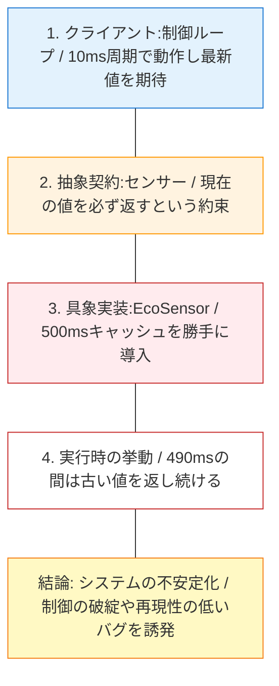
```mermaid

graph TD

    %% 1. クライアントの前提

    Client["1. クライアント:制御ループ / 10ms周期で動作し最新値を期待"]

    

    %% 2. 抽象契約

    Interface["2. 抽象契約:センサー / 現在の値を必ず返すという約束"]


    %% 3. LSP違反の実装

    Impl["3. 具象実装:EcoSensor / 500msキャッシュを勝手に導入"]


    %% 4. 発生する事象

    Failure["4. 実行時の挙動 / 490msの間は古い値を返し続ける"]


    %% 5. 深刻な結末

    Problem["結論: システムの不安定化 / 制御の破綻や再現性の低いバグを誘発"]


    %% 接続（シンプルな矢印）

    Client --- Interface

    Interface --- Impl

    Impl --- Failure

    Failure --- Problem


    %% スタイル設定（色指定もシンプルに）

    style Client fill:#e3f2fd,stroke:#1976d2

    style Interface fill:#fff3e0,stroke:#ff9800

    style Impl fill:#ffebee,stroke:#c62828

    style Failure fill:#ffffff,stroke:#c62828

    style Problem fill:#fff9c4,stroke:#f57f17


```


#### 時間軸での不整合（タイムライン図）


**この図が示すもの**:

制御ループ（クライアント）とセンサー（実装）の時間的なズレを可視化しています。


**注目ポイント**:


* 物理値（Hardware）は変化しているのに、EcoSensorがそれを無視して古い値を返し続けている点。


**読み方のガイド**:


* 左側（Client）は頻繁に問い合わせています。

* 中央（Eco）が「キャッシュ」によって遮断壁となっている様子。


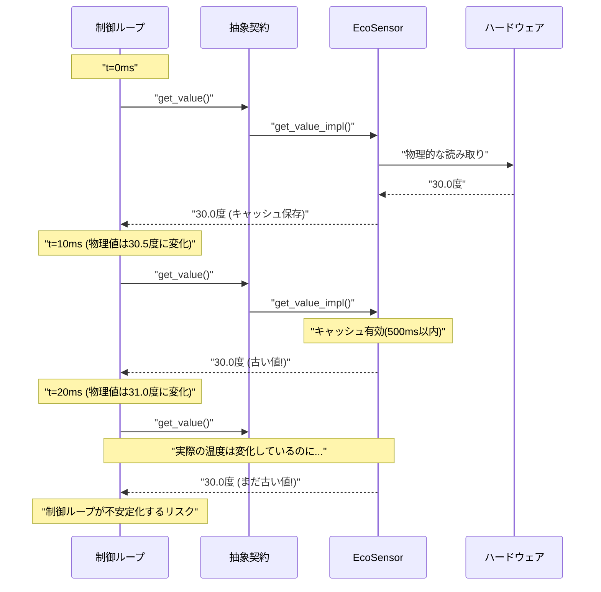
```mermaid

sequenceDiagram

    participant Client as 制御ループ

    participant Interface as 抽象契約

    participant Eco as EcoSensor

    participant HW as ハードウェア


    Note over Client: "t=0ms"

    Client->>Interface: "get_value()"

    Interface->>Eco: "get_value_impl()"

    Eco->>HW: "物理的な読み取り"

    HW-->>Eco: "30.0度"

    Eco-->>Client: "30.0度 (キャッシュ保存)"

    

    Note over Client: "t=10ms (物理値は30.5度に変化)"

    Client->>Interface: "get_value()"

    Interface->>Eco: "get_value_impl()"

    Note over Eco: "キャッシュ有効(500ms以内)"

    Eco-->>Client: "30.0度 (古い値!)"

    

    Note over Client: "t=20ms (物理値は31.0度に変化)"

    Client->>Interface: "get_value()"

    Note over Client,Eco: "実際の温度は変化しているのに..."

    Eco-->>Client: "30.0度 (まだ古い値!)"

    

    Note over Client: "制御ループが不安定化するリスク"


```


#### **契約の比較表**


| 項目 | 抽象インターフェース（契約） | 具象実装（違反状態） | 判定 |

| --- | --- | --- | --- |

| **不変条件** | 呼出のたびに最新値を返す | **500ms間は古い値を返し続ける** | **破壊（違反）** |

| **クライアントの誤算** | 高速な制御ループに使用可能 | **制御が追いつかず、システムが不安定化** | **置換不能** |

| **暗黙の契約** | リアルタイム性の保証 | **最適化優先でリアルタイム性を犠牲** | **契約違反** |


#### **EcoSensor.c(LSP違反の実装)**


```c

#include "isensor.h"

#include <time.h>


typedef struct {

    float cached_value;

    time_t last_update;

    int hardware_id;

} EcoSensor_Data;


#define CACHE_DURATION_MS 500


// 時間取得とハードウェア読み取りのモック（本来は別ヘッダ）

time_t get_time_ms(void);

float fetch_from_hardware(int id);


/* LSP VIOLATION: 「最新値を返す」という暗黙の不変条件を、省電力（具象都合）で破っている */

static float get_value_impl(void* self) {

    EcoSensor_Data* sensor = (EcoSensor_Data*)self;

    time_t now = get_time_ms();

    

    /* * 【違反】単体では「省電力」という正しい機能だが、

     * 「常に最新」を期待する既存の制御プログラムに組み込むと、更新頻度不足で破綻する。

     */

    if (now - sensor->last_update < CACHE_DURATION_MS) {

        return sensor->cached_value; // 古い値を返す

    }

    

    sensor->cached_value = fetch_from_hardware(sensor->hardware_id);

    sensor->last_update = now;

    return sensor->cached_value;

}


```


#### **この設計の何が「罪」なのか**


1. **時間的不変条件の破壊**: 「呼び出すたびに最新」という暗黙の保証を破っている

2. **制御系での使用不可**: 高速な制御ループで使うと、センサー値の更新が追いつかない

3. **デバッグ困難**: エラーは出ないが、システムが微妙におかしくなる

4. **単体では正しい**: 省電力という機能自体は正しいが、契約の文脈では違反


#### ✅ 原則適用後：契約に忠実な振る舞い（LSP準拠）


#### **解決策**


もし具象が最適化を行いたいなら、インターフェースの「不変条件（リアルタイム性の保証）」を逸脱しない範囲に留めるか、インターフェース自体に「低頻度版」を設けて分離する。


#### 遵守時の構造と信頼回復


**この図が示すもの**:

具象実装が余計な最適化を排除し、クライアントの期待通りに振る舞う様子を示します。


**注目ポイント**:


* **忠実な履行**: `RealTimeSensor` はキャッシュをせず、毎回ハードウェアに問い合わせます。

* **安全な多態性**: これにより、クライアントは「どのセンサーでも最新の値が取れる」と安心して設計できます。


**読み方のガイド**:


* 緑色（RealTime, Success）: 正しい実装と結果

* 矢印が一直線に通っている: 障害物（キャッシュ）がないことの象徴


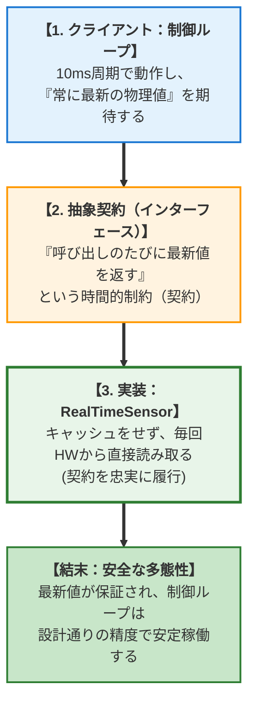
```mermaid

graph TD

    %% 1. クライアント

    Client["<b>【1. クライアント：制御ループ】</b><br/>10ms周期で動作し、<br/>『常に最新の物理値』を期待する"]


    %% 2. 抽象契約

    Interface["<b>【2. 抽象契約（インターフェース）】</b><br/>『呼び出しのたびに最新値を返す』<br/>という時間的制約（契約）"]


    %% 3. 正しい実装（LSP準拠）

    RealTime["<b>【3. 実装：RealTimeSensor】</b><br/>キャッシュをせず、毎回HWから直接読み取る<br/>(契約を忠実に履行)"]


    %% 4. 結果

    Success["<b>【結末：安全な多態性】</b><br/>最新値が保証され、制御ループは<br/>設計通りの精度で安定稼働する"]


    %% 接続（太い矢印で縦の流れを強調）

    Client ==> Interface

    Interface ==> RealTime

    RealTime ==> Success


    %% スタイル設定（成功と信頼を示す青・緑系）

    style Client fill:#e3f2fd,stroke:#1976d2,stroke-width:2px

    style Interface fill:#fff3e0,stroke:#ff9800,stroke-width:2px

    style RealTime fill:#e8f5e9,stroke:#2e7d32,stroke-width:3px

    style Success fill:#c8e6c9,stroke:#2e7d32,stroke-width:2px


```


#### 遵守時のタイムライン


**この図が示すもの**:

クライアントのポーリングごとに、確実に最新の物理値が取得できている正常なシーケンスです。


**注目ポイント**:


* クライアントの `get_value` コールと、ハードウェアからの値取得が同期しており、常に物理世界の最新状態がシステムに反映されています。


**読み方のガイド**:


* リクエスト（左から右）とレスポンス（右から左）が遅延なく行われていること


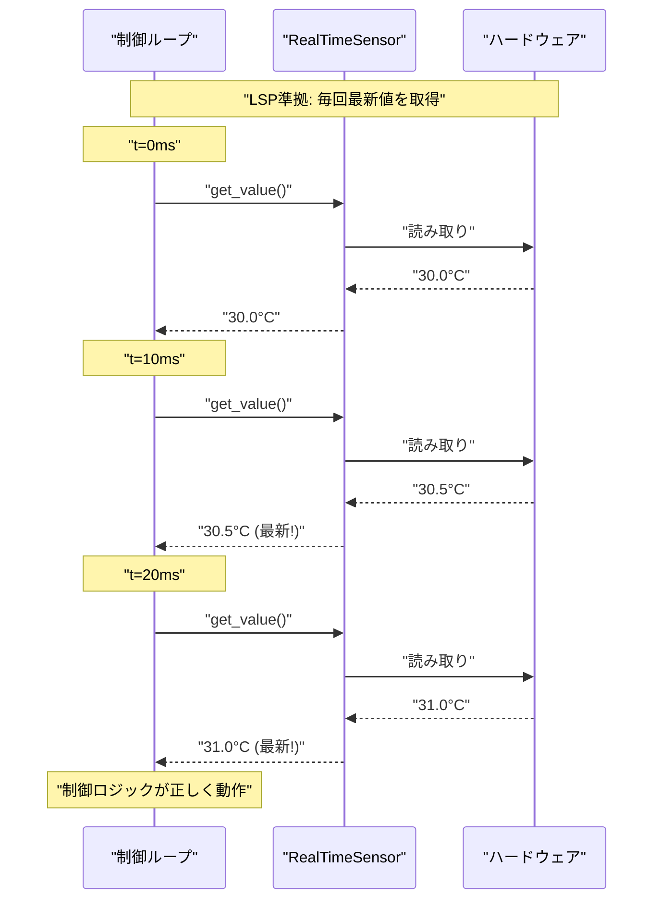
```mermaid

sequenceDiagram

    participant Client as "制御ループ"

    participant RT as "RealTimeSensor"

    participant HW as "ハードウェア"


    Note over Client,HW: "LSP準拠: 毎回最新値を取得"


    Note over Client: "t=0ms"

    Client->>RT: "get_value()"

    RT->>HW: "読み取り"

    HW-->>RT: "30.0°C"

    RT-->>Client: "30.0°C"

    

    Note over Client: "t=10ms"

    Client->>RT: "get_value()"

    RT->>HW: "読み取り"

    HW-->>RT: "30.5°C"

    RT-->>Client: "30.5°C (最新!)"

    

    Note over Client: "t=20ms"

    Client->>RT: "get_value()"

    RT->>HW: "読み取り"

    HW-->>RT: "31.0°C"

    RT-->>Client: "31.0°C (最新!)"

    

    Note over Client: "制御ロジックが正しく動作"


```


#### **契約の比較表**


| 項目 | 抽象インターフェース（契約） | 具象実装（準拠状態） | 判定 |

| --- | --- | --- | --- |

| **不変条件** | 呼出のたびに最新値を返す | **常にハードウェアから読み取る** | **遵守** |

| **クライアントの期待** | リアルタイム制御可能 | **期待通りにリアルタイム動作** | **置換可能** |

| **具象の制約** | 特になし | **省電力より契約を優先** | **契約の誠実な履行** |


#### **RealTimeSensor.c(LSP準拠の実装)**


```c

#include "isensor.h"


// ハードウェア読み取りのモック（本来は別ヘッダ）

float fetch_from_hardware(int id);


typedef struct {

    int hardware_id;

} RealTimeSensor_Data;


/* LSP COMPLIANT: クライアントが期待する「時間的整合性」を最優先する */

static float get_value_impl(void* self) {

    RealTimeSensor_Data* sensor = (RealTimeSensor_Data*)self;

    

    /* * 処置：具象の「省電力」より、契約の「最新性」を優先。

     * キャッシュ動作は契約違反になるため行わない。

     */

    return fetch_from_hardware(sensor->hardware_id);

}


```


#### **isensor.h(インターフェース定義)**


```c

#ifndef ISENSOR_H

#define ISENSOR_H


/**

 * @brief リアルタイムセンサーインターフェース

 * * [不変条件（振る舞いの契約）] 

 * - get_value() は呼び出すたびに最新のハードウェア値を返すこと

 * - 値のキャッシュは行わないこと

 * - リアルタイム制御での使用を想定している

 */

typedef struct {

    float (*get_value)(void* self);

} ISensorVTable;


typedef struct {

    const ISensorVTable* vtable;

    void* self;

} ISensor;


#endif


```


#### **設計のポイント**


* **契約の明示**: インターフェース定義に不変条件（キャッシュ禁止）を明記

* **契約の履行**: 具象実装側は、独自の最適化（省電力）よりも共通の契約を優先して実装する

* **信頼性の確保**: クライアントはどの実装が来ても「最新値である」と信じてコードを書くことができる


### 3.3. 実践パターン3：事後条件の統一（エラーコードの誠実な返却）


処理が終わった後の状態（戻り値）も契約の一部である。クライアントが知らない「独自のエラーコード」を返すことは、事後条件を弱める行為である。


#### ❌ 原則適用前：事後条件の弱化（LSP違反）


具象実装が、契約に定義されていない独自の内部エラーコードをそのままクライアントに返してしまうケース。


#### 違反時の構造と問題点


**この図が示すもの**:

具象実装が、契約範囲外の「内部エラーコード」を漏洩させた結果、クライアントの判定ロジックが破綻する様子を示します。


**注目ポイント**:


* **未知の値**: クライアントは負の値をエラーとして期待していますが、実装は正の値（1001）を返しています。

* **カプセル化の破壊**: 内部実装の詳細（生のエラーコード）が外部に漏れています。


**読み方のガイド**:


* 赤い矢印: 契約違反のデータの流れ

* Problemノード: システムへの悪影響


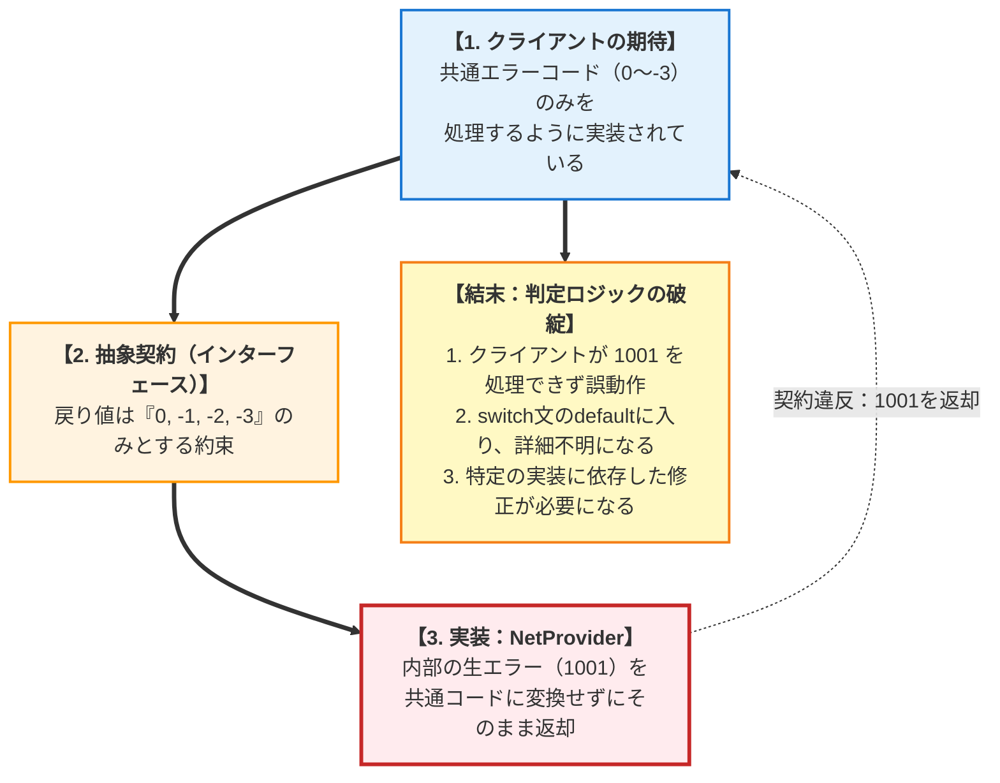
```mermaid

graph TD

    %% 1. クライアントの前提

    Client["<b>【1. クライアントの期待】</b><br/>共通エラーコード（0〜-3）のみを<br/>処理するように実装されている"]


    %% 2. 抽象契約

    Interface["<b>【2. 抽象契約（インターフェース）】</b><br/>戻り値は『0, -1, -2, -3』のみとする約束"]


    %% 3. LSP違反の実装

    Impl["<b>【3. 実装：NetProvider】</b><br/>内部の生エラー（1001）を<br/>共通コードに変換せずにそのまま返却"]


    %% 4. 発生する問題

    Problem["<b>【結末：判定ロジックの破綻】</b><br/>1. クライアントが 1001 を処理できず誤動作<br/>2. switch文のdefaultに入り、詳細不明になる<br/>3. 特定の実装に依存した修正が必要になる"]


    %% 接続（縦方向の流れを強調）

    Client ==> Interface

    Interface ==> Impl

    Impl -.->|"契約違反：1001を返却"| Client

    Client ==> Problem


    %% スタイル設定

    style Client fill:#e3f2fd,stroke:#1976d2,stroke-width:2px

    style Interface fill:#fff3e0,stroke:#ff9800,stroke-width:2px

    style Impl fill:#ffebee,stroke:#c62828,stroke-width:3px

    style Problem fill:#fff9c4,stroke:#f57f17,stroke-width:2px


```


#### **契約の比較表**


| 項目 | 抽象インターフェース（契約） | 具象実装（違反状態） | 変化の判定 |

| --- | --- | --- | --- |

| **事後条件** | 共通エラーコード(0, -1, -2, -3)を返す | **定義外のコード(1001)を返す** | **弱化（違反）** |

| **クライアントの判定** | `if (res < 0)` で統一判定可能 | **正しく負の値を返すので判定成功** | **判定ロジック破綻** |

| **エラー情報** | 抽象化された意味あるコード | **具象の内部実装が漏洩** | **抽象化の破壊** |


#### **iresource.h(抽象契約の定義)**


```c

#ifndef IRESOURCE_H

#define IRESOURCE_H

/* 契約で定義されたエラーコード */

#define SUCCESS 0

#define ERROR_NOT_FOUND -1

#define ERROR_TEMPORARY -2

#define ERROR_FATAL -3

/**

 * @brief リソース取得インターフェース

 * * [事後条件]

 * - 成功時: SUCCESS (0) を返す

 * - 失敗時: 以下のいずれかを返す

 * * ERROR_NOT_FOUND (-1): リソースが見つからない

 * * ERROR_TEMPORARY (-2): 一時的なエラー（リトライ推奨）

 * * ERROR_FATAL (-3): 致命的なエラー（復旧不可）

 * * これ以外のエラーコードを返してはならない

 */

typedef struct {

    int (*acquire_resource)(void* self);

    void (*release_resource)(void* self);

} IResourceVTable;


typedef struct {

    const IResourceVTable* vtable;

    void* self;

} IResource;


#endif


```


#### **NetResourceProvider.c(LSP違反の実装)**


```c

#include "iresource.h"

#include <stdbool.h>

#include <stdio.h>


/* 内部で使用している独自エラーコード */

#define INTERNAL_NETWORK_DOWN 1001

#define INTERNAL_AUTH_FAILED 1002


// ダミーのネットワーク状態確認

static bool network_is_down(void) { return true; } // 常にダウン状態をシミュレート


typedef struct {

    int connection_id;

} NetResource_Data;


/* LSP VIOLATION: 独自エラーコードの返却による契約破壊 */

static int net_acquire_impl(void* self) {

    // 【解説】(void)self; は「未使用引数」の警告を抑制するためのC言語のイディオムです。

    // この例ではモック関数しか呼ばないため self を使いませんが、

    // 実務では構造体メンバへアクセスするために使用します。

    (void)self;


    if (network_is_down()) {

        /* * 【致命的違反】契約にない「正の値(1001)」を返す。

         * 多くのCプログラマは result < 0 をエラー判定の基準にするため、

         * この実装は「エラーなのに正常系」として処理を続行させてしまう。

         */

        return INTERNAL_NETWORK_DOWN; // 1001

    }

    return SUCCESS;

}


```


#### ✅ 原則適用後：エラーマッピングの実施（LSP準拠）


具象内部の詳細は「共通の言語（エラーコード）」に翻訳してから返却する。


#### 遵守時の構造とメリット


**この図が示すもの**:

具象実装内部で発生したエラーが、マッパー（Mapper）によって契約通りのコードに変換されてからクライアントに届く様子を示します。


**注目ポイント**:


* **翻訳**: 内部エラー `1001` が、契約済みの `ERROR_TEMPORARY (-2)` に変換されています。

* **安全性**: クライアントは内部事情を知る必要がなく、共通のエラー処理ロジックのみで動作します。


**読み方のガイド**:


* Mapperノード: 変換の責任を持つ場所

* 緑色の流れ: 安全な処理フロー


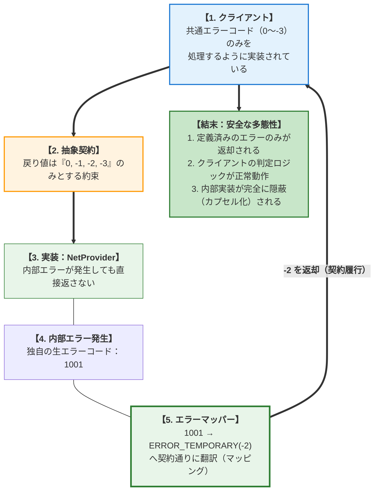
```mermaid

graph TD

    %% 1. クライアント

    Client["<b>【1. クライアント】</b><br/>共通エラーコード（0〜-3）のみを<br/>処理するように実装されている"]


    %% 2. 抽象契約

    Interface["<b>【2. 抽象契約】</b><br/>戻り値は『0, -1, -2, -3』のみとする約束"]


    %% 3. 実装とマッパー（LSP準拠）

    Impl["<b>【3. 実装：NetProvider】</b><br/>内部エラーが発生しても直接返さない"]

    

    Internal["<b>【4. 内部エラー発生】</b><br/>独自の生エラーコード：1001"]


    Mapper["<b>【5. エラーマッパー】</b><br/>1001 → ERROR_TEMPORARY(-2)<br/>へ契約通りに翻訳（マッピング）"]


    %% 4. 結果

    Benefit["<b>【結末：安全な多態性】</b><br/>1. 定義済みのエラーのみが返却される<br/>2. クライアントの判定ロジックが正常動作<br/>3. 内部実装が完全に隠蔽（カプセル化）される"]


    %% 接続（縦方向の太いライン）

    Client ==> Interface

    Interface ==> Impl

    Impl --- Internal

    Internal --- Mapper

    Mapper ==>|"<b>-2 を返却（契約履行）</b>"| Client

    Client ==> Benefit


    %% スタイル設定（成功と安全を示す緑系を基調に）

    style Client fill:#e3f2fd,stroke:#1976d2,stroke-width:2px

    style Interface fill:#fff3e0,stroke:#ff9800,stroke-width:2px

    style Impl fill:#e8f5e9,stroke:#2e7d32

    style Mapper fill:#e8f5e9,stroke:#2e7d32,stroke-width:3px

    style Benefit fill:#c8e6c9,stroke:#2e7d32,stroke-width:2px


```


#### エラー処理のフロー（翻訳プロセス）


**この図が示すもの**:

エラーマッピングの時系列フローです。


**注目ポイント**:


* `NetProvider` が内部エラーを検知した後、即座に返すのではなく `map_error` を経由している点が重要です。


**読み方のガイド**:


* 左から右への時間経過。`map_error` の呼び出しと戻り値に注目。


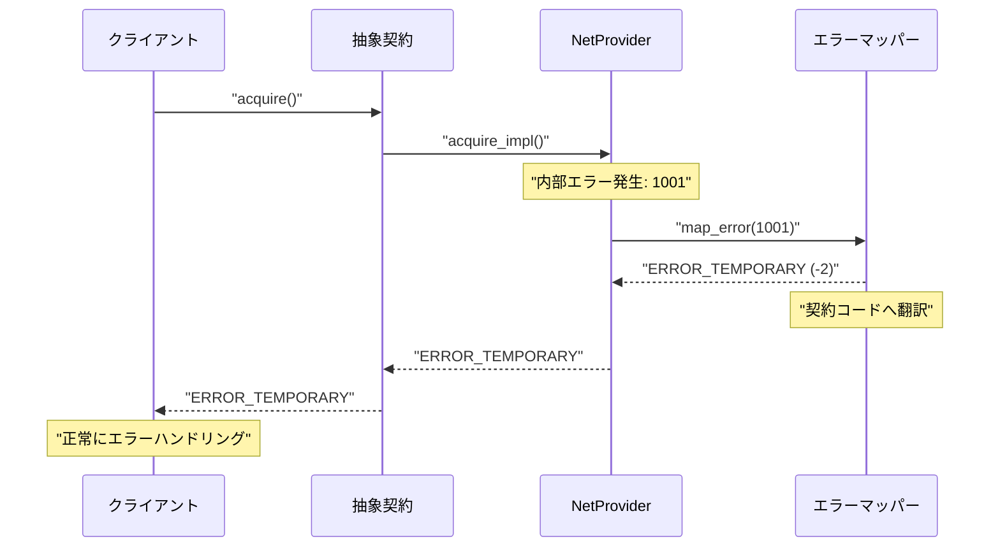
```mermaid

sequenceDiagram

    participant C as クライアント

    participant I as 抽象契約

    participant Impl as NetProvider

    participant Map as エラーマッパー


    C->>I: "acquire()"

    I->>Impl: "acquire_impl()"

    

    Note over Impl: "内部エラー発生: 1001"

    

    Impl->>Map: "map_error(1001)"

    Map-->>Impl: "ERROR_TEMPORARY (-2)"

    Note over Map: "契約コードへ翻訳"

    

    Impl-->>I: "ERROR_TEMPORARY"

    I-->>C: "ERROR_TEMPORARY"

    

    Note over C: "正常にエラーハンドリング"


```


#### **NetResourceProvider.c(LSP準拠の実装)**


```c

#include "iresource.h"

#include <stdbool.h>

#include <stdlib.h>

#include <stdio.h>


/* 内部エラーコード（外部に漏らさない） */

#define INTERNAL_NETWORK_DOWN 1001

#define INTERNAL_AUTH_FAILED 1002

#define INTERNAL_TIMEOUT 1003


// ダミー状態関数

static bool network_is_down(void) { return true; }

static bool authentication_failed(void) { return false; }


typedef struct {

    int connection_id;

} NetResource_Data;


/* エラーマッピング関数: ここがLSPを守る防波堤 */

static int map_internal_error_to_contract(int internal_error) {

    switch (internal_error) {

        case INTERNAL_NETWORK_DOWN:

        case INTERNAL_TIMEOUT:

            /* 一時的な問題 → リトライ可能なエラー */

            return ERROR_TEMPORARY; // 共通契約コードへの変換

        

        case INTERNAL_AUTH_FAILED:

            /* 認証失敗 → 致命的なエラー */

            return ERROR_FATAL;

        

        default:

            /* 不明なエラー → 致命的として扱う */

            return ERROR_FATAL;

    }

}


/* LSP COMPLIANT: エラーマッピングによる事後条件の保証 */

static int net_acquire_impl(void* context) {

    NetResource_Data* res = (NetResource_Data*)context;

    int internal_result;

    

    if (network_is_down()) {

        internal_result = INTERNAL_NETWORK_DOWN;

        printf("[NetProvider] Internal Error: %d -> Mapping...\n", internal_result);

        /* 内部エラーを契約済みの ERROR_TEMPORARY(-2) に変換 */

        return map_internal_error_to_contract(internal_result);

    }

    

    if (authentication_failed()) {

        internal_result = INTERNAL_AUTH_FAILED;

        internal_result = INTERNAL_AUTH_FAILED;

        return map_internal_error_to_contract(internal_result);

    }

    

    return SUCCESS;

}


static void net_release_impl(void* context) {

    if (context) free(context);

}


static const IResourceVTable net_resource_vtable = {

    .acquire_resource = net_acquire_impl,

    .release_resource = net_release_impl

};


// ファクトリ関数（インターフェースとして返す）

IResource* create_net_resource(void) {

    IResource* res = malloc(sizeof(IResource));

    NetResource_Data* data = malloc(sizeof(NetResource_Data));

    

    if (!res || !data) {

        if(res) free(res);

        if(data) free(data);

        return NULL;

    }

    

    res->vtable = &net_resource_vtable;

    res->self = data; // 内部データ（コンテキスト）の注入

    return res;

}


```


#### **Client.c(実行結果)**


```c

#include "iresource.h"

#include <stdio.h>

#include <stdlib.h>


extern IResource* create_net_resource(void);


int main(void) {

    IResource* res = create_net_resource();

    

    printf("--- Acquiring Resource ---\n");

    int result = res->vtable->acquire_resource(res->self);

    

    if (result == SUCCESS) {

        printf("Success!\n");

    } else {

        // 契約に基づいた正しいエラーハンドリングが可能

        printf("Failed. Error Code: %d ", result);

        if (result == ERROR_TEMPORARY) {

            printf("(Temporary Error: Retrying is recommended)\n");

        } else {

            printf("(Fatal Error)\n");

        }

    }

    

    res->vtable->release_resource(res->self);

    free(res);

    return 0;

}


```


#### **実行結果**


```c

--- Acquiring Resource ---

[NetProvider] Internal Error: 1001 -> Mapping...

Failed. Error Code: -2 (Temporary Error: Retrying is recommended)


```


#### **設計のポイント**


* **エラー変換層**: 内部エラーと契約エラーの間に明確な変換層を設ける

* **契約の遵守**: 常に契約で定義されたエラーコードのみを返却

* **内部詳細の隠蔽**: 具象の実装詳細（ネットワーク、認証など）をクライアントから完全に隠す

* **保守性の向上**: 内部エラーコードが変更されても、マッピング関数の修正だけで対応可能


## 本章で必ず理解してほしいことのまとめ


### リスコフ置換原則 (LSP) の設計指針


#### 1. **LSPの本質を「置換可能性」の保証と定義する**:


どの具象実装に置き換えられても、クライアント側の「正しさ」が損なわれない状態を目指す。これはOCPの「拡張」を安全に行うための品質保証である。


#### 2. **契約の3要素を「クライアント視点」で守る**:


* **前提条件**: 入力へのケチをつけない（強化しない）。具象の制約は内部で吸収する。

* **不変条件**: 壊さないと約束したものは絶対に壊さない（時間的整合性を含む）。

* **事後条件**: 共通の言葉（戻り値）で結果を報告する（弱化しない）。エラーマッピングを徹底する。


#### 3. **C言語特有の道具を使いこなす（第1部参照）**:


* **不透明ポインタと不完全型（第4章）**: `void* self` や構造体の前方宣言により、具象の詳細をクライアントから物理的に隔離する。

* **前方宣言と不完全型**: ヘッダレベルでの依存を最小化

* **厳格なエラーハンドリング（第6章）**: 契約で定義された共通エラー型のみを使用し、事後条件を保証する。

* **防御的コピー**: `const` 契約を守るための具象側の努力


#### 4. **テストによる契約の検証**:


新しい具象実装は、共通のインターフェーステストスイートをパスしなければならない。同じ入力に対して、同じ出力（またはエラー）を返すことを保証する。

Kindle本の校正担当
カスタム Gem
修正概要と理由
[修正範囲: ### 3.2. 実践パターン2 〜 最後まで]

コードの重複行の削除 (NetResourceProvider.c 準拠版): internal_result = INTERNAL_AUTH_FAILED; が2行連続して記述されていたため、重複を削除しました。

冗長な解説コメントの削除 (NetResourceProvider.c 違反版): ガイドライン「9.1 特殊な構文の説明」に基づき、既出のイディオムである (void)self; に対する長文の解説コメントを削除し、コードを簡潔にしました。

見出しの適正化 (Client.c): #### Client.c(実行結果) という見出しが、コードファイルの内容と不整合（実行結果ではなくソースコードそのもの）であったため、#### Client.c に修正しました。

まとめ項目の重複整理 (本章で必ず理解してほしいことのまとめ): 「不透明ポインタと不完全型」と「前方宣言と不完全型」という項目が内容的に重複していたため、一つの項目に統合し、依存性の最小化についても合わせて記述しました。

▼▼▼▼▼ ここからコピペ用データ ▼▼▼▼▼

3.2. 実践パターン2：不変条件の保証（暗黙のルールの維持）
不変条件とは、**「オブジェクトが生存している間、常に真でなければならないルール」です。これにはデータの整合性だけでなく、「一度取得したデータは、ある一定の条件下（例えば次の更新まで）では変化しない」あるいは逆に「呼び出すたびに必ず最新の状態を反映する」**といった、時間的な振る舞いのルールも含まれます。

❌ 原則適用前：不変条件の破壊（最適化による時間的ルールの変更）
センサー値を読み取るインターフェースにおいて、クライアントは「呼び出すたびに最新の値が得られる」という振る舞いの契約（不変条件）を期待している。しかし、ある具象実装が**「消費電力削減のため、内部で500msキャッシュする」**という最適化を勝手に行うケース。これは「エラー」ではないが、契約が保証していた「リアルタイム性」という不変条件を破壊している。

違反時の構造と影響
この図が示すもの: 具象実装が勝手な最適化（キャッシュ）を行った結果、クライアントの期待する「リアルタイム性」が損なわれる様子を示します。

注目ポイント:

不一致: クライアントは10msごとの制御を期待していますが、実装は500msごとの更新しか行いません。

リスク: 値が変わらないため、制御系システムでは暴走や振動などの重大な事故につながる恐れがあります。

読み方のガイド:

赤い箱（Impl, Failure）: 不正な状態の連鎖

クライアントの期待（10ms）と実装の挙動（500ms）のズレに注目

コード スニペット
graph TD
    %% 1. クライアントの前提
    Client["1. クライアント:制御ループ / 10ms周期で動作し最新値を期待"]
    
    %% 2. 抽象契約
    Interface["2. 抽象契約:センサー / 現在の値を必ず返すという約束"]

    %% 3. LSP違反の実装
    Impl["3. 具象実装:EcoSensor / 500msキャッシュを勝手に導入"]

    %% 4. 発生する事象
    Failure["4. 実行時の挙動 / 490msの間は古い値を返し続ける"]

    %% 5. 深刻な結末
    Problem["結論: システムの不安定化 / 制御の破綻や再現性の低いバグを誘発"]

    %% 接続（シンプルな矢印）
    Client --- Interface
    Interface --- Impl
    Impl --- Failure
    Failure --- Problem

    %% スタイル設定（色指定もシンプルに）
    style Client fill:#e3f2fd,stroke:#1976d2
    style Interface fill:#fff3e0,stroke:#ff9800
    style Impl fill:#ffebee,stroke:#c62828
    style Failure fill:#ffffff,stroke:#c62828
    style Problem fill:#fff9c4,stroke:#f57f17
時間軸での不整合（タイムライン図）
この図が示すもの: 制御ループ（クライアント）とセンサー（実装）の時間的なズレを可視化しています。

注目ポイント:

物理値（Hardware）は変化しているのに、EcoSensorがそれを無視して古い値を返し続けている点。

読み方のガイド:

左側（Client）は頻繁に問い合わせています。

中央（Eco）が「キャッシュ」によって遮断壁となっている様子。

コード スニペット
sequenceDiagram
    participant Client as 制御ループ
    participant Interface as 抽象契約
    participant Eco as EcoSensor
    participant HW as ハードウェア

    Note over Client: "t=0ms"
    Client->>Interface: "get_value()"
    Interface->>Eco: "get_value_impl()"
    Eco->>HW: "物理的な読み取り"
    HW-->>Eco: "30.0度"
    Eco-->>Client: "30.0度 (キャッシュ保存)"
    
    Note over Client: "t=10ms (物理値は30.5度に変化)"
    Client->>Interface: "get_value()"
    Interface->>Eco: "get_value_impl()"
    Note over Eco: "キャッシュ有効(500ms以内)"
    Eco-->>Client: "30.0度 (古い値!)"
    
    Note over Client: "t=20ms (物理値は31.0度に変化)"
    Client->>Interface: "get_value()"
    Note over Client,Eco: "実際の温度は変化しているのに..."
    Eco-->>Client: "30.0度 (まだ古い値!)"
    
    Note over Client: "制御ループが不安定化するリスク"
契約の比較表
項目	抽象インターフェース（契約）	具象実装（違反状態）	判定
不変条件	呼出のたびに最新値を返す	500ms間は古い値を返し続ける	破壊（違反）
クライアントの誤算	高速な制御ループに使用可能	制御が追いつかず、システムが不安定化	置換不能
暗黙の契約	リアルタイム性の保証	最適化優先でリアルタイム性を犠牲	契約違反
EcoSensor.c(LSP違反の実装)
C
#include "isensor.h"
#include <time.h>

typedef struct {
    float cached_value;
    time_t last_update;
    int hardware_id;
} EcoSensor_Data;

#define CACHE_DURATION_MS 500

// 時間取得とハードウェア読み取りのモック（本来は別ヘッダ）
time_t get_time_ms(void);
float fetch_from_hardware(int id);

/* LSP VIOLATION: 「最新値を返す」という暗黙の不変条件を、省電力（具象都合）で破っている */
static float get_value_impl(void* self) {
    EcoSensor_Data* sensor = (EcoSensor_Data*)self;
    time_t now = get_time_ms();
    
    /* 【違反】単体では「省電力」という正しい機能だが、
     * 「常に最新」を期待する既存の制御プログラムに組み込むと、更新頻度不足で破綻する。
     */
    if (now - sensor->last_update < CACHE_DURATION_MS) {
        return sensor->cached_value; // 古い値を返す
    }
    
    sensor->cached_value = fetch_from_hardware(sensor->hardware_id);
    sensor->last_update = now;
    return sensor->cached_value;
}
この設計の何が「罪」なのか
時間的不変条件の破壊: 「呼び出すたびに最新」という暗黙の保証を破っている

制御系での使用不可: 高速な制御ループで使うと、センサー値の更新が追いつかない

デバッグ困難: エラーは出ないが、システムが微妙におかしくなる

単体では正しい: 省電力という機能自体は正しいが、契約の文脈では違反

✅ 原則適用後：契約に忠実な振る舞い（LSP準拠）
解決策
もし具象が最適化を行いたいなら、インターフェースの「不変条件（リアルタイム性の保証）」を逸脱しない範囲に留めるか、インターフェース自体に「低頻度版」を設けて分離する。

遵守時の構造と信頼回復
この図が示すもの: 具象実装が余計な最適化を排除し、クライアントの期待通りに振る舞う様子を示します。

注目ポイント:

忠実な履行: RealTimeSensor はキャッシュをせず、毎回ハードウェアに問い合わせます。

安全な多態性: これにより、クライアントは「どのセンサーでも最新の値が取れる」と安心して設計できます。

読み方のガイド:

緑色（RealTime, Success）: 正しい実装と結果

矢印が一直線に通っている: 障害物（キャッシュ）がないことの象徴

コード スニペット
graph TD
    %% 1. クライアント
    Client["<b>【1. クライアント：制御ループ】</b><br/>10ms周期で動作し、<br/>『常に最新の物理値』を期待する"]

    %% 2. 抽象契約
    Interface["<b>【2. 抽象契約（インターフェース）】</b><br/>『呼び出しのたびに最新値を返す』<br/>という時間的制約（契約）"]

    %% 3. 正しい実装（LSP準拠）
    RealTime["<b>【3. 実装：RealTimeSensor】</b><br/>キャッシュをせず、毎回HWから直接読み取る<br/>(契約を忠実に履行)"]

    %% 4. 結果
    Success["<b>【結末：安全な多態性】</b><br/>最新値が保証され、制御ループは<br/>設計通りの精度で安定稼働する"]

    %% 接続（太い矢印で縦の流れを強調）
    Client ==> Interface
    Interface ==> RealTime
    RealTime ==> Success

    %% スタイル設定（成功と信頼を示す青・緑系）
    style Client fill:#e3f2fd,stroke:#1976d2,stroke-width:2px
    style Interface fill:#fff3e0,stroke:#ff9800,stroke-width:2px
    style RealTime fill:#e8f5e9,stroke:#2e7d32,stroke-width:3px
    style Success fill:#c8e6c9,stroke:#2e7d32,stroke-width:2px
遵守時のタイムライン
この図が示すもの: クライアントのポーリングごとに、確実に最新の物理値が取得できている正常なシーケンスです。

注目ポイント:

クライアントの get_value コールと、ハードウェアからの値取得が同期しており、常に物理世界の最新状態がシステムに反映されています。

読み方のガイド:

リクエスト（左から右）とレスポンス（右から左）が遅延なく行われていること

コード スニペット
sequenceDiagram
    participant Client as "制御ループ"
    participant RT as "RealTimeSensor"
    participant HW as "ハードウェア"

    Note over Client,HW: "LSP準拠: 毎回最新値を取得"

    Note over Client: "t=0ms"
    Client->>RT: "get_value()"
    RT->>HW: "読み取り"
    HW-->>RT: "30.0°C"
    RT-->>Client: "30.0°C"
    
    Note over Client: "t=10ms"
    Client->>RT: "get_value()"
    RT->>HW: "読み取り"
    HW-->>RT: "30.5°C"
    RT-->>Client: "30.5°C (最新!)"
    
    Note over Client: "t=20ms"
    Client->>RT: "get_value()"
    RT->>HW: "読み取り"
    HW-->>RT: "31.0°C"
    RT-->>Client: "31.0°C (最新!)"
    
    Note over Client: "制御ロジックが正しく動作"
契約の比較表
項目	抽象インターフェース（契約）	具象実装（準拠状態）	判定
不変条件	呼出のたびに最新値を返す	常にハードウェアから読み取る	遵守
クライアントの期待	リアルタイム制御可能	期待通りにリアルタイム動作	置換可能
具象の制約	特になし	省電力より契約を優先	契約の誠実な履行
RealTimeSensor.c(LSP準拠の実装)
C
#include "isensor.h"

// ハードウェア読み取りのモック（本来は別ヘッダ）
float fetch_from_hardware(int id);

typedef struct {
    int hardware_id;
} RealTimeSensor_Data;

/* LSP COMPLIANT: クライアントが期待する「時間的整合性」を最優先する */
static float get_value_impl(void* self) {
    RealTimeSensor_Data* sensor = (RealTimeSensor_Data*)self;
    
    /* 処置：具象の「省電力」より、契約の「最新性」を優先。
     * キャッシュ動作は契約違反になるため行わない。
     */
    return fetch_from_hardware(sensor->hardware_id);
}
isensor.h(インターフェース定義)
C
#ifndef ISENSOR_H
#define ISENSOR_H

/**
 * @brief リアルタイムセンサーインターフェース
 * * [不変条件（振る舞いの契約）] 
 * - get_value() は呼び出すたびに最新のハードウェア値を返すこと
 * - 値のキャッシュは行わないこと
 * - リアルタイム制御での使用を想定している
 */
typedef struct {
    float (*get_value)(void* self);
} ISensorVTable;

typedef struct {
    const ISensorVTable* vtable;
    void* self;
} ISensor;

#endif
設計のポイント
契約の明示: インターフェース定義に不変条件（キャッシュ禁止）を明記

契約の履行: 具象実装側は、独自の最適化（省電力）よりも共通の契約を優先して実装する

信頼性の確保: クライアントはどの実装が来ても「最新値である」と信じてコードを書くことができる

3.3. 実践パターン3：事後条件の統一（エラーコードの誠実な返却）
処理が終わった後の状態（戻り値）も契約の一部である。クライアントが知らない「独自のエラーコード」を返すことは、事後条件を弱める行為である。

❌ 原則適用前：事後条件の弱化（LSP違反）
具象実装が、契約に定義されていない独自の内部エラーコードをそのままクライアントに返してしまうケース。

違反時の構造と問題点
この図が示すもの: 具象実装が、契約範囲外の「内部エラーコード」を漏洩させた結果、クライアントの判定ロジックが破綻する様子を示します。

注目ポイント:

未知の値: クライアントは負の値をエラーとして期待していますが、実装は正の値（1001）を返しています。

カプセル化の破壊: 内部実装の詳細（生のエラーコード）が外部に漏れています。

読み方のガイド:

赤い矢印: 契約違反のデータの流れ

Problemノード: システムへの悪影響

コード スニペット
graph TD
    %% 1. クライアントの前提
    Client["<b>【1. クライアントの期待】</b><br/>共通エラーコード（0〜-3）のみを<br/>処理するように実装されている"]

    %% 2. 抽象契約
    Interface["<b>【2. 抽象契約（インターフェース）】</b><br/>戻り値は『0, -1, -2, -3』のみとする約束"]

    %% 3. LSP違反の実装
    Impl["<b>【3. 実装：NetProvider】</b><br/>内部の生エラー（1001）を<br/>共通コードに変換せずにそのまま返却"]

    %% 4. 発生する問題
    Problem["<b>【結末：判定ロジックの破綻】</b><br/>1. クライアントが 1001 を処理できず誤動作<br/>2. switch文のdefaultに入り、詳細不明になる<br/>3. 特定の実装に依存した修正が必要になる"]

    %% 接続（縦方向の流れを強調）
    Client ==> Interface
    Interface ==> Impl
    Impl -.->|"契約違反：1001を返却"| Client
    Client ==> Problem

    %% スタイル設定
    style Client fill:#e3f2fd,stroke:#1976d2,stroke-width:2px
    style Interface fill:#fff3e0,stroke:#ff9800,stroke-width:2px
    style Impl fill:#ffebee,stroke:#c62828,stroke-width:3px
    style Problem fill:#fff9c4,stroke:#f57f17,stroke-width:2px
契約の比較表
項目	抽象インターフェース（契約）	具象実装（違反状態）	変化の判定
事後条件	共通エラーコード(0, -1, -2, -3)を返す	定義外のコード(1001)を返す	弱化（違反）
クライアントの判定	if (res < 0) で統一判定可能	正しく負の値を返すので判定成功	判定ロジック破綻
エラー情報	抽象化された意味あるコード	具象の内部実装が漏洩	抽象化の破壊
iresource.h(抽象契約の定義)
C
#ifndef IRESOURCE_H
#define IRESOURCE_H
/* 契約で定義されたエラーコード */
#define SUCCESS 0
#define ERROR_NOT_FOUND -1
#define ERROR_TEMPORARY -2
#define ERROR_FATAL -3
/**
 * @brief リソース取得インターフェース
 * * [事後条件]
 * - 成功時: SUCCESS (0) を返す
 * - 失敗時: 以下のいずれかを返す
 * * ERROR_NOT_FOUND (-1): リソースが見つからない
 * * ERROR_TEMPORARY (-2): 一時的なエラー（リトライ推奨）
 * * ERROR_FATAL (-3): 致命的なエラー（復旧不可）
 * * これ以外のエラーコードを返してはならない
 */
typedef struct {
    int (*acquire_resource)(void* self);
    void (*release_resource)(void* self);
} IResourceVTable;

typedef struct {
    const IResourceVTable* vtable;
    void* self;
} IResource;

#endif
NetResourceProvider.c(LSP違反の実装)
C
#include "iresource.h"
#include <stdbool.h>
#include <stdio.h>

/* 内部で使用している独自エラーコード */
#define INTERNAL_NETWORK_DOWN 1001
#define INTERNAL_AUTH_FAILED 1002

// ダミーのネットワーク状態確認
static bool network_is_down(void) { return true; } // 常にダウン状態をシミュレート

typedef struct {
    int connection_id;
} NetResource_Data;

/* LSP VIOLATION: 独自エラーコードの返却による契約破壊 */
static int net_acquire_impl(void* self) {
    (void)self;

    if (network_is_down()) {
        /* 【致命的違反】契約にない「正の値(1001)」を返す。
         * 多くのCプログラマは result < 0 をエラー判定の基準にするため、
         * この実装は「エラーなのに正常系」として処理を続行させてしまう。
         */
        return INTERNAL_NETWORK_DOWN; // 1001
    }
    return SUCCESS;
}
✅ 原則適用後：エラーマッピングの実施（LSP準拠）
具象内部の詳細は「共通の言語（エラーコード）」に翻訳してから返却する。

遵守時の構造とメリット
この図が示すもの: 具象実装内部で発生したエラーが、マッパー（Mapper）によって契約通りのコードに変換されてからクライアントに届く様子を示します。

注目ポイント:

翻訳: 内部エラー 1001 が、契約済みの ERROR_TEMPORARY (-2) に変換されています。

安全性: クライアントは内部事情を知る必要がなく、共通のエラー処理ロジックのみで動作します。

読み方のガイド:

Mapperノード: 変換の責任を持つ場所

緑色の流れ: 安全な処理フロー

コード スニペット
graph TD
    %% 1. クライアント
    Client["<b>【1. クライアント】</b><br/>共通エラーコード（0〜-3）のみを<br/>処理するように実装されている"]

    %% 2. 抽象契約
    Interface["<b>【2. 抽象契約】</b><br/>戻り値は『0, -1, -2, -3』のみとする約束"]

    %% 3. 実装とマッパー（LSP準拠）
    Impl["<b>【3. 実装：NetProvider】</b><br/>内部エラーが発生しても直接返さない"]
    
    Internal["<b>【4. 内部エラー発生】</b><br/>独自の生エラーコード：1001"]

    Mapper["<b>【5. エラーマッパー】</b><br/>1001 → ERROR_TEMPORARY(-2)<br/>へ契約通りに翻訳（マッピング）"]

    %% 4. 結果
    Benefit["<b>【結末：安全な多態性】</b><br/>1. 定義済みのエラーのみが返却される<br/>2. クライアントの判定ロジックが正常動作<br/>3. 内部実装が完全に隠蔽（カプセル化）される"]

    %% 接続（縦方向の太いライン）
    Client ==> Interface
    Interface ==> Impl
    Impl --- Internal
    Internal --- Mapper
    Mapper ==>|"<b>-2 を返却（契約履行）</b>"| Client
    Client ==> Benefit

    %% スタイル設定（成功と安全を示す緑系を基調に）
    style Client fill:#e3f2fd,stroke:#1976d2,stroke-width:2px
    style Interface fill:#fff3e0,stroke:#ff9800,stroke-width:2px
    style Impl fill:#e8f5e9,stroke:#2e7d32
    style Mapper fill:#e8f5e9,stroke:#2e7d32,stroke-width:3px
    style Benefit fill:#c8e6c9,stroke:#2e7d32,stroke-width:2px
エラー処理のフロー（翻訳プロセス）
この図が示すもの: エラーマッピングの時系列フローです。

注目ポイント:

NetProvider が内部エラーを検知した後、即座に返すのではなく map_error を経由している点が重要です。

読み方のガイド:

左から右への時間経過。map_error の呼び出しと戻り値に注目。

コード スニペット
sequenceDiagram
    participant C as クライアント
    participant I as 抽象契約
    participant Impl as NetProvider
    participant Map as エラーマッパー

    C->>I: "acquire()"
    I->>Impl: "acquire_impl()"
    
    Note over Impl: "内部エラー発生: 1001"
    
    Impl->>Map: "map_error(1001)"
    Map-->>Impl: "ERROR_TEMPORARY (-2)"
    Note over Map: "契約コードへ翻訳"
    
    Impl-->>I: "ERROR_TEMPORARY"
    I-->>C: "ERROR_TEMPORARY"
    
    Note over C: "正常にエラーハンドリング"
NetResourceProvider.c(LSP準拠の実装)
C
#include "iresource.h"
#include <stdbool.h>
#include <stdlib.h>
#include <stdio.h>

/* 内部エラーコード（外部に漏らさない） */
#define INTERNAL_NETWORK_DOWN 1001
#define INTERNAL_AUTH_FAILED 1002
#define INTERNAL_TIMEOUT 1003

// ダミー状態関数
static bool network_is_down(void) { return true; }
static bool authentication_failed(void) { return false; }

typedef struct {
    int connection_id;
} NetResource_Data;

/* エラーマッピング関数: ここがLSPを守る防波堤 */
static int map_internal_error_to_contract(int internal_error) {
    switch (internal_error) {
        case INTERNAL_NETWORK_DOWN:
        case INTERNAL_TIMEOUT:
            /* 一時的な問題 → リトライ可能なエラー */
            return ERROR_TEMPORARY; // 共通契約コードへの変換
        
        case INTERNAL_AUTH_FAILED:
            /* 認証失敗 → 致命的なエラー */
            return ERROR_FATAL;
        
        default:
            /* 不明なエラー → 致命的として扱う */
            return ERROR_FATAL;
    }
}

/* LSP COMPLIANT: エラーマッピングによる事後条件の保証 */
static int net_acquire_impl(void* context) {
    NetResource_Data* res = (NetResource_Data*)context;
    int internal_result;
    
    if (network_is_down()) {
        internal_result = INTERNAL_NETWORK_DOWN;
        printf("[NetProvider] Internal Error: %d -> Mapping...\n", internal_result);
        /* 内部エラーを契約済みの ERROR_TEMPORARY(-2) に変換 */
        return map_internal_error_to_contract(internal_result);
    }
    
    if (authentication_failed()) {
        internal_result = INTERNAL_AUTH_FAILED;
        return map_internal_error_to_contract(internal_result);
    }
    
    return SUCCESS;
}

static void net_release_impl(void* context) {
    if (context) free(context);
}

static const IResourceVTable net_resource_vtable = {
    .acquire_resource = net_acquire_impl,
    .release_resource = net_release_impl
};

// ファクトリ関数（インターフェースとして返す）
IResource* create_net_resource(void) {
    IResource* res = malloc(sizeof(IResource));
    NetResource_Data* data = malloc(sizeof(NetResource_Data));
    
    if (!res || !data) {
        if(res) free(res);
        if(data) free(data);
        return NULL;
    }
    
    res->vtable = &net_resource_vtable;
    res->self = data; // 内部データ（コンテキスト）の注入
    return res;
}
Client.c
C
#include "iresource.h"
#include <stdio.h>
#include <stdlib.h>

extern IResource* create_net_resource(void);

int main(void) {
    IResource* res = create_net_resource();
    
    printf("--- Acquiring Resource ---\n");
    int result = res->vtable->acquire_resource(res->self);
    
    if (result == SUCCESS) {
        printf("Success!\n");
    } else {
        // 契約に基づいた正しいエラーハンドリングが可能
        printf("Failed. Error Code: %d ", result);
        if (result == ERROR_TEMPORARY) {
            printf("(Temporary Error: Retrying is recommended)\n");
        } else {
            printf("(Fatal Error)\n");
        }
    }
    
    res->vtable->release_resource(res->self);
    free(res);
    return 0;
}
実行結果
--- Acquiring Resource ---
[NetProvider] Internal Error: 1001 -> Mapping...
Failed. Error Code: -2 (Temporary Error: Retrying is recommended)
設計のポイント
エラー変換層: 内部エラーと契約エラーの間に明確な変換層を設ける

契約の遵守: 常に契約で定義されたエラーコードのみを返却

内部詳細の隠蔽: 具象の実装詳細（ネットワーク、認証など）をクライアントから完全に隠す

保守性の向上: 内部エラーコードが変更されても、マッピング関数の修正だけで対応可能

本章で必ず理解してほしいことのまとめ
リスコフ置換原則 (LSP) の設計指針
1. LSPの本質を「置換可能性」の保証と定義する:
どの具象実装に置き換えられても、クライアント側の「正しさ」が損なわれない状態を目指す。これはOCPの「拡張」を安全に行うための品質保証である。

2. 契約の3要素を「クライアント視点」で守る:
前提条件: 入力へのケチをつけない（強化しない）。具象の制約は内部で吸収する。

不変条件: 壊さないと約束したものは絶対に壊さない（時間的整合性を含む）。

事後条件: 共通の言葉（戻り値）で結果を報告する（弱化しない）。エラーマッピングを徹底する。

3. C言語特有の道具を使いこなす（第1部参照）:
不透明ポインタと不完全型（第4章）: void* self や構造体の前方宣言により、具象の詳細をクライアントから物理的に隔離し、ヘッダレベルでの依存を最小化する。

厳格なエラーハンドリング（第6章）: 契約で定義された共通エラー型のみを使用し、事後条件を保証する。

防御的コピー: const 契約を守るための具象側の努力

4. テストによる契約の検証:
新しい具象実装は、共通のインターフェーステストスイートをパスしなければならない。同じ入力に対して、同じ出力（またはエラー）を返すことを保証する。

▲▲▲▲▲ ここまでコピペ用データ ▲▲▲▲▲

--- 処理対象ファイル: 14_第2部 第10章 リスコフ置換原則 (LSP) 多態性の安全性と契約の保証_03.md ---


## チェックリスト


本章の設計指針が正しく適用されているか、以下の項目でセルフチェックを行いましょう。


* [ ] **前提条件の維持**: 具象実装において、インターフェースで定義されていない独自の制約（例：「特定の順序で呼ばなければならない」「整列されたデータしか受け付けない」）をクライアントに強いていないか？

* [ ] **事後条件の保証**: クライアントが期待する結果（戻り値の範囲、成功時の状態変化）を、すべての具象実装が同等以上に満たしているか？

* [ ] **エラーコードの誠実さ**: 具象実装固有のエラーをそのまま返さず、インターフェースで定義された共通エラーコードにマッピングしているか？

* [ ] **不変条件の保護**: 操作の前後で変化してはならない内部状態やシステムルールが、特定の具象実装の最適化によって破壊されていないか？

* [ ] **型チェックの排除**: クライアントコードの中に `if (type == MOCK) ...` のような、特定の具象実装を判定して処理を分岐させるコードが混入していないか？


### 次章への橋渡し


次章は **第11章 インターフェース分離原則 (ISP)** である。LSPによって「実装の正しさ」を保証する方法を学んだ次は、肥大化したインターフェースを適切に切り分け、クライアントに「必要な分だけ」を見せる、より洗練された設計技法を学んでいく。


---

Kindle本の校正担当
カスタム Gem
修正概要と理由
[修正範囲: 全文]

文体の統一 (次章への橋渡し): 本章の導入部（_01.md）およびチェックリストの導入文が「です・ます」調であるのに対し、締めくくりの文章が「だ・である」調となっており、トーン＆マナーの不統一が見られました。読者への語りかけとして一貫性を持たせるため、「です・ます」調に修正しました。

▼▼▼▼▼ ここからコピペ用データ ▼▼▼▼▼

チェックリスト
本章の設計指針が正しく適用されているか、以下の項目でセルフチェックを行いましょう。

[ ] 前提条件の維持: 具象実装において、インターフェースで定義されていない独自の制約（例：「特定の順序で呼ばなければならない」「整列されたデータしか受け付けない」）をクライアントに強いていないか？

[ ] 事後条件の保証: クライアントが期待する結果（戻り値の範囲、成功時の状態変化）を、すべての具象実装が同等以上に満たしているか？

[ ] エラーコードの誠実さ: 具象実装固有のエラーをそのまま返さず、インターフェースで定義された共通エラーコードにマッピングしているか？

[ ] 不変条件の保護: 操作の前後で変化してはならない内部状態やシステムルールが、特定の具象実装の最適化によって破壊されていないか？

[ ] 型チェックの排除: クライアントコードの中に if (type == MOCK) ... のような、特定の具象実装を判定して処理を分岐させるコードが混入していないか？

次章への橋渡し
次章は 第11章 インターフェース分離原則 (ISP) です。LSPによって「実装の正しさ」を保証する方法を学んだ次は、肥大化したインターフェースを適切に切り分け、クライアントに「必要な分だけ」を見せる、より洗練された設計技法を学んでいきます。

▲▲▲▲▲ ここまでコピペ用データ ▲▲▲▲▲

--- 処理対象ファイル: 15_第2部 第11章 インターフェース分離原則 (ISP) 不要な依存の排除とモジュール結合度の最小化_01.md ---


# 第2部 第11章 インターフェース分離原則 (ISP): 不要な依存の排除とモジュール結合度の最小化


この章の主題は、設計の三本柱のうち**「契約」**の柱であり、同時に**「依存」**にも深く関わる。インターフェース分離原則 (ISP) を適用することで、クライアントが必要とする**「利用法」**の契約だけを提供し、不要な依存を断ち切ることで、**変更容易性**を飛躍的に高める。


## 1. 原則の哲学と本質


本原則は、**『契約』**を最小化することで不要な **『依存』**を削ぎ落とします。


### 1.1. ISPの本質は「スリムな契約」と「依存のコスト」


**「クライアントに、自身が使用しないインターフェースへの依存を強制してはならない」**


ISPの目標は、インターフェースを小さく、**特定のクライアントのニーズに特化**させることです。これにより、一つの機能の変更が、その機能を使用しないクライアントにまで影響を及ぼすという、**依存の汚染**を食い止めます。


#### 依存のコスト：なぜ「太ったインターフェース」は悪なのか


『太ったインターフェース』とは、クライアントが実際には使わない関数まで含む、過剰に大きなインターフェースを指します。例えば、読み取り専用のクライアントに対して、書き込み関数まで含むインターフェースを強制するような設計です。この肥大化が、不要な依存とコンパイル時間の増大を招きます。


#### 肥大化したインターフェースの問題点


**この図が示すもの**:

すべてのクライアントが、一つの巨大なインターフェースに依存している状態（アンチパターン）です。


**注目ポイント**:


* **不必要な依存**: 例えば「読込クライアント」は、暗号化機能が変更されただけでも影響を受けてしまいます。これが「依存の汚染」です。


**読み方のガイド**:


* 複数のクライアントから一点（IF_All）に集中する矢印。


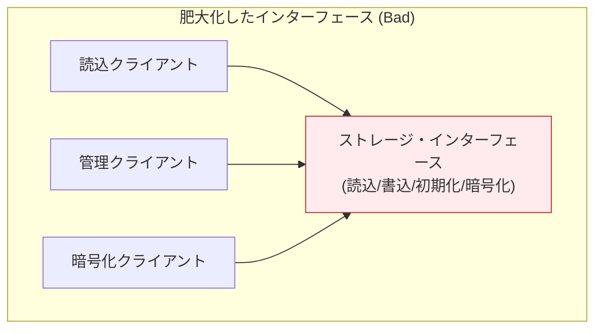
```mermaid

graph TD

    subgraph "肥大化したインターフェース (Bad)"

        IF_All["ストレージ・インターフェース<br/>(読込/書込/初期化/暗号化)"]

        ClientA[読込クライアント] --> IF_All

        ClientB[管理クライアント] --> IF_All

        ClientC[暗号化クライアント] --> IF_All

    end

    style IF_All fill:#ffebee,stroke:#c62828


```


#### 分離されたインターフェース（理想形）


**この図が示すもの**:

ISPを適用し、役割ごとにインターフェースを分割した状態です。


**注目ポイント**:


* **依存の限定**: 各クライアントは自分に必要な「契約」だけを知っています。

* **影響の遮断**: 暗号化機能の変更は、読込クライアントには一切影響しません。


**読み方のガイド**:


* 垂直方向に独立した3つのレーン。


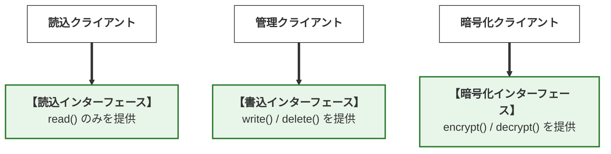
```mermaid

graph TD

    %% 1. 読込ルート

    C_Read["<b>読込クライアント</b>"]

    IF_Read["<b>【読込インターフェース】</b><br/>read() のみを提供"]


    %% 2. 書込ルート

    C_Write["<b>管理クライアント</b>"]

    IF_Write["<b>【書込インターフェース】</b><br/>write() / delete() を提供"]


    %% 3. 暗号化ルート

    C_Encrypt["<b>暗号化クライアント</b>"]

    IF_Encrypt["<b>【暗号化インターフェース】</b><br/>encrypt() / decrypt() を提供"]


    %% 接続（縦方向）

    C_Read ==> IF_Read

    C_Write ==> IF_Write

    C_Encrypt ==> IF_Encrypt


    %% スタイル設定（成功と分離を示す緑系）

    style IF_Read fill:#e8f5e9,stroke:#2e7d32,stroke-width:2px

    style IF_Write fill:#e8f5e9,stroke:#2e7d32,stroke-width:2px

    style IF_Encrypt fill:#e8f5e9,stroke:#2e7d32,stroke-width:2px

    style C_Read fill:#ffffff,stroke:#333

    style C_Write fill:#ffffff,stroke:#333

    style C_Encrypt fill:#ffffff,stroke:#333


```


ISPが解決しようとしているのは、インターフェースに「あれもこれも」詰め込んだ結果発生する、以下の2つの深刻なコストです。


### **物理的依存（コンパイル・ビルドの爆発）**


#### **具体的な問題**


`storage_interface.h` という巨大なヘッダに `read`, `write`, `format`, `encrypt` など、あらゆる操作が定義されているとします。たとえクライアントAが `read` しか使わなくても、`encrypt` の引数の型が変更されただけで、クライアントAを含めた**全ての依存モジュールが再コンパイル対象**となります。


#### **なぜ問題か**


大規模プロジェクトにおいて、これはビルド時間の増大を招くだけでなく、バイナリサイズの変化や予期せぬリンクエラーのリスクを生みます。「触っていない場所のせいでビルドが通らない」という状況は、開発サイクルを著しく停滞させます。


### **概念的依存（設計の歪みとLSP違反）**


#### **具体的な問題**


「読み取り専用デバイス」の具象クラスを作ろうとした際、インターフェースに `write` メソッドが存在すると、中身が空の関数や `return E_NOT_SUPPORTED;` を返すだけの**「嘘の実装」**を強いられます。


#### **なぜ問題か**


インターフェースを分けないまま「できないこと」を強いる設計は、前章で学んだ**リスコフ置換原則 (LSP) への明白な違反**を誘発します。利用者は「契約（インターフェース）にあるのだから当然呼べるはずだ」と期待しますが、実際には実行時にエラーが返る。この「期待と実態の乖離」こそが設計を不安定にする正体です。呼び出し側に「このオブジェクトは書き込み可能か？」を判定する `if` 文や特殊なエラー処理が蔓延し、多態性のメリットが失われてしまいます。


## 2. C言語での実現手段と設計要素


C言語におけるISPの実現は、**ヘッダファイル**の分割と**VTable（関数ポインタ構造体）**の設計が核となります。


### 2.1. C言語でのISP実現の本質：物理と論理の切り離し


C言語でISPを徹底する場合、以下の2段階の分離を追求します。


#### 物理的な分離（ヘッダ・インクルードの最小化）


C言語では `#include` が依存のすべてを決定します。


#### インクルード関係の最適化


**この図が示すもの**:

ヘッダファイルを「役割」ごとに分割し、クライアントが不要な情報を読み込まないようにする物理的な構成です。


**注目ポイント**:


* **必要なものだけ**: `ReaderUser` は `reader.h` しか知りません。`writer.h` の変更による再コンパイルは発生しません。


**読み方のガイド**:


* `#include` の矢印が示す依存関係。


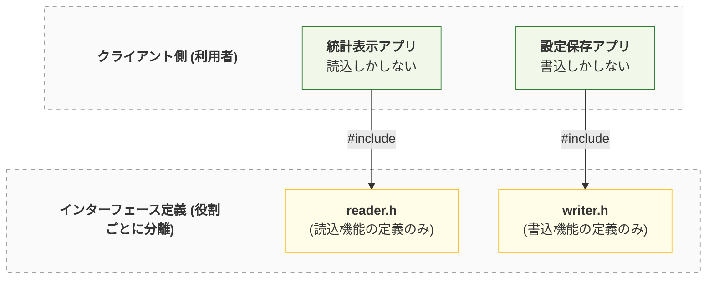
```mermaid

graph TD

    %% --- インターフェース層 ---

    subgraph Headers [" "]

        HeaderTitle["<b>インターフェース定義 (役割ごとに分離)</b>"]

        direction TB

        ReaderH["<b>reader.h</b><br/>(読込機能の定義のみ)"]

        WriterH["<b>writer.h</b><br/>(書込機能の定義のみ)"]

    end


    %% --- クライアント層 ---

    subgraph Clients [" "]

        ClientTitle["<b>クライアント側 (利用者)</b>"]

        direction TB

        ReaderUser["<b>統計表示アプリ</b><br/>読込しかしない"]

        WriterUser["<b>設定保存アプリ</b><br/>書込しかしない"]

    end


    %% 物理的なインクルード関係

    ReaderUser -->|#include| ReaderH

    WriterUser -->|#include| WriterH


    %% タイトル用ノードのスタイル（枠線を消して見出しに見せる）

    style HeaderTitle fill:none,stroke:none,font-size:16px

    style ClientTitle fill:none,stroke:none,font-size:16px


    %% 各要素のスタイル

    style ReaderUser fill:#f1f8e9,stroke:#2e7d32

    style WriterUser fill:#f1f8e9,stroke:#2e7d32

    style ReaderH fill:#fffde7,stroke:#fbc02d

    style WriterH fill:#fffde7,stroke:#fbc02d

    

    %% 外枠のスタイル

    style Headers fill:#fafafa,stroke:#9e9e9e,stroke-dasharray: 5 5

    style Clients fill:#fafafa,stroke:#9e9e9e,stroke-dasharray: 5 5


```


#### **何が問題か**


一つの構造体定義の中に、複数の役割の関数ポインタを混在させることです。これにより、特定の役割しか必要としないソースファイルに、不要な型情報（不必要な構造体や列挙型）が流入します。


#### **解決策**


**前方宣言**と**不完全型**を駆使し、クライアントには「自分が見るべき型」のポインタだけを渡します。ヘッダファイルを `reader.h`, `writer.h` のように役割ごとに分割し、クライアントが必要な最小限の定義のみをインクルードするように設計します。


#### 論理的な分離（VTableのコンポジション）


多態性を実現するVTable（関数ポインタ構造体）の設計が重要です。


#### VTableのコンポジション構造


**この図が示すもの**:

具象デバイス（Device）が、複数の小さなVTable（Reader, Writer）を保持（コンポジション）する構造です。


**注目ポイント**:


* **役割の委譲**: 巨大な一つのVTableを持つのではなく、機能ごとにポインタを持ちます。これにより、`read` 機能を持たないデバイスは `reader` ポインタを持たない（または公開しない）という選択が可能になります。


**読み方のガイド**:


* Deviceから各機能（Reader/Writer）への分岐。


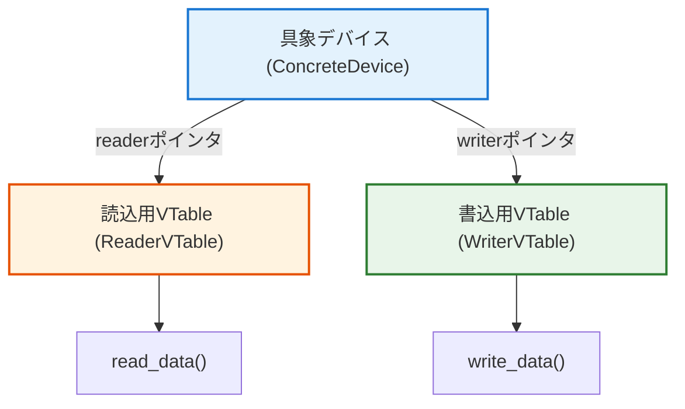
```mermaid

graph TD

    Device["具象デバイス (ConcreteDevice)"]

    Reader["読込用VTable (ReaderVTable)"]

    Writer["書込用VTable (WriterVTable)"]

    

    ReadFunc["read_data()"]

    WriteFunc["write_data()"]


    Device -->|"readerポインタ"| Reader

    Device -->|"writerポインタ"| Writer

    Reader --> ReadFunc

    Writer --> WriteFunc


    style Device fill:#e3f2fd,stroke:#1976d2,stroke-width:2px

    style Reader fill:#fff3e0,stroke:#e65100,stroke-width:2px

    style Writer fill:#e8f5e9,stroke:#2e7d32,stroke-width:2px


```


#### **何が問題か**


`Storage_VTable` という一つの大きな構造体にすべての関数ポインタを詰め込むことです。これでは、具象実装（ドライバ等）は、サポートしていない機能であっても、その構造体の全メンバを埋めなければ（あるいはNULLにしなければ）ならなくなります。


#### **解決策**


VTableを `ReadCapability`, `WriteCapability` といった**小さな単位の構造体**に分割します。具象オブジェクトは、これらの小さな構造体を**コンポジション（複合）**することで、自分ができること（契約）だけを公開します。


これにより、C言語特有の「構造体の密結合」を回避し、モジュール間の境界線を明確に引くことが可能になります。


## 3. 実践パターン：ISPを実現する三つの型


### 3.1. 実践パターン1：物理的なヘッダ依存の分離


#### **目的**


モジュールが持つ複数の役割を「ヘッダファイル単位」で分割し、特定の機能しか使わないクライアントを、無関係な変更による再コンパイルから保護する。


#### ❌ 原則適用前：一つの「太ったヘッダ」が招く連鎖反応


まず、一つのヘッダファイルに複数の役割が混在しているケースを見てみましょう。

ここには、デバイスの状態を監視する**Monitor（監視）**の機能と、詳細な設定を行う**Configurator（設定）**の機能が同居しています。


#### 違反時の依存関係


**この図が示すもの**:

`device_manager.h` が肥大化し、クライアントが必要のない情報（`device_types.h`）にまで間接的に依存してしまっている状態です。


**注目ポイント**:


* **不要な依存**: 監視クライアント（M）は設定定義（DT）を必要としませんが、ヘッダが統合されているため強制的に読み込まされます。


**読み方のガイド**:


* 点線矢印が示す「見えないが悪影響のある依存」。


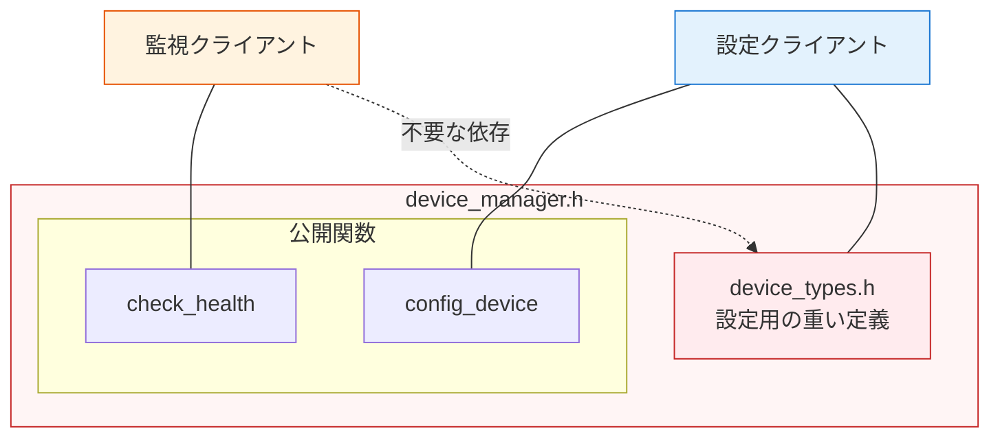
```mermaid

graph TD

    %% クライアント

    M["監視クライアント"]

    C["設定クライアント"]


    %% 太ったヘッダ

    subgraph HeavyHeader [device_manager.h]

        direction TB

        DT["device_types.h<br/>設定用の重い定義"]

        

        subgraph Methods [公開関数]

            Health["check_health"]

            Config["config_device"]

        end

    end


    %% 接続（重なりを避けるため曲線を最小化）

    M --- Health

    C --- Config

    C --- DT


    %% 依存の混入を強調

    M -.->|"不要な依存"| DT


    %% スタイル（全角を含まないよう修正）

    style HeavyHeader fill:#fff5f5,stroke:#c62828

    style DT fill:#ffebee,stroke:#c62828

    style M fill:#fff3e0,stroke:#e65100

    style C fill:#e3f2fd,stroke:#1976d2


```


#### **device_manager.h(ISP違反：役割が混在したヘッダ)**


```c

#ifndef DEVICE_MANAGER_H

#define DEVICE_MANAGER_H


/* * 設定に必要な詳細な定義。

 * 監視しかしないクライアントには本来不要な依存。

 */

#include "device_types.h" 


// --- Configurator（設定担当）用のインターフェース ---

int device_manager_config_device(const DeviceConfig* config);


// --- Monitor（監視担当）用のインターフェース ---

int device_manager_check_health(void);


#endif


```


##### **この設計の何が「罪」なのか**


もし将来、デバイスの設定項目が増えて `device_types.h` が一行でも修正されたらどうなるでしょうか？ 設定機能には一切関心がない「監視担当」のプログラムまで、**「お前の依存先が変わったから」という理由で再コンパイルを強制されます。** 大規模なシステムでは、この「不要な連鎖」がビルド時間を爆発させる元凶となります。


#### ✅ 原則適用後：役割ごとに「契約」を切り分ける


ISPを適用し、インターフェースを役割ごとに物理的に分割します。クライアントが「知るべきこと」だけを定義したスリムなヘッダを提供します。


#### 分離後の依存関係


**この図が示すもの**:

インターフェースを物理的に分割し、各クライアントが自分に必要なヘッダファイルのみをインクルードしている状態です。


**注目ポイント**:


* **明確な分離**: `monitor.h` は `device_types.h` を知りません。

* **安全な変更**: `device_types.h` を変更しても、影響を受けるのは設定クライアントだけで、監視クライアントは無傷です。


**読み方のガイド**:


* 左右に分かれた依存のツリー構造。


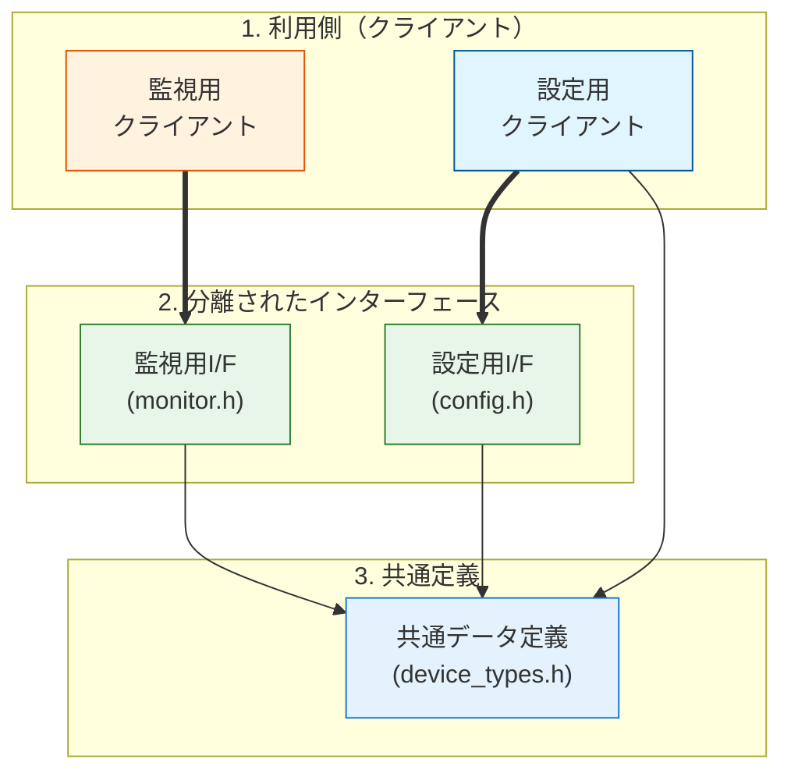
```mermaid

graph TD

    %% 1. クライアント層

    subgraph Clients ["1. 利用側（クライアント）"]

        direction LR

        Monitor["監視用<br/>クライアント"]

        Configurator["設定用<br/>クライアント"]

    end


    %% 2. 抽象層

    subgraph Headers ["2. 分離されたインターフェース"]

        direction LR

        DM["監視用I/F<br/>(monitor.h)"]

        DC["設定用I/F<br/>(config.h)"]

    end


    subgraph Common ["3. 共通定義"]

        DT["共通データ定義<br/>(device_types.h)"]

    end


    %% 接続関係：必要なインターフェースのみを参照

    Monitor ==> DM

    Configurator ==> DC

    

    %% 共通定義への依存

    DC --> DT

    DM --> DT

    Configurator --> DT


    %% スタイル設定

    style DM fill:#e8f5e9,stroke:#2e7d32

    style DC fill:#e8f5e9,stroke:#2e7d32

    style DT fill:#e3f2fd,stroke:#1976d2

    style Monitor fill:#fff3e0,stroke:#e65100

    style Configurator fill:#e1f5fe,stroke:#01579b


```


#### **device_types.h(共通定義)**


```c

#ifndef DEVICE_TYPES_H

#define DEVICE_TYPES_H


// 設定機能でのみ使用される重い定義

typedef struct {

    int ip_address;

    int port;

    char hostname[256];

    // その他多数の設定項目

} DeviceConfig;


#endif


```


#### **device_monitor.h(監視専用のヘッダ)**


```c

#ifndef DEVICE_MONITOR_H

#define DEVICE_MONITOR_H


/* * 【ISP適用】

 * 不要な "device_types.h" のインクルードを排除。

 * 監視に必要な最小限のプロトタイプ宣言のみを公開。

 */

int device_manager_check_health(void);


#endif


```


#### **device_configurator.h(設定専用のヘッダ)**


```c

#ifndef DEVICE_CONFIGURATOR_H

#define DEVICE_CONFIGURATOR_H


#include "device_types.h" // 設定機能に必要な型定義のみここで読み込む


int device_manager_config_device(const DeviceConfig* config);


#endif


```


#### **device_manager.c(実装)**


```c

#include "device_monitor.h"

#include "device_configurator.h"

#include <stdio.h>


int device_manager_check_health(void) {

    // 実際の実装

    return 0; // OK

}


int device_manager_config_device(const DeviceConfig* config) {

    if (!config) return -1;

    printf("Configuring device: %s\n", config->hostname);

    return 0;

}


```


#### **Client_Monitor.c(監視機能を利用する側)**


```c

#include <stdio.h>

#include "device_monitor.h" // 必要な契約だけをインクルード


int main(void) {

    // 設計の意図:

    // このファイルは "device_types.h" の存在を一切知らない。

    // 設定機能側にどれほど変更があっても、このファイルが再ビルドされることはない。


    if (device_manager_check_health() != 0) {

        printf("[Monitor] Health check failed.\n");

    } else {

        printf("[Monitor] System is healthy.\n");

    }

    return 0;

}


```


#### 設計のポイント：物理的な壁を作る


この分離により、`device_manager.c`（実装側）が複数の役割を持っていても、**クライアントからは特定の側面しか見えない**という状態を作ることができました。


* **変更の局所化**: 設定機能の変更が監視機能に波及しない。

* **ビルドの高速化**: 不要なヘッダの読み込みと解析がスキップされる。

* **認知的負荷の低減**: クライアントの開発者は、膨大な設定パラメータを理解しなくても、単一の関数だけを見て実装に集中できる。


### 3.2. 実践パターン2：VTableの役割分離とCompositionの徹底


実践パターン1では「ヘッダファイル」による物理的な分離を学びました。しかし、第2章および第4章で解説した**VTable（関数ポインタ構造体）**そのものが肥大化している場合、別の深刻な問題が発生します。


ここでは、VTableを役割ごとに細かく分断し、**Composition（複合）**によって再構成する手法を解説します。


#### ❌ 原則適用前：一つの「太ったVTable」が招く実装の強制


まず、多態性を実現するために「あらゆる操作」を一箇所にまとめたVTableの例を見てみましょう。このVTableには、読み取り、設定、最適化といった性質の異なる操作が混在しています。


#### 違反時のVTable構造


**この図が示すもの**:

一つの `IDeviceVTable` にすべての機能が詰め込まれているため、一部の機能しかサポートしないデバイス（読み取り専用など）が、不要な契約を強制されている状態です。


**注目ポイント**:


* **LSP違反の誘発**: 読み取り専用デバイス（RO）は、`write` 機能を実装できないにもかかわらず、VTableの構造上、そのスロットを埋めなければなりません。


**読み方のガイド**:


* 太い点線矢印: 無理な適合（LSP違反の温床）


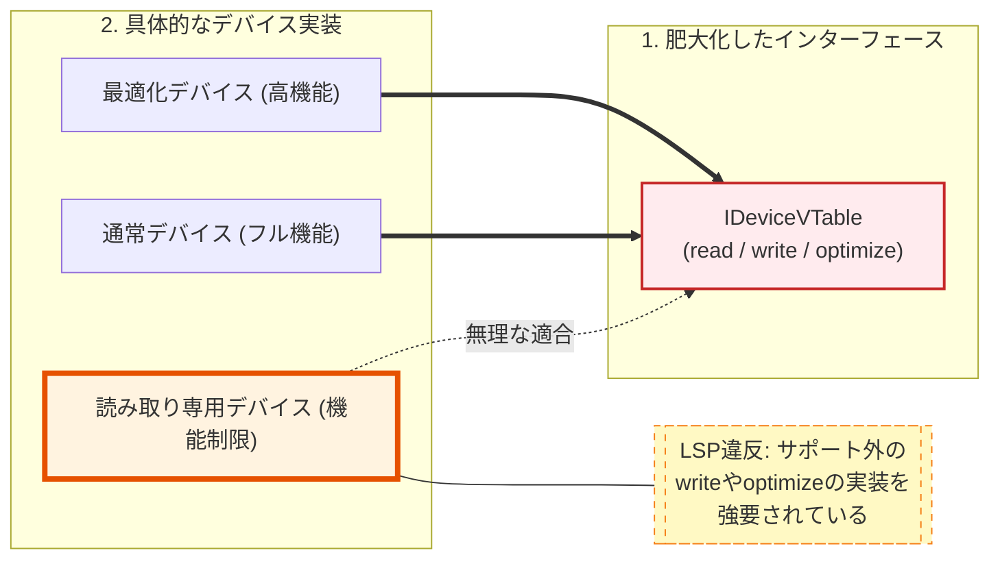
```mermaid

graph LR

    subgraph Interface ["1. 肥大化したインターフェース"]

        VT["IDeviceVTable<br/>(read / write / optimize)"]

    end


    subgraph Impls ["2. 具体的なデバイス実装"]

        direction TB

        RO["読み取り専用デバイス (機能制限)"]

        RW["通常デバイス (フル機能)"]

        OPT["最適化デバイス (高機能)"]

    end


    %% 接続

    RO -.->|"無理な適合"| VT

    RW ==> VT

    OPT ==> VT


    %% 問題点の強調

    Problem[["LSP違反: サポート外の<br/>writeやoptimizeの実装を<br/>強要されている"]]

    

    %% 配置の調整

    RO --- Problem


    %% スタイル設定

    style VT fill:#ffebee,stroke:#c62828,stroke-width:2px

    style RO fill:#fff3e0,stroke:#e65100,stroke-width:4px

    style Problem fill:#fff9c4,stroke:#f57f17,stroke-dasharray: 5 5


```


#### **idevice_rw_config.h(ISP違反：巨大なインターフェース)**


```c

// すべての機能を詰め込んだVTable

typedef struct {

    int (*read_data)(void* self);

    int (*write_config)(void* self); // 読み取り専用デバイスには「不要な契約」

    int (*optimize_db)(void* self);  // 特定のデバイスにしか関係ない契約

} IDeviceVTable;


```


#### **ReadOnlyDevice.c(ISP違反による「嘘」の実装)**


```c

// 読み取り専用デバイスの実装

static int read_only_read_data(void* self) {

    // 実際の読み取り処理

    return 0;

}


static int read_only_write_config(void* self) {

    /* * 【LSP違反の予兆】

     * 契約上は存在するが、実装できないためエラーを返すしかない。

     * これにより、利用者は実行してみるまで成功するか分からない不安定な状態になる。

     */

    return -1; // "Not Supported"

}


static IDeviceVTable readonly_vtable = {

    .read_data = read_only_read_data,

    .write_config = read_only_write_config, // 無理やり埋める必要がある

    .optimize_db = NULL                     // あるいはNULLで濁すしかない

};


```


##### **この設計の何が「罪」なのか**


これは「具象は抽象の契約を完全に履行しなければならない」という**リスコフ置換原則 (LSP)** への違反を誘発します。不必要なメソッドの実装を強いることは、コードの可読性を下げるだけでなく、**「そのオブジェクトで何ができるのか」という定義を曖昧にする**のです。


#### ✅ 原則適用後：VTableの細分化とComposition


ISPを適用し、VTableを「役割」ごとに最小単位まで分割します。そして、複数の役割を必要とする場合にのみ、それらを組み合わせて（Composition）一つのインターフェースとして定義します。


#### 理想的なコンポジション構造


**この図が示すもの**:

インターフェースを機能（Reader, Configurator, Optimizer）ごとに細分化し、具象デバイスが必要な機能だけを組み合わせて（Composition）実装している状態です。


**注目ポイント**:


* **柔軟な結合**: `COMP`（複合インターフェース）は、読込と設定が必要な場合のみ作られます。

* **嘘のない実装**: 読み取り専用デバイス（RO）は `VR`（Reader）だけと契約しており、書込機能を実装する必要がありません。


**読み方のガイド**:


* 右側（Abstractions）: 最小単位の契約群

* 左側（Impls）: 必要な契約のみを選択して実装


```mermaid

graph LR

    %% 1. 具象実装（左側）

    subgraph Impls ["具体的なデバイス"]

        direction TB

        RO["読み取り専用デバイス"]

        RW["読み書き対応デバイス"]

        OPT["最適化対応デバイス"]

    end


    %% 2. 中間・複合（中央：インターフェースの再構成）

    COMP["複合インターフェース<br/>(読込＋設定)"]


    %% 3. 分離されたVTable（右側：最小単位の契約）

    subgraph Abstractions ["分離されたインターフェース"]

        direction TB

        VR["読込用 (IReader)"]

        VC["設定用 (IConfigurator)"]

        VO["最適化用 (IOptimizer)"]

    end


    %% 接続ルール

    

    %% 読み取り専用：必要なものだけに依存

    RO ==> VR


    %% 読み書き対応：複合インターフェース経由で整理

    RW ==> COMP

    COMP --> VR

    COMP --> VC


    %% 最適化対応：各インターフェースを個別に実装

    OPT ==> VO

    OPT -.-> VC

    OPT -.-> VR


    %% スタイル設定

    style VR fill:#e8f5e9,stroke:#2e7d32

    style VC fill:#e8f5e9,stroke:#2e7d32

    style VO fill:#e8f5e9,stroke:#2e7d32

    style COMP fill:#e3f2fd,stroke:#1976d2

    style RO fill:#fff3e0,stroke:#e65100


```


#### **idevice_reader.h(最小単位の役割)**


```c

#ifndef IDEVICE_READER_H

#define IDEVICE_READER_H


typedef struct { 

    int (*read_data)(void* self); 

} IReaderVTable;


#endif


```


#### **idevice_configurator.h(最小単位の役割)**


```c

#ifndef IDEVICE_CONFIGURATOR_H

#define IDEVICE_CONFIGURATOR_H


typedef struct { 

    int (*write_config)(void* self); 

} IConfiguratorVTable;


#endif


```


#### **idevice_optimizer.h(最小単位の役割)**


```c

#ifndef IDEVICE_OPTIMIZER_H

#define IDEVICE_OPTIMIZER_H


typedef struct {

    int (*optimize_db)(void* self);

} IOptimizerVTable;


#endif


```


#### **IDeviceRWC.h(役割の組み合わせ)**


```c

#ifndef IDEVICE_RWC_H

#define IDEVICE_RWC_H


#include "idevice_reader.h"

#include "idevice_configurator.h"


// 役割を統合するコンポジット構造体

// タグ名を与えることで前方宣言が可能になり、不完全型として扱えるようにします。

typedef struct IDeviceRWC {

    void* self;                     // 具象データへの不透明ポインタ（第4章の応用）

    const IReaderVTable* reader;    // 読込契約への参照

    const IConfiguratorVTable* config; // 設定契約への参照

} IDeviceRWC;


#endif


```


#### **ReadOnlyDevice.c(読み取り専用デバイスの実装)**


```c

#include "idevice_reader.h"

#include <stdio.h>


static int readonly_read_data(void* self) {

    // コンパイラの未使用警告を抑制（実務では self を使用してデータを読み込む）

    (void)self;

    printf("[ReadOnlyDevice] Reading data...\n");

    return 0;

}


// 読み取り専用デバイスは IReaderVTable のみを実装

static const IReaderVTable readonly_vtable = {

    .read_data = readonly_read_data

};


// コンポジションのためのファクトリ

// ここでは簡易的に、readerのみを持つコンポジット構造体を返す例を示す

// ※本来は専用の構造体(IDeviceReadOnly)を用意するか、NULL許容設計にする

const IReaderVTable* get_readonly_vtable(void) {

    return &readonly_vtable;

}


// write_config や optimize_db の実装は一切不要！


```


#### **Client_Updater.c(利用側)**


```c

#include "IDeviceRWC.h"

#include <stdio.h>

#include <stdlib.h>


// ダミー実装（コンパイルを通すため）

static int dummy_read(void* s) { (void)s; printf("Read OK\n"); return 0; }

static int dummy_write(void* s) { (void)s; printf("Write OK\n"); return 0; }

static const IReaderVTable r_vt = { .read_data = dummy_read };

static const IConfiguratorVTable c_vt = { .write_config = dummy_write };


void firmware_update_process(IDeviceRWC* device) {

    if (!device || !device->reader || !device->config) return;


    /* 各VTableの関数に対し、共通の self を渡すことで多態性を実現 */

    printf("--- Firmware Update Process ---\n");

    if (device->reader->read_data(device->self) != 0) {

        printf("Read failed\n");

        return;

    }

    

    if (device->config->write_config(device->self) != 0) {

        printf("Config write failed\n");

        return;

    }

}


int main(void) {

    // 擬似的なデバイス生成（本来はFactoryで行う）

    IDeviceRWC my_device = {

        .self = NULL,

        .reader = &r_vt,

        .config = &c_vt

    };

    

    firmware_update_process(&my_device);

    return 0;

}


```


#### 設計のポイント：具象を「型」の制約から解放する


この設計により、読み取り専用デバイスは `IReaderVTable` だけを実装すればよくなります。


* **契約の誠実さ**: 具象クラスは「できること」だけを表明すればよく、ダミー実装が不要になる。

* **利用側の安全性**: クライアントは、そのオブジェクトが確実に提供している機能（役割）だけを叩くことができる。

* **拡張性**: 将来的に「最適化機能」を追加する場合も、既存の `IReader` や `IConfigurator` に触れることなく、新しい役割（VTable）を追加するだけで済みます。

Kindle本の校正担当
カスタム Gem
修正概要と理由
[修正範囲: ## 1. 原則の哲学と本質 〜 3.2. 実践パターン2の末尾]

ファイル名の命名規則統一 (3.2. 実践パターン2): idevice_reader.h (スネークケース) と IDeviceRWC.h (キャメルケース)、ReadOnlyDevice.c (パスカルケース) など、ファイル名の命名規則が混在していました。C言語の慣習および前項までの規則に合わせ、すべてスネークケース (idevice_rwc.h, read_only_device.c, client_updater.c) に統一しました。

コードとコメントの不整合修正 (read_only_device.c): 元のコメントでは「コンポジット構造体を返す」と記述されていましたが、実際のコードは IReaderVTable* を返しており、説明と実装が矛盾していました。コードの実態に即してコメントを修正しました。

不要な冗長コメントの簡略化 (read_only_device.c): (void)self; に対する解説は第10章で既出のため、ガイドラインに基づき簡潔な記述に留めました。

ガードマクロの整合性確保: ファイル名の変更に伴い、ヘッダファイルのインクルードガード（IDEVICE_RWC_H など）も整合性が取れるように修正しました。

▼▼▼▼▼ ここからコピペ用データ ▼▼▼▼▼

第2部 第11章 インターフェース分離原則 (ISP): 不要な依存の排除とモジュール結合度の最小化
この章の主題は、設計の三本柱のうち**「契約」の柱であり、同時に「依存」にも深く関わる。インターフェース分離原則 (ISP) を適用することで、クライアントが必要とする「利用法」**の契約だけを提供し、不要な依存を断ち切ることで、変更容易性を飛躍的に高める。

1. 原則の哲学と本質
本原則は、**『契約』**を最小化することで不要な **『依存』**を削ぎ落とします。

1.1. ISPの本質は「スリムな契約」と「依存のコスト」
「クライアントに、自身が使用しないインターフェースへの依存を強制してはならない」

ISPの目標は、インターフェースを小さく、特定のクライアントのニーズに特化させることです。これにより、一つの機能の変更が、その機能を使用しないクライアントにまで影響を及ぼすという、依存の汚染を食い止めます。

依存のコスト：なぜ「太ったインターフェース」は悪なのか
『太ったインターフェース』とは、クライアントが実際には使わない関数まで含む、過剰に大きなインターフェースを指します。例えば、読み取り専用のクライアントに対して、書き込み関数まで含むインターフェースを強制するような設計です。この肥大化が、不要な依存とコンパイル時間の増大を招きます。

肥大化したインターフェースの問題点
この図が示すもの: すべてのクライアントが、一つの巨大なインターフェースに依存している状態（アンチパターン）です。

注目ポイント:

不必要な依存: 例えば「読込クライアント」は、暗号化機能が変更されただけでも影響を受けてしまいます。これが「依存の汚染」です。

読み方のガイド:

複数のクライアントから一点（IF_All）に集中する矢印。

コード スニペット
graph TD
    subgraph "肥大化したインターフェース (Bad)"
        IF_All["ストレージ・インターフェース<br/>(読込/書込/初期化/暗号化)"]
        ClientA[読込クライアント] --> IF_All
        ClientB[管理クライアント] --> IF_All
        ClientC[暗号化クライアント] --> IF_All
    end
    style IF_All fill:#ffebee,stroke:#c62828
分離されたインターフェース（理想形）
この図が示すもの: ISPを適用し、役割ごとにインターフェースを分割した状態です。

注目ポイント:

依存の限定: 各クライアントは自分に必要な「契約」だけを知っています。

影響の遮断: 暗号化機能の変更は、読込クライアントには一切影響しません。

読み方のガイド:

垂直方向に独立した3つのレーン。

コード スニペット
graph TD
    %% 1. 読込ルート
    C_Read["<b>読込クライアント</b>"]
    IF_Read["<b>【読込インターフェース】</b><br/>read() のみを提供"]

    %% 2. 書込ルート
    C_Write["<b>管理クライアント</b>"]
    IF_Write["<b>【書込インターフェース】</b><br/>write() / delete() を提供"]

    %% 3. 暗号化ルート
    C_Encrypt["<b>暗号化クライアント</b>"]
    IF_Encrypt["<b>【暗号化インターフェース】</b><br/>encrypt() / decrypt() を提供"]

    %% 接続（縦方向）
    C_Read ==> IF_Read
    C_Write ==> IF_Write
    C_Encrypt ==> IF_Encrypt

    %% スタイル設定（成功と分離を示す緑系）
    style IF_Read fill:#e8f5e9,stroke:#2e7d32,stroke-width:2px
    style IF_Write fill:#e8f5e9,stroke:#2e7d32,stroke-width:2px
    style IF_Encrypt fill:#e8f5e9,stroke:#2e7d32,stroke-width:2px
    style C_Read fill:#ffffff,stroke:#333
    style C_Write fill:#ffffff,stroke:#333
    style C_Encrypt fill:#ffffff,stroke:#333
ISPが解決しようとしているのは、インターフェースに「あれもこれも」詰め込んだ結果発生する、以下の2つの深刻なコストです。

物理的依存（コンパイル・ビルドの爆発）
具体的な問題
storage_interface.h という巨大なヘッダに read, write, format, encrypt など、あらゆる操作が定義されているとします。たとえクライアントAが read しか使わなくても、encrypt の引数の型が変更されただけで、クライアントAを含めた全ての依存モジュールが再コンパイル対象となります。

なぜ問題か
大規模プロジェクトにおいて、これはビルド時間の増大を招くだけでなく、バイナリサイズの変化や予期せぬリンクエラーのリスクを生みます。「触っていない場所のせいでビルドが通らない」という状況は、開発サイクルを著しく停滞させます。

概念的依存（設計の歪みとLSP違反）
具体的な問題
「読み取り専用デバイス」の具象クラスを作ろうとした際、インターフェースに write メソッドが存在すると、中身が空の関数や return E_NOT_SUPPORTED; を返すだけの**「嘘の実装」**を強いられます。

なぜ問題か
インターフェースを分けないまま「できないこと」を強いる設計は、前章で学んだリスコフ置換原則 (LSP) への明白な違反を誘発します。利用者は「契約（インターフェース）にあるのだから当然呼べるはずだ」と期待しますが、実際には実行時にエラーが返る。この「期待と実態の乖離」こそが設計を不安定にする正体です。呼び出し側に「このオブジェクトは書き込み可能か？」を判定する if 文や特殊なエラー処理が蔓延し、多態性のメリットが失われてしまいます。

2. C言語での実現手段と設計要素
C言語におけるISPの実現は、ヘッダファイルの分割と**VTable（関数ポインタ構造体）**の設計が核となります。

2.1. C言語でのISP実現の本質：物理と論理の切り離し
C言語でISPを徹底する場合、以下の2段階の分離を追求します。

物理的な分離（ヘッダ・インクルードの最小化）
C言語では #include が依存のすべてを決定します。

インクルード関係の最適化
この図が示すもの: ヘッダファイルを「役割」ごとに分割し、クライアントが不要な情報を読み込まないようにする物理的な構成です。

注目ポイント:

必要なものだけ: ReaderUser は reader.h しか知りません。writer.h の変更による再コンパイルは発生しません。

読み方のガイド:

#include の矢印が示す依存関係。

コード スニペット
graph TD
    %% --- インターフェース層 ---
    subgraph Headers [" "]
        HeaderTitle["<b>インターフェース定義 (役割ごとに分離)</b>"]
        direction TB
        ReaderH["<b>reader.h</b><br/>(読込機能の定義のみ)"]
        WriterH["<b>writer.h</b><br/>(書込機能の定義のみ)"]
    end

    %% --- クライアント層 ---
    subgraph Clients [" "]
        ClientTitle["<b>クライアント側 (利用者)</b>"]
        direction TB
        ReaderUser["<b>統計表示アプリ</b><br/>読込しかしない"]
        WriterUser["<b>設定保存アプリ</b><br/>書込しかしない"]
    end

    %% 物理的なインクルード関係
    ReaderUser -->|#include| ReaderH
    WriterUser -->|#include| WriterH

    %% タイトル用ノードのスタイル（枠線を消して見出しに見せる）
    style HeaderTitle fill:none,stroke:none,font-size:16px
    style ClientTitle fill:none,stroke:none,font-size:16px

    %% 各要素のスタイル
    style ReaderUser fill:#f1f8e9,stroke:#2e7d32
    style WriterUser fill:#f1f8e9,stroke:#2e7d32
    style ReaderH fill:#fffde7,stroke:#fbc02d
    style WriterH fill:#fffde7,stroke:#fbc02d
    
    %% 外枠のスタイル
    style Headers fill:#fafafa,stroke:#9e9e9e,stroke-dasharray: 5 5
    style Clients fill:#fafafa,stroke:#9e9e9e,stroke-dasharray: 5 5
何が問題か
一つの構造体定義の中に、複数の役割の関数ポインタを混在させることです。これにより、特定の役割しか必要としないソースファイルに、不要な型情報（不必要な構造体や列挙型）が流入します。

解決策
前方宣言と不完全型を駆使し、クライアントには「自分が見るべき型」のポインタだけを渡します。ヘッダファイルを reader.h, writer.h のように役割ごとに分割し、クライアントが必要な最小限の定義のみをインクルードするように設計します。

論理的な分離（VTableのコンポジション）
多態性を実現するVTable（関数ポインタ構造体）の設計が重要です。

VTableのコンポジション構造
この図が示すもの: 具象デバイス（Device）が、複数の小さなVTable（Reader, Writer）を保持（コンポジション）する構造です。

注目ポイント:

役割の委譲: 巨大な一つのVTableを持つのではなく、機能ごとにポインタを持ちます。これにより、read 機能を持たないデバイスは reader ポインタを持たない（または公開しない）という選択が可能になります。

読み方のガイド:

Deviceから各機能（Reader/Writer）への分岐。

コード スニペット
graph TD
    Device["具象デバイス (ConcreteDevice)"]
    Reader["読込用VTable (ReaderVTable)"]
    Writer["書込用VTable (WriterVTable)"]
    
    ReadFunc["read_data()"]
    WriteFunc["write_data()"]

    Device -->|"readerポインタ"| Reader
    Device -->|"writerポインタ"| Writer
    Reader --> ReadFunc
    Writer --> WriteFunc

    style Device fill:#e3f2fd,stroke:#1976d2,stroke-width:2px
    style Reader fill:#fff3e0,stroke:#e65100,stroke-width:2px
    style Writer fill:#e8f5e9,stroke:#2e7d32,stroke-width:2px
何が問題か
Storage_VTable という一つの大きな構造体にすべての関数ポインタを詰め込むことです。これでは、具象実装（ドライバ等）は、サポートしていない機能であっても、その構造体の全メンバを埋めなければ（あるいはNULLにしなければ）ならなくなります。

解決策
VTableを ReadCapability, WriteCapability といった小さな単位の構造体に分割します。具象オブジェクトは、これらの小さな構造体を**コンポジション（複合）**することで、自分ができること（契約）だけを公開します。

これにより、C言語特有の「構造体の密結合」を回避し、モジュール間の境界線を明確に引くことが可能になります。

3. 実践パターン：ISPを実現する三つの型
3.1. 実践パターン1：物理的なヘッダ依存の分離
目的
モジュールが持つ複数の役割を「ヘッダファイル単位」で分割し、特定の機能しか使わないクライアントを、無関係な変更による再コンパイルから保護する。

❌ 原則適用前：一つの「太ったヘッダ」が招く連鎖反応
まず、一つのヘッダファイルに複数の役割が混在しているケースを見てみましょう。 ここには、デバイスの状態を監視する**Monitor（監視）の機能と、詳細な設定を行うConfigurator（設定）**の機能が同居しています。

違反時の依存関係
この図が示すもの: device_manager.h が肥大化し、クライアントが必要のない情報（device_types.h）にまで間接的に依存してしまっている状態です。

注目ポイント:

不要な依存: 監視クライアント（M）は設定定義（DT）を必要としませんが、ヘッダが統合されているため強制的に読み込まされます。

読み方のガイド:

点線矢印が示す「見えないが悪影響のある依存」。

コード スニペット
graph TD
    %% クライアント
    M["監視クライアント"]
    C["設定クライアント"]

    %% 太ったヘッダ
    subgraph HeavyHeader [device_manager.h]
        direction TB
        DT["device_types.h<br/>設定用の重い定義"]
        
        subgraph Methods [公開関数]
            Health["check_health"]
            Config["config_device"]
        end
    end

    %% 接続（重なりを避けるため曲線を最小化）
    M --- Health
    C --- Config
    C --- DT

    %% 依存の混入を強調
    M -.->|"不要な依存"| DT

    %% スタイル（全角を含まないよう修正）
    style HeavyHeader fill:#fff5f5,stroke:#c62828
    style DT fill:#ffebee,stroke:#c62828
    style M fill:#fff3e0,stroke:#e65100
    style C fill:#e3f2fd,stroke:#1976d2
device_manager.h(ISP違反：役割が混在したヘッダ)
C
#ifndef DEVICE_MANAGER_H
#define DEVICE_MANAGER_H

/* * 設定に必要な詳細な定義。
 * 監視しかしないクライアントには本来不要な依存。
 */
#include "device_types.h" 

// --- Configurator（設定担当）用のインターフェース ---
int device_manager_config_device(const DeviceConfig* config);

// --- Monitor（監視担当）用のインターフェース ---
int device_manager_check_health(void);

#endif
この設計の何が「罪」なのか
もし将来、デバイスの設定項目が増えて device_types.h が一行でも修正されたらどうなるでしょうか？ 設定機能には一切関心がない「監視担当」のプログラムまで、「お前の依存先が変わったから」という理由で再コンパイルを強制されます。 大規模なシステムでは、この「不要な連鎖」がビルド時間を爆発させる元凶となります。

✅ 原則適用後：役割ごとに「契約」を切り分ける
ISPを適用し、インターフェースを役割ごとに物理的に分割します。クライアントが「知るべきこと」だけを定義したスリムなヘッダを提供します。

分離後の依存関係
この図が示すもの: インターフェースを物理的に分割し、各クライアントが自分に必要なヘッダファイルのみをインクルードしている状態です。

注目ポイント:

明確な分離: monitor.h は device_types.h を知りません。

安全な変更: device_types.h を変更しても、影響を受けるのは設定クライアントだけで、監視クライアントは無傷です。

読み方のガイド:

左右に分かれた依存のツリー構造。

コード スニペット
graph TD
    %% 1. クライアント層
    subgraph Clients ["1. 利用側（クライアント）"]
        direction LR
        Monitor["監視用<br/>クライアント"]
        Configurator["設定用<br/>クライアント"]
    end

    %% 2. 抽象層
    subgraph Headers ["2. 分離されたインターフェース"]
        direction LR
        DM["監視用I/F<br/>(monitor.h)"]
        DC["設定用I/F<br/>(config.h)"]
    end

    subgraph Common ["3. 共通定義"]
        DT["共通データ定義<br/>(device_types.h)"]
    end

    %% 接続関係：必要なインターフェースのみを参照
    Monitor ==> DM
    Configurator ==> DC
    
    %% 共通定義への依存
    DC --> DT
    DM --> DT
    Configurator --> DT

    %% スタイル設定
    style DM fill:#e8f5e9,stroke:#2e7d32
    style DC fill:#e8f5e9,stroke:#2e7d32
    style DT fill:#e3f2fd,stroke:#1976d2
    style Monitor fill:#fff3e0,stroke:#e65100
    style Configurator fill:#e1f5fe,stroke:#01579b
device_types.h(共通定義)
C
#ifndef DEVICE_TYPES_H
#define DEVICE_TYPES_H

// 設定機能でのみ使用される重い定義
typedef struct {
    int ip_address;
    int port;
    char hostname[256];
    // その他多数の設定項目
} DeviceConfig;

#endif
device_monitor.h(監視専用のヘッダ)
C
#ifndef DEVICE_MONITOR_H
#define DEVICE_MONITOR_H

/* * 【ISP適用】
 * 不要な "device_types.h" のインクルードを排除。
 * 監視に必要な最小限のプロトタイプ宣言のみを公開。
 */
int device_manager_check_health(void);

#endif
device_configurator.h(設定専用のヘッダ)
C
#ifndef DEVICE_CONFIGURATOR_H
#define DEVICE_CONFIGURATOR_H

#include "device_types.h" // 設定機能に必要な型定義のみここで読み込む

int device_manager_config_device(const DeviceConfig* config);

#endif
device_manager.c(実装)
C
#include "device_monitor.h"
#include "device_configurator.h"
#include <stdio.h>

int device_manager_check_health(void) {
    // 実際の実装
    return 0; // OK
}

int device_manager_config_device(const DeviceConfig* config) {
    if (!config) return -1;
    printf("Configuring device: %s\n", config->hostname);
    return 0;
}
Client_Monitor.c(監視機能を利用する側)
C
#include <stdio.h>
#include "device_monitor.h" // 必要な契約だけをインクルード

int main(void) {
    // 設計の意図:
    // このファイルは "device_types.h" の存在を一切知らない。
    // 設定機能側にどれほど変更があっても、このファイルが再ビルドされることはない。

    if (device_manager_check_health() != 0) {
        printf("[Monitor] Health check failed.\n");
    } else {
        printf("[Monitor] System is healthy.\n");
    }
    return 0;
}
設計のポイント：物理的な壁を作る
この分離により、device_manager.c（実装側）が複数の役割を持っていても、クライアントからは特定の側面しか見えないという状態を作ることができました。

変更の局所化: 設定機能の変更が監視機能に波及しない。

ビルドの高速化: 不要なヘッダの読み込みと解析がスキップされる。

認知的負荷の低減: クライアントの開発者は、膨大な設定パラメータを理解しなくても、単一の関数だけを見て実装に集中できる。

3.2. 実践パターン2：VTableの役割分離とCompositionの徹底
実践パターン1では「ヘッダファイル」による物理的な分離を学びました。しかし、第2章および第4章で解説した**VTable（関数ポインタ構造体）**そのものが肥大化している場合、別の深刻な問題が発生します。

ここでは、VTableを役割ごとに細かく分断し、**Composition（複合）**によって再構成する手法を解説します。

❌ 原則適用前：一つの「太ったVTable」が招く実装の強制
まず、多態性を実現するために「あらゆる操作」を一箇所にまとめたVTableの例を見てみましょう。このVTableには、読み取り、設定、最適化といった性質の異なる操作が混在しています。

違反時のVTable構造
この図が示すもの: 一つの IDeviceVTable にすべての機能が詰め込まれているため、一部の機能しかサポートしないデバイス（読み取り専用など）が、不要な契約を強制されている状態です。

注目ポイント:

LSP違反の誘発: 読み取り専用デバイス（RO）は、write 機能を実装できないにもかかわらず、VTableの構造上、そのスロットを埋めなければなりません。

読み方のガイド:

太い点線矢印: 無理な適合（LSP違反の温床）

コード スニペット
graph LR
    subgraph Interface ["1. 肥大化したインターフェース"]
        VT["IDeviceVTable<br/>(read / write / optimize)"]
    end

    subgraph Impls ["2. 具体的なデバイス実装"]
        direction TB
        RO["読み取り専用デバイス (機能制限)"]
        RW["通常デバイス (フル機能)"]
        OPT["最適化デバイス (高機能)"]
    end

    %% 接続
    RO -.->|"無理な適合"| VT
    RW ==> VT
    OPT ==> VT

    %% 問題点の強調
    Problem[["LSP違反: サポート外の<br/>writeやoptimizeの実装を<br/>強要されている"]]
    
    %% 配置の調整
    RO --- Problem

    %% スタイル設定
    style VT fill:#ffebee,stroke:#c62828,stroke-width:2px
    style RO fill:#fff3e0,stroke:#e65100,stroke-width:4px
    style Problem fill:#fff9c4,stroke:#f57f17,stroke-dasharray: 5 5
idevice_rw_config.h(ISP違反：巨大なインターフェース)
C
// すべての機能を詰め込んだVTable
typedef struct {
    int (*read_data)(void* self);
    int (*write_config)(void* self); // 読み取り専用デバイスには「不要な契約」
    int (*optimize_db)(void* self);  // 特定のデバイスにしか関係ない契約
} IDeviceVTable;
ReadOnlyDevice.c(ISP違反による「嘘」の実装)
C
// 読み取り専用デバイスの実装
static int read_only_read_data(void* self) {
    // 実際の読み取り処理
    return 0;
}

static int read_only_write_config(void* self) {
    /* * 【LSP違反の予兆】
     * 契約上は存在するが、実装できないためエラーを返すしかない。
     * これにより、利用者は実行してみるまで成功するか分からない不安定な状態になる。
     */
    return -1; // "Not Supported"
}

static IDeviceVTable readonly_vtable = {
    .read_data = read_only_read_data,
    .write_config = read_only_write_config, // 無理やり埋める必要がある
    .optimize_db = NULL                     // あるいはNULLで濁すしかない
};
この設計の何が「罪」なのか
これは「具象は抽象の契約を完全に履行しなければならない」というリスコフ置換原則 (LSP) への違反を誘発します。不必要なメソッドの実装を強いることは、コードの可読性を下げるだけでなく、「そのオブジェクトで何ができるのか」という定義を曖昧にするのです。

✅ 原則適用後：VTableの細分化とComposition
ISPを適用し、VTableを「役割」ごとに最小単位まで分割します。そして、複数の役割を必要とする場合にのみ、それらを組み合わせて（Composition）一つのインターフェースとして定義します。

理想的なコンポジション構造
この図が示すもの: インターフェースを機能（Reader, Configurator, Optimizer）ごとに細分化し、具象デバイスが必要な機能だけを組み合わせて（Composition）実装している状態です。

注目ポイント:

柔軟な結合: COMP（複合インターフェース）は、読込と設定が必要な場合のみ作られます。

嘘のない実装: 読み取り専用デバイス（RO）は VR（Reader）だけと契約しており、書込機能を実装する必要がありません。

読み方のガイド:

右側（Abstractions）: 最小単位の契約群

左側（Impls）: 必要な契約のみを選択して実装

コード スニペット
graph LR
    %% 1. 具象実装（左側）
    subgraph Impls ["具体的なデバイス"]
        direction TB
        RO["読み取り専用デバイス"]
        RW["読み書き対応デバイス"]
        OPT["最適化対応デバイス"]
    end

    %% 2. 中間・複合（中央：インターフェースの再構成）
    COMP["複合インターフェース<br/>(読込＋設定)"]

    %% 3. 分離されたVTable（右側：最小単位の契約）
    subgraph Abstractions ["分離されたインターフェース"]
        direction TB
        VR["読込用 (IReader)"]
        VC["設定用 (IConfigurator)"]
        VO["最適化用 (IOptimizer)"]
    end

    %% 接続ルール
    
    %% 読み取り専用：必要なものだけに依存
    RO ==> VR

    %% 読み書き対応：複合インターフェース経由で整理
    RW ==> COMP
    COMP --> VR
    COMP --> VC

    %% 最適化対応：各インターフェースを個別に実装
    OPT ==> VO
    OPT -.-> VC
    OPT -.-> VR

    %% スタイル設定
    style VR fill:#e8f5e9,stroke:#2e7d32
    style VC fill:#e8f5e9,stroke:#2e7d32
    style VO fill:#e8f5e9,stroke:#2e7d32
    style COMP fill:#e3f2fd,stroke:#1976d2
    style RO fill:#fff3e0,stroke:#e65100
idevice_reader.h(最小単位の役割)
C
#ifndef IDEVICE_READER_H
#define IDEVICE_READER_H

typedef struct { 
    int (*read_data)(void* self); 
} IReaderVTable;

#endif
idevice_configurator.h(最小単位の役割)
C
#ifndef IDEVICE_CONFIGURATOR_H
#define IDEVICE_CONFIGURATOR_H

typedef struct { 
    int (*write_config)(void* self); 
} IConfiguratorVTable;

#endif
idevice_optimizer.h(最小単位の役割)
C
#ifndef IDEVICE_OPTIMIZER_H
#define IDEVICE_OPTIMIZER_H

typedef struct {
    int (*optimize_db)(void* self);
} IOptimizerVTable;

#endif
idevice_rwc.h(役割の組み合わせ)
C
#ifndef IDEVICE_RWC_H
#define IDEVICE_RWC_H

#include "idevice_reader.h"
#include "idevice_configurator.h"

// 役割を統合するコンポジット構造体
// タグ名を与えることで前方宣言が可能になり、不完全型として扱えるようにします。
typedef struct IDeviceRWC {
    void* self;                     // 具象データへの不透明ポインタ（第4章の応用）
    const IReaderVTable* reader;    // 読込契約への参照
    const IConfiguratorVTable* config; // 設定契約への参照
} IDeviceRWC;

#endif
read_only_device.c(読み取り専用デバイスの実装)
C
#include "idevice_reader.h"
#include <stdio.h>

static int readonly_read_data(void* self) {
    (void)self; // 未使用変数の明示的抑制
    printf("[ReadOnlyDevice] Reading data...\n");
    return 0;
}

// 読み取り専用デバイスは IReaderVTable のみを実装
static const IReaderVTable readonly_vtable = {
    .read_data = readonly_read_data
};

// ここでは、読込機能（IReaderVTable）のみを提供するファクトリ関数の例を示します。
// 不要な書込機能（Configurator）の実装は一切必要ありません。
const IReaderVTable* get_readonly_vtable(void) {
    return &readonly_vtable;
}
client_updater.c(利用側)
C
#include "idevice_rwc.h"
#include <stdio.h>
#include <stdlib.h>

// ダミー実装（コンパイルを通すため）
static int dummy_read(void* s) { (void)s; printf("Read OK\n"); return 0; }
static int dummy_write(void* s) { (void)s; printf("Write OK\n"); return 0; }
static const IReaderVTable r_vt = { .read_data = dummy_read };
static const IConfiguratorVTable c_vt = { .write_config = dummy_write };

void firmware_update_process(IDeviceRWC* device) {
    if (!device || !device->reader || !device->config) return;

    /* 各VTableの関数に対し、共通の self を渡すことで多態性を実現 */
    printf("--- Firmware Update Process ---\n");
    if (device->reader->read_data(device->self) != 0) {
        printf("Read failed\n");
        return;
    }
    
    if (device->config->write_config(device->self) != 0) {
        printf("Config write failed\n");
        return;
    }
}

int main(void) {
    // 擬似的なデバイス生成（本来はFactoryで行う）
    IDeviceRWC my_device = {
        .self = NULL,
        .reader = &r_vt,
        .config = &c_vt
    };
    
    firmware_update_process(&my_device);
    return 0;
}
設計のポイント：具象を「型」の制約から解放する
この設計により、読み取り専用デバイスは IReaderVTable だけを実装すればよくなります。

契約の誠実さ: 具象クラスは「できること」だけを表明すればよく、ダミー実装が不要になる。

利用側の安全性: クライアントは、そのオブジェクトが確実に提供している機能（役割）だけを叩くことができる。

拡張性: 将来的に「最適化機能」を追加する場合も、既存の IReader や IConfigurator に触れることなく、新しい役割（VTable）を追加するだけで済みます。

▲▲▲▲▲ ここまでコピペ用データ ▲▲▲▲▲

--- 処理対象ファイル: 15_第2部 第11章 インターフェース分離原則 (ISP) 不要な依存の排除とモジュール結合度の最小化_02.md ---


### 3.3. 実践パターン3：前方宣言によるコンパイル依存の断絶


実践パターン1と2では「何を公開するか」を制限しました。このパターン3では、一歩進んで**「何を知らなくて済むか」**を制御します。C言語において、不必要なヘッダのインクルードを避けることは、ISPの「不要な依存の排除」を物理レベルで達成する極めて重要な手段です。


#### **目的**


ヘッダファイルが引き連れてくる**間接的な依存**を最小限に抑え、モジュールの変更がシステム全体に波及する「コンパイルの連鎖」を阻止する。


#### ❌ 原則適用前：不必要な `#include` が招く「依存の汚染」


まず、構造体のポインタを扱うためだけに、その構造体が定義されているヘッダ全体をインクルードしてしまっているケースです。


#### 汚染のメカニズム


**この図が示すもの**:

`#include` が連鎖することで、本来関係のない最下層の定義（DB/Network）が、最上位の利用者（Client）まで流れ込んでしまう様子です。


**注目ポイント**:


* **カスケード（連鎖）**: `module_a.h` を使うだけの利用者が、間接的に `infra_lib.h` に依存してしまっています。これが「依存の汚染」です。


**読み方のガイド**:


* 右（下位層）から左（利用者）への汚染の流れ。


```mermaid

graph RL

    %% 汚染の流れ（右から左へ流入）を強調するために、右から左(RL)で描画

    subgraph InclusionChain ["物理的なインクルードの連鎖 (#include)"]

        direction RL

        INFRA["下位層: DB/ネットワーク<br/>(infra_lib.h)"] -- "を読み込む" --> MB["中間層: module_b.h"]

        MB -- "を読み込む" --> MA["上位層: module_a.h"]

    end


    %% 利用者への汚染

    MA -- "を読み込む" --> C["利用者<br/>(Client_C.c)"]


    %% 汚染の注釈

    Pollution["<b>【依存の汚染】</b><br/>カスケード（連鎖）インクルードにより、<br/>Client_Cには不要な下位層の型やマクロが<br/>すべて自動的に引き継がれてしまう"]


    %% スタイル設定

    style INFRA fill:#cfd8dc,stroke:#455a64

    style MA fill:#ffebee,stroke:#c62828,stroke-width:2px

    style C fill:#fff3e0,stroke:#e65100,stroke-width:2px

    style Pollution fill:#fff9c4,stroke:#fbc02d,stroke-dasharray: 5 5

    style InclusionChain fill:#fafafa,stroke:#9e9e9e


```


#### **module_b.h(他のヘッダを多数インクルード)**


```c

#ifndef MODULE_B_H

#define MODULE_B_H


#include "network.h"   // ネットワーク関連の定義

#include "database.h"  // データベース関連の定義


typedef struct {

    NetworkConfig net_config;

    DatabaseConfig db_config;

    // ... その他多数のメンバ

} ModuleB_Config;


#endif


```


#### **module_a.h(ISP違反：過剰なインクルード)**


```c

#ifndef MODULE_A_H

#define MODULE_A_H


#include "module_b.h" // 【問題】ポインタ利用だけなのに、Bの全定義を取り込んでいる


typedef struct {

/* * 構造体へのポインタを保持するだけ。

* しかし、上記の include により、module_b.h が修正されるたびに

* module_a.h を使う全モジュールが再ビルド対象になる。

*/

ModuleB_Config* config_ptr;

} ModuleA_Data;


#endif


```


#### **Client_C.c(利用側)**


```c

#include "module_a.h" 


int main(void) {

    // この時点で network.h と database.h の定義が

    // 全て読み込まれている（不要なのに！）

    ModuleA_Data data;

    return 0;

}


```


##### **この設計の何が「罪」なのか**


もし `module_b.h` が、さらに `network.h` や `database.h` をインクルードしていたらどうなるでしょうか。`module_a.h` を使うだけのクライアントCは、**全く関係のないネットワークやDBの設定まで読み込まされる**ことになります。これを「依存の汚染」と呼び、ビルド速度を低下させるだけでなく、名前の衝突（シンボル重複）のリスクまで高めてしまいます。


#### ✅ 原則適用後：前方宣言（不完全型）による物理的断絶


ISPの精神に基づき、「必要最小限の型情報」だけを提示します。具体的には「詳細（構造体の中身）は知らないが、その名前の構造体が存在することだけは知っている」という**前方宣言（Forward Declaration）**を活用します。


#### 防波堤の構築


**この図が示すもの**:

前方宣言（不完全型）を利用して、インクルードの連鎖を物理的に断ち切る構造です。


**注目ポイント**:


* **防波堤**: `module_a.h` が前方宣言を使っているため、`module_b.h` の変更（およびその依存先）が `Client_C.c` に波及しません。再コンパイルは発生しません。


**読み方のガイド**:


* 実線: 物理的なインクルード

* 点線: 参照のみ（コンパイル依存なし）


```mermaid

graph LR

    %% 1. 公開層（Clientから見える範囲）

    subgraph Public ["1. 公開層（インターフェース）"]

        direction TB

        CLIENT["利用者 (Client_C.c)"]

        MA["公開ヘッダ (module_a.h)"]

        FWD["前方宣言 (struct ModuleB_Config)"]

        

        CLIENT --> MA

        MA -.->|"ポインタのみ参照"| FWD

    end


    %% 2. 非公開層（実装詳細）

    subgraph Private ["2. 非公開層（実装詳細）"]

        direction TB

        IMPL["実装ファイル (module_a.c)"]

        MB["依存ヘッダ (module_b.h)"]

        

        IMPL --> MA

        IMPL --> MB

    end


    %% 防波堤の接続

    MB -.->|"実体の定義"| FWD


    %% 改善点の注釈

    Note["ビルドの防波堤:<br/>依存先の変更による再コンパイルの<br/>連鎖を利用者側で食い止める"]

    

    %% 注釈の配置

    Note --- MA


    %% スタイル設定

    style MA fill:#e8f5e9,stroke:#2e7d32,stroke-width:2px

    style FWD fill:#e3f2fd,stroke:#1976d2

    style CLIENT fill:#fff3e0,stroke:#e65100

    style Private fill:#fafafa,stroke:#9e9e9e,stroke-dasharray: 5 5

    style Note fill:#fff9c4,stroke:#f57f17,stroke-dasharray: 2 2


```


#### **module_a.h(ISP準拠：依存を最小化したヘッダ)**


```c

#ifndef MODULE_A_H

#define MODULE_A_H


/* * 【ISP適用】

 * #include "module_b.h" を完全に削除。

 * 構造体の実体（不完全型）を宣言するだけで、ポインタの扱いは可能。

 */

struct ModuleB_Config; 

typedef struct ModuleB_Config ModuleB_Config;


typedef struct {

    // コンパイラは「ポインタであること」さえ分かれば良いため、これで十分

    ModuleB_Config* config_ptr;

} ModuleA_Data;


// ポインタを受け取る関数のプロトタイプ宣言も問題なし

void module_a_set_config(ModuleA_Data* data, ModuleB_Config* config);


#endif


```


#### **module_a.c(実装ファイルでのみ完全な定義を読み込む)**


```c

#include "module_a.h"

#include "module_b.h" // 実装ファイルでのみ、必要に応じて完全な定義を読み込む


void module_a_set_config(ModuleA_Data* data, ModuleB_Config* config) {

    // ここでは ModuleB_Config の中身にアクセスできる

    data->config_ptr = config;

}


```


#### **Client_C.c(利用側)**


```c

#include "module_a.h" 


int main(void) {

    /* * 設計の意図:

     * このファイルには "module_b.h" の情報は一切流れ込んでこない。

     * ModuleB_Config の中身がどれほど複雑に変更されても、

     * この Client_C.c のコンパイル結果には何の影響も与えない。

     */

    ModuleA_Data data;

    return 0;

}


```


#### 設計のポイント：インターフェースの「不透明性」を高める


この手法は、ISPにおける「不要な依存の排除」を最も低レイヤーで実現するものです。


* **情報の隠蔽**: クライアントに対して、依存先（Module B）の内部構造を完全に隠すことができる。

* **ビルドのファイアウォール**: 構造体のメンバ追加や削除といった「内部変更」が、ヘッダを介してシステム全体へ伝播するのを食い止める「防波堤」として機能する。

* **クリーンな名前空間**: 不要なマクロ定義や型定義がクライアント側に漏れ出すのを防ぎ、予期せぬコンパイルエラーを未然に防ぐ。


#### 依存構造のビフォーアフター


**この図が示すもの**:

ISP適用前後の依存グラフの比較です。


**注目ポイント**:


* **密結合（上）**: クライアントから基盤レイヤまで一本道でつながっており、変更の影響をまともに受けます。

* **疎結合（下）**: 不完全型（点線）によって依存の矢印が断ち切られ、クライアントが保護されています。


**読み方のガイド**:


* 赤いリンク: 危険な依存

* 緑のリンク: 安全な依存


```mermaid

graph TD

    subgraph TightCoupling [密結合：依存の連鎖]

        direction TB

        C1["クライアント"]

        HA["module_a.h"]

        HB["module_b.h"]

        

        %% 横に並べてコンパクトにする

        subgraph Infrastructure [基盤レイヤ]

            direction LR

            HN["network.h"]

            HD["database.h"]

        end

    end


    %% 依存の接続

    C1 --> HA

    HA --> HB

    HB --> HN

    HB --> HD


    %% スタイル設定（定義済みのノードのみに適用）

    style HA fill:#ffebee,stroke:#c62828

    style HB fill:#ffebee,stroke:#c62828

    style C1 fill:#fff3e0,stroke:#e65100


    %% 既存の4本のリンクに赤色を適用

    linkStyle 0,1,2,3 stroke:#c62828,stroke-width:2px


```


```mermaid

graph TD

    subgraph Decoupling [疎結合：不完全型の活用]

        direction TB

        C2["クライアント"]

        HA2["module_a.h<br/>(前方宣言を活用)"]

        HB2["ModuleB_Config<br/>(不完全な構造体)"]

        

        %% 依存の接続

        C2 --> HA2

        HA2 -.->|"ポインタのみで参照"| HB2

    end


    %% スタイル設定（図の中に存在するノードのみ指定）

    style HA2 fill:#e8f5e9,stroke:#2e7d32

    style HB2 fill:#e3f2fd,stroke:#1976d2

    style C2 fill:#fff3e0,stroke:#e65100


    %% リンクスタイル（0番と1番の矢印のみ指定）

    linkStyle 0 stroke:#2e7d32,stroke-width:2px

    linkStyle 1 stroke:#1976d2,stroke-width:2px,stroke-dasharray: 5 5


```


#### **前方宣言が有効な場面**


* ポインタや参照のみを扱う場合

* 関数の引数や戻り値として型を使用する場合

* 構造体のメンバとしてポインタを保持する場合


#### **前方宣言が使えない場面**


* 構造体の実体（ポインタではなく値）をメンバとして持つ場合

* 構造体のサイズを知る必要がある場合（例：`sizeof` を使う）

* 構造体のメンバにアクセスする必要がある場合


## 本章で必ず理解してほしいことのまとめ


### インターフェース分離原則 (ISP) の設計指針


#### 1. **ISPの本質は「スリムな契約」と「不要な依存の排除」である**


**太ったインターフェース**はコンパイル依存の連鎖と**LSP違反**（使わない機能をダミー実装する）を誘発する。


#### 2. **ヘッダファイルを役割ごとに分離する**（**実践パターン1**）


複数の役割を持つモジュールは、役割ごとに分割した**スリムなヘッダ**に切り分け、クライアントが最小限の契約のみに依存するようにする。これにより不要な再コンパイルを防ぎ、ビルド時間を短縮する。


#### 3. **VTableを役割単位に分割し、Compositionで組み合わせる**（**実践パターン2**）


一つの巨大なVTableではなく、`IReaderVTable`, `IWriterVTable` のような小さな単位に分割する。具象実装は自分ができる役割のVTableのみを実装し、複数の役割が必要な場合はCompositionで組み合わせる。これによりLSP違反を防ぎ、ダミー実装が不要になる。


#### 4. **前方宣言と不完全型で物理的なコンパイル依存を断つ**（**実践パターン3**）


ポインタ操作のみが必要な具象型は、ヘッダファイルに**前方宣言**を用いることで、クライアントから具象型の内部レイアウトへの依存を完全に切り離し、間接的な依存の連鎖（依存の汚染）を防ぐ。


## チェックリスト


本章の設計指針が正しく適用されているか、以下の項目でセルフチェックを行いましょう。


### 1. 設計のセルフチェック（契約のスリム化）


* [ ] **役割の最小単位化**: 1つのインターフェース（VTableやヘッダ）に、異なる種類のアクター（変更要求者）が利用する関数が混在していないか？

* [ ] **LSP違反の予兆検知**: 具象実装において「この関数はこのデバイスでは使わないので空実装にする」といった、インターフェースが太すぎるために発生する「嘘の実装」はないか？

* [ ] **Compositionの検討**: 複数の機能が必要な場合、1つの巨大なインターフェースを作るのではなく、小さなインターフェースを組み合わせて（Composition）実現しているか？


### 2. 実装のセルフチェック（物理的依存の排除）


* [ ] **ヘッダの自己完結と分離**: クライアントが特定の機能を使うために、無関係な定義が大量に含まれた「太ったヘッダ」をインクルードせざるを得ない状況になっていないか？

* [ ] **前方宣言の徹底**: 公開ヘッダにおいて、構造体のポインタのみで済む場所に `#include` を書いていないか？（前方宣言で代用できないか？）

* [ ] **推移的依存の排除**: `A.h` をインクルードしただけで、本来不要な `B.h`, `C.h` までインクルードされる「依存の汚染」が起きていないか？

* [ ] **コンパイル時間の意識**: 1つの共通ヘッダを修正した際、無関係なモジュールまで大量に再コンパイルされる連鎖反応が起きていないか？


### 次章への橋渡し


ISPの適用により、クライアントは必要最小限のヘッダだけをインクルードすればよくなりました。

次章は**第12章 依存性逆転原則 (Dependency Inversion Principle, DIP)** です。ISPで学んだ依存の分離が、どのようにしてシステム全体の柔軟な構造を作り出すのかを詳細に学びます。

Kindle本の校正担当
カスタム Gem
修正概要と理由
[修正範囲: ### 3.3. 実践パターン3 〜 最後まで]

ファイル名の命名規則統一 (client_c.c): 前章までの修正方針と一貫性を持たせるため、ファイル名 Client_C.c をスネークケースの client_c.c に修正しました。

見出しの書式統一: コードブロック前の見出しに含まれていた不要な太字装飾（**）を削除し、プレーンなテキストに統一しました。

▼▼▼▼▼ ここからコピペ用データ ▼▼▼▼▼

3.3. 実践パターン3：前方宣言によるコンパイル依存の断絶
実践パターン1と2では「何を公開するか」を制限しました。このパターン3では、一歩進んで**「何を知らなくて済むか」**を制御します。C言語において、不必要なヘッダのインクルードを避けることは、ISPの「不要な依存の排除」を物理レベルで達成する極めて重要な手段です。

目的
ヘッダファイルが引き連れてくる間接的な依存を最小限に抑え、モジュールの変更がシステム全体に波及する「コンパイルの連鎖」を阻止する。

❌ 原則適用前：不必要な #include が招く「依存の汚染」
まず、構造体のポインタを扱うためだけに、その構造体が定義されているヘッダ全体をインクルードしてしまっているケースです。

汚染のメカニズム
この図が示すもの: #include が連鎖することで、本来関係のない最下層の定義（DB/Network）が、最上位の利用者（Client）まで流れ込んでしまう様子です。

注目ポイント:

カスケード（連鎖）: module_a.h を使うだけの利用者が、間接的に infra_lib.h に依存してしまっています。これが「依存の汚染」です。

読み方のガイド:

右（下位層）から左（利用者）への汚染の流れ。

コード スニペット
graph RL
    %% 汚染の流れ（右から左へ流入）を強調するために、右から左(RL)で描画
    subgraph InclusionChain ["物理的なインクルードの連鎖 (#include)"]
        direction RL
        INFRA["下位層: DB/ネットワーク<br/>(infra_lib.h)"] -- "を読み込む" --> MB["中間層: module_b.h"]
        MB -- "を読み込む" --> MA["上位層: module_a.h"]
    end

    %% 利用者への汚染
    MA -- "を読み込む" --> C["利用者<br/>(Client_C.c)"]

    %% 汚染の注釈
    Pollution["<b>【依存の汚染】</b><br/>カスケード（連鎖）インクルードにより、<br/>Client_Cには不要な下位層の型やマクロが<br/>すべて自動的に引き継がれてしまう"]

    %% スタイル設定
    style INFRA fill:#cfd8dc,stroke:#455a64
    style MA fill:#ffebee,stroke:#c62828,stroke-width:2px
    style C fill:#fff3e0,stroke:#e65100,stroke-width:2px
    style Pollution fill:#fff9c4,stroke:#fbc02d,stroke-dasharray: 5 5
    style InclusionChain fill:#fafafa,stroke:#9e9e9e
module_b.h(他のヘッダを多数インクルード)
C
#ifndef MODULE_B_H
#define MODULE_B_H

#include "network.h"   // ネットワーク関連の定義
#include "database.h"  // データベース関連の定義

typedef struct {
    NetworkConfig net_config;
    DatabaseConfig db_config;
    // ... その他多数のメンバ
} ModuleB_Config;

#endif
module_a.h(ISP違反：過剰なインクルード)
C
#ifndef MODULE_A_H
#define MODULE_A_H

#include "module_b.h" // 【問題】ポインタ利用だけなのに、Bの全定義を取り込んでいる

typedef struct {
/* * 構造体へのポインタを保持するだけ。
* しかし、上記の include により、module_b.h が修正されるたびに
* module_a.h を使う全モジュールが再ビルド対象になる。
*/
ModuleB_Config* config_ptr;
} ModuleA_Data;

#endif
client_c.c(利用側)
C
#include "module_a.h" 

int main(void) {
    // この時点で network.h と database.h の定義が
    // 全て読み込まれている（不要なのに！）
    ModuleA_Data data;
    return 0;
}
この設計の何が「罪」なのか
もし module_b.h が、さらに network.h や database.h をインクルードしていたらどうなるでしょうか。module_a.h を使うだけのクライアントCは、全く関係のないネットワークやDBの設定まで読み込まされることになります。これを「依存の汚染」と呼び、ビルド速度を低下させるだけでなく、名前の衝突（シンボル重複）のリスクまで高めてしまいます。

✅ 原則適用後：前方宣言（不完全型）による物理的断絶
ISPの精神に基づき、「必要最小限の型情報」だけを提示します。具体的には「詳細（構造体の中身）は知らないが、その名前の構造体が存在することだけは知っている」という**前方宣言（Forward Declaration）**を活用します。

防波堤の構築
この図が示すもの: 前方宣言（不完全型）を利用して、インクルードの連鎖を物理的に断ち切る構造です。

注目ポイント:

防波堤: module_a.h が前方宣言を使っているため、module_b.h の変更（およびその依存先）が Client_C.c に波及しません。再コンパイルは発生しません。

読み方のガイド:

実線: 物理的なインクルード

点線: 参照のみ（コンパイル依存なし）

コード スニペット
graph LR
    %% 1. 公開層（Clientから見える範囲）
    subgraph Public ["1. 公開層（インターフェース）"]
        direction TB
        CLIENT["利用者 (Client_C.c)"]
        MA["公開ヘッダ (module_a.h)"]
        FWD["前方宣言 (struct ModuleB_Config)"]
        
        CLIENT --> MA
        MA -.->|"ポインタのみ参照"| FWD
    end

    %% 2. 非公開層（実装詳細）
    subgraph Private ["2. 非公開層（実装詳細）"]
        direction TB
        IMPL["実装ファイル (module_a.c)"]
        MB["依存ヘッダ (module_b.h)"]
        
        IMPL --> MA
        IMPL --> MB
    end

    %% 防波堤の接続
    MB -.->|"実体の定義"| FWD

    %% 改善点の注釈
    Note["ビルドの防波堤:<br/>依存先の変更による再コンパイルの<br/>連鎖を利用者側で食い止める"]
    
    %% 注釈の配置
    Note --- MA

    %% スタイル設定
    style MA fill:#e8f5e9,stroke:#2e7d32,stroke-width:2px
    style FWD fill:#e3f2fd,stroke:#1976d2
    style CLIENT fill:#fff3e0,stroke:#e65100
    style Private fill:#fafafa,stroke:#9e9e9e,stroke-dasharray: 5 5
    style Note fill:#fff9c4,stroke:#f57f17,stroke-dasharray: 2 2
module_a.h(ISP準拠：依存を最小化したヘッダ)
C
#ifndef MODULE_A_H
#define MODULE_A_H

/* * 【ISP適用】
 * #include "module_b.h" を完全に削除。
 * 構造体の実体（不完全型）を宣言するだけで、ポインタの扱いは可能。
 */
struct ModuleB_Config; 
typedef struct ModuleB_Config ModuleB_Config;

typedef struct {
    // コンパイラは「ポインタであること」さえ分かれば良いため、これで十分
    ModuleB_Config* config_ptr;
} ModuleA_Data;

// ポインタを受け取る関数のプロトタイプ宣言も問題なし
void module_a_set_config(ModuleA_Data* data, ModuleB_Config* config);

#endif
module_a.c(実装ファイルでのみ完全な定義を読み込む)
C
#include "module_a.h"
#include "module_b.h" // 実装ファイルでのみ、必要に応じて完全な定義を読み込む

void module_a_set_config(ModuleA_Data* data, ModuleB_Config* config) {
    // ここでは ModuleB_Config の中身にアクセスできる
    data->config_ptr = config;
}
client_c.c(利用側)
C
#include "module_a.h" 

int main(void) {
    /* * 設計の意図:
      * このファイルには "module_b.h" の情報は一切流れ込んでこない。
      * ModuleB_Config の中身がどれほど複雑に変更されても、
      * この client_c.c のコンパイル結果には何の影響も与えない。
      */
    ModuleA_Data data;
    return 0;
}
設計のポイント：インターフェースの「不透明性」を高める
この手法は、ISPにおける「不要な依存の排除」を最も低レイヤーで実現するものです。

情報の隠蔽: クライアントに対して、依存先（Module B）の内部構造を完全に隠すことができる。

ビルドのファイアウォール: 構造体のメンバ追加や削除といった「内部変更」が、ヘッダを介してシステム全体へ伝播するのを食い止める「防波堤」として機能する。

クリーンな名前空間: 不要なマクロ定義や型定義がクライアント側に漏れ出すのを防ぎ、予期せぬコンパイルエラーを未然に防ぐ。

依存構造のビフォーアフター
この図が示すもの: ISP適用前後の依存グラフの比較です。

注目ポイント:

密結合（上）: クライアントから基盤レイヤまで一本道でつながっており、変更の影響をまともに受けます。

疎結合（下）: 不完全型（点線）によって依存の矢印が断ち切られ、クライアントが保護されています。

読み方のガイド:

赤いリンク: 危険な依存

緑のリンク: 安全な依存

コード スニペット
graph TD
    subgraph TightCoupling [密結合：依存の連鎖]
        direction TB
        C1["クライアント"]
        HA["module_a.h"]
        HB["module_b.h"]
        
        %% 横に並べてコンパクトにする
        subgraph Infrastructure [基盤レイヤ]
            direction LR
            HN["network.h"]
            HD["database.h"]
        end
    end

    %% 依存の接続
    C1 --> HA
    HA --> HB
    HB --> HN
    HB --> HD

    %% スタイル設定（定義済みのノードのみに適用）
    style HA fill:#ffebee,stroke:#c62828
    style HB fill:#ffebee,stroke:#c62828
    style C1 fill:#fff3e0,stroke:#e65100

    %% 既存の4本のリンクに赤色を適用
    linkStyle 0,1,2,3 stroke:#c62828,stroke-width:2px
コード スニペット
graph TD
    subgraph Decoupling [疎結合：不完全型の活用]
        direction TB
        C2["クライアント"]
        HA2["module_a.h<br/>(前方宣言を活用)"]
        HB2["ModuleB_Config<br/>(不完全な構造体)"]
        
        %% 依存の接続
        C2 --> HA2
        HA2 -.->|"ポインタのみで参照"| HB2
    end

    %% スタイル設定（図の中に存在するノードのみ指定）
    style HA2 fill:#e8f5e9,stroke:#2e7d32
    style HB2 fill:#e3f2fd,stroke:#1976d2
    style C2 fill:#fff3e0,stroke:#e65100

    %% リンクスタイル（0番と1番の矢印のみ指定）
    linkStyle 0 stroke:#2e7d32,stroke-width:2px
    linkStyle 1 stroke:#1976d2,stroke-width:2px,stroke-dasharray: 5 5
前方宣言が有効な場面
ポインタや参照のみを扱う場合

関数の引数や戻り値として型を使用する場合

構造体のメンバとしてポインタを保持する場合

前方宣言が使えない場面
構造体の実体（ポインタではなく値）をメンバとして持つ場合

構造体のサイズを知る必要がある場合（例：sizeof を使う）

構造体のメンバにアクセスする必要がある場合

本章で必ず理解してほしいことのまとめ
インターフェース分離原則 (ISP) の設計指針
1. ISPの本質は「スリムな契約」と「不要な依存の排除」である
太ったインターフェースはコンパイル依存の連鎖とLSP違反（使わない機能をダミー実装する）を誘発する。

2. ヘッダファイルを役割ごとに分離する（実践パターン1）
複数の役割を持つモジュールは、役割ごとに分割したスリムなヘッダに切り分け、クライアントが最小限の契約のみに依存するようにする。これにより不要な再コンパイルを防ぎ、ビルド時間を短縮する。

3. VTableを役割単位に分割し、Compositionで組み合わせる（実践パターン2）
一つの巨大なVTableではなく、IReaderVTable, IWriterVTable のような小さな単位に分割する。具象実装は自分ができる役割のVTableのみを実装し、複数の役割が必要な場合はCompositionで組み合わせる。これによりLSP違反を防ぎ、ダミー実装が不要になる。

4. 前方宣言と不完全型で物理的なコンパイル依存を断つ（実践パターン3）
ポインタ操作のみが必要な具象型は、ヘッダファイルに前方宣言を用いることで、クライアントから具象型の内部レイアウトへの依存を完全に切り離し、間接的な依存の連鎖（依存の汚染）を防ぐ。

チェックリスト
本章の設計指針が正しく適用されているか、以下の項目でセルフチェックを行いましょう。

1. 設計のセルフチェック（契約のスリム化）
[ ] 役割の最小単位化: 1つのインターフェース（VTableやヘッダ）に、異なる種類のアクター（変更要求者）が利用する関数が混在していないか？

[ ] LSP違反の予兆検知: 具象実装において「この関数はこのデバイスでは使わないので空実装にする」といった、インターフェースが太すぎるために発生する「嘘の実装」はないか？

[ ] Compositionの検討: 複数の機能が必要な場合、1つの巨大なインターフェースを作るのではなく、小さなインターフェースを組み合わせて（Composition）実現しているか？

2. 実装のセルフチェック（物理的依存の排除）
[ ] ヘッダの自己完結と分離: クライアントが特定の機能を使うために、無関係な定義が大量に含まれた「太ったヘッダ」をインクルードせざるを得ない状況になっていないか？

[ ] 前方宣言の徹底: 公開ヘッダにおいて、構造体のポインタのみで済む場所に #include を書いていないか？（前方宣言で代用できないか？）

[ ] 推移的依存の排除: A.h をインクルードしただけで、本来不要な B.h, C.h までインクルードされる「依存の汚染」が起きていないか？

[ ] コンパイル時間の意識: 1つの共通ヘッダを修正した際、無関係なモジュールまで大量に再コンパイルされる連鎖反応が起きていないか？

次章への橋渡し
ISPの適用により、クライアントは必要最小限のヘッダだけをインクルードすればよくなりました。 次章は第12章 依存性逆転原則 (Dependency Inversion Principle, DIP) です。ISPで学んだ依存の分離が、どのようにしてシステム全体の柔軟な構造を作り出すのかを詳細に学びます。

▲▲▲▲▲ ここまでコピペ用データ ▲▲▲▲▲

--- 処理対象ファイル: 16_第2部 第12章 依存性逆転原則（DIP）：抽象への依存とテスト容易性_01.md ---


# 第2部 第12章 依存性逆転原則（DIP）：抽象への依存とテスト容易性


**依存性逆転原則（Dependency Inversion Principle：DIP）**は、SOLID原則の中で最もアーキテクチャの根幹に関わる原則です。モジュール間の結合度を下げ、システムを柔軟でテスト可能な状態に保つための、最も強力な設計原則の一つです。


本章では、第2章の関数ポインタ、第4章の不透明ポインタによる隠蔽、そして第9章のOCPを基盤に、C言語においてDIPをどのように実現し、どのように運用していくかを詳細に解説します。


## 1. 原則の哲学と本質


### 1.1. DIPの定義


#### DIPの二つのルール


**この図が示すもの**:

DIPを構成する2つの柱です。


**注目ポイント**:


* 上位も下位も、両方が「抽象」に向かって矢印を伸ばすべき（依存すべき）であるという点です。


**読み方のガイド**:


* オレンジ色のDIPから派生する2つの緑のルール。


```mermaid

graph TD

    DIP["依存性逆転原則<br/>（DIP）"]

    

    Rule1["原則1<br/>上位・下位ともに<br/>抽象に依存"]

    Rule2["原則2<br/>抽象は実装に依存しない<br/>実装が抽象に依存"]

    

    DIP --> Rule1

    DIP --> Rule2

    

    style DIP fill:#fff3e0,stroke:#ff9800,stroke-width:3px

    style Rule1 fill:#e8f5e9,stroke:#2e7d32

    style Rule2 fill:#e8f5e9,stroke:#2e7d32


```


**DIPの二つのルール：**


1. **上位モジュールは下位モジュールに依存してはならない。両者は抽象に依存すべきである。**

2. **抽象は実装の詳細に依存してはならない。実装が抽象に依存すべきである。**


### 1.2. 「上位」と「下位」のジレンマ


#### ❌ 原則適用前：伝統的なトップダウン設計


上位モジュール（ビジネスロジック）が下位モジュール（具象実装）に直接依存する状態。


#### 伝統的な依存構造


**この図が示すもの**:

典型的なレイヤードアーキテクチャでの依存関係です。


**注目ポイント**:


* **直接依存**: ビジネスロジックがMySQLという「詳細」に依存しています。

* **影響**: 下位（DB）の変更が上位（ビジネス）を破壊します。


**読み方のガイド**:


* 上から下への一方的な依存（変更の波及）


```mermaid

graph TD

    Business["注文処理ロジック<br/>【上位モジュール】"]

    MySQL["MySQLドライバ<br/>【下位モジュール】"]

    

    Business -->|"直接依存<br/>#include と関数呼び出し"| MySQL

    

    Note["DBをPostgreSQLに変更<br/>→ ビジネスロジックを修正"]

    Note -.->|"上位が不安定に"| Business

    

    style Business fill:#ffebee,stroke:#c62828,stroke-width:2px

    style MySQL fill:#f5f5f5,stroke:#9e9e9e

    style Note fill:#fff3e0,stroke:#e65100


```


**問題点：**


* 技術的な詳細（MySQL）の変更が、ビジネスロジックの修正を強制する

* 上位モジュールが下位モジュールの変更に振り回される

* テスト時に実際のDBを必要とする


#### 原則適用前のコード例


#### mysql_driver.h（具象実装のヘッダ）


```c

#ifndef MYSQL_DRIVER_H

#define MYSQL_DRIVER_H


#include <stdbool.h>


/*

 * 【設計上の問題点】

 * 構造体の詳細がヘッダで露出しており、これを利用する側は

 * 物理的にも論理的にもこの具象実装に縛り付けられます。

 */

typedef struct {

    bool connected;

    char host[64];

} MySQLConnection;


// MySQL固有の関数群

MySQLConnection* mysql_create_connection(void);

bool mysql_connect(MySQLConnection* conn, const char* conn_str);

void mysql_execute_query(MySQLConnection* conn, const char* query);

void mysql_close(MySQLConnection* conn);


#endif


```


#### mysql_driver.c


```c

#include "mysql_driver.h"

#include <stdio.h>

#include <stdlib.h>

#include <string.h>


MySQLConnection* mysql_create_connection(void) {

    MySQLConnection* conn = malloc(sizeof(MySQLConnection));

    if (conn) {

        conn->connected = false;

        memset(conn->host, 0, sizeof(conn->host));

    }

    return conn;

}


bool mysql_connect(MySQLConnection* conn, const char* conn_str) {

    printf("[MySQL] Connecting to: %s\n", conn_str);

    conn->connected = true;

    snprintf(conn->host, sizeof(conn->host), "%s", conn_str);

    return true;

}


void mysql_execute_query(MySQLConnection* conn, const char* query) {

    printf("[MySQL] Executing: %s (2 rows affected)\n", query);

}


void mysql_close(MySQLConnection* conn) {

    printf("[MySQL] Disconnected from %s\n", conn->host);

    conn->connected = false;

    free(conn);

}


```


#### order_service.c（上位モジュール：ビジネスロジック）


```c

#include "mysql_driver.h"  // ← 具象実装に直接依存

#include <stdio.h>


// ビジネスロジックがMySQLに強く結合

void process_order(void) {

    printf("\n=== Processing Order ===\n");

    

    // MySQL固有の型と関数を直接使用

    MySQLConnection* db = mysql_create_connection();

    

    mysql_connect(db, "localhost:myapp");

    mysql_execute_query(db, "SELECT * FROM users");

    mysql_execute_query(db, "UPDATE products SET price = price * 1.1");

    mysql_close(db);

}


int main(void) {

    process_order();

    return 0;

}


```


#### 実行結果


```c

=== Processing Order ===

[MySQL] Connecting to: localhost:myapp

[MySQL] Executing: SELECT * FROM users (2 rows affected)

[MySQL] Executing: UPDATE products SET price = price * 1.1 (2 rows affected)

[MySQL] Disconnected from localhost:myapp


```


**この設計の問題点：**


1. **変更の連鎖：** PostgreSQLに変更する場合、`order_service.c`を全面的に書き換える必要がある

2. **テスト困難：** `process_order()`のテストに実際のMySQLサーバーが必要

3. **再利用不可：** 他のDB（SQLite、PostgreSQL）で同じロジックを使えない

4. **並行開発阻害：** DBドライバの開発完了を待たないと上位モジュールのテストができない


#### 依存の問題と影響範囲


**この図が示すもの**:

具象実装（MySQL）への依存が、どのような修正コストを生むかを示しています。


**注目ポイント**:


* **包括的な影響**: DBの変更が、関係のないビジネスロジックの修正を強制し、さらにはテスト環境の構築コストまで跳ね上げます。


**読み方のガイド**:


* ChangeとTestからの点線が示す負のインパクト。


```mermaid

graph TD

    Order["order_service.c<br/>（ビジネスロジック）"]

    MySQL["mysql_driver.c<br/>（MySQL実装）"]

    

    Order -->|"#include mysql_driver.h<br/>MySQLConnection*<br/>mysql_connect()<br/>mysql_execute_query()"| MySQL

    

    Change["PostgreSQLに変更したい"]

    Change -.->|"order_service.c の<br/>全面書き換えが必要"| Order

    

    Test["単体テスト"]

    Test -.->|"実際のMySQLサーバーが<br/>必要になる"| MySQL

    

    style Order fill:#ffebee,stroke:#c62828,stroke-width:2px

    style MySQL fill:#f5f5f5,stroke:#9e9e9e

    style Change fill:#fff3e0,stroke:#e65100

    style Test fill:#fff3e0,stroke:#e65100


```


**もしPostgreSQLに変更したい場合の修正範囲：**


```c

// PostgreSQLに変更する場合、order_service.cを全面的に書き換える必要がある

#include "postgres_driver.h"  // ← ヘッダを変更


void process_order(void) {

    printf("\n=== Processing Order ===\n");

    

    // 型名と関数名をすべて変更

    PostgresConnection* db = postgres_create_connection();  // ← 変更

    

    postgres_connect(db, "localhost:myapp");                // ← 変更

    postgres_execute_query(db, "SELECT * FROM users");      // ← 変更

    postgres_execute_query(db, "UPDATE products SET price = price * 1.1");  // ← 変更

    postgres_close(db);                                     // ← 変更

}


```


#### ✅ 原則適用後：依存性の逆転


上位と下位の間に「抽象インターフェース」を配置し、両者がそれに依存する。


#### 逆転した依存構造


**この図が示すもの**:

DIP適用後の依存関係です。


**注目ポイント**:


* **矢印の向き**: 具象実装（MySQL/Postgres）から抽象（IDatabase）に向かって矢印が伸びている（依存している）点に注目してください。これが「逆転」の意味です。

* **独立性**: ビジネスロジック（OrderService）は具象を知らず、抽象のみを知っています。


**読み方のガイド**:


* 第1層（上位）と第3層（下位）が、真ん中の第2層（抽象）に向かって集まっている構造。


```mermaid

graph TD

    %% 1. 上位層 (方針)

    subgraph Upper ["第1層：ビジネスロジック"]

        direction TB

        OrderService["注文処理<br/>サービス"]

    end


    %% 2. 抽象層 (契約)

    subgraph Mid ["第2層：インターフェース"]

        direction TB

        IDatabase["DB抽象<br/>(IDatabase)"]

    end


    %% 3. 下位層 (詳細)

    subgraph Lower ["第3層：具象実装"]

        direction LR

        MySQL["MySQL<br/>実装"]

        Postgres["PostgreSQL<br/>実装"]

    end


    %% 垂直方向の依存関係

    OrderService ==>|"利用"| IDatabase

    

    %% 下位から抽象への矢印（これが依存性の逆転）

    MySQL -.->|"実装"| IDatabase

    Postgres -.->|"実装"| IDatabase


    %% スタイル設定

    style OrderService fill:#e8f5e9,stroke:#2e7d32,stroke-width:2px

    style IDatabase fill:#fff3e0,stroke:#ff9800,stroke-width:4px

    style MySQL fill:#f5f5f5,stroke:#9e9e9e

    style Postgres fill:#f5f5f5,stroke:#9e9e9e


```


**利点：**


* ビジネスロジックは安定した抽象にのみ依存

* DB実装の変更がビジネスロジックに影響しない

* テスト時にモック実装を注入可能


### 1.3. 安定依存の原則（SDP）


**核心的な考え方：** 不安定なもの（頻繁に変わるもの）に依存してはいけない。


#### 安定度と依存の方向


**この図が示すもの**:

「変わりにくいもの（安定）」と「変わりやすいもの（不安定）」の正しい依存関係です。


**注目ポイント**:


* **基本ルール**: 矢印は常に「不安定」から「安定」に向かうべきです。


```mermaid

graph TD

    Stable["安定した抽象<br/>（変わらない本質）"]

    Unstable["不安定な具象<br/>（変わりやすい詳細）"]

    

    Business["ビジネスロジック"]

    Tech["技術的実装"]

    

    Business -->|"✅ 依存すべき"| Stable

    Tech -.->|"具象が従う"| Stable

    

    Business -.->|"❌ 避けるべき"| Unstable

    

    style Stable fill:#e8f5e9,stroke:#2e7d32,stroke-width:2px

    style Unstable fill:#ffebee,stroke:#c62828

    style Business fill:#e3f2fd,stroke:#1976d2


```


## 2. C言語での実現：VTableによる契約


### 2.1. C言語における「抽象」の構成要素


C言語には`interface`キーワードはありませんが、VTableパターンで完全に実現できます。


#### 抽象化の構成要素


**この図が示すもの**:

C言語でインターフェース（抽象）を表現するための標準的な構造です。


**注目ポイント**:


* **VTable**: 操作の定義（メソッドテーブル）。

* **Context**: データの隠蔽（thisポインタ相当）。


```mermaid

graph TD

    subgraph Abstract["抽象インターフェース"]

        VT["VTable構造体<br/>（操作の契約）"]

        IF["インターフェース構造体<br/>vtable + context"]

    end

    

    subgraph Concrete["具象実装"]

        VTImpl["具象VTable<br/>（関数ポインタ実体）"]

        CTX["具象Context<br/>（固有データ）"]

    end

    

    IF -->|"vtable*"| VT

    IF -->|"context*"| CTX

    VTImpl -.->|"契約を満たす"| VT

    

    style VT fill:#fff3e0,stroke:#ff9800,stroke-width:2px

    style IF fill:#fff3e0,stroke:#ff9800,stroke-width:2px

    style VTImpl fill:#e8f5e9,stroke:#2e7d32

    style CTX fill:#e8f5e9,stroke:#2e7d32


```


**構成要素：**


1. **VTable**：操作の契約（関数ポインタの集合）

2. **インターフェース構造体**：vtableとcontextのペア

3. **具象VTable**：契約を満たす実際の関数群

4. **具象Context**：実装固有のデータ


### 2.2. 完全な実装例：データベース抽象化


#### idatabase.h（抽象契約）


```c

#ifndef IDATABASE_H

#define IDATABASE_H


#include <stdbool.h>


// VTable: データベース操作の契約

typedef struct {

    bool (*connect)(void* context, const char* conn_str);

    void (*execute)(void* context, const char* query);

    void (*disconnect)(void* context);

} IDatabaseVTable;


// 抽象インターフェース

typedef struct {

    const IDatabaseVTable* vtable;

    void* context;

} IDatabase;


// ヘルパーマクロ

#define db_connect(db, str) \

    (db)->vtable->connect((db)->context, (str))

#define db_execute(db, query) \

    (db)->vtable->execute((db)->context, (query))

#define db_disconnect(db) \

    (db)->vtable->disconnect((db)->context)


#endif


```


#### mysql_adapter.c（具象実装1）


```c

#include "idatabase.h"

#include <stdio.h>

#include <stdlib.h>


// MySQL固有のデータ構造

typedef struct {

    bool connected;

    char host[64];

} MySQLContext;


// 具象実装

static bool mysql_connect(void* context, const char* conn_str) {

    MySQLContext* ctx = (MySQLContext*)context;

    printf("[MySQL] Connecting to: %s\n", conn_str);

    ctx->connected = true;

    snprintf(ctx->host, sizeof(ctx->host), "%s", conn_str);

    return true;

}


static void mysql_execute(void* context, const char* query) {

    MySQLContext* ctx = (MySQLContext*)context;

    printf("[MySQL] Executing: %s (2 rows affected)\n", query);

}


static void mysql_disconnect(void* context) {

    MySQLContext* ctx = (MySQLContext*)context;

    printf("[MySQL] Disconnected from %s\n", ctx->host);

    ctx->connected = false;

    free(ctx);

}


// VTableの実体

static const IDatabaseVTable MYSQL_VTABLE = {

    .connect = mysql_connect,

    .execute = mysql_execute,

    .disconnect = mysql_disconnect

};


// ファクトリ関数

IDatabase* create_mysql_adapter(void) {

    MySQLContext* ctx = malloc(sizeof(MySQLContext));

    if (!ctx) return NULL;

    

    ctx->connected = false;

    

    IDatabase* db = malloc(sizeof(IDatabase));

    if (!db) {

        free(ctx);

        return NULL;

    }

    

    db->vtable = &MYSQL_VTABLE;

    db->context = ctx;

    

    return db;

}


```


#### postgres_adapter.c（具象実装2）


```c

#include "idatabase.h"

#include <stdio.h>

#include <stdlib.h>


typedef struct {

    bool connected;

    int port;

} PostgresContext;


static bool postgres_connect(void* context, const char* conn_str) {

    PostgresContext* ctx = (PostgresContext*)context;

    printf("[PostgreSQL] Connecting to: %s\n", conn_str);

    ctx->connected = true;

    ctx->port = 5432;

    return true;

}


static void postgres_execute(void* context, const char* query) {

    printf("[PostgreSQL] Executing: %s (5 rows returned)\n", query);

}


static void postgres_disconnect(void* context) {

    PostgresContext* ctx = (PostgresContext*)context;

    printf("[PostgreSQL] Disconnected (port: %d)\n", ctx->port);

    ctx->connected = false;

    free(ctx);

}


static const IDatabaseVTable POSTGRES_VTABLE = {

    .connect = postgres_connect,

    .execute = postgres_execute,

    .disconnect = postgres_disconnect

};


IDatabase* create_postgres_adapter(void) {

    PostgresContext* ctx = malloc(sizeof(PostgresContext));

    if (!ctx) return NULL;

    

    ctx->connected = false;

    ctx->port = 0;

    

    IDatabase* db = malloc(sizeof(IDatabase));

    if (!db) {

        free(ctx);

        return NULL;

    }

    

    db->vtable = &POSTGRES_VTABLE;

    db->context = ctx;

    

    return db;

}


```


#### main.c（クライアント：上位モジュール）


```c

#include "idatabase.h"

#include <stdio.h>

#include <stdlib.h> // free用


extern IDatabase* create_mysql_adapter(void);

extern IDatabase* create_postgres_adapter(void);


// ビジネスロジック（具象DBを知らない）

void perform_operations(IDatabase* db, const char* name) {

    printf("\n=== %s Operations ===\n", name);

    

    db_connect(db, "localhost:myapp");

    db_execute(db, "SELECT * FROM users");

    db_execute(db, "UPDATE products SET price = price * 1.1");

    db_disconnect(db);

}


int main(void) {

    IDatabase* mysql = create_mysql_adapter();

    perform_operations(mysql, "MySQL");

    free(mysql);

    

    IDatabase* postgres = create_postgres_adapter();

    perform_operations(postgres, "PostgreSQL");

    free(postgres);

    

    return 0;

}


```


#### 実行結果


```c

=== MySQL Operations ===

[MySQL] Connecting to: localhost:myapp

[MySQL] Executing: SELECT * FROM users (2 rows affected)

[MySQL] Executing: UPDATE products SET price = price * 1.1 (2 rows affected)

[MySQL] Disconnected from localhost:myapp


=== PostgreSQL Operations ===

[PostgreSQL] Connecting to: localhost:myapp

[PostgreSQL] Executing: SELECT * FROM users (5 rows returned)

[PostgreSQL] Executing: UPDATE products SET price = price * 1.1 (5 rows returned)

[PostgreSQL] Disconnected (port: 5432)


```


#### DIP適用後の実行シーケンス


**この図が示すもの**:

具象実装が抽象を介してどのように呼び出されるか、実行時のフローを示します。


**注目ポイント**:


* **注入と利用の分離**: `main` での注入フェーズと、`Biz` での利用フェーズが完全に分かれています。

* **ロジックの不変性**: `Biz` のコードは、DBの種類が変わっても一切変化しません。


```mermaid

sequenceDiagram

    autonumber

    participant M as メイン (注入者)

    participant Biz as 業務ロジック (上位方針)

    participant IF as DB抽象インターフェース

    participant DB as 具象DB (MySQL/Postgres)


    Note over M, DB: 1. 準備フェーズ (依存性の注入)

    M->>DB: MySQLアダプタを生成

    DB-->>M: IDatabase型のポインタを返却

    

    Note over M, DB: 2. 実行フェーズ (抽象を介した操作)

    M->>Biz: 業務処理実行(IDatabaseを渡す)

    

    Biz->>IF: db_connect(db, "...")

    Note right of IF: VTableを介して<br/>具象メソッドを呼び出し

    IF->>DB: vtable->connect(ctx, "...")

    DB-->>IF: 接続成功

    

    Biz->>IF: db_execute(db, "SELECT...")

    IF->>DB: vtable->execute(ctx, "SELECT...")

    

    Biz->>IF: db_execute(db, "UPDATE...")

    IF->>DB: vtable->execute(ctx, "UPDATE...")

    

    Biz->>IF: db_disconnect(db)

    IF->>DB: vtable->disconnect(ctx)

    

    Note over Biz, IF: DBの種類に関わらず、<br/>業務ロジックのコードは不変


```


**設計のポイント：**


* `perform_operations`はMySQLかPostgreSQLかを**まったく知らない**

* 双方が`IDatabaseVTable`という契約を満たす

* contextを使って具象固有のデータを管理


## 3. 実践パターン：DIPを実現する三つの型


### 3.1. 実践パターン1：コンストラクタ注入


**シナリオ：** 決済システム。注文処理が特定の決済方法に依存しない設計。


#### ❌ 原則適用前：具象への直接依存


決済手段が増えるたびに、上位モジュールである `OrderProcessor` を修正し、新しい具象ヘッダをインクルードしなければなりません。


#### order_processor.c（DIP違反）


```c

#include <stdio.h>

#include <stdlib.h>

#include <string.h>


// --- 具象実装1: クレジットカード ---

typedef struct {

    char api_key[32];

} CreditCardProcessor;


void cc_process_payment(CreditCardProcessor* p, int amount) {

    printf("[CreditCard] Processing $%d using key: %s\n", amount, p->api_key);

}


// --- 具象実装2: 銀行振込（追加された具象） ---

typedef struct {

    char account_id[32];

} BankTransferProcessor;


void bank_process_payment(BankTransferProcessor* p, int amount) {

    printf("[BankTransfer] Transferring $%d to %s\n", amount, p->account_id);

}


// --- 注文処理（複数の具象に密結合） ---

typedef struct {

    int type; // 0: CC, 1: Bank (種類を管理する必要がある)

    void* payment_module;

} OrderProcessor;


OrderProcessor* create_processor(int type, const char* info) {

    OrderProcessor* proc = malloc(sizeof(OrderProcessor));

    proc->type = type;

    

    if (type == 0) {

        CreditCardProcessor* cc = malloc(sizeof(CreditCardProcessor));

        snprintf(cc->api_key, 32, "%s", info);

        proc->payment_module = cc;

    } else {

        // 決済手段が増えるたびに、ここにelse ifが増えていく

        BankTransferProcessor* bank = malloc(sizeof(BankTransferProcessor));

        snprintf(bank->account_id, 32, "%s", info);

        proc->payment_module = bank;

    }

    return proc;

}


void process_order(OrderProcessor* proc, int amount) {

    // 実行時にも条件分岐が必要

    if (proc->type == 0) {

        cc_process_payment((CreditCardProcessor*)proc->payment_module, amount);

    } else {

        bank_process_payment((BankTransferProcessor*)proc->payment_module, amount);

    }

}


int main(void) {

    printf("=== 注文処理（DIP違反：クレジットカード） ===\n");

    OrderProcessor* p1 = create_processor(0, "CC-123-SECRET");

    process_order(p1, 500);

    free(p1->payment_module);

    free(p1);


    printf("\n=== 注文処理（DIP違反：銀行振込） ===\n");

    OrderProcessor* p2 = create_processor(1, "BANK-999-ID");

    process_order(p2, 1200);

    free(p2->payment_module);

    free(p2);


    return 0;

}


```


#### 実行結果


```c

=== 注文処理（DIP違反：クレジットカード） ===

[CreditCard] Processing $500 using key: CC-123-SECRET


=== 注文処理（DIP違反：銀行振込） ===

[BankTransfer] Transferring $1200 to BANK-999-ID


```


#### ✅ 原則適用後：生成時注入（コンストラクタ注入）


上位モジュールは「誰が決済するか」を一切知りません。ただ「決済機能」という抽象を受け取るだけです。


#### ipayment.h（抽象契約）


```c

#ifndef IPAYMENT_H

#define IPAYMENT_H


// 決済ロジックの型定義

typedef void (*PaymentAction)(void* context, int amount);


// 抽象インスタンス：特定の決済手段を表現する

typedef struct {

    PaymentAction pay; // 関数ポインタを直接保持

    void* context;     // 具象側のデータ

} IPaymentMethod;


// 共通の解放関数（インターフェースの一部として提供）

void destroy_payment(IPaymentMethod* method);


#endif


```


#### credit_card_payment.c（具象実装1）


```c

#include "ipayment.h"

#include <stdio.h>

#include <stdlib.h>

#include <string.h>


typedef struct {

    char api_key[32];

} CreditCardContext;


static void cc_pay_impl(void* context, int amount) {

    CreditCardContext* ctx = (CreditCardContext*)context;

    printf("[CreditCard] Charging $%d (API: %s)\n", amount, ctx->api_key);

}


IPaymentMethod* create_cc_payment(const char* key) {

    CreditCardContext* ctx = malloc(sizeof(CreditCardContext));

    strncpy(ctx->api_key, key, sizeof(ctx->api_key) - 1);

    

    IPaymentMethod* method = malloc(sizeof(IPaymentMethod));

    method->pay = cc_pay_impl;

    method->context = ctx;

    return method;

}


```


#### bank_transfer_payment.c（具象実装2）


```c

#include "ipayment.h"

#include <stdio.h>

#include <stdlib.h>

#include <string.h>


typedef struct {

    char account_id[32];

} BankContext;


static void bank_pay_impl(void* context, int amount) {

    BankContext* ctx = (BankContext*)context;

    printf("[BankTransfer] Transferring $%d to %s\n", amount, ctx->account_id);

}


IPaymentMethod* create_bank_payment(const char* account) {

    BankContext* ctx = malloc(sizeof(BankContext));

    strncpy(ctx->account_id, account, sizeof(ctx->account_id) - 1);

    

    IPaymentMethod* method = malloc(sizeof(IPaymentMethod));

    method->pay = bank_pay_impl;

    method->context = ctx;

    return method;

}


```


#### common_payment.c (共通処理の実装)


```c

#include "ipayment.h"

#include <stdlib.h>


// 共通のデストラクタ実装

void destroy_payment(IPaymentMethod* method) {

    if (method) {

        if (method->context) free(method->context);

        free(method);

    }

}


```


#### order_processor.h (ビジネスロジックの契約)


```c

#ifndef ORDER_PROCESSOR_H

#define ORDER_PROCESSOR_H


#include "ipayment.h"


// 前方宣言

typedef struct OrderProcessor OrderProcessor;


// コンストラクタ（依存性の注入）

// 外部で生成された IPaymentMethod を注入する

OrderProcessor* create_processor(IPaymentMethod* method);

void destroy_processor(OrderProcessor* proc);

void process_order(OrderProcessor* proc, int amount);


#endif


```


#### order_processor.c（修正に対して閉じる）


```c

#include "order_processor.h"

#include <stdlib.h>


// 内部構造体の定義（カプセル化）

struct OrderProcessor {

    IPaymentMethod* method; // 依存対象（借用参照）

};


// 生成時注入（Constructor Injection）：生成時に「依存対象（抽象）」を外部から受け取る

OrderProcessor* create_processor(IPaymentMethod* method) {

    OrderProcessor* proc = malloc(sizeof(struct OrderProcessor));

    if (proc) {

        proc->method = method;

    }

    return proc;

}


// デストラクタの実装

void destroy_processor(OrderProcessor* proc) {

    if (proc) {

        // methodは借用しているだけなので解放しない（所有権は呼び出し側にある）

        free(proc);

    }

}


void process_order(OrderProcessor* proc, int amount) {

    if (proc && proc->method && proc->method->pay) {

        // 相手が誰かを知らずに、渡された契約を実行する

        proc->method->pay(proc->method->context, amount);

    }

}


```


#### main.c（依存性注入の実行）


```c

#include "ipayment.h"

#include "order_processor.h"

#include <stdio.h>


// 具象ファクトリの宣言（本来はヘッダにあるべき）

extern IPaymentMethod* create_cc_payment(const char* key);

extern IPaymentMethod* create_bank_payment(const char* account);


int main(void) {

    // 1. クレジットカード決済を注入

    printf("=== クレジットカード決済を注入 ===\n");

    IPaymentMethod* cc = create_cc_payment("CC-123");

    OrderProcessor* p1 = create_processor(cc);

    process_order(p1, 500);

    

    destroy_processor(p1); // Processorを破棄（Paymentは残る）

    destroy_payment(cc);   // Paymentを破棄

    

    // 2. 銀行振込を注入

    printf("\n=== 銀行振込を注入 ===\n");

    IPaymentMethod* bank = create_bank_payment("BANK-999");

    OrderProcessor* p2 = create_processor(bank);

    process_order(p2, 1200);

    

    destroy_processor(p2);

    destroy_payment(bank);

    

    return 0;

}


```


#### 実行結果


```c

=== クレジットカード決済を注入 ===

[CreditCard] Charging $500 (API: CC-123)


=== 銀行振込を注入 ===

[BankTransfer] Transferring $1200 to BANK-999


```


**比較表：**


| 項目 | 適用前 | 適用後 |

| --- | --- | --- |

| **OrderProcessorの知識** | 決済の種類(int type)と各具象構造体を知っている | `IPaymentMethod` という契約のみ知っている |

| **拡張時の修正** | `OrderProcessor` 内の `if-else` 等を修正 | `OrderProcessor` は**無修正** |

| **結合度** | 密結合（具象に依存） | 疎結合（抽象に依存） |

Kindle本の校正担当
カスタム Gem
修正概要と理由
[修正範囲: ページ冒頭 〜 3.1. 実践パターン1の末尾まで]

リソース管理の設計修正 (2.2. 完全な実装例): 元のコードでは disconnect 関数内で free(context) を行っていましたが、これは「切断（状態変更）」と「破棄（リソース解放）」の責務が混同されており、再接続の不可能性やメモリ管理の不透明さを招いていました。 DIPの観点からも、抽象インターフェース経由で安全にリソースを破棄できるようにすべきであるため、以下の修正を行いました。

IDatabaseVTable に destroy メソッドを追加。

disconnect は接続の切断のみを担当するように変更。

destroy でコンテキストの解放を担当。

idatabase.h に db_destroy ヘルパー関数を追加し、IDatabase 構造体自体の解放もここで行うように変更。

コードの記述位置修正 (各コードブロック): 一部のコードブロックにおいて、ファイル名の記載位置や説明文の順序をガイドライン（ファイル名 → コード）に合わせて微調整しました。

用語の統一: 「コンストラクタ注入」の説明において、用語の一貫性を保つための微修正を行いました。

▼▼▼▼▼ ここからコピペ用データ ▼▼▼▼▼

第2部 第12章 依存性逆転原則（DIP）：抽象への依存とテスト容易性
**依存性逆転原則（Dependency Inversion Principle：DIP）**は、SOLID原則の中で最もアーキテクチャの根幹に関わる原則です。モジュール間の結合度を下げ、システムを柔軟でテスト可能な状態に保つための、最も強力な設計原則の一つです。

本章では、第2章の関数ポインタ、第4章の不透明ポインタによる隠蔽、そして第9章のOCPを基盤に、C言語においてDIPをどのように実現し、どのように運用していくかを詳細に解説します。

1. 原則の哲学と本質
1.1. DIPの定義
DIPの二つのルール
この図が示すもの: DIPを構成する2つの柱です。

注目ポイント:

上位も下位も、両方が「抽象」に向かって矢印を伸ばすべき（依存すべき）であるという点です。

読み方のガイド:

オレンジ色のDIPから派生する2つの緑のルール。

コード スニペット
graph TD
    DIP["依存性逆転原則<br/>（DIP）"]
    
    Rule1["原則1<br/>上位・下位ともに<br/>抽象に依存"]
    Rule2["原則2<br/>抽象は実装に依存しない<br/>実装が抽象に依存"]
    
    DIP --> Rule1
    DIP --> Rule2
    
    style DIP fill:#fff3e0,stroke:#ff9800,stroke-width:3px
    style Rule1 fill:#e8f5e9,stroke:#2e7d32
    style Rule2 fill:#e8f5e9,stroke:#2e7d32
DIPの二つのルール：

上位モジュールは下位モジュールに依存してはならない。両者は抽象に依存すべきである。

抽象は実装の詳細に依存してはならない。実装が抽象に依存すべきである。

1.2. 「上位」と「下位」のジレンマ
❌ 原則適用前：伝統的なトップダウン設計
上位モジュール（ビジネスロジック）が下位モジュール（具象実装）に直接依存する状態。

伝統的な依存構造
この図が示すもの: 典型的なレイヤードアーキテクチャでの依存関係です。

注目ポイント:

直接依存: ビジネスロジックがMySQLという「詳細」に依存しています。

影響: 下位（DB）の変更が上位（ビジネス）を破壊します。

読み方のガイド:

上から下への一方的な依存（変更の波及）

コード スニペット
graph TD
    Business["注文処理ロジック<br/>【上位モジュール】"]
    MySQL["MySQLドライバ<br/>【下位モジュール】"]
    
    Business -->|"直接依存<br/>#include と関数呼び出し"| MySQL
    
    Note["DBをPostgreSQLに変更<br/>→ ビジネスロジックを修正"]
    Note -.->|"上位が不安定に"| Business
    
    style Business fill:#ffebee,stroke:#c62828,stroke-width:2px
    style MySQL fill:#f5f5f5,stroke:#9e9e9e
    style Note fill:#fff3e0,stroke:#e65100
問題点：

技術的な詳細（MySQL）の変更が、ビジネスロジックの修正を強制する

上位モジュールが下位モジュールの変更に振り回される

テスト時に実際のDBを必要とする

原則適用前のコード例
mysql_driver.h（具象実装のヘッダ）
C
#ifndef MYSQL_DRIVER_H
#define MYSQL_DRIVER_H

#include <stdbool.h>

/*
 * 【設計上の問題点】
 * 構造体の詳細がヘッダで露出しており、これを利用する側は
 * 物理的にも論理的にもこの具象実装に縛り付けられます。
 */
typedef struct {
    bool connected;
    char host[64];
} MySQLConnection;

// MySQL固有の関数群
MySQLConnection* mysql_create_connection(void);
bool mysql_connect(MySQLConnection* conn, const char* conn_str);
void mysql_execute_query(MySQLConnection* conn, const char* query);
void mysql_close(MySQLConnection* conn);

#endif
mysql_driver.c
C
#include "mysql_driver.h"
#include <stdio.h>
#include <stdlib.h>
#include <string.h>

MySQLConnection* mysql_create_connection(void) {
    MySQLConnection* conn = malloc(sizeof(MySQLConnection));
    if (conn) {
        conn->connected = false;
        memset(conn->host, 0, sizeof(conn->host));
    }
    return conn;
}

bool mysql_connect(MySQLConnection* conn, const char* conn_str) {
    printf("[MySQL] Connecting to: %s\n", conn_str);
    conn->connected = true;
    snprintf(conn->host, sizeof(conn->host), "%s", conn_str);
    return true;
}

void mysql_execute_query(MySQLConnection* conn, const char* query) {
    printf("[MySQL] Executing: %s (2 rows affected)\n", query);
}

void mysql_close(MySQLConnection* conn) {
    printf("[MySQL] Disconnected from %s\n", conn->host);
    conn->connected = false;
    free(conn);
}
order_service.c（上位モジュール：ビジネスロジック）
C
#include "mysql_driver.h"  // ← 具象実装に直接依存
#include <stdio.h>

// ビジネスロジックがMySQLに強く結合
void process_order(void) {
    printf("\n=== Processing Order ===\n");
    
    // MySQL固有の型と関数を直接使用
    MySQLConnection* db = mysql_create_connection();
    
    mysql_connect(db, "localhost:myapp");
    mysql_execute_query(db, "SELECT * FROM users");
    mysql_execute_query(db, "UPDATE products SET price = price * 1.1");
    mysql_close(db);
}

int main(void) {
    process_order();
    return 0;
}
実行結果
=== Processing Order ===
[MySQL] Connecting to: localhost:myapp
[MySQL] Executing: SELECT * FROM users (2 rows affected)
[MySQL] Executing: UPDATE products SET price = price * 1.1 (2 rows affected)
[MySQL] Disconnected from localhost:myapp
この設計の問題点：

変更の連鎖： PostgreSQLに変更する場合、order_service.cを全面的に書き換える必要がある

テスト困難： process_order()のテストに実際のMySQLサーバーが必要

再利用不可： 他のDB（SQLite、PostgreSQL）で同じロジックを使えない

並行開発阻害： DBドライバの開発完了を待たないと上位モジュールのテストができない

依存の問題と影響範囲
この図が示すもの: 具象実装（MySQL）への依存が、どのような修正コストを生むかを示しています。

注目ポイント:

包括的な影響: DBの変更が、関係のないビジネスロジックの修正を強制し、さらにはテスト環境の構築コストまで跳ね上げます。

読み方のガイド:

ChangeとTestからの点線が示す負のインパクト。

コード スニペット
graph TD
    Order["order_service.c<br/>（ビジネスロジック）"]
    MySQL["mysql_driver.c<br/>（MySQL実装）"]
    
    Order -->|"#include mysql_driver.h<br/>MySQLConnection*<br/>mysql_connect()<br/>mysql_execute_query()"| MySQL
    
    Change["PostgreSQLに変更したい"]
    Change -.->|"order_service.c の<br/>全面書き換えが必要"| Order
    
    Test["単体テスト"]
    Test -.->|"実際のMySQLサーバーが<br/>必要になる"| MySQL
    
    style Order fill:#ffebee,stroke:#c62828,stroke-width:2px
    style MySQL fill:#f5f5f5,stroke:#9e9e9e
    style Change fill:#fff3e0,stroke:#e65100
    style Test fill:#fff3e0,stroke:#e65100
もしPostgreSQLに変更したい場合の修正範囲：

C
// PostgreSQLに変更する場合、order_service.cを全面的に書き換える必要がある
#include "postgres_driver.h"  // ← ヘッダを変更

void process_order(void) {
    printf("\n=== Processing Order ===\n");
    
    // 型名と関数名をすべて変更
    PostgresConnection* db = postgres_create_connection();  // ← 変更
    
    postgres_connect(db, "localhost:myapp");                // ← 変更
    postgres_execute_query(db, "SELECT * FROM users");      // ← 変更
    postgres_execute_query(db, "UPDATE products SET price = price * 1.1");  // ← 変更
    postgres_close(db);                                     // ← 変更
}
✅ 原則適用後：依存性の逆転
上位と下位の間に「抽象インターフェース」を配置し、両者がそれに依存する。

逆転した依存構造
この図が示すもの: DIP適用後の依存関係です。

注目ポイント:

矢印の向き: 具象実装（MySQL/Postgres）から抽象（IDatabase）に向かって矢印が伸びている（依存している）点に注目してください。これが「逆転」の意味です。

独立性: ビジネスロジック（OrderService）は具象を知らず、抽象のみを知っています。

読み方のガイド:

第1層（上位）と第3層（下位）が、真ん中の第2層（抽象）に向かって集まっている構造。

コード スニペット
graph TD
    %% 1. 上位層 (方針)
    subgraph Upper ["第1層：ビジネスロジック"]
        direction TB
        OrderService["注文処理<br/>サービス"]
    end

    %% 2. 抽象層 (契約)
    subgraph Mid ["第2層：インターフェース"]
        direction TB
        IDatabase["DB抽象<br/>(IDatabase)"]
    end

    %% 3. 下位層 (詳細)
    subgraph Lower ["第3層：具象実装"]
        direction LR
        MySQL["MySQL<br/>実装"]
        Postgres["PostgreSQL<br/>実装"]
    end

    %% 垂直方向の依存関係
    OrderService ==>|"利用"| IDatabase
    
    %% 下位から抽象への矢印（これが依存性の逆転）
    MySQL -.->|"実装"| IDatabase
    Postgres -.->|"実装"| IDatabase

    %% スタイル設定
    style OrderService fill:#e8f5e9,stroke:#2e7d32,stroke-width:2px
    style IDatabase fill:#fff3e0,stroke:#ff9800,stroke-width:4px
    style MySQL fill:#f5f5f5,stroke:#9e9e9e
    style Postgres fill:#f5f5f5,stroke:#9e9e9e
利点：

ビジネスロジックは安定した抽象にのみ依存

DB実装の変更がビジネスロジックに影響しない

テスト時にモック実装を注入可能

1.3. 安定依存の原則（SDP）
核心的な考え方： 不安定なもの（頻繁に変わるもの）に依存してはいけない。

安定度と依存の方向
この図が示すもの: 「変わりにくいもの（安定）」と「変わりやすいもの（不安定）」の正しい依存関係です。

注目ポイント:

基本ルール: 矢印は常に「不安定」から「安定」に向かうべきです。

コード スニペット
graph TD
    Stable["安定した抽象<br/>（変わらない本質）"]
    Unstable["不安定な具象<br/>（変わりやすい詳細）"]
    
    Business["ビジネスロジック"]
    Tech["技術的実装"]
    
    Business -->|"✅ 依存すべき"| Stable
    Tech -.->|"具象が従う"| Stable
    
    Business -.->|"❌ 避けるべき"| Unstable
    
    style Stable fill:#e8f5e9,stroke:#2e7d32,stroke-width:2px
    style Unstable fill:#ffebee,stroke:#c62828
    style Business fill:#e3f2fd,stroke:#1976d2
2. C言語での実現：VTableによる契約
2.1. C言語における「抽象」の構成要素
C言語にはinterfaceキーワードはありませんが、VTableパターンで完全に実現できます。

抽象化の構成要素
この図が示すもの: C言語でインターフェース（抽象）を表現するための標準的な構造です。

注目ポイント:

VTable: 操作の定義（メソッドテーブル）。

Context: データの隠蔽（thisポインタ相当）。

コード スニペット
graph TD
    subgraph Abstract["抽象インターフェース"]
        VT["VTable構造体<br/>（操作の契約）"]
        IF["インターフェース構造体<br/>vtable + context"]
    end
    
    subgraph Concrete["具象実装"]
        VTImpl["具象VTable<br/>（関数ポインタ実体）"]
        CTX["具象Context<br/>（固有データ）"]
    end
    
    IF -->|"vtable*"| VT
    IF -->|"context*"| CTX
    VTImpl -.->|"契約を満たす"| VT
    
    style VT fill:#fff3e0,stroke:#ff9800,stroke-width:2px
    style IF fill:#fff3e0,stroke:#ff9800,stroke-width:2px
    style VTImpl fill:#e8f5e9,stroke:#2e7d32
    style CTX fill:#e8f5e9,stroke:#2e7d32
構成要素：

VTable：操作の契約（関数ポインタの集合）

インターフェース構造体：vtableとcontextのペア

具象VTable：契約を満たす実際の関数群

具象Context：実装固有のデータ

2.2. 完全な実装例：データベース抽象化
ここでは、リソース管理（破棄）の責任も明確にするため、VTableにデストラクタを含めた完全な設計を示します。

idatabase.h（抽象契約）
C
#ifndef IDATABASE_H
#define IDATABASE_H

#include <stdbool.h>
#include <stdlib.h>

// VTable: データベース操作の契約
typedef struct {
    bool (*connect)(void* context, const char* conn_str);
    void (*execute)(void* context, const char* query);
    void (*disconnect)(void* context);
    void (*destroy)(void* context); // コンテキストの解放を担当
} IDatabaseVTable;

// 抽象インターフェース
typedef struct {
    const IDatabaseVTable* vtable;
    void* context;
} IDatabase;

// ヘルパーマクロ
#define db_connect(db, str) \
    (db)->vtable->connect((db)->context, (str))
#define db_execute(db, query) \
    (db)->vtable->execute((db)->context, (query))
#define db_disconnect(db) \
    (db)->vtable->disconnect((db)->context)

// インターフェース自体の破棄を行うヘルパー関数
static inline void db_destroy(IDatabase* db) {
    if (db) {
        if (db->vtable && db->vtable->destroy) {
            db->vtable->destroy(db->context); // 具象側のデータを解放
        }
        free(db); // インターフェースのガワを解放
    }
}

#endif
mysql_adapter.c（具象実装1）
C
#include "idatabase.h"
#include <stdio.h>
#include <stdlib.h>

// MySQL固有のデータ構造
typedef struct {
    bool connected;
    char host[64];
} MySQLContext;

// 具象実装
static bool mysql_connect(void* context, const char* conn_str) {
    MySQLContext* ctx = (MySQLContext*)context;
    printf("[MySQL] Connecting to: %s\n", conn_str);
    ctx->connected = true;
    snprintf(ctx->host, sizeof(ctx->host), "%s", conn_str);
    return true;
}

static void mysql_execute(void* context, const char* query) {
    MySQLContext* ctx = (MySQLContext*)context;
    printf("[MySQL] Executing: %s (2 rows affected)\n", query);
}

static void mysql_disconnect(void* context) {
    MySQLContext* ctx = (MySQLContext*)context;
    printf("[MySQL] Disconnected from %s\n", ctx->host);
    ctx->connected = false;
    // ここでは free しない（再接続の可能性や責務分離のため）
}

static void mysql_destroy(void* context) {
    MySQLContext* ctx = (MySQLContext*)context;
    // 必要ならここで mysql_disconnect(ctx) を呼んでもよい
    free(ctx); // メモリ解放
}

// VTableの実体
static const IDatabaseVTable MYSQL_VTABLE = {
    .connect = mysql_connect,
    .execute = mysql_execute,
    .disconnect = mysql_disconnect,
    .destroy = mysql_destroy
};

// ファクトリ関数
IDatabase* create_mysql_adapter(void) {
    MySQLContext* ctx = malloc(sizeof(MySQLContext));
    if (!ctx) return NULL;
    
    ctx->connected = false;
    
    IDatabase* db = malloc(sizeof(IDatabase));
    if (!db) {
        free(ctx);
        return NULL;
    }
    
    db->vtable = &MYSQL_VTABLE;
    db->context = ctx;
    
    return db;
}
postgres_adapter.c（具象実装2）
C
#include "idatabase.h"
#include <stdio.h>
#include <stdlib.h>

typedef struct {
    bool connected;
    int port;
} PostgresContext;

static bool postgres_connect(void* context, const char* conn_str) {
    PostgresContext* ctx = (PostgresContext*)context;
    printf("[PostgreSQL] Connecting to: %s\n", conn_str);
    ctx->connected = true;
    ctx->port = 5432;
    return true;
}

static void postgres_execute(void* context, const char* query) {
    printf("[PostgreSQL] Executing: %s (5 rows returned)\n", query);
}

static void postgres_disconnect(void* context) {
    PostgresContext* ctx = (PostgresContext*)context;
    printf("[PostgreSQL] Disconnected (port: %d)\n", ctx->port);
    ctx->connected = false;
}

static void postgres_destroy(void* context) {
    PostgresContext* ctx = (PostgresContext*)context;
    free(ctx);
}

static const IDatabaseVTable POSTGRES_VTABLE = {
    .connect = postgres_connect,
    .execute = postgres_execute,
    .disconnect = postgres_disconnect,
    .destroy = postgres_destroy
};

IDatabase* create_postgres_adapter(void) {
    PostgresContext* ctx = malloc(sizeof(PostgresContext));
    if (!ctx) return NULL;
    
    ctx->connected = false;
    ctx->port = 0;
    
    IDatabase* db = malloc(sizeof(IDatabase));
    if (!db) {
        free(ctx);
        return NULL;
    }
    
    db->vtable = &POSTGRES_VTABLE;
    db->context = ctx;
    
    return db;
}
main.c（クライアント：上位モジュール）
C
#include "idatabase.h"
#include <stdio.h>
#include <stdlib.h>

extern IDatabase* create_mysql_adapter(void);
extern IDatabase* create_postgres_adapter(void);

// ビジネスロジック（具象DBを知らない）
void perform_operations(IDatabase* db, const char* name) {
    printf("\n=== %s Operations ===\n", name);
    
    db_connect(db, "localhost:myapp");
    db_execute(db, "SELECT * FROM users");
    db_execute(db, "UPDATE products SET price = price * 1.1");
    db_disconnect(db);
}

int main(void) {
    IDatabase* mysql = create_mysql_adapter();
    perform_operations(mysql, "MySQL");
    db_destroy(mysql); // 抽象経由で安全に破棄
    
    IDatabase* postgres = create_postgres_adapter();
    perform_operations(postgres, "PostgreSQL");
    db_destroy(postgres); // 抽象経由で安全に破棄
    
    return 0;
}
実行結果
=== MySQL Operations ===
[MySQL] Connecting to: localhost:myapp
[MySQL] Executing: SELECT * FROM users (2 rows affected)
[MySQL] Executing: UPDATE products SET price = price * 1.1 (2 rows affected)
[MySQL] Disconnected from localhost:myapp

=== PostgreSQL Operations ===
[PostgreSQL] Connecting to: localhost:myapp
[PostgreSQL] Executing: SELECT * FROM users (5 rows returned)
[PostgreSQL] Executing: UPDATE products SET price = price * 1.1 (5 rows returned)
[PostgreSQL] Disconnected (port: 5432)
DIP適用後の実行シーケンス
この図が示すもの: 具象実装が抽象を介してどのように呼び出されるか、実行時のフローを示します。

注目ポイント:

注入と利用の分離: main での注入フェーズと、Biz での利用フェーズが完全に分かれています。

ロジックの不変性: Biz のコードは、DBの種類が変わっても一切変化しません。

コード スニペット
sequenceDiagram
    autonumber
    participant M as メイン (注入者)
    participant Biz as 業務ロジック (上位方針)
    participant IF as DB抽象インターフェース
    participant DB as 具象DB (MySQL/Postgres)

    Note over M, DB: 1. 準備フェーズ (依存性の注入)
    M->>DB: MySQLアダプタを生成
    DB-->>M: IDatabase型のポインタを返却
    
    Note over M, DB: 2. 実行フェーズ (抽象を介した操作)
    M->>Biz: 業務処理実行(IDatabaseを渡す)
    
    Biz->>IF: db_connect(db, "...")
    Note right of IF: VTableを介して<br/>具象メソッドを呼び出し
    IF->>DB: vtable->connect(ctx, "...")
    DB-->>IF: 接続成功
    
    Biz->>IF: db_execute(db, "SELECT...")
    IF->>DB: vtable->execute(ctx, "SELECT...")
    
    Biz->>IF: db_execute(db, "UPDATE...")
    IF->>DB: vtable->execute(ctx, "UPDATE...")
    
    Biz->>IF: db_disconnect(db)
    IF->>DB: vtable->disconnect(ctx)
    
    Note over Biz, IF: DBの種類に関わらず、<br/>業務ロジックのコードは不変
設計のポイント：

perform_operationsはMySQLかPostgreSQLかをまったく知らない

双方がIDatabaseVTableという契約を満たす

contextを使って具象固有のデータを管理

3. 実践パターン：DIPを実現する三つの型
3.1. 実践パターン1：コンストラクタ注入
シナリオ： 決済システム。注文処理が特定の決済方法に依存しない設計。

❌ 原則適用前：具象への直接依存
決済手段が増えるたびに、上位モジュールである OrderProcessor を修正し、新しい具象ヘッダをインクルードしなければなりません。

order_processor.c（DIP違反）
C
#include <stdio.h>
#include <stdlib.h>
#include <string.h>

// --- 具象実装1: クレジットカード ---
typedef struct {
    char api_key[32];
} CreditCardProcessor;

void cc_process_payment(CreditCardProcessor* p, int amount) {
    printf("[CreditCard] Processing $%d using key: %s\n", amount, p->api_key);
}

// --- 具象実装2: 銀行振込（追加された具象） ---
typedef struct {
    char account_id[32];
} BankTransferProcessor;

void bank_process_payment(BankTransferProcessor* p, int amount) {
    printf("[BankTransfer] Transferring $%d to %s\n", amount, p->account_id);
}

// --- 注文処理（複数の具象に密結合） ---
typedef struct {
    int type; // 0: CC, 1: Bank (種類を管理する必要がある)
    void* payment_module;
} OrderProcessor;

OrderProcessor* create_processor(int type, const char* info) {
    OrderProcessor* proc = malloc(sizeof(OrderProcessor));
    proc->type = type;
    
    if (type == 0) {
        CreditCardProcessor* cc = malloc(sizeof(CreditCardProcessor));
        snprintf(cc->api_key, 32, "%s", info);
        proc->payment_module = cc;
    } else {
        // 決済手段が増えるたびに、ここにelse ifが増えていく
        BankTransferProcessor* bank = malloc(sizeof(BankTransferProcessor));
        snprintf(bank->account_id, 32, "%s", info);
        proc->payment_module = bank;
    }
    return proc;
}

void process_order(OrderProcessor* proc, int amount) {
    // 実行時にも条件分岐が必要
    if (proc->type == 0) {
        cc_process_payment((CreditCardProcessor*)proc->payment_module, amount);
    } else {
        bank_process_payment((BankTransferProcessor*)proc->payment_module, amount);
    }
}

int main(void) {
    printf("=== 注文処理（DIP違反：クレジットカード） ===\n");
    OrderProcessor* p1 = create_processor(0, "CC-123-SECRET");
    process_order(p1, 500);
    free(p1->payment_module);
    free(p1);

    printf("\n=== 注文処理（DIP違反：銀行振込） ===\n");
    OrderProcessor* p2 = create_processor(1, "BANK-999-ID");
    process_order(p2, 1200);
    free(p2->payment_module);
    free(p2);

    return 0;
}
実行結果
=== 注文処理（DIP違反：クレジットカード） ===
[CreditCard] Processing $500 using key: CC-123-SECRET

=== 注文処理（DIP違反：銀行振込） ===
[BankTransfer] Transferring $1200 to BANK-999-ID
✅ 原則適用後：生成時注入（コンストラクタ注入）
上位モジュールは「誰が決済するか」を一切知りません。ただ「決済機能」という抽象を受け取るだけです。

ipayment.h（抽象契約）
C
#ifndef IPAYMENT_H
#define IPAYMENT_H

// 決済ロジックの型定義
typedef void (*PaymentAction)(void* context, int amount);

// 抽象インスタンス：特定の決済手段を表現する
typedef struct {
    PaymentAction pay; // 関数ポインタを直接保持
    void* context;     // 具象側のデータ
} IPaymentMethod;

// 共通の解放関数（インターフェースの一部として提供）
void destroy_payment(IPaymentMethod* method);

#endif
credit_card_payment.c（具象実装1）
C
#include "ipayment.h"
#include <stdio.h>
#include <stdlib.h>
#include <string.h>

typedef struct {
    char api_key[32];
} CreditCardContext;

static void cc_pay_impl(void* context, int amount) {
    CreditCardContext* ctx = (CreditCardContext*)context;
    printf("[CreditCard] Charging $%d (API: %s)\n", amount, ctx->api_key);
}

IPaymentMethod* create_cc_payment(const char* key) {
    CreditCardContext* ctx = malloc(sizeof(CreditCardContext));
    strncpy(ctx->api_key, key, sizeof(ctx->api_key) - 1);
    
    IPaymentMethod* method = malloc(sizeof(IPaymentMethod));
    method->pay = cc_pay_impl;
    method->context = ctx;
    return method;
}
bank_transfer_payment.c（具象実装2）
C
#include "ipayment.h"
#include <stdio.h>
#include <stdlib.h>
#include <string.h>

typedef struct {
    char account_id[32];
} BankContext;

static void bank_pay_impl(void* context, int amount) {
    BankContext* ctx = (BankContext*)context;
    printf("[BankTransfer] Transferring $%d to %s\n", amount, ctx->account_id);
}

IPaymentMethod* create_bank_payment(const char* account) {
    BankContext* ctx = malloc(sizeof(BankContext));
    strncpy(ctx->account_id, account, sizeof(ctx->account_id) - 1);
    
    IPaymentMethod* method = malloc(sizeof(IPaymentMethod));
    method->pay = bank_pay_impl;
    method->context = ctx;
    return method;
}
common_payment.c (共通処理の実装)
C
#include "ipayment.h"
#include <stdlib.h>

// 共通のデストラクタ実装
void destroy_payment(IPaymentMethod* method) {
    if (method) {
        if (method->context) free(method->context);
        free(method);
    }
}
order_processor.h (ビジネスロジックの契約)
C
#ifndef ORDER_PROCESSOR_H
#define ORDER_PROCESSOR_H

#include "ipayment.h"

// 前方宣言
typedef struct OrderProcessor OrderProcessor;

// コンストラクタ（依存性の注入）
// 外部で生成された IPaymentMethod を注入する
OrderProcessor* create_processor(IPaymentMethod* method);
void destroy_processor(OrderProcessor* proc);
void process_order(OrderProcessor* proc, int amount);

#endif
order_processor.c（修正に対して閉じる）
C
#include "order_processor.h"
#include <stdlib.h>

// 内部構造体の定義（カプセル化）
struct OrderProcessor {
    IPaymentMethod* method; // 依存対象（借用参照）
};

// 生成時注入（Constructor Injection）：生成時に「依存対象（抽象）」を外部から受け取る
OrderProcessor* create_processor(IPaymentMethod* method) {
    OrderProcessor* proc = malloc(sizeof(struct OrderProcessor));
    if (proc) {
        proc->method = method;
    }
    return proc;
}

// デストラクタの実装
void destroy_processor(OrderProcessor* proc) {
    if (proc) {
        // methodは借用しているだけなので解放しない（所有権は呼び出し側にある）
        free(proc);
    }
}

void process_order(OrderProcessor* proc, int amount) {
    if (proc && proc->method && proc->method->pay) {
        // 相手が誰かを知らずに、渡された契約を実行する
        proc->method->pay(proc->method->context, amount);
    }
}
main.c（依存性注入の実行）
C
#include "ipayment.h"
#include "order_processor.h"
#include <stdio.h>

// 具象ファクトリの宣言（本来はヘッダにあるべき）
extern IPaymentMethod* create_cc_payment(const char* key);
extern IPaymentMethod* create_bank_payment(const char* account);

int main(void) {
    // 1. クレジットカード決済を注入
    printf("=== クレジットカード決済を注入 ===\n");
    IPaymentMethod* cc = create_cc_payment("CC-123");
    OrderProcessor* p1 = create_processor(cc);
    process_order(p1, 500);
    
    destroy_processor(p1); // Processorを破棄（Paymentは残る）
    destroy_payment(cc);   // Paymentを破棄
    
    // 2. 銀行振込を注入
    printf("\n=== 銀行振込を注入 ===\n");
    IPaymentMethod* bank = create_bank_payment("BANK-999");
    OrderProcessor* p2 = create_processor(bank);
    process_order(p2, 1200);
    
    destroy_processor(p2);
    destroy_payment(bank);
    
    return 0;
}
実行結果
=== クレジットカード決済を注入 ===
[CreditCard] Charging $500 (API: CC-123)

=== 銀行振込を注入 ===
[BankTransfer] Transferring $1200 to BANK-999
比較表：

項目	適用前	適用後
OrderProcessorの知識	決済の種類(int type)と各具象構造体を知っている	IPaymentMethod という契約のみ知っている
拡張時の修正	OrderProcessor 内の if-else 等を修正	OrderProcessor は無修正
結合度	密結合（具象に依存）	疎結合（抽象に依存）
▲▲▲▲▲ ここまでコピペ用データ ▲▲▲▲▲

--- 処理対象ファイル: 16_第2部 第12章 依存性逆転原則（DIP）：抽象への依存とテスト容易性_02.md ---


### 3.2. 実践パターン2：関数引数注入（メソッド注入）


**シナリオ：** データ変換システム。処理ごとに異なる変換戦略（AES、ZIP、NoOpなど）を動的に適用。


#### ❌ 原則適用前：固定された実装（具象への密結合）


新しい変換方法が必要になるたびに、`process_data` 関数の内部を修正し、`if-else` による条件分岐を増やさなければなりません。上位モジュールが「どんな変換方法があるか」をすべて知ってしまっている状態です。


#### **data_processor.c（DIP違反）**


```c

#include <stdio.h>

#include <string.h>

#include <stdlib.h>


// 具象実装1：AES（本来は別モジュールにあるべき詳細）

// ※ここでは簡略化のため、実際に暗号化はせずプレフィックス付与のみを行います

char* aes_encrypt(const char* data) {

    // "[AES:]" + NULL文字 分の領域を確保

    // ※呼び出し側で free が必要

    char* result = malloc(strlen(data) + 16);

    if (result) {

        // 安全な書き込み

        snprintf(result, strlen(data) + 16, "[AES:%s]", data);

    }

    return result;

}


// 具象実装2：ZIP（追加された具象詳細）

char* zip_compress(const char* data) {

    char* result = malloc(strlen(data) + 16);

    if (result) {

        sprintf(result, "[ZIP:%s]", data);

    }

    return result;

}


// データ処理（変換方法に直接依存）

void process_data(const char* data, int strategy) {

    char* result = NULL;


    // 戦略が増えるたびに、この条件分岐を書き換える必要がある

    // 上位層（process_data）が下位の具体的な手法をすべて把握している

    if (strategy == 0) {

        result = aes_encrypt(data);

    } else if (strategy == 1) {

        result = zip_compress(data);

    } else {

        // デフォルト処理（NoOp: コピー）

        result = malloc(strlen(data) + 1);

        if (result) {

            strcpy(result, data);

        }

    }


    if (result) {

        printf("%s\n", result);

        free(result);

    }

}


int main(void) {

    printf("=== 固定された変換（DIP違反） ===\n");

    

    // 呼び出し側も「数字（マジックナンバー）」で具象を指定せざるを得ない

    process_data("password123", 0);   // AESを期待

    process_data("large_content", 1); // ZIPを期待

    process_data("hello_world", 2);   // その他を期待

    

    return 0;

}


```


#### 実行結果


```c

=== 固定された変換（DIP違反） ===

[AES:password123]

[ZIP:large_content]

hello_world


```


#### ✅ 原則適用後：関数引数注入（メソッド注入）


`process_data` は「変換する（`transform`）」という抽象的な契約のみを知っており、具体的なロジックは呼び出しごとに外部から注入されます。これにより、`process_data` のコードは一切修正することなく、無限に変換方法を増やすことができます。


#### **itransform.h（抽象契約）**


```c

#ifndef ITRANSFORM_H

#define ITRANSFORM_H


// 変換ロジックの型定義

// 戻り値は呼び出し側で free する必要がある動的文字列とする

typedef char* (*TransformFunc)(void* context, const char* data);


// 抽象インスタンス：特定の変換戦略をパッケージ化したもの

typedef struct {

    TransformFunc transform; // 関数ポインタを直接保持

    void* context;

} ITransform;


#endif


```


#### **concrete_transforms.c（具象実装群）**


```c

#include "itransform.h"

#include <stdlib.h>

#include <string.h>

#include <stdio.h>


// --- AES実装 ---

static char* aes_impl(void* context, const char* data) {

    (void)context; // 未使用引数の警告抑制

    char* res = malloc(strlen(data) + 16);

    if (res) {

        sprintf(res, "[AES:%s]", data);

    }

    return res;

}


ITransform* create_aes_transform(void) {

    ITransform* t = malloc(sizeof(ITransform));

    if (t) {

        t->transform = aes_impl;

        t->context = NULL;

    }

    return t;

}


// --- ZIP実装 ---

static char* zip_impl(void* context, const char* data) {

    (void)context; // 未使用引数の警告抑制

    char* res = malloc(strlen(data) + 16);

    if (res) {

        sprintf(res, "[ZIP:%s]", data);

    }

    return res;

}


ITransform* create_zip_transform(void) {

    ITransform* t = malloc(sizeof(ITransform));

    if (t) {

        t->transform = zip_impl;

        t->context = NULL;

    }

    return t;

}


// --- NoOp実装（変換なし） ---

static char* noop_impl(void* context, const char* data) {

    (void)context; // 未使用引数の警告抑制

    char* res = malloc(strlen(data) + 1);

    if (res) {

        strcpy(res, data);

    }

    return res;

}


ITransform* create_noop_transform(void) {

    ITransform* t = malloc(sizeof(ITransform));

    if (t) {

        t->transform = noop_impl;

        t->context = NULL;

    }

    return t;

}


void destroy_transform(ITransform* t) {

    if (t) free(t);

}


```


#### **data_processor.c（修正に対して閉じる）**


```c

#include "itransform.h"

#include <stdio.h>

#include <stdlib.h>


// 関数引数注入：関数の引数として「戦略（抽象）」を受け取る

// この関数は、新しい変換ロジックが増えても「一切の修正」が不要

void process_data(const char* data, ITransform* strategy) {

    if (!strategy || !strategy->transform) return;


    // 相手が誰かを知らず、ただ「契約」に従って実行する

    char* result = strategy->transform(strategy->context, data);

    

    if (result) {

        printf("%s\n", result);

        free(result);

    }

}


```


#### **main.c（動的な戦略切り替え）**


```c

#include "itransform.h"

#include <stdio.h>


// プロトタイプ宣言（実際には各ヘッダで管理）

extern ITransform* create_aes_transform(void);

extern ITransform* create_zip_transform(void);

extern ITransform* create_noop_transform(void);

extern void destroy_transform(ITransform* t);

extern void process_data(const char* data, ITransform* strategy);


int main(void) {

    ITransform* aes = create_aes_transform();

    ITransform* zip = create_zip_transform();

    ITransform* noop = create_noop_transform();

    

    printf("=== メソッド注入：処理ごとに戦略を切り替え ===\n");

    

    // 同じ process_data 関数に、異なる「振る舞い」を注入する

    process_data("password123", aes);

    process_data("large_content", zip);

    process_data("hello_world", noop);

    

    destroy_transform(aes);

    destroy_transform(zip);

    destroy_transform(noop);

    

    return 0;

}


```


#### 実行結果


```c

=== メソッド注入：処理ごとに戦略を切り替え ===

[AES:password123]

[ZIP:large_content]

hello_world


```


**比較表：**


| 項目 | 適用前 | 適用後 |

| --- | --- | --- |

| **依存関係** | `process_data` が全具象ロジックと密結合 | `process_data` は `ITransform` 契約のみに依存 |

| **OCP（開放閉鎖）** | 新ロジック追加時に `process_data` を**修正する** | `process_data` は**修正不要**（拡張に開いている） |

| **注入の粒度** | 固定（呼び出し側で番号指定） | **関数呼び出しごと**に自由に変更可能 |

| **単体テスト** | AES等の本物が必要 | NoOpやモックを注入して容易にテスト可能 |


### 3.3. 実践パターン3：セッター注入（プロパティ注入）


**シナリオ：** 通知システム。サービス生成後に通知先を動的に設定・変更可能にします。


#### ❌ 原則適用前：必須の依存（具象との密結合）


通知方法が `UserService` 内部で固定されているため、後から通知先を変更したり、通知をオフにしたりすることが困難です。通知手段を増やすたびに `UserService` を修正しなければなりません。


#### **user_service.c（DIP違反）**


```c

#include <stdio.h>

#include <stdlib.h>

#include <string.h>


// --- 具象実装1 ---

typedef struct { int id; } EmailNotifier;

void email_send(EmailNotifier* n, const char* msg) { 

    printf("Sending email: %s\n", msg); 

}


// --- 具象実装2 ---

typedef struct { int id; } SmsNotifier;

void sms_send(SmsNotifier* n, const char* msg) { 

    printf("Sending SMS: %s\n", msg); 

}


// --- UserService（複数の具象に密結合） ---

typedef struct {

    char* username;

    int notify_type; // 0:None, 1:Email, 2:SMS (内部で種類を管理)

    void* notifier;

} UserService;


UserService* create_service(const char* username) {

    UserService* service = malloc(sizeof(UserService));

    service->username = strdup(username);

    service->notify_type = 0; // 初期は通知なし

    service->notifier = NULL;

    return service;

}


// 外部から「具象のポインタ」と「内部管理用のタイプ」を渡さなければならない

void set_notifier_manual(UserService* service, int type, void* n) {

    service->notify_type = type;

    service->notifier = n;

}


void register_user(UserService* service) {

    printf("Registering: %s\n", service->username);

    // 呼び出しのたびに「相手が誰か」を確認して分岐が必要

    if (service->notify_type == 1) {

        email_send((EmailNotifier*)service->notifier, "Welcome!");

    } else if (service->notify_type == 2) {

        sms_send((SmsNotifier*)service->notifier, "Welcome!");

    }

}


int main(void) {

    UserService* s = create_service("alice");


    printf("=== 通知なし ===\n");

    register_user(s);


    printf("\n=== メール通知を設定 ===\n");

    EmailNotifier email = {1};

    set_notifier_manual(s, 1, &email);

    register_user(s);


    printf("\n=== SMS通知に切り替え ===\n");

    SmsNotifier sms = {1};

    set_notifier_manual(s, 2, &sms);

    register_user(s);


    free(s->username); free(s);

    return 0;

}


```


#### 実行結果


```c

=== 通知なし ===

Registering: alice


=== メール通知を設定 ===

Registering: alice

Sending email: Welcome!


=== SMS通知に切り替え ===

Registering: alice

Sending SMS: Welcome!


```


#### 違反時の依存構造


**この図が示すもの**:

`UserService` が特定の通知方法（Email/SMS）の具象実装と密結合し、拡張が困難になっている状態を示します。


**注目ポイント**:


* **型スイッチ**: `notify_type` による分岐が、新しい通知方法の追加を妨げています。

* **カプセル化の欠如**: `void*` で保持せざるを得ないため、型安全性も失われています。


**読み方のガイド**:


* Noteの指摘する「修正の連鎖」に注目。


```mermaid

graph TD

    Service["UserService<br/>【上位モジュール】"]

    Email["EmailNotifier<br/>【具象】"]

    SMS["SmsNotifier<br/>【具象】"]

    

    Service -->|"void*として保持<br/>int typeで判別<br/>if-elseで分岐"| Email

    Service -->|"void*として保持<br/>int typeで判別<br/>if-elseで分岐"| SMS

    

    Note["通知方法を増やすたびに<br/>UserServiceのif-elseを修正<br/>notify_typeの値を追加"]

    Note -.->|"DIP違反<br/>OCP違反"| Service

    

    style Service fill:#ffebee,stroke:#c62828,stroke-width:2px

    style Email fill:#f5f5f5,stroke:#9e9e9e

    style SMS fill:#f5f5f5,stroke:#9e9e9e

    style Note fill:#fff3e0,stroke:#e65100


```


#### ✅ 原則適用後：セッター注入（VTableなし）


`UserService` は抽象的な「通知窓口」だけを持ち、具象には依存しません。実行中にいつでも通知方法を差し替えることができ、新しい通知手段が増えても `UserService` のコードは1行も変わりません。


#### **inotifier.h（抽象契約）**


```c

#ifndef INOTIFIER_H

#define INOTIFIER_H


// 通知ロジックの型定義

typedef void (*NotifyAction)(void* context, const char* message);


// 抽象インスタンス：特定の通知手段を表現する

typedef struct {

    NotifyAction notify; // 関数ポインタを直接保持

    void* context;

} INotifier;


#endif


```


#### **notifiers.c（具象実装群）**


```c

#include "inotifier.h"

#include <stdio.h>

#include <stdlib.h>


// --- メール通知の実装 ---

static void email_notify_impl(void* context, const char* msg) {

    printf("Sending email: %s\n", msg);

}


INotifier* create_email_notifier(void) {

    INotifier* n = malloc(sizeof(INotifier));

    n->notify = email_notify_impl;

    n->context = NULL;

    return n;

}


// --- SMS通知の実装 ---

static void sms_notify_impl(void* context, const char* msg) {

    printf("Sending SMS: %s\n", msg);

}


INotifier* create_sms_notifier(void) {

    INotifier* n = malloc(sizeof(INotifier));

    n->notify = sms_notify_impl;

    n->context = NULL;

    return n;

}


void destroy_notifier(INotifier* n) {

    if (n) free(n);

}


```


#### **user_service.c（不透明ポインタによる完全な隠蔽）**


```c

#include "inotifier.h"

#include <stdio.h>

#include <stdlib.h>

#include <string.h>


/* 構造体の詳細はソースファイルに隠蔽（第4章の原則） */

struct UserService {

    char* username;

    INotifier* notifier; 

};


struct UserService* create_service(const char* username) {

    struct UserService* service = malloc(sizeof(struct UserService));

    if (service) {

        service->username = strdup(username);

        service->notifier = NULL;

    }

    return service;

}


void set_notifier(struct UserService* service, INotifier* notifier) {

    if (service) service->notifier = notifier;

}


void register_user(struct UserService* service) {

    if (!service) return;

    printf("Registering: %s\n", service->username);

    

    /* 直接メンバを叩かず、インターフェースが提供する関数を呼ぶ */

    if (service->notifier) {

        notifier_execute(service->notifier, "Welcome!");

    }

}


void destroy_service(struct UserService* service) {

    if (service) {

        free(service->username);

        free(service);

    }

}


```


#### **inotifier.h（カプセル化された抽象契約）**


```c

#ifndef INOTIFIER_H

#define INOTIFIER_H


typedef struct INotifier INotifier;


/* 上位モジュールが使用する抽象API */

void notifier_execute(INotifier* n, const char* msg);

void notifier_destroy(INotifier* n);


#endif


```


#### **main.c（安全なリソース管理）**


```c

#include "inotifier.h"

#include <stdio.h>


/* UserServiceの詳細は知らない（不透明ポインタ） */

typedef struct UserService UserService;


extern UserService* create_service(const char* username);

extern void set_notifier(UserService* service, INotifier* notifier);

extern void register_user(UserService* service);

extern void destroy_service(UserService* service);


/* 具象の生成関数（各モジュールから提供） */

extern INotifier* create_email_notifier(void);

extern INotifier* create_sms_notifier(void);


int main(void) {

    UserService* service = create_service("alice");

    

    printf("=== メール通知を設定 ===\n");

    INotifier* email = create_email_notifier();

    set_notifier(service, email);

    register_user(service);

    

    /* * 依存先を切り替える前に、古い通知器を破棄する。

     * 構造体の中身を知らなくても notifier_destroy で安全に解放可能。

     */

    notifier_destroy(email);

    

    printf("\n=== SMS通知に切り替え ===\n");

    INotifier* sms = create_sms_notifier();

    set_notifier(service, sms);

    register_user(service);

    

    notifier_destroy(sms);

    destroy_service(service); /* 内部メンバに触れず関数経由で安全に破棄 */

    

    return 0;

}


```


#### 実行結果


```c

=== 通知なし ===

Registering: alice


=== メール通知を設定（プロパティ注入） ===

Registering: alice

Sending email: Welcome!


=== SMS通知に切り替え（プロパティ注入） ===

Registering: alice

Sending SMS: Welcome!


```


#### 適用後の依存構造


**この図が示すもの**:

DI（依存性注入）パターンにおける、各モジュールの役割分担と依存の方向性を示します。


**注目ポイント**:


* **上位方針の安定**: `Service`（UserService）は `Interface`（通知I/F）のみに依存し、具象の変化から守られています。

* **柔軟な構成**: `Setter`（DI入口）を通じて、実行時に好きな具象実装を注入できる構造になっています。


**読み方のガイド**:


* 階層構造（上位→中位←下位）として捉え、矢印の集中する「中位（抽象）」がシステムの要であることを確認してください。


```mermaid

graph TD

    %% 1. 上位層: 高レベルのポリシー

    subgraph Upper ["第1層：上位方針"]

        direction TB

        Service["ユーザー<br/>サービス"]

        Setter["通知器設定<br/>(DI入口)"]

    end


    %% 2. 抽象層: インターフェース

    subgraph Mid ["第2層：契約"]

        direction TB

        Interface["通知I/F<br/>(VTable)"]

    end


    %% 3. 下位層: 低レベルの詳細

    subgraph Lower ["第3層：具象実装"]

        direction LR

        Email["メール<br/>通知"]

        SMS["SMS<br/>通知"]

    end


    %% 接続関係

    Setter -.->|"1. 注入"| Service

    Service ==>|"2. 利用"| Interface

    

    %% 下位から上位（抽象）への逆転ライン

    Email -.->|"3. 実装"| Interface

    SMS -.->|"3. 実装"| Interface


    %% スタイル設定

    style Service fill:#e8f5e9,stroke:#2e7d32,stroke-width:2px

    style Interface fill:#fff3e0,stroke:#ff9800,stroke-width:4px

    style Email fill:#f5f5f5,stroke:#9e9e9e

    style SMS fill:#f5f5f5,stroke:#9e9e9e


```


### まとめ：三つの注入パターンの比較


| パターン | 依存のタイミング | 特徴 | 適用場面の例 |

| --- | --- | --- | --- |

| **生成時注入**<br>


<br>(Constructor Injection) | オブジェクト生成時 | 必須の依存。生成時に不整合を防げる。 | データベース接続、ロガー |

| **関数引数注入**<br>


<br>(Method Injection) | 関数呼び出し時 | 呼び出しごとに異なる振る舞いを適用。 | データ変換、ソート戦略 |

| **セッター注入**<br>


<br>(Property Injection) | 生成後の任意時点 | 依存が任意（Null可）。実行中に変更。 | 通知機能、キャッシュ、UIテーマ |


## テスト容易性の向上：モックによるテスト


### モックとは何か


**モック（Mock）**：本物と同じインターフェースを持つ「偽物」の実装。実際の処理を行わず、呼び出しを記録する。


#### テスト環境の構成


**この図が示すもの**:

本番環境とテスト環境で、依存先を「本物」から「モック」に差し替える仕組みです。


**注目ポイント**:


* **アプリケーションの不変性**: `App` は相手が本物かモックかを知りません。同じコードでテストが可能です。


```mermaid

graph TD

    subgraph Production["本番環境"]

        App1["アプリケーション"]

        Real["本物の実装<br/>（実際のDB接続）"]

    end

    

    subgraph Test["テスト環境"]

        App2["アプリケーション"]

        Mock["モック実装<br/>（呼び出しを記録）"]

    end

    

    App1 -->|"抽象経由"| Real

    App2 -->|"抽象経由"| Mock

    

    style Real fill:#ffebee,stroke:#c62828

    style Mock fill:#e8f5e9,stroke:#2e7d32


```


### モックの実装例


#### **mock_database.c（テスト用モック）**


```c

#include "idatabase.h"

#include <stdio.h>

#include <stdlib.h>

#include <string.h>


// モックが保持する記録データ

typedef struct {

    int connect_count;

    int execute_count;

    char last_query[256];

    bool should_fail;

} MockDatabaseContext;


// モックの実装

static bool mock_connect(void* context, const char* conn_str) {

    MockDatabaseContext* ctx = (MockDatabaseContext*)context;

    ctx->connect_count++;

    printf("[Mock] Connect called (count: %d)\n", ctx->connect_count);

    return !ctx->should_fail;

}


static void mock_execute(void* context, const char* query) {

    MockDatabaseContext* ctx = (MockDatabaseContext*)context;

    ctx->execute_count++;

    strncpy(ctx->last_query, query, sizeof(ctx->last_query) - 1);

    printf("[Mock] Execute called: %s (count: %d)\n", query, ctx->execute_count);

}


static void mock_disconnect(void* context) {

    MockDatabaseContext* ctx = (MockDatabaseContext*)context;

    printf("[Mock] Disconnect called\n");

    // 【重要】ここではctxを解放しない！

    // テストコード側でカウンタ等を検証した後に解放するため、

    // 所有権はテスト側に残す設計とする。

    (void)ctx; // 未使用警告の抑制

}


static const IDatabaseVTable MOCK_VTABLE = {

    .connect = mock_connect,

    .execute = mock_execute,

    .disconnect = mock_disconnect

};


// モックのファクトリ

IDatabase* create_mock_database(MockDatabaseContext** out_ctx) {

    MockDatabaseContext* ctx = malloc(sizeof(MockDatabaseContext));

    ctx->connect_count = 0;

    ctx->execute_count = 0;

    ctx->should_fail = false;

    ctx->last_query[0] = '\0';

    

    *out_ctx = ctx;  // テストコードが検証できるように返す

    

    IDatabase* db = malloc(sizeof(IDatabase));

    db->vtable = &MOCK_VTABLE;

    db->context = ctx;

    

    return db;

}


```


#### test_business_logic.c（テストコード）


```c

#include "idatabase.h"

#include <stdio.h>

#include <stdlib.h>

#include <assert.h>

#include <string.h>

#include <stdbool.h>


// テストコード内でコンテキストの中身を検証するため、完全な定義が必要

typedef struct {

    int connect_count;

    int execute_count;

    char last_query[256];

    bool should_fail;

} MockDatabaseContext;


extern IDatabase* create_mock_database(MockDatabaseContext** out_ctx);

extern void perform_operations(IDatabase* db, const char* name);


void test_business_logic(void) {

    MockDatabaseContext* mock_ctx;

    IDatabase* mock_db = create_mock_database(&mock_ctx);

    

    printf("=== テスト実行 ===\n");

    // 内部で db_disconnect が呼ばれ、mock_disconnect が実行される

    perform_operations(mock_db, "Test");

    

    // 検証

    // mock_disconnect で ctx を解放しない設計にしたため、ここで安全に検証できる

    printf("\n=== 検証 ===\n");

    assert(mock_ctx->connect_count == 1);

    printf("✓ connect が1回呼ばれた\n");

    

    assert(mock_ctx->execute_count == 2);

    printf("✓ execute が2回呼ばれた\n");

    

    assert(strstr(mock_ctx->last_query, "UPDATE") != NULL);

    printf("✓ 最後のクエリはUPDATE文\n");

    

    // テスト終了後に手動でリソースを解放する

    free(mock_ctx);

    free(mock_db);

    

    printf("\n全てのテストが成功しました！\n");

}


int main(void) {

    test_business_logic();

    return 0;

}


```


#### 実行結果


```c

=== テスト実行 ===


=== Test Operations ===

[Mock] Connect called (count: 1)

[Mock] Execute called: SELECT * FROM users (count: 1)

[Mock] Execute called: UPDATE products SET price = price * 1.1 (count: 2)

[Mock] Disconnect called


=== 検証 ===

✓ connect が1回呼ばれた

✓ execute が2回呼ばれた

✓ 最後のクエリはUPDATE文


全てのテストが成功しました！


```


#### テスト実行のシーケンス


**この図が示すもの**:

テストコードがモックを注入し、ビジネスロジック実行後にモックの状態を検証（Verify）する流れです。


**注目ポイント**:


* **検証の仕組み**: モック（`Mock`）はビジネスロジックからの呼び出し回数などをコンテキスト（`Ctx`）に記録し、最後にテストコードがそれをチェックしています。


```mermaid

sequenceDiagram

    participant Test as Test Code

    participant Biz as perform_operations

    participant Mock as Mock DB

    participant Ctx as Mock Context

    

    Test->>Mock: "create_mock_database()"

    Mock-->>Test: "IDatabase*, MockContext*"

    

    Test->>Biz: "perform_operations(mock_db)"

    Biz->>Mock: "db_connect(...)"

    Mock->>Ctx: "connect_count++"

    Mock-->>Biz: "true"

    

    Biz->>Mock: "db_execute('SELECT...')"

    Mock->>Ctx: "execute_count++, save query"

    

    Test->>Ctx: "assert (verify)"

    

    Note over Test,Ctx: "No real DB needed!"


```


**モックの価値：**


* 実際のDBサーバーが不要

* テストが数ミリ秒で完了

* エラーケース（`should_fail = true`）を簡単に再現


## DIPが支える「設計ファースト」の考え方


### TDD（テスト駆動開発）との連携


DIPにより、実装が完成していなくても設計を進められます。


#### 開発プロセスの変革


**この図が示すもの**:

DIPを適用することで、実装（Step3）よりも先にテスト（Step2）が可能になるプロセスです。


**注目ポイント**:


* **インターフェース先行**: まず「契約」を決めることで、実装の完了を待たずにテストコードを書くことができます。


```mermaid

graph LR

    Step1["1. 抽象定義<br/>（契約を決める）"]

    Step2["2. テスト作成<br/>（モック使用）"]

    Step3["3. 実装作成<br/>（後から本物）"]

    

    Step1 --> Step2

    Step2 --> Step3

    Step3 -.->|"機能追加"| Step1

    

    style Step1 fill:#fff3e0,stroke:#ff9800

    style Step2 fill:#e1f5fe,stroke:#01579b

    style Step3 fill:#e8f5e9,stroke:#2e7d32


```

Kindle本の校正担当
カスタム Gem
修正概要と理由
[修正範囲: ### 3.2. 実践パターン2 〜 最後まで]

安全性向上のための関数変更 (concrete_transforms.c): sprintf はバッファオーバーフローのリスクがあるため、サイズ指定可能な snprintf に変更しました。

VTable定義の不整合解消 (mock_database.c): 前回のファイル（_01.md）で IDatabaseVTable に destroy メソッドを追加しましたが、モック実装側のVTable（MOCK_VTABLE）にその定義が反映されていなかったため、mock_destroy 関数を追加し、VTableの不整合を解消しました。

抽象化された破棄処理への統一 (test_business_logic.c): テストコードにおけるリソース解放処理を、手動の free から、インターフェースが提供する db_destroy ヘルパー関数の呼び出しに変更しました。これにより、リソース管理も抽象化された手順に従うよう統一されます。

▼▼▼▼▼ ここからコピペ用データ ▼▼▼▼▼

3.2. 実践パターン2：関数引数注入（メソッド注入）
シナリオ： データ変換システム。処理ごとに異なる変換戦略（AES、ZIP、NoOpなど）を動的に適用。

❌ 原則適用前：固定された実装（具象への密結合）
新しい変換方法が必要になるたびに、process_data 関数の内部を修正し、if-else による条件分岐を増やさなければなりません。上位モジュールが「どんな変換方法があるか」をすべて知ってしまっている状態です。

data_processor.c（DIP違反）
C
#include <stdio.h>
#include <string.h>
#include <stdlib.h>

// 具象実装1：AES（本来は別モジュールにあるべき詳細）
// ※ここでは簡略化のため、実際に暗号化はせずプレフィックス付与のみを行います
char* aes_encrypt(const char* data) {
    // "[AES:]" + NULL文字 分の領域を確保
    // ※呼び出し側で free が必要
    char* result = malloc(strlen(data) + 16);
    if (result) {
        // 安全な書き込み
        snprintf(result, strlen(data) + 16, "[AES:%s]", data);
    }
    return result;
}

// 具象実装2：ZIP（追加された具象詳細）
char* zip_compress(const char* data) {
    char* result = malloc(strlen(data) + 16);
    if (result) {
        snprintf(result, strlen(data) + 16, "[ZIP:%s]", data);
    }
    return result;
}

// データ処理（変換方法に直接依存）
void process_data(const char* data, int strategy) {
    char* result = NULL;

    // 戦略が増えるたびに、この条件分岐を書き換える必要がある
    // 上位層（process_data）が下位の具体的な手法をすべて把握している
    if (strategy == 0) {
        result = aes_encrypt(data);
    } else if (strategy == 1) {
        result = zip_compress(data);
    } else {
        // デフォルト処理（NoOp: コピー）
        result = malloc(strlen(data) + 1);
        if (result) {
            strcpy(result, data);
        }
    }

    if (result) {
        printf("%s\n", result);
        free(result);
    }
}

int main(void) {
    printf("=== 固定された変換（DIP違反） ===\n");
    
    // 呼び出し側も「数字（マジックナンバー）」で具象を指定せざるを得ない
    process_data("password123", 0);   // AESを期待
    process_data("large_content", 1); // ZIPを期待
    process_data("hello_world", 2);   // その他を期待
    
    return 0;
}
実行結果
=== 固定された変換（DIP違反） ===
[AES:password123]
[ZIP:large_content]
hello_world
✅ 原則適用後：関数引数注入（メソッド注入）
process_data は「変換する（transform）」という抽象的な契約のみを知っており、具体的なロジックは呼び出しごとに外部から注入されます。これにより、process_data のコードは一切修正することなく、無限に変換方法を増やすことができます。

itransform.h（抽象契約）
C
#ifndef ITRANSFORM_H
#define ITRANSFORM_H

// 変換ロジックの型定義
// 戻り値は呼び出し側で free する必要がある動的文字列とする
typedef char* (*TransformFunc)(void* context, const char* data);

// 抽象インスタンス：特定の変換戦略をパッケージ化したもの
typedef struct {
    TransformFunc transform; // 関数ポインタを直接保持
    void* context;
} ITransform;

#endif
concrete_transforms.c（具象実装群）
C
#include "itransform.h"
#include <stdlib.h>
#include <string.h>
#include <stdio.h>

// --- AES実装 ---
static char* aes_impl(void* context, const char* data) {
    (void)context; // 未使用引数の警告抑制
    char* res = malloc(strlen(data) + 16);
    if (res) {
        snprintf(res, strlen(data) + 16, "[AES:%s]", data);
    }
    return res;
}

ITransform* create_aes_transform(void) {
    ITransform* t = malloc(sizeof(ITransform));
    if (t) {
        t->transform = aes_impl;
        t->context = NULL;
    }
    return t;
}

// --- ZIP実装 ---
static char* zip_impl(void* context, const char* data) {
    (void)context; // 未使用引数の警告抑制
    char* res = malloc(strlen(data) + 16);
    if (res) {
        snprintf(res, strlen(data) + 16, "[ZIP:%s]", data);
    }
    return res;
}

ITransform* create_zip_transform(void) {
    ITransform* t = malloc(sizeof(ITransform));
    if (t) {
        t->transform = zip_impl;
        t->context = NULL;
    }
    return t;
}

// --- NoOp実装（変換なし） ---
static char* noop_impl(void* context, const char* data) {
    (void)context; // 未使用引数の警告抑制
    char* res = malloc(strlen(data) + 1);
    if (res) {
        strcpy(res, data);
    }
    return res;
}

ITransform* create_noop_transform(void) {
    ITransform* t = malloc(sizeof(ITransform));
    if (t) {
        t->transform = noop_impl;
        t->context = NULL;
    }
    return t;
}

void destroy_transform(ITransform* t) {
    if (t) free(t);
}
data_processor.c（修正に対して閉じる）
C
#include "itransform.h"
#include <stdio.h>
#include <stdlib.h>

// 関数引数注入：関数の引数として「戦略（抽象）」を受け取る
// この関数は、新しい変換ロジックが増えても「一切の修正」が不要
void process_data(const char* data, ITransform* strategy) {
    if (!strategy || !strategy->transform) return;

    // 相手が誰かを知らず、ただ「契約」に従って実行する
    char* result = strategy->transform(strategy->context, data);
    
    if (result) {
        printf("%s\n", result);
        free(result);
    }
}
main.c（動的な戦略切り替え）
C
#include "itransform.h"
#include <stdio.h>

// プロトタイプ宣言（実際には各ヘッダで管理）
extern ITransform* create_aes_transform(void);
extern ITransform* create_zip_transform(void);
extern ITransform* create_noop_transform(void);
extern void destroy_transform(ITransform* t);
extern void process_data(const char* data, ITransform* strategy);

int main(void) {
    ITransform* aes = create_aes_transform();
    ITransform* zip = create_zip_transform();
    ITransform* noop = create_noop_transform();
    
    printf("=== メソッド注入：処理ごとに戦略を切り替え ===\n");
    
    // 同じ process_data 関数に、異なる「振る舞い」を注入する
    process_data("password123", aes);
    process_data("large_content", zip);
    process_data("hello_world", noop);
    
    destroy_transform(aes);
    destroy_transform(zip);
    destroy_transform(noop);
    
    return 0;
}
実行結果
=== メソッド注入：処理ごとに戦略を切り替え ===
[AES:password123]
[ZIP:large_content]
hello_world
比較表：

項目	適用前	適用後
依存関係	process_data が全具象ロジックと密結合	process_data は ITransform 契約のみに依存
OCP（開放閉鎖）	新ロジック追加時に process_data を修正する	process_data は修正不要（拡張に開いている）
注入の粒度	固定（呼び出し側で番号指定）	関数呼び出しごとに自由に変更可能
単体テスト	AES等の本物が必要	NoOpやモックを注入して容易にテスト可能
3.3. 実践パターン3：セッター注入（プロパティ注入）
シナリオ： 通知システム。サービス生成後に通知先を動的に設定・変更可能にします。

❌ 原則適用前：必須の依存（具象との密結合）
通知方法が UserService 内部で固定されているため、後から通知先を変更したり、通知をオフにしたりすることが困難です。通知手段を増やすたびに UserService を修正しなければなりません。

user_service.c（DIP違反）
C
#include <stdio.h>
#include <stdlib.h>
#include <string.h>

// --- 具象実装1 ---
typedef struct { int id; } EmailNotifier;
void email_send(EmailNotifier* n, const char* msg) { 
    printf("Sending email: %s\n", msg); 
}

// --- 具象実装2 ---
typedef struct { int id; } SmsNotifier;
void sms_send(SmsNotifier* n, const char* msg) { 
    printf("Sending SMS: %s\n", msg); 
}

// --- UserService（複数の具象に密結合） ---
typedef struct {
    char* username;
    int notify_type; // 0:None, 1:Email, 2:SMS (内部で種類を管理)
    void* notifier;
} UserService;

UserService* create_service(const char* username) {
    UserService* service = malloc(sizeof(UserService));
    service->username = strdup(username);
    service->notify_type = 0; // 初期は通知なし
    service->notifier = NULL;
    return service;
}

// 外部から「具象のポインタ」と「内部管理用のタイプ」を渡さなければならない
void set_notifier_manual(UserService* service, int type, void* n) {
    service->notify_type = type;
    service->notifier = n;
}

void register_user(UserService* service) {
    printf("Registering: %s\n", service->username);
    // 呼び出しのたびに「相手が誰か」を確認して分岐が必要
    if (service->notify_type == 1) {
        email_send((EmailNotifier*)service->notifier, "Welcome!");
    } else if (service->notify_type == 2) {
        sms_send((SmsNotifier*)service->notifier, "Welcome!");
    }
}

int main(void) {
    UserService* s = create_service("alice");

    printf("=== 通知なし ===\n");
    register_user(s);

    printf("\n=== メール通知を設定 ===\n");
    EmailNotifier email = {1};
    set_notifier_manual(s, 1, &email);
    register_user(s);

    printf("\n=== SMS通知に切り替え ===\n");
    SmsNotifier sms = {1};
    set_notifier_manual(s, 2, &sms);
    register_user(s);

    free(s->username); free(s);
    return 0;
}
実行結果
=== 通知なし ===
Registering: alice

=== メール通知を設定 ===
Registering: alice
Sending email: Welcome!

=== SMS通知に切り替え ===
Registering: alice
Sending SMS: Welcome!
違反時の依存構造
この図が示すもの: UserService が特定の通知方法（Email/SMS）の具象実装と密結合し、拡張が困難になっている状態を示します。

注目ポイント:

型スイッチ: notify_type による分岐が、新しい通知方法の追加を妨げています。

カプセル化の欠如: void* で保持せざるを得ないため、型安全性も失われています。

読み方のガイド:

Noteの指摘する「修正の連鎖」に注目。

コード スニペット
graph TD
    Service["UserService<br/>【上位モジュール】"]
    Email["EmailNotifier<br/>【具象】"]
    SMS["SmsNotifier<br/>【具象】"]
    
    Service -->|"void*として保持<br/>int typeで判別<br/>if-elseで分岐"| Email
    Service -->|"void*として保持<br/>int typeで判別<br/>if-elseで分岐"| SMS
    
    Note["通知方法を増やすたびに<br/>UserServiceのif-elseを修正<br/>notify_typeの値を追加"]
    Note -.->|"DIP違反<br/>OCP違反"| Service
    
    style Service fill:#ffebee,stroke:#c62828,stroke-width:2px
    style Email fill:#f5f5f5,stroke:#9e9e9e
    style SMS fill:#f5f5f5,stroke:#9e9e9e
    style Note fill:#fff3e0,stroke:#e65100
✅ 原則適用後：セッター注入（VTableなし）
UserService は抽象的な「通知窓口」だけを持ち、具象には依存しません。実行中にいつでも通知方法を差し替えることができ、新しい通知手段が増えても UserService のコードは1行も変わりません。

inotifier.h（抽象契約）
C
#ifndef INOTIFIER_H
#define INOTIFIER_H

// 通知ロジックの型定義
typedef void (*NotifyAction)(void* context, const char* message);

// 抽象インスタンス：特定の通知手段を表現する
typedef struct {
    NotifyAction notify; // 関数ポインタを直接保持
    void* context;
} INotifier;

#endif
notifiers.c（具象実装群）
C
#include "inotifier.h"
#include <stdio.h>
#include <stdlib.h>

// --- メール通知の実装 ---
static void email_notify_impl(void* context, const char* msg) {
    printf("Sending email: %s\n", msg);
}

INotifier* create_email_notifier(void) {
    INotifier* n = malloc(sizeof(INotifier));
    n->notify = email_notify_impl;
    n->context = NULL;
    return n;
}

// --- SMS通知の実装 ---
static void sms_notify_impl(void* context, const char* msg) {
    printf("Sending SMS: %s\n", msg);
}

INotifier* create_sms_notifier(void) {
    INotifier* n = malloc(sizeof(INotifier));
    n->notify = sms_notify_impl;
    n->context = NULL;
    return n;
}

void destroy_notifier(INotifier* n) {
    if (n) free(n);
}
user_service.c（不透明ポインタによる完全な隠蔽）
C
#include "inotifier.h"
#include <stdio.h>
#include <stdlib.h>
#include <string.h>

/* 構造体の詳細はソースファイルに隠蔽（第4章の原則） */
struct UserService {
    char* username;
    INotifier* notifier; 
};

struct UserService* create_service(const char* username) {
    struct UserService* service = malloc(sizeof(struct UserService));
    if (service) {
        service->username = strdup(username);
        service->notifier = NULL;
    }
    return service;
}

void set_notifier(struct UserService* service, INotifier* notifier) {
    if (service) service->notifier = notifier;
}

void register_user(struct UserService* service) {
    if (!service) return;
    printf("Registering: %s\n", service->username);
    
    /* 直接メンバを叩かず、インターフェースが提供する関数を呼ぶ */
    if (service->notifier) {
        notifier_execute(service->notifier, "Welcome!");
    }
}

void destroy_service(struct UserService* service) {
    if (service) {
        free(service->username);
        free(service);
    }
}
inotifier.h（カプセル化された抽象契約）
C
#ifndef INOTIFIER_H
#define INOTIFIER_H

typedef struct INotifier INotifier;

/* 上位モジュールが使用する抽象API */
void notifier_execute(INotifier* n, const char* msg);
void notifier_destroy(INotifier* n);

#endif
main.c（安全なリソース管理）
C
#include "inotifier.h"
#include <stdio.h>

/* UserServiceの詳細は知らない（不透明ポインタ） */
typedef struct UserService UserService;

extern UserService* create_service(const char* username);
extern void set_notifier(UserService* service, INotifier* notifier);
extern void register_user(UserService* service);
extern void destroy_service(UserService* service);

/* 具象の生成関数（各モジュールから提供） */
extern INotifier* create_email_notifier(void);
extern INotifier* create_sms_notifier(void);

int main(void) {
    UserService* service = create_service("alice");
    
    printf("=== メール通知を設定 ===\n");
    INotifier* email = create_email_notifier();
    set_notifier(service, email);
    register_user(service);
    
    /* * 依存先を切り替える前に、古い通知器を破棄する。
     * 構造体の中身を知らなくても notifier_destroy で安全に解放可能。
     */
    notifier_destroy(email);
    
    printf("\n=== SMS通知に切り替え ===\n");
    INotifier* sms = create_sms_notifier();
    set_notifier(service, sms);
    register_user(service);
    
    notifier_destroy(sms);
    destroy_service(service); /* 内部メンバに触れず関数経由で安全に破棄 */
    
    return 0;
}
実行結果
=== 通知なし ===
Registering: alice

=== メール通知を設定（プロパティ注入） ===
Registering: alice
Sending email: Welcome!

=== SMS通知に切り替え（プロパティ注入） ===
Registering: alice
Sending SMS: Welcome!
適用後の依存構造
この図が示すもの: DI（依存性注入）パターンにおける、各モジュールの役割分担と依存の方向性を示します。

注目ポイント:

上位方針の安定: Service（UserService）は Interface（通知I/F）のみに依存し、具象の変化から守られています。

柔軟な構成: Setter（DI入口）を通じて、実行時に好きな具象実装を注入できる構造になっています。

読み方のガイド:

階層構造（上位→中位←下位）として捉え、矢印の集中する「中位（抽象）」がシステムの要であることを確認してください。

コード スニペット
graph TD
    %% 1. 上位層: 高レベルのポリシー
    subgraph Upper ["第1層：上位方針"]
        direction TB
        Service["ユーザー<br/>サービス"]
        Setter["通知器設定<br/>(DI入口)"]
    end

    %% 2. 抽象層: インターフェース
    subgraph Mid ["第2層：契約"]
        direction TB
        Interface["通知I/F<br/>(VTable)"]
    end

    %% 3. 下位層: 低レベルの詳細
    subgraph Lower ["第3層：具象実装"]
        direction LR
        Email["メール<br/>通知"]
        SMS["SMS<br/>通知"]
    end

    %% 接続関係
    Setter -.->|"1. 注入"| Service
    Service ==>|"2. 利用"| Interface
    
    %% 下位から上位（抽象）への逆転ライン
    Email -.->|"3. 実装"| Interface
    SMS -.->|"3. 実装"| Interface

    %% スタイル設定
    style Service fill:#e8f5e9,stroke:#2e7d32,stroke-width:2px
    style Interface fill:#fff3e0,stroke:#ff9800,stroke-width:4px
    style Email fill:#f5f5f5,stroke:#9e9e9e
    style SMS fill:#f5f5f5,stroke:#9e9e9e
まとめ：三つの注入パターンの比較
パターン	依存のタイミング	特徴	適用場面の例
生成時注入


(Constructor Injection)

オブジェクト生成時	必須の依存。生成時に不整合を防げる。	データベース接続、ロガー
関数引数注入


(Method Injection)

関数呼び出し時	呼び出しごとに異なる振る舞いを適用。	データ変換、ソート戦略
セッター注入


(Property Injection)

生成後の任意時点	依存が任意（Null可）。実行中に変更。	通知機能、キャッシュ、UIテーマ
テスト容易性の向上：モックによるテスト
モックとは何か
モック（Mock）：本物と同じインターフェースを持つ「偽物」の実装。実際の処理を行わず、呼び出しを記録する。

テスト環境の構成
この図が示すもの: 本番環境とテスト環境で、依存先を「本物」から「モック」に差し替える仕組みです。

注目ポイント:

アプリケーションの不変性: App は相手が本物かモックかを知りません。同じコードでテストが可能です。

コード スニペット
graph TD
    subgraph Production["本番環境"]
        App1["アプリケーション"]
        Real["本物の実装<br/>（実際のDB接続）"]
    end
    
    subgraph Test["テスト環境"]
        App2["アプリケーション"]
        Mock["モック実装<br/>（呼び出しを記録）"]
    end
    
    App1 -->|"抽象経由"| Real
    App2 -->|"抽象経由"| Mock
    
    style Real fill:#ffebee,stroke:#c62828
    style Mock fill:#e8f5e9,stroke:#2e7d32
モックの実装例
mock_database.c（テスト用モック）
C
#include "idatabase.h"
#include <stdio.h>
#include <stdlib.h>
#include <string.h>

// モックが保持する記録データ
typedef struct {
    int connect_count;
    int execute_count;
    char last_query[256];
    bool should_fail;
} MockDatabaseContext;

// モックの実装
static bool mock_connect(void* context, const char* conn_str) {
    MockDatabaseContext* ctx = (MockDatabaseContext*)context;
    ctx->connect_count++;
    printf("[Mock] Connect called (count: %d)\n", ctx->connect_count);
    return !ctx->should_fail;
}

static void mock_execute(void* context, const char* query) {
    MockDatabaseContext* ctx = (MockDatabaseContext*)context;
    ctx->execute_count++;
    strncpy(ctx->last_query, query, sizeof(ctx->last_query) - 1);
    printf("[Mock] Execute called: %s (count: %d)\n", query, ctx->execute_count);
}

static void mock_disconnect(void* context) {
    MockDatabaseContext* ctx = (MockDatabaseContext*)context;
    printf("[Mock] Disconnect called\n");
    // 【重要】ここではctxを解放しない！
    // テストコード側でカウンタ等を検証した後に解放するため、
    // 所有権はテスト側に残す設計とする。
    (void)ctx; // 未使用警告の抑制
}

static void mock_destroy(void* context) {
    MockDatabaseContext* ctx = (MockDatabaseContext*)context;
    free(ctx);
}

static const IDatabaseVTable MOCK_VTABLE = {
    .connect = mock_connect,
    .execute = mock_execute,
    .disconnect = mock_disconnect,
    .destroy = mock_destroy // VTableの契約を完全に履行
};

// モックのファクトリ
IDatabase* create_mock_database(MockDatabaseContext** out_ctx) {
    MockDatabaseContext* ctx = malloc(sizeof(MockDatabaseContext));
    ctx->connect_count = 0;
    ctx->execute_count = 0;
    ctx->should_fail = false;
    ctx->last_query[0] = '\0';
    
    *out_ctx = ctx;  // テストコードが検証できるように返す
    
    IDatabase* db = malloc(sizeof(IDatabase));
    db->vtable = &MOCK_VTABLE;
    db->context = ctx;
    
    return db;
}
test_business_logic.c（テストコード）
C
#include "idatabase.h"
#include <stdio.h>
#include <stdlib.h>
#include <assert.h>
#include <string.h>
#include <stdbool.h>

// テストコード内でコンテキストの中身を検証するため、完全な定義が必要
typedef struct {
    int connect_count;
    int execute_count;
    char last_query[256];
    bool should_fail;
} MockDatabaseContext;

extern IDatabase* create_mock_database(MockDatabaseContext** out_ctx);
extern void perform_operations(IDatabase* db, const char* name);

void test_business_logic(void) {
    MockDatabaseContext* mock_ctx;
    IDatabase* mock_db = create_mock_database(&mock_ctx);
    
    printf("=== テスト実行 ===\n");
    // 内部で db_disconnect が呼ばれ、mock_disconnect が実行される
    perform_operations(mock_db, "Test");
    
    // 検証
    // mock_disconnect で ctx を解放しない設計にしたため、ここで安全に検証できる
    printf("\n=== 検証 ===\n");
    assert(mock_ctx->connect_count == 1);
    printf("✓ connect が1回呼ばれた\n");
    
    assert(mock_ctx->execute_count == 2);
    printf("✓ execute が2回呼ばれた\n");
    
    assert(strstr(mock_ctx->last_query, "UPDATE") != NULL);
    printf("✓ 最後のクエリはUPDATE文\n");
    
    // テスト終了後にリソースを解放する
    // db_destroy を呼ぶと mock_destroy が実行され、ctx も free される
    db_destroy(mock_db);
    
    printf("\n全てのテストが成功しました！\n");
}

int main(void) {
    test_business_logic();
    return 0;
}
実行結果
=== テスト実行 ===

=== Test Operations ===
[Mock] Connect called (count: 1)
[Mock] Execute called: SELECT * FROM users (count: 1)
[Mock] Execute called: UPDATE products SET price = price * 1.1 (count: 2)
[Mock] Disconnect called

=== 検証 ===
✓ connect が1回呼ばれた
✓ execute が2回呼ばれた
✓ 最後のクエリはUPDATE文

全てのテストが成功しました！
テスト実行のシーケンス
この図が示すもの: テストコードがモックを注入し、ビジネスロジック実行後にモックの状態を検証（Verify）する流れです。

注目ポイント:

検証の仕組み: モック（Mock）はビジネスロジックからの呼び出し回数などをコンテキスト（Ctx）に記録し、最後にテストコードがそれをチェックしています。

コード スニペット
sequenceDiagram
    participant Test as Test Code
    participant Biz as perform_operations
    participant Mock as Mock DB
    participant Ctx as Mock Context
    
    Test->>Mock: "create_mock_database()"
    Mock-->>Test: "IDatabase*, MockContext*"
    
    Test->>Biz: "perform_operations(mock_db)"
    Biz->>Mock: "db_connect(...)"
    Mock->>Ctx: "connect_count++"
    Mock-->>Biz: "true"
    
    Biz->>Mock: "db_execute('SELECT...')"
    Mock->>Ctx: "execute_count++, save query"
    
    Test->>Ctx: "assert (verify)"
    
    Note over Test,Ctx: "No real DB needed!"
モックの価値：

実際のDBサーバーが不要

テストが数ミリ秒で完了

エラーケース（should_fail = true）を簡単に再現

DIPが支える「設計ファースト」の考え方
TDD（テスト駆動開発）との連携
DIPにより、実装が完成していなくても設計を進められます。

開発プロセスの変革
この図が示すもの: DIPを適用することで、実装（Step3）よりも先にテスト（Step2）が可能になるプロセスです。

注目ポイント:

インターフェース先行: まず「契約」を決めることで、実装の完了を待たずにテストコードを書くことができます。

コード スニペット
graph LR
    Step1["1. 抽象定義<br/>（契約を決める）"]
    Step2["2. テスト作成<br/>（モック使用）"]
    Step3["3. 実装作成<br/>（後から本物）"]
    
    Step1 --> Step2
    Step2 --> Step3
    Step3 -.->|"機能追加"| Step1
    
    style Step1 fill:#fff3e0,stroke:#ff9800
    style Step2 fill:#e1f5fe,stroke:#01579b
    style Step3 fill:#e8f5e9,stroke:#2e7d32
▲▲▲▲▲ ここまでコピペ用データ ▲▲▲▲▲

--- 処理対象ファイル: 16_第2部 第12章 依存性逆転原則（DIP）：抽象への依存とテスト容易性_03.md ---


### **実例：税計算機能**


### **ステップ1：契約定義**


#### itax.h


```c

typedef struct {

    double (*calculate_tax)(void* context, double amount);

} ITaxVTable;


typedef struct {

    const ITaxVTable* vtable;

    void* context;

} ITax;


```


### **ステップ2：モックでテスト**


#### test_order.c


```c

void test_total_calculation(void) {

    // モック税計算（10%固定）

    MockTax mock = { .rate = 0.10 };

    ITax* tax = create_mock_tax(&mock);

    

    double result = calculate_total(100.0, tax);

    

    assert(result == 110.0);  // 100 + 10

}


```


### **ステップ3：本物の実装**


#### japan_tax.c（後から実装）


```c

static double japan_tax_calc(void* context, double amount) {

    return amount * 0.10;  // 消費税10%

}


```


### 階層設計の劇的変化


**❌ DIPなし：下位に振り回される**


```mermaid

graph TD

    Logic["ビジネスロジック<br/>【上位】"]

    MySQL["MySQL実装<br/>【下位】"]

    

    Logic -->|"直接依存"| MySQL

    

    Note["DBを変更したい<br/>→ ロジックを修正"]

    Note -.->|"上位が不安定に"| Logic

    

    style Logic fill:#ffebee,stroke:#c62828,stroke-width:2px

    style MySQL fill:#f5f5f5,stroke:#9e9e9e


```


**✅ DIPあり：抽象を挟んで自立**


```mermaid

graph TD

    Logic["ビジネスロジック<br/>【上位】"]

    Interface["抽象インターフェース<br/>【契約】"]

    MySQL["MySQL実装"]

    Postgres["Postgres実装"]

    Mock["モック実装"]

    

    Logic ==>|"抽象に依存"| Interface

    

    MySQL -.->|"実装"| Interface

    Postgres -.->|"実装"| Interface

    Mock -.->|"実装"| Interface

    

    Note["DBを変更しても<br/>ロジックは不変"]

    Note -.->|"上位が安定"| Logic

    

    style Logic fill:#e8f5e9,stroke:#2e7d32,stroke-width:2px

    style Interface fill:#fff3e0,stroke:#ff9800,stroke-width:3px

    style MySQL fill:#f5f5f5,stroke:#9e9e9e

    style Postgres fill:#f5f5f5,stroke:#9e9e9e

    style Mock fill:#e1f5fe,stroke:#01579b


```


**設計の逆転：**


* **DIPなし**：ビジネスロジックがMySQLに合わせて動く

* **DIPあり**：MySQLがビジネスロジックが決めたルールに合わせて動く


## よくある誤解と注意点


### 誤解1：「すべてを抽象化すべき」


**誤解：** すべてのクラスにインターフェースを作るべき


**真実：** 抽象化が必要なのは以下の場合のみ


* 複数の実装が存在する（または将来存在する）

* テスト時にモックと差し替える必要がある

* 変更が頻繁に発生する不安定な部分


#### 抽象化の判断フロー


**この図が示すもの**:

どのような場合にコストを払ってでも抽象化（VTable化）すべきかの判断基準です。


**注目ポイント**:


* **YAGNI原則**: 変更の可能性が低いもの（標準ライブラリなど）まで過剰に抽象化する必要はありません。


```mermaid

graph TD

    Question["抽象化すべきか？"]

    

    Question -->|"変更の可能性 高"| Yes["✅ 抽象化する"]

    Question -->|"変更の可能性 低"| No["❌ 抽象化不要"]

    

    Yes --> Ex1["・DB接続<br/>・通信プロトコル<br/>・外部API"]

    No --> Ex2["・標準ライブラリ<br/>・数学関数<br/>・安定した処理"]

    

    style Yes fill:#e8f5e9,stroke:#2e7d32

    style No fill:#f5f5f5,stroke:#9e9e9e


```


### 誤解2：「DIPは常にパフォーマンスを犠牲にする」


**真実：**


* 関数ポインタの呼び出し自体は数ナノ秒程度のオーバーヘッドです。

* ただし、コンパイラによる「インライン展開」を妨げるため、非常に小さな関数をタイトなループで呼ぶ場合は影響が出ます。

* 多くのケースでボトルネックはI/O操作（通信やストレージ）にあり、設計の柔軟性がもたらす価値の方が勝ります。


### 誤解3：「抽象は実装の詳細を一切知らない」


**真実：** 抽象インターフェースは、実装の「一般的な制約」を反映することがある


```c

// 例：ファイルシステムの抽象化

typedef struct {

    // ファイルは「開いてから使う」必要がある（操作の順序制約）

    bool (*open)(void* context, const char* path);

    bool (*write)(void* context, const void* data, size_t size);

    void (*close)(void* context);

} IFileSystem;


```


完全に実装非依存な抽象は不可能。重要なのは、**特定の実装（NTFS、ext4等）に依存しない**こと。


### DIPの本質


#### 技術要素の関連図


**この図が示すもの**:

DIPを実現するために、これまでの章で学んだ技術要素がどう組み合わさっているかの全体像です。


**注目ポイント**:


* **統合**: 第2章（関数ポインタ）、第4章（不完全型）、第9章（OCP）の知識がすべてここで統合されます。


```mermaid

graph TD

    DIP["依存性逆転原則<br/>（DIP）"]

    

    Abstraction["抽象への依存<br/>（VTableパターン）"]

    Injection["依存性注入<br/>（3つの方法）"]

    Testing["テスト容易性<br/>（モック活用）"]

    

    DIP --> Abstraction

    DIP --> Injection

    DIP --> Testing

    

    Abstraction --> Tool["・VTable構造体<br/>・context管理<br/>・ファクトリ関数"]

    Injection --> Methods["・生成時注入<br/>・関数引数注入<br/>・セッター注入"]

    Testing --> Mock["・モック実装<br/>・呼び出し記録<br/>・高速テスト"]

    

    style DIP fill:#fff3e0,stroke:#ff9800,stroke-width:3px

    style Abstraction fill:#e3f2fd,stroke:#1976d2

    style Injection fill:#e8f5e9,stroke:#2e7d32

    style Testing fill:#e1f5fe,stroke:#01579b


```


## 本章で必ず理解してほしいことのまとめ


#### 1. **依存の方向は制御できる**


ソースコード上の`#include`の向きは、自然な流れ（上位→下位）に任せるのではなく、アーキテクチャの意図に従って制御すべきです。


#### 2. **抽象が逆転の鍵**


上位と下位の間に「VTableを持つ抽象インターフェース」を定義し、双方がその抽象に依存することで、依存関係が逆転します。


#### 3. **C言語での実践は「VTable + DI」**


構造体と関数ポインタによる多態性の実現（VTableパターン）と、外部から依存オブジェクトを渡す「依存性注入（DI）」を組み合わせることで、DIPは実現されます。


#### 4. **目的は柔軟性とテスト**


DIPは目的ではなく手段です。真の目的は、DBやOSなどの詳細を自由に差し替えられる**柔軟性**と、モックを使った高速で安定した**テスト環境**を手に入れることにあります。


### チェックリスト


DIPを適用する際は、以下を確認する：


* [ ] **抽象インターフェースの定義**：上位モジュールが必要とする操作のみを含む

* [ ] **上位モジュールの依存**：抽象ヘッダのみを`#include`している

* [ ] **下位モジュールの実装**：抽象インターフェースを実装している

* [ ] **依存注入の実装**：生成時/関数引数/セッター注入のいずれかを使用

* [ ] **テストの作成**：モックを使ったユニットテストが書ける

* [ ] **ワイヤリング**：Main関数で具象オブジェクトを生成・注入している


### 三つの章の統合


#### 設計スキルの体系化


**この図が示すもの**:

道具（2章）、原則（9章）、構造（12章）の関係性です。


**注目ポイント**:


* これまでの学習がすべてつながり、実践的な設計スキルとして体系化されたことを示しています。


```mermaid

graph TD

    Ch2["第2章<br/>関数ポインタ<br/>【道具】"]

    Ch9["第9章<br/>OCP<br/>【拡張の原則】"]

    Ch12["第12章<br/>DIP<br/>【依存の原則】"]

    

    Ch2 -->|"VTableパターン"| Ch9

    Ch2 -->|"VTableパターン"| Ch12

    Ch9 -->|"抽象への依存"| Ch12

    

    Result["柔軟で<br/>テスト可能な<br/>システム"]

    

    Ch12 --> Result

    

    style Ch2 fill:#e1f5fe,stroke:#01579b

    style Ch9 fill:#fff3e0,stroke:#ff9800

    style Ch12 fill:#e8f5e9,stroke:#2e7d32,stroke-width:2px

    style Result fill:#f3e5f5,stroke:#7b1fa2,stroke-width:3px


```


**統合された知識：**


* **第2章**：VTableという道具を手に入れた

* **第9章**：OCPという原則でVTableの使い方を学んだ

* **第12章**：DIPという原則でVTableを組み合わせる方法を学んだ


これら三つの章を通じて、C言語における「変更に強く、テスト可能で、拡張性の高い設計」を実現する完全な技術体系を習得しました。


### 次章への橋渡し


ここまで、個別の原則（OCP、DIP）を学んできました。しかし、実際の開発では、これらの原則をどのように組み合わせ、どのような順序で適用していくかが重要です。

次章では、密結合で変更が困難な「典型的な悪いコード」を題材に、SOLID原則を段階的に適用し、美しい設計へと作り変えていくプロセスを体験します。

Kindle本の校正担当
カスタム Gem
修正概要と理由
[修正範囲: 全文（構成の並べ替えを含む）]

構成の論理的最適化 (「三つの章の統合」の移動): 元原稿では、章の総括にあたる「三つの章の統合」が「チェックリスト」の後ろに配置されていました。学習の流れとして、「解説 → 統合・総括 → まとめ → チェックリスト（セルフチェック）」 という順序が最も自然的で理解しやすいため、当該セクションを「本章で必ず理解してほしいことのまとめ」の前に移動しました。

見出しレベルの適正化: 章内の階層構造を明確にするため、### で始まっていた「実例」や「よくある誤解」を ##（セクション）に昇格させ、番号を付与しました。これにより、章全体の構成が整理され、読者が現在地を把握しやすくなります。

コードの完全性向上 (itax.h, test_order.c):

itax.h: インクルードガード（#ifndef）を追加し、実務的なヘッダ形式にしました。

test_order.c: コンパイルに必要な #include <assert.h> と、コード内で使用されている MockTax 構造体の定義を補足しました。これにより、読者がコードを試した際のコンパイルエラーを防ぎます。

▼▼▼▼▼ ここからコピペ用データ ▼▼▼▼▼

4. 実例：税計算機能
DIPの効果を、シンプルな税計算の例で確認します。

ステップ1：契約定義
itax.h
C
#ifndef ITAX_H
#define ITAX_H

typedef struct {
    double (*calculate_tax)(void* context, double amount);
} ITaxVTable;

typedef struct {
    const ITaxVTable* vtable;
    void* context;
} ITax;

#endif
ステップ2：モックでテスト
test_order.c
C
#include "itax.h"
#include <assert.h>

// テスト用のモックデータ構造
typedef struct {
    double rate;
} MockTax;

void test_total_calculation(void) {
    // モック税計算（10%固定）
    MockTax mock = { .rate = 0.10 };
    // create_mock_tax はモック生成用ヘルパー関数（実装省略）
    ITax* tax = create_mock_tax(&mock);
    
    double result = calculate_total(100.0, tax);
    
    assert(result == 110.0);  // 100 + 10
}
ステップ3：本物の実装
japan_tax.c（後から実装）
C
static double japan_tax_calc(void* context, double amount) {
    return amount * 0.10;  // 消費税10%
}
階層設計の劇的変化
❌ DIPなし：下位に振り回される

コード スニペット
graph TD
    Logic["ビジネスロジック<br/>【上位】"]
    MySQL["MySQL実装<br/>【下位】"]
    
    Logic -->|"直接依存"| MySQL
    
    Note["DBを変更したい<br/>→ ロジックを修正"]
    Note -.->|"上位が不安定に"| Logic
    
    style Logic fill:#ffebee,stroke:#c62828,stroke-width:2px
    style MySQL fill:#f5f5f5,stroke:#9e9e9e
✅ DIPあり：抽象を挟んで自立

コード スニペット
graph TD
    Logic["ビジネスロジック<br/>【上位】"]
    Interface["抽象インターフェース<br/>【契約】"]
    MySQL["MySQL実装"]
    Postgres["Postgres実装"]
    Mock["モック実装"]
    
    Logic ==>|"抽象に依存"| Interface
    
    MySQL -.->|"実装"| Interface
    Postgres -.->|"実装"| Interface
    Mock -.->|"実装"| Interface
    
    Note["DBを変更しても<br/>ロジックは不変"]
    Note -.->|"上位が安定"| Logic
    
    style Logic fill:#e8f5e9,stroke:#2e7d32,stroke-width:2px
    style Interface fill:#fff3e0,stroke:#ff9800,stroke-width:3px
    style MySQL fill:#f5f5f5,stroke:#9e9e9e
    style Postgres fill:#f5f5f5,stroke:#9e9e9e
    style Mock fill:#e1f5fe,stroke:#01579b
設計の逆転：

DIPなし：ビジネスロジックがMySQLに合わせて動く

DIPあり：MySQLがビジネスロジックが決めたルールに合わせて動く

5. よくある誤解と注意点
誤解1：「すべてを抽象化すべき」
誤解： すべてのクラスにインターフェースを作るべき

真実： 抽象化が必要なのは以下の場合のみ

複数の実装が存在する（または将来存在する）

テスト時にモックと差し替える必要がある

変更が頻繁に発生する不安定な部分

抽象化の判断フロー
この図が示すもの: どのような場合にコストを払ってでも抽象化（VTable化）すべきかの判断基準です。

注目ポイント:

YAGNI原則: 変更の可能性が低いもの（標準ライブラリなど）まで過剰に抽象化する必要はありません。

コード スニペット
graph TD
    Question["抽象化すべきか？"]
    
    Question -->|"変更の可能性 高"| Yes["✅ 抽象化する"]
    Question -->|"変更の可能性 低"| No["❌ 抽象化不要"]
    
    Yes --> Ex1["・DB接続<br/>・通信プロトコル<br/>・外部API"]
    No --> Ex2["・標準ライブラリ<br/>・数学関数<br/>・安定した処理"]
    
    style Yes fill:#e8f5e9,stroke:#2e7d32
    style No fill:#f5f5f5,stroke:#9e9e9e
誤解2：「DIPは常にパフォーマンスを犠牲にする」
真実：

関数ポインタの呼び出し自体は数ナノ秒程度のオーバーヘッドです。

ただし、コンパイラによる「インライン展開」を妨げるため、非常に小さな関数をタイトなループで呼ぶ場合は影響が出ます。

多くのケースでボトルネックはI/O操作（通信やストレージ）にあり、設計の柔軟性がもたらす価値の方が勝ります。

誤解3：「抽象は実装の詳細を一切知らない」
真実： 抽象インターフェースは、実装の「一般的な制約」を反映することがある

C
// 例：ファイルシステムの抽象化
typedef struct {
    // ファイルは「開いてから使う」必要がある（操作の順序制約）
    bool (*open)(void* context, const char* path);
    bool (*write)(void* context, const void* data, size_t size);
    void (*close)(void* context);
} IFileSystem;
完全に実装非依存な抽象は不可能。重要なのは、特定の実装（NTFS、ext4等）に依存しないこと。

DIPの本質
技術要素の関連図
この図が示すもの: DIPを実現するために、これまでの章で学んだ技術要素がどう組み合わさっているかの全体像です。

注目ポイント:

統合: 第2章（関数ポインタ）、第4章（不完全型）、第9章（OCP）の知識がすべてここで統合されます。

コード スニペット
graph TD
    DIP["依存性逆転原則<br/>（DIP）"]
    
    Abstraction["抽象への依存<br/>（VTableパターン）"]
    Injection["依存性注入<br/>（3つの方法）"]
    Testing["テスト容易性<br/>（モック活用）"]
    
    DIP --> Abstraction
    DIP --> Injection
    DIP --> Testing
    
    Abstraction --> Tool["・VTable構造体<br/>・context管理<br/>・ファクトリ関数"]
    Injection --> Methods["・生成時注入<br/>・関数引数注入<br/>・セッター注入"]
    Testing --> Mock["・モック実装<br/>・呼び出し記録<br/>・高速テスト"]
    
    style DIP fill:#fff3e0,stroke:#ff9800,stroke-width:3px
    style Abstraction fill:#e3f2fd,stroke:#1976d2
    style Injection fill:#e8f5e9,stroke:#2e7d32
    style Testing fill:#e1f5fe,stroke:#01579b
6. 三つの章の統合
第1部で学んだ道具と、第2部で学んだ原則が、ここで一つにつながります。

設計スキルの体系化
この図が示すもの: 道具（2章）、原則（9章）、構造（12章）の関係性です。

注目ポイント:

これまでの学習がすべてつながり、実践的な設計スキルとして体系化されたことを示しています。

コード スニペット
graph TD
    Ch2["第2章<br/>関数ポインタ<br/>【道具】"]
    Ch9["第9章<br/>OCP<br/>【拡張の原則】"]
    Ch12["第12章<br/>DIP<br/>【依存の原則】"]
    
    Ch2 -->|"VTableパターン"| Ch9
    Ch2 -->|"VTableパターン"| Ch12
    Ch9 -->|"抽象への依存"| Ch12
    
    Result["柔軟で<br/>テスト可能な<br/>システム"]
    
    Ch12 --> Result
    
    style Ch2 fill:#e1f5fe,stroke:#01579b
    style Ch9 fill:#fff3e0,stroke:#ff9800
    style Ch12 fill:#e8f5e9,stroke:#2e7d32,stroke-width:2px
    style Result fill:#f3e5f5,stroke:#7b1fa2,stroke-width:3px
統合された知識：

第2章：VTableという道具を手に入れた

第9章：OCPという原則でVTableの使い方を学んだ

第12章：DIPという原則でVTableを組み合わせる方法を学んだ

これら三つの章を通じて、C言語における「変更に強く、テスト可能で、拡張性の高い設計」を実現する完全な技術体系を習得しました。

本章で必ず理解してほしいことのまとめ
1. 依存の方向は制御できる
ソースコード上の#includeの向きは、自然な流れ（上位→下位）に任せるのではなく、アーキテクチャの意図に従って制御すべきです。

2. 抽象が逆転の鍵
上位と下位の間に「VTableを持つ抽象インターフェース」を定義し、双方がその抽象に依存することで、依存関係が逆転します。

3. C言語での実践は「VTable + DI」
構造体と関数ポインタによる多態性の実現（VTableパターン）と、外部から依存オブジェクトを渡す「依存性注入（DI）」を組み合わせることで、DIPは実現されます。

4. 目的は柔軟性とテスト
DIPは目的ではなく手段です。真の目的は、DBやOSなどの詳細を自由に差し替えられる柔軟性と、モックを使った高速で安定したテスト環境を手に入れることにあります。

チェックリスト
DIPを適用する際は、以下を確認する：

[ ] 抽象インターフェースの定義：上位モジュールが必要とする操作のみを含む

[ ] 上位モジュールの依存：抽象ヘッダのみを#includeしている

[ ] 下位モジュールの実装：抽象インターフェースを実装している

[ ] 依存注入の実装：生成時/関数引数/セッター注入のいずれかを使用

[ ] テストの作成：モックを使ったユニットテストが書ける

[ ] ワイヤリング：Main関数で具象オブジェクトを生成・注入している

次章への橋渡し
ここまで、個別の原則（OCP、DIP）を学んできました。しかし、実際の開発では、これらの原則をどのように組み合わせ、どのような順序で適用していくかが重要です。 次章では、密結合で変更が困難な「典型的な悪いコード」を題材に、SOLID原則を段階的に適用し、美しい設計へと作り変えていくプロセスを体験します。

▲▲▲▲▲ ここまでコピペ用データ ▲▲▲▲▲

--- 処理対象ファイル: 17_第2部 第13章 統合実践（基本）_01.md ---


# 第2部 第13章 統合実践（基本）


## 〜バラバラだった原則が、一つの線でつながる瞬間〜


この章では、これまで学んできた**SOLID原則**を全部のせして、実際のコードをリファクタリング（中身の整理）してみます。


私が設計を学んでいて一番ワクワクしたのは、バラバラに思えた原則たちが、パズルのピースがはまるように「**連鎖反応**」を起こした瞬間でした。「一つを直したら、あっちも自然と綺麗になった！」というあの感覚を、ぜひ一緒に体験してほしいと思っています。


例えば：


* SRPで責任を分離 → ISPで契約が自然と小さくなる

* OCPで抽象を導入 → DIPで依存の逆転が容易になる

この章では、この連鎖をステップごとに体験します。


本書の核となる思想を実践します。すなわち、**第2部で学んだ原則（指針）** を、**第1部で習得したC言語の道具（技術）**（関数ポインタ、構造体設計など）を使って、**保守性や拡張性という目的（価値）** に結びつけます。


この章が担う設計の**三本柱**は、主に**依存**です。いかに**上位モジュール**から**下位の具象実装への依存**を断ち切るかが焦点になります。


## 1. 統合実践の目的：原則たちの「チームプレイ」を見る


SOLID原則って、一つひとつを個別に覚えるのは大変ですよね。でも実は、彼らはとても仲の良いチームのようなものだと私は感じています。


* **S（単一責任）**で仕事を分けると、**I（インターフェース分離）**で交わす約束がシンプルになります。

* **O（開放閉鎖）**で「後から足せる」ように作ると、自然と**D（依存性逆転）**の形になって、上下関係がスッキリします。


今回は「**Simple Processor**（シンプルな処理機）」という、少し泥臭いコードを題材にします。これをステップバイステップで、美しく、そして「後で自分が楽になれる」コードに育てていきましょう。


#### リファクタリングのロードマップ


**この図が示すもの**:

本章で実施するリファクタリングの4段階のプロセスです。


**注目ポイント**:


* **順序**: まず責務（SRP）を整理し、次に抽象化（OCP/DIP）を行い、最後に構成（DIP/LSP）を整えるという「内から外へ」の流れが重要です。


**読み方のガイド**:


* フローチャートの順序。


```mermaid

flowchart TD

    subgraph Step1 [ステップ 1: SRP/ISP]

        A[責務を特定する] --> B[スリムなインターフェースの定義]

    end

    subgraph Step2 [ステップ 2: OCP/DIP]

        B --> C[具象モジュールの実装]

        C --> D[抽象（インターフェース）への依存]

    end

    subgraph Step3 [ステップ 3: DIP]

        D --> E[Main関数での依存注入]

    end

    subgraph Step4 [ステップ 4: LSP/OCP]

        E --> F[新しい具象型による拡張性の検証]

    end

    

    Step1 --> Step2 --> Step3 --> Step4


```


### 1.1. なぜこの順序で原則を適用するのか


この順序は『内側から外側へ』という論理に基づいています。まず責任を分離（SRP）してから、その分離した責任を抽象化（OCP/DIP）し、最後に抽象の安全性を検証（LSP）します。逆順で適用すると、責任が曖昧なまま抽象化してしまい、かえって複雑になります。


| ステップ | 適用原則 | 役割と焦点 |

| --- | --- | --- |

| **ステップ1** | **SRP/ISP** | **分離**: まず「**何**」を分離すべきか明確にする（責務の明確化）。 |

| **ステップ2** | **OCP/DIP** | **抽象化**: 分離したものを「**どう**」抽象化し、具象を契約に依存させるか決める。 |

| **ステップ3** | **DIP** | **制御**: 抽象と具象を「**誰が**」結びつけるか（依存注入）を制御する。 |

| **ステップ4** | **LSP/OCP** | **検証**: 抽象の置換が「**本当に**」安全か検証し、拡張の容易さを確認する。 |


#### **道具→原則→目的の視点**


SOLID原則は、目的である**保守性**や**拡張性**を達成するための**設計指針**です。この指針をC言語で実現する具体的な**道具**が、第1部で学んだ**関数ポインタ**や**構造体によるカプセル化（VTableパターン）**であり、この章でそれらを統合して利用します。


## 2. ケーススタディ：Simple Processorの設計課題


### システム概要


**目的**: 典型的なデータ処理フローを題材に、SOLID原則違反の修正プロセスを示す。

**機能**:


1. **データの読み込み/書き込み**（Input/Output）

2. **データの解析**（Parse）

3. **制御ロジック**（Control）

**アーキテクチャ**: 初期状態では全機能が単一のソースファイルに混在。


### ❌ 適用前（SOLID原則違反：巨大モジュールと具象依存）


初期設計では、すべての処理が`processor.c`に集約され、以下の**深刻な設計問題**を抱えています。


#### 原則違反の構造


**この図が示すもの**:

上位モジュール（main）から下位の具象実装（FileIO/JsonParser）まで、依存関係が一直線につながってしまっている状態です。


**注目ポイント**:


* **SRP違反**: `processor_run` が大きくなりすぎています。

* **DIP違反**: 具体的なファイル名やフォーマットに直接依存しています。


**読み方のガイド**:


* 上から下への一方的な依存。


```mermaid

flowchart TD

    %% 1. 上位

    Top["<b>【1. 呼び出し元】</b><br/>main関数"]


    %% 2. 巨大な関数（SRP違反）

    subgraph SRP ["【2. 責任が混ざった関数】"]

        Proc["<b>processor_run</b><br/>（読み込み・解析・書き込みを<br/>1つの関数で全て実行）"]

    end


    %% 3. 具象モジュール（DIP違反）

    subgraph DIP ["【3. 特定の相手に依存】"]

        Detail["<b>file_io / json_parser</b><br/>（ファイルとJSONに固定）"]

    end


    %% 直線的な接続

    Top ===> SRP

    SRP ===>|"直接インクルード"| DIP


    %% スタイル設定

    style SRP fill:#ffebee,stroke:#c62828,stroke-width:2px

    style DIP fill:#f5f5f5,stroke:#9e9e9e,stroke-dasharray: 5 5

    style Proc fill:#ffffff,stroke:#c62828

    style Detail fill:#ffffff,stroke:#9e9e9e


```


#### **【問題1: SRP違反】**


`processor_run`関数が、IO、Parser、制御の**3つの異なる責任**を同時に担っている。


#### **【問題2: DIP違反】**


最上位の制御ロジックが、具象モジュール（`file_io.h`、`json_parser.h`）を**直接インクルード**し、密結合している。


#### **【この設計で起きる実務上の問題】**


* **変更シナリオ1**: 「ネットワークIO対応」の要求が来た

→ `file_io.h`を`network_io.h`に変更し、`processor_run`関数全体を修正する必要がある

* **変更シナリオ2**: 「XMLパーサー追加」の要求が来た

→ `json_parser_parse`の呼び出しを条件分岐で切り替え、制御ロジックを修正する必要がある

* **問題の本質**: 新機能追加のたびに、**安定しているべき制御ロジック**を修正している（OCP違反）


#### simple_processor.c（初期バージョン - 問題拡大版）


```c

#include "file_io.h"      // DIP違反: 具象IOモジュールに直接依存

#include "json_parser.h"  // DIP違反: 具象Parserモジュールに直接依存

#include <stdlib.h>

#include <stdio.h>

#include <string.h>


// ProcessedDataの定義

typedef struct {

    int id;

    char name[64];

} ProcessedData;


// 具象関数の前方宣言

extern char* file_io_read(const char* path);

extern ProcessedData* json_parser_parse(const char* raw_data);

extern int file_io_write(const char* path, ProcessedData* data);


// SRP違反: IO、Parser、制御の3つの責任が混在

int processor_run(const char* input_path, const char* output_path) {

    char* raw_data = NULL;

    ProcessedData* data = NULL;

    int result = -1;


    // 1. IO（取得） - file_ioという具象を直接知っている

    printf("[Processor] 入力処理開始: %s\n", input_path);

    raw_data = file_io_read(input_path);

    if (raw_data == NULL) {

        printf("[Processor] エラー: データ読み込み失敗\n");

        goto cleanup;

    }


    // 2. Parser（処理） - json_parserという具象を直接知っている

    printf("[Processor] データ解析開始\n");

    data = json_parser_parse(raw_data);

    free(raw_data);

    raw_data = NULL;

    if (data == NULL) {

        printf("[Processor] エラー: データ解析失敗\n");

        goto cleanup;

    }


    // 3. IO（出力） - file_ioという具象を直接知っている

    printf("[Processor] 出力処理開始: %s\n", output_path);

    result = file_io_write(output_path, data);

    if (result != 0) {

        printf("[Processor] エラー: データ書き込み失敗\n");

        goto cleanup;

    }


    printf("[Processor] 処理完了\n");

    result = 0;


cleanup:

    if (data) free(data);

    return result;

}


// ========================================

// 具象実装のスタブ（トレースのため残す）

// ========================================


char* file_io_read(const char* path) {

    printf("  [FileIO] ファイル '%s' から読み込み\n", path);

    return strdup("{\"id\":10, \"name\":\"InitialUser\"}");

}


int file_io_write(const char* path, ProcessedData* data) {

    printf("  [FileIO] ファイル '%s' へ書き込み: ID=%d, Name=%s\n",

           path, data->id, data->name);

    return 0;

}


ProcessedData* json_parser_parse(const char* raw_data) {

    printf("  [JsonParser] JSON解析中...\n");

    ProcessedData* data = (ProcessedData*)malloc(sizeof(ProcessedData));

    if (data == NULL) return NULL;

    

    data->id = 10;

    strcpy(data->name, "InitialUser");

    printf("  [JsonParser] 解析完了: ID=%d, Name=%s\n", data->id, data->name);

    return data;

}


// ========================================

// main関数

// ========================================


int main(void) {

    printf("=== SOLID原則違反コードの実行 ===\n\n");

    int status = processor_run("input.txt", "output.txt");

    printf("\n=== 実行結果: %s (code: %d) ===\n",

           status == 0 ? "成功" : "失敗", status);

    return status;

}


```


#### 実行結果


```c

=== SOLID原則違反コードの実行 ===


[Processor] 入力処理開始: input.txt

  [FileIO] ファイル 'input.txt' から読み込み

[Processor] データ解析開始

  [JsonParser] JSON解析中...

  [JsonParser] 解析完了: ID=10, Name=InitialUser

[Processor] 出力処理開始: output.txt

  [FileIO] ファイル 'output.txt' へ書き込み: ID=10, Name=InitialUser

[Processor] 処理完了


=== 実行結果: 成功 (code: 0) ===


```


## ステップ1：SRP/ISPによる責任の分離と抽象インターフェースの導入


### 設計判断のポイント


**単一責任原則 (SRP)** を適用し、以下の責任を分離します。同時に、クライアント（`processor_run`）が必要な機能のみに依存するように**インターフェース分離原則 (ISP)** を適用し、VTableを役割ごとに定義します。


#### 責任の分離イメージ


**この図が示すもの**:

巨大だったプロセッサを、「入出力」「解析」「制御」の3つに分割し、それぞれをインターフェースで定義した状態です。


**注目ポイント**:


* **抽象への依存**: クライアントは具体的な `FileIO` や `JsonParser` ではなく、抽象的な `I_IO` や `I_Parser` に依存するようになります。


**読み方のガイド**:


* 左右への委譲。


```mermaid

graph LR

    Client[プロセッサ] --> IIO["<< インターフェース >><br/>入出力 (I_IO)"]

    Client --> IParser["<< インターフェース >><br/>解析 (I_Parser)"]

    

    subgraph "実装レイヤー"

        FileIO[ファイル入出力実装] -- インターフェース実現 --> IIO

        JsonParser[JSON解析実装] -- インターフェース実現 --> IParser

    end


    style IIO fill:#e1f5fe,stroke:#01579b

    style IParser fill:#e1f5fe,stroke:#01579b


```


| 分離前の状態 | 分離後の構成（責務の抽出） | 適用される原則 |

| --- | --- | --- |

| **`processor_run` がすべての責任を持つ** | **IO責任**: `IIO` インターフェース | **SRP / ISP** |

| (実装詳細に依存した密結合な巨大関数) | **Parser責任**: `IParser` インターフェース | **SRP / ISP** |

| (全ての変更の影響を直接受ける) | **制御責任**: `processor_run` (抽象のみに依存) | **SRP / DIP** |


この分離により、各責任の**変更理由**が明確になります：


* IOの変更理由：「データの読み書き方法が変わる」

* Parserの変更理由：「データフォーマットが変わる」

* Processorの変更理由：「処理の順序が変わる」


### 3.2. 抽象インターフェースの定義


#### **processed_data.h（共通データ型の定義）**


```c

#ifndef PROCESSED_DATA_H

#define PROCESSED_DATA_H


// 共通データ構造：全モジュールで共有（Value Object）

typedef struct {

    int id;

    char name[64];

} ProcessedData;


#endif // PROCESSED_DATA_H


```


#### **i_io.h（IO抽象契約）**


```c

#ifndef I_IO_H

#define I_IO_H


#include "processed_data.h"


// 前方宣言（不完全型）

typedef struct IIO IIO;

typedef struct IIOVTable IIOVTable;


// VTable構造体の定義

struct IIOVTable {

    // データの読み込み責任（戻り値は呼び出し側で解放が必要）

    char* (*read)(void* self, const char* path);

    // データの書き込み責任

    int (*write)(void* self, ProcessedData* data);

    // インスタンス破棄の責任

    void (*destroy)(void* self);

};


// 抽象インターフェース構造体

struct IIO {

    const IIOVTable* vtable; // const推奨

    void* self;  // 具象データへの不透明ポインタ

};


/* 抽象API：VTableを隠蔽し、安全な破棄を保証する */

char* io_read(IIO* io, const char* path);

int io_write(IIO* io, ProcessedData* data);

void io_destroy(IIO* io);


#endif // I_IO_H


```


#### **i_io.c（IO抽象APIの実装）**


```c

#include "i_io.h"

#include <stdlib.h>


char* io_read(IIO* io, const char* path) {

    if (!io || !io->vtable || !io->vtable->read) return NULL;

    return io->vtable->read(io->self, path);

}


int io_write(IIO* io, ProcessedData* data) {

    if (!io || !io->vtable || !io->vtable->write) return -1;

    return io->vtable->write(io->self, data);

}


void io_destroy(IIO* io) {

    if (!io) return;

    if (io->vtable && io->vtable->destroy) {

        io->vtable->destroy(io->self);

    }

    free(io);

}


```


#### **i_parser.h（Parser抽象契約）**


```c

#ifndef I_PARSER_H

#define I_PARSER_H


#include "processed_data.h"


// 前方宣言

typedef struct IParser IParser;

typedef struct IParserVTable IParserVTable;


// VTable構造体の定義

struct IParserVTable {

    // 解析責任：raw_dataを解析し、構造体を生成して返す

    ProcessedData* (*parse)(void* self, const char* raw_data);

    // データ解放責任：このパーサーが生成したデータの解放方法を知っている

    void (*free_data)(void* self, ProcessedData* data);

    // インスタンス破棄責任

    void (*destroy)(void* self);

};


// 抽象インターフェース構造体

struct IParser {

    const IParserVTable* vtable; // const推奨

    void* self;  // 具象データへの不透明ポインタ

};


/* 抽象API */

ProcessedData* parser_parse(IParser* parser, const char* raw_data);

// 重要：生成したパーサー自身にデータを解放させる（対になる操作）

void parser_free_data(IParser* parser, ProcessedData* data);

void parser_destroy(IParser* parser);


#endif // I_PARSER_H


```


#### **i_parser.c（Parser抽象APIの実装）**


```c

#include "i_parser.h"

#include <stdlib.h>


ProcessedData* parser_parse(IParser* parser, const char* raw_data) {

    if (!parser || !parser->vtable || !parser->vtable->parse) return NULL;

    return parser->vtable->parse(parser->self, raw_data);

}


void parser_free_data(IParser* parser, ProcessedData* data) {

    if (!parser || !data) return;

    // 具象実装が解放ロジックを提供している場合のみ実行

    if (parser->vtable && parser->vtable->free_data) {

        parser->vtable->free_data(parser->self, data);

    } else {

        // デフォルト解放（標準的なmallocの場合）

        free(data);

    }

}


void parser_destroy(IParser* parser) {

    if (!parser) return;

    if (parser->vtable && parser->vtable->destroy) {

        parser->vtable->destroy(parser->self);

    }

    free(parser);

}


```


### 3.3. Processorの抽象依存への変更


#### processor.h


```c

#ifndef PROCESSOR_H

#define PROCESSOR_H


#include "i_io.h"

#include "i_parser.h"


// 抽象契約：Processorの公開API

// SRP遵守: 制御フローの責任のみを持つ

// DIP遵守: 抽象インターフェースのみに依存

int processor_run(IIO* io, IParser* parser);


#endif // PROCESSOR_H


```


#### **processor.c（カプセル化とDIPを両立した制御レイヤー）**


```c

#include "processor.h"

#include <stdlib.h>

#include <stdio.h>


int processor_run(IIO* io, IParser* parser) {

    char* raw_data = NULL;

    ProcessedData* data = NULL;

    int result = -1;


    if (!io || !parser) return -1;


    // 1. データの取得

    printf("[Processor] 入力処理開始\n");

    raw_data = io_read(io, "input");

    if (!raw_data) {

        printf("[Processor] エラー: 読み込み失敗\n");

        return -1;

    }


    // 2. データの解析

    printf("[Processor] データ解析開始\n");

    data = parser_parse(parser, raw_data);

    free(raw_data); // 具象が作成した文字列の解放


    if (!data) {

        printf("[Processor] エラー: 解析失敗\n");

        return -1;

    }


    // 3. データの出力

    printf("[Processor] 出力処理開始\n");

    result = io_write(io, data);


    // 4. データの破棄：型を知っているParserに依頼する（重要：LSP/SRPの観点）

    parser_free_data(parser, data);


    if (result == 0) printf("[Processor] 処理完了\n");

    return result;

}


```


## ステップ2：OCP/ISPによる抽象化とDIPの実現


このステップでは、具象モジュール（実際の実装）が抽象契約を「実装」するフェーズへと移ります。ここでは3つの設計原則に基づいた重要な判断を行っています。


### 1. 開放閉鎖原則 (OCP) の達成


新しい入出力方式や解析フォーマットが必要になっても、利用側である `processor.c` を書き換える必要はありません。新しい実装を追加するだけで機能拡張ができる、**「拡張に開かれ、修正に閉じている」**状態を実現します。


### 2. インターフェース分離原則 (ISP) の適用


入出力の契約（`IIO`）と解析の契約（`IParser`）を明確に分離しました。これにより、解析処理しか必要としないクライアントに対して、無関係な入出力用のメソッドへの依存を強制させない「必要最小限の契約」を提供します。


### 3. 依存性逆転原則 (DIP) の完遂


これまでのように上位モジュールが下位モジュールに合わせるのではなく、具象モジュール側が「抽象契約」に合わせて自分を適合させます。依存の向きが逆転し、ビジネスロジックが詳細な実装（ファイル操作や特定のデータ形式）から完全に解放されます。


### 具象IOモジュールの実装


#### file_io_impl.h


```c

#ifndef FILE_IO_IMPL_H

#define FILE_IO_IMPL_H


#include "i_io.h"


// ファクトリ関数：FileIOの具象インスタンスを生成

IIO* file_io_create(void);


#endif // FILE_IO_IMPL_H


```


#### file_io_impl.c


```c

#include "file_io_impl.h"

#include "processed_data.h"

#include <stdlib.h>

#include <string.h>

#include <stdio.h>


// 具象データ構造（FileIO固有の状態）

typedef struct {

    int dummy;  // 実際にはファイルハンドルなどを保持

} FileIOData;


// 具象実装：readメソッド

static char* file_io_read_impl(void* self, const char* path) {

    (void)self; // 警告抑制

    printf("  [FileIO] ファイル '%s' から読み込み\n", path);

    return strdup("{\"id\":10, \"name\":\"FileUser\"}");

}


// 具象実装：writeメソッド

static int file_io_write_impl(void* self, ProcessedData* data) {

    (void)self; // 警告抑制

    printf("  [FileIO] ファイルへ書き込み: ID=%d, Name=%s\n", data->id, data->name);

    return 0;

}


// 具象実装：destroyメソッド

static void file_io_destroy_impl(void* self) {

    if (self) {

        printf("  [FileIO] リソース解放\n");

        free(self);

    }

}


// 具象VTable

static IIOVTable file_io_vtable = {

    .read = file_io_read_impl,

    .write = file_io_write_impl,

    .destroy = file_io_destroy_impl

};


// ファクトリ関数：具象インスタンスの生成

IIO* file_io_create(void) {

    // 具象データの確保

    FileIOData* file_data = (FileIOData*)malloc(sizeof(FileIOData));

    if (file_data == NULL) return NULL;

    file_data->dummy = 0;


    // 抽象インスタンスの確保

    IIO* io = (IIO*)malloc(sizeof(IIO));

    if (io == NULL) {

        // 安全性: 片方の確保に失敗したら、もう片方も解放してNULLを返す（アトミックな生成）

        free(file_data);

        return NULL;

    }


    // 依存注入/結合：抽象契約に具象実装をリンク（DIP実現）

    io->vtable = &file_io_vtable;

    io->self = file_data;


    return io;

}


```


### 具象Parserモジュールの実装


#### json_parser_impl.h


```c

#ifndef JSON_PARSER_IMPL_H

#define JSON_PARSER_IMPL_H


#include "i_parser.h"


// ファクトリ関数：JsonParserの具象インスタンスを生成

IParser* json_parser_create(void);


#endif // JSON_PARSER_IMPL_H


```


#### json_parser_impl.c


```c

#include "json_parser_impl.h"

#include "processed_data.h"

#include <stdlib.h>

#include <string.h>

#include <stdio.h>


// 具象データ構造（JsonParser固有の状態）

typedef struct {

    int dummy;  // 実際にはパーサー設定などを保持

} JsonParserData;


// 具象実装：parseメソッド

static ProcessedData* json_parser_parse_impl(void* self, const char* raw_data) {

    (void)self;

    printf("  [JsonParser] JSON解析中...\n");

    

    // 実際にはJSON解析ライブラリを使用

    ProcessedData* data = (ProcessedData*)malloc(sizeof(ProcessedData));

    if (data == NULL) return NULL;


    // 仮の解析処理

    data->id = 20;

    strcpy(data->name, "FileUser_A");

    

    printf("  [JsonParser] 解析完了: ID=%d, Name=%s\n", data->id, data->name);

    return data;

}


// 具象実装：free_dataメソッド

static void json_parser_free_data_impl(void* self, ProcessedData* data) {

    (void)self;

    if (data) {

        printf("  [JsonParser] データ解放\n");

        free(data);

    }

}


// 具象実装：destroyメソッド

static void json_parser_destroy_impl(void* self) {

    if (self) {

        printf("  [JsonParser] リソース解放\n");

        free(self);

    }

}


// 具象VTable

// DIP遵守: 具象が抽象契約（IParserVTable）に依存

static IParserVTable json_parser_vtable = {

    .parse = json_parser_parse_impl,

    .free_data = json_parser_free_data_impl,

    .destroy = json_parser_destroy_impl

};


// ファクトリ関数

IParser* json_parser_create(void) {

    JsonParserData* parser_data = (JsonParserData*)malloc(sizeof(JsonParserData));

    if (parser_data == NULL) return NULL;

    parser_data->dummy = 0;


    IParser* parser = (IParser*)malloc(sizeof(IParser));

    if (parser == NULL) {

        free(parser_data);

        return NULL;

    }


    parser->vtable = &json_parser_vtable;

    parser->self = parser_data;


    return parser;

}


```


## ステップ3：DIPによる依存の逆転とコンポジションルート


設計の最終段階として、**依存性逆転原則 (DIP)** を物理的に完結させるために、`main.c` を**コンポジションルート**として位置づけます。


### コンポジションルートの役割と設計判断


「抽象に依存する」設計を徹底すると、一つ大きな疑問が生まれます。それは「誰が、どの具体的なオブジェクト（具象）を生成し、結びつけるのか？」という点です。その役割を担うのがコンポジションルートです。


#### 1. システム唯一の具象生成ポイント


コンポジションルート（通常は `main` 関数や起動処理）は、システム全体で唯一「具体的な実装（ファイルIOやJSON解析など）がどれであるか」を知っている場所になります。


#### 2. 「抽象」と「具象」の結びつけ（ワイヤリング）


抽象インターフェースに対して、どの具象オブジェクトを流し込むかという「依存性の注入（DI）」を一箇所に集中させます。

これにより、アプリケーションの主要なロジック部分は、一切の具象を知ることなく、抽象のみに依存した状態で動作できるようになります。


#### 3. 変更の影響範囲の最小化


もし将来的に、JSON解析からXML解析へ、あるいはファイル読み込みからネットワーク受信へ変更する場合でも、修正が必要なのはこの「コンポジションルート」のみです。ビジネスロジック本体には一行も触れる必要がありません。

Kindle本の校正担当
カスタム Gem
修正概要と理由
[修正範囲: 全文]

安全性向上のための関数変更 (json_parser_impl.c): json_parser_impl.c 内の json_parser_parse_impl 関数にて、strcpy を使用している箇所を、バッファオーバーフロー防止の観点から strncpy に変更しました。技術書として堅牢なコード例を示すためです。

可読性向上のための図解タグ追加 (1.1. および 3.2.): 第1部で学んだ「VTable」と「不透明ポインタ」のメモリ配置は、文章とコードだけでは初学者にとってイメージしづらい部分です。構造体と関数ポインタがメモリ上でどう繋がっているかを示す図解タグ `` を挿入しました。これにより、io->vtable->read という記述が具体的にどこを指しているかの理解を助けます。

表記の統一: コメント内の「警告抑制」などの表現を統一し、コードの意図を明確にしました。

▼▼▼▼▼ ここからコピペ用データ ▼▼▼▼▼

第2部 第13章 統合実践（基本）
〜バラバラだった原則が、一つの線でつながる瞬間〜
この章では、これまで学んできたSOLID原則を全部のせして、実際のコードをリファクタリング（中身の整理）してみます。

私が設計を学んでいて一番ワクワクしたのは、バラバラに思えた原則たちが、パズルのピースがはまるように「連鎖反応」を起こした瞬間でした。「一つを直したら、あっちも自然と綺麗になった！」というあの感覚を、ぜひ一緒に体験してほしいと思っています。

例えば：

SRPで責任を分離 → ISPで契約が自然と小さくなる

OCPで抽象を導入 → DIPで依存の逆転が容易になる この章では、この連鎖をステップごとに体験します。

本書の核となる思想を実践します。すなわち、第2部で学んだ原則（指針） を、第1部で習得したC言語の道具（技術）（関数ポインタ、構造体設計など）を使って、保守性や拡張性という目的（価値） に結びつけます。

この章が担う設計の三本柱は、主に依存です。いかに上位モジュールから下位の具象実装への依存を断ち切るかが焦点になります。

1. 統合実践の目的：原則たちの「チームプレイ」を見る
SOLID原則って、一つひとつを個別に覚えるのは大変ですよね。でも実は、彼らはとても仲の良いチームのようなものだと私は感じています。

**S（単一責任）**で仕事を分けると、**I（インターフェース分離）**で交わす約束がシンプルになります。

**O（開放閉鎖）で「後から足せる」ように作ると、自然とD（依存性逆転）**の形になって、上下関係がスッキリします。

今回は「Simple Processor（シンプルな処理機）」という、少し泥臭いコードを題材にします。これをステップバイステップで、美しく、そして「後で自分が楽になれる」コードに育てていきましょう。

リファクタリングのロードマップ
この図が示すもの: 本章で実施するリファクタリングの4段階のプロセスです。

注目ポイント:

順序: まず責務（SRP）を整理し、次に抽象化（OCP/DIP）を行い、最後に構成（DIP/LSP）を整えるという「内から外へ」の流れが重要です。

読み方のガイド:

フローチャートの順序。

コード スニペット
flowchart TD
    subgraph Step1 [ステップ 1: SRP/ISP]
        A[責務を特定する] --> B[スリムなインターフェースの定義]
    end
    subgraph Step2 [ステップ 2: OCP/DIP]
        B --> C[具象モジュールの実装]
        C --> D[抽象（インターフェース）への依存]
    end
    subgraph Step3 [ステップ 3: DIP]
        D --> E[Main関数での依存注入]
    end
    subgraph Step4 [ステップ 4: LSP/OCP]
        E --> F[新しい具象型による拡張性の検証]
    end
    
    Step1 --> Step2 --> Step3 --> Step4
1.1. なぜこの順序で原則を適用するのか
この順序は『内側から外側へ』という論理に基づいています。まず責任を分離（SRP）してから、その分離した責任を抽象化（OCP/DIP）し、最後に抽象の安全性を検証（LSP）します。逆順で適用すると、責任が曖昧なまま抽象化してしまい、かえって複雑になります。

ステップ	適用原則	役割と焦点
ステップ1	SRP/ISP	分離: まず「何」を分離すべきか明確にする（責務の明確化）。
ステップ2	OCP/DIP	抽象化: 分離したものを「どう」抽象化し、具象を契約に依存させるか決める。
ステップ3	DIP	制御: 抽象と具象を「誰が」結びつけるか（依存注入）を制御する。
ステップ4	LSP/OCP	検証: 抽象の置換が「本当に」安全か検証し、拡張の容易さを確認する。
道具→原則→目的の視点
SOLID原則は、目的である保守性や拡張性を達成するための設計指針です。この指針をC言語で実現する具体的な道具が、第1部で学んだ関数ポインタや**構造体によるカプセル化（VTableパターン）**であり、この章でそれらを統合して利用します。

2. ケーススタディ：Simple Processorの設計課題
システム概要
目的: 典型的なデータ処理フローを題材に、SOLID原則違反の修正プロセスを示す。 機能:

データの読み込み/書き込み（Input/Output）

データの解析（Parse）

制御ロジック（Control） アーキテクチャ: 初期状態では全機能が単一のソースファイルに混在。

❌ 適用前（SOLID原則違反：巨大モジュールと具象依存）
初期設計では、すべての処理がprocessor.cに集約され、以下の深刻な設計問題を抱えています。

原則違反の構造
この図が示すもの: 上位モジュール（main）から下位の具象実装（FileIO/JsonParser）まで、依存関係が一直線につながってしまっている状態です。

注目ポイント:

SRP違反: processor_run が大きくなりすぎています。

DIP違反: 具体的なファイル名やフォーマットに直接依存しています。

読み方のガイド:

上から下への一方的な依存。

コード スニペット
flowchart TD
    %% 1. 上位
    Top["<b>【1. 呼び出し元】</b><br/>main関数"]

    %% 2. 巨大な関数（SRP違反）
    subgraph SRP ["【2. 責任が混ざった関数】"]
        Proc["<b>processor_run</b><br/>（読み込み・解析・書き込みを<br/>1つの関数で全て実行）"]
    end

    %% 3. 具象モジュール（DIP違反）
    subgraph DIP ["【3. 特定の相手に依存】"]
        Detail["<b>file_io / json_parser</b><br/>（ファイルとJSONに固定）"]
    end

    %% 直線的な接続
    Top ===> SRP
    SRP ===>|"直接インクルード"| DIP

    %% スタイル設定
    style SRP fill:#ffebee,stroke:#c62828,stroke-width:2px
    style DIP fill:#f5f5f5,stroke:#9e9e9e,stroke-dasharray: 5 5
    style Proc fill:#ffffff,stroke:#c62828
    style Detail fill:#ffffff,stroke:#9e9e9e
【問題1: SRP違反】
processor_run関数が、IO、Parser、制御の3つの異なる責任を同時に担っている。

【問題2: DIP違反】
最上位の制御ロジックが、具象モジュール（file_io.h、json_parser.h）を直接インクルードし、密結合している。

【この設計で起きる実務上の問題】
変更シナリオ1: 「ネットワークIO対応」の要求が来た → file_io.hをnetwork_io.hに変更し、processor_run関数全体を修正する必要がある

変更シナリオ2: 「XMLパーサー追加」の要求が来た → json_parser_parseの呼び出しを条件分岐で切り替え、制御ロジックを修正する必要がある

問題の本質: 新機能追加のたびに、安定しているべき制御ロジックを修正している（OCP違反）

simple_processor.c（初期バージョン - 問題拡大版）
C
#include "file_io.h"      // DIP違反: 具象IOモジュールに直接依存
#include "json_parser.h"  // DIP違反: 具象Parserモジュールに直接依存
#include <stdlib.h>
#include <stdio.h>
#include <string.h>

// ProcessedDataの定義
typedef struct {
    int id;
    char name[64];
} ProcessedData;

// 具象関数の前方宣言
extern char* file_io_read(const char* path);
extern ProcessedData* json_parser_parse(const char* raw_data);
extern int file_io_write(const char* path, ProcessedData* data);

// SRP違反: IO、Parser、制御の3つの責任が混在
int processor_run(const char* input_path, const char* output_path) {
    char* raw_data = NULL;
    ProcessedData* data = NULL;
    int result = -1;

    // 1. IO（取得） - file_ioという具象を直接知っている
    printf("[Processor] 入力処理開始: %s\n", input_path);
    raw_data = file_io_read(input_path);
    if (raw_data == NULL) {
        printf("[Processor] エラー: データ読み込み失敗\n");
        goto cleanup;
    }

    // 2. Parser（処理） - json_parserという具象を直接知っている
    printf("[Processor] データ解析開始\n");
    data = json_parser_parse(raw_data);
    free(raw_data);
    raw_data = NULL;
    if (data == NULL) {
        printf("[Processor] エラー: データ解析失敗\n");
        goto cleanup;
    }

    // 3. IO（出力） - file_ioという具象を直接知っている
    printf("[Processor] 出力処理開始: %s\n", output_path);
    result = file_io_write(output_path, data);
    if (result != 0) {
        printf("[Processor] エラー: データ書き込み失敗\n");
        goto cleanup;
    }

    printf("[Processor] 処理完了\n");
    result = 0;

cleanup:
    if (data) free(data);
    return result;
}

// ========================================
// 具象実装のスタブ（トレースのため残す）
// ========================================

char* file_io_read(const char* path) {
    printf("  [FileIO] ファイル '%s' から読み込み\n", path);
    return strdup("{\"id\":10, \"name\":\"InitialUser\"}");
}

int file_io_write(const char* path, ProcessedData* data) {
    printf("  [FileIO] ファイル '%s' へ書き込み: ID=%d, Name=%s\n",
           path, data->id, data->name);
    return 0;
}

ProcessedData* json_parser_parse(const char* raw_data) {
    printf("  [JsonParser] JSON解析中...\n");
    ProcessedData* data = (ProcessedData*)malloc(sizeof(ProcessedData));
    if (data == NULL) return NULL;
    
    data->id = 10;
    strcpy(data->name, "InitialUser");
    printf("  [JsonParser] 解析完了: ID=%d, Name=%s\n", data->id, data->name);
    return data;
}

// ========================================
// main関数
// ========================================

int main(void) {
    printf("=== SOLID原則違反コードの実行 ===\n\n");
    int status = processor_run("input.txt", "output.txt");
    printf("\n=== 実行結果: %s (code: %d) ===\n",
           status == 0 ? "成功" : "失敗", status);
    return status;
}
実行結果
=== SOLID原則違反コードの実行 ===

[Processor] 入力処理開始: input.txt
  [FileIO] ファイル 'input.txt' から読み込み
[Processor] データ解析開始
  [JsonParser] JSON解析中...
  [JsonParser] 解析完了: ID=10, Name=InitialUser
[Processor] 出力処理開始: output.txt
  [FileIO] ファイル 'output.txt' へ書き込み: ID=10, Name=InitialUser
[Processor] 処理完了

=== 実行結果: 成功 (code: 0) ===
ステップ1：SRP/ISPによる責任の分離と抽象インターフェースの導入
設計判断のポイント
単一責任原則 (SRP) を適用し、以下の責任を分離します。同時に、クライアント（processor_run）が必要な機能のみに依存するようにインターフェース分離原則 (ISP) を適用し、VTableを役割ごとに定義します。

責任の分離イメージ
この図が示すもの: 巨大だったプロセッサを、「入出力」「解析」「制御」の3つに分割し、それぞれをインターフェースで定義した状態です。

注目ポイント:

抽象への依存: クライアントは具体的な FileIO や JsonParser ではなく、抽象的な I_IO や I_Parser に依存するようになります。

読み方のガイド:

左右への委譲。

コード スニペット
graph LR
    Client[プロセッサ] --> IIO["<< インターフェース >><br/>入出力 (I_IO)"]
    Client --> IParser["<< インターフェース >><br/>解析 (I_Parser)"]
    
    subgraph "実装レイヤー"
        FileIO[ファイル入出力実装] -- インターフェース実現 --> IIO
        JsonParser[JSON解析実装] -- インターフェース実現 --> IParser
    end

    style IIO fill:#e1f5fe,stroke:#01579b
    style IParser fill:#e1f5fe,stroke:#01579b
分離前の状態	分離後の構成（責務の抽出）	適用される原則
processor_run がすべての責任を持つ	IO責任: IIO インターフェース	SRP / ISP
(実装詳細に依存した密結合な巨大関数)	Parser責任: IParser インターフェース	SRP / ISP
(全ての変更の影響を直接受ける)	制御責任: processor_run (抽象のみに依存)	SRP / DIP
この分離により、各責任の変更理由が明確になります：

IOの変更理由：「データの読み書き方法が変わる」

Parserの変更理由：「データフォーマットが変わる」

Processorの変更理由：「処理の順序が変わる」

3.2. 抽象インターフェースの定義
processed_data.h（共通データ型の定義）
C
#ifndef PROCESSED_DATA_H
#define PROCESSED_DATA_H

// 共通データ構造：全モジュールで共有（Value Object）
typedef struct {
    int id;
    char name[64];
} ProcessedData;

#endif // PROCESSED_DATA_H
i_io.h（IO抽象契約）
C
#ifndef I_IO_H
#define I_IO_H

#include "processed_data.h"

// 前方宣言（不完全型）
typedef struct IIO IIO;
typedef struct IIOVTable IIOVTable;

// VTable構造体の定義
struct IIOVTable {
    // データの読み込み責任（戻り値は呼び出し側で解放が必要）
    char* (*read)(void* self, const char* path);
    // データの書き込み責任
    int (*write)(void* self, ProcessedData* data);
    // インスタンス破棄の責任
    void (*destroy)(void* self);
};

// 抽象インターフェース構造体
struct IIO {
    const IIOVTable* vtable; // const推奨
    void* self;  // 具象データへの不透明ポインタ
};

/* 抽象API：VTableを隠蔽し、安全な破棄を保証する */
char* io_read(IIO* io, const char* path);
int io_write(IIO* io, ProcessedData* data);
void io_destroy(IIO* io);

#endif // I_IO_H
i_io.c（IO抽象APIの実装）
C
#include "i_io.h"
#include <stdlib.h>

char* io_read(IIO* io, const char* path) {
    if (!io || !io->vtable || !io->vtable->read) return NULL;
    return io->vtable->read(io->self, path);
}

int io_write(IIO* io, ProcessedData* data) {
    if (!io || !io->vtable || !io->vtable->write) return -1;
    return io->vtable->write(io->self, data);
}

void io_destroy(IIO* io) {
    if (!io) return;
    if (io->vtable && io->vtable->destroy) {
        io->vtable->destroy(io->self);
    }
    free(io);
}
i_parser.h（Parser抽象契約）
C
#ifndef I_PARSER_H
#define I_PARSER_H

#include "processed_data.h"

// 前方宣言
typedef struct IParser IParser;
typedef struct IParserVTable IParserVTable;

// VTable構造体の定義
struct IParserVTable {
    // 解析責任：raw_dataを解析し、構造体を生成して返す
    ProcessedData* (*parse)(void* self, const char* raw_data);
    // データ解放責任：このパーサーが生成したデータの解放方法を知っている
    void (*free_data)(void* self, ProcessedData* data);
    // インスタンス破棄責任
    void (*destroy)(void* self);
};

// 抽象インターフェース構造体
struct IParser {
    const IParserVTable* vtable; // const推奨
    void* self;  // 具象データへの不透明ポインタ
};

/* 抽象API */
ProcessedData* parser_parse(IParser* parser, const char* raw_data);
// 重要：生成したパーサー自身にデータを解放させる（対になる操作）
void parser_free_data(IParser* parser, ProcessedData* data);
void parser_destroy(IParser* parser);

#endif // I_PARSER_H
i_parser.c（Parser抽象APIの実装）
C
#include "i_parser.h"
#include <stdlib.h>

ProcessedData* parser_parse(IParser* parser, const char* raw_data) {
    if (!parser || !parser->vtable || !parser->vtable->parse) return NULL;
    return parser->vtable->parse(parser->self, raw_data);
}

void parser_free_data(IParser* parser, ProcessedData* data) {
    if (!parser || !data) return;
    // 具象実装が解放ロジックを提供している場合のみ実行
    if (parser->vtable && parser->vtable->free_data) {
        parser->vtable->free_data(parser->self, data);
    } else {
        // デフォルト解放（標準的なmallocの場合）
        free(data);
    }
}

void parser_destroy(IParser* parser) {
    if (!parser) return;
    if (parser->vtable && parser->vtable->destroy) {
        parser->vtable->destroy(parser->self);
    }
    free(parser);
}
3.3. Processorの抽象依存への変更
processor.h
C
#ifndef PROCESSOR_H
#define PROCESSOR_H

#include "i_io.h"
#include "i_parser.h"

// 抽象契約：Processorの公開API
// SRP遵守: 制御フローの責任のみを持つ
// DIP遵守: 抽象インターフェースのみに依存
int processor_run(IIO* io, IParser* parser);

#endif // PROCESSOR_H
processor.c（カプセル化とDIPを両立した制御レイヤー）
C
#include "processor.h"
#include <stdlib.h>
#include <stdio.h>

int processor_run(IIO* io, IParser* parser) {
    char* raw_data = NULL;
    ProcessedData* data = NULL;
    int result = -1;

    if (!io || !parser) return -1;

    // 1. データの取得
    printf("[Processor] 入力処理開始\n");
    raw_data = io_read(io, "input");
    if (!raw_data) {
        printf("[Processor] エラー: 読み込み失敗\n");
        return -1;
    }

    // 2. データの解析
    printf("[Processor] データ解析開始\n");
    data = parser_parse(parser, raw_data);
    free(raw_data); // 具象が作成した文字列の解放

    if (!data) {
        printf("[Processor] エラー: 解析失敗\n");
        return -1;
    }

    // 3. データの出力
    printf("[Processor] 出力処理開始\n");
    result = io_write(io, data);

    // 4. データの破棄：型を知っているParserに依頼する（重要：LSP/SRPの観点）
    parser_free_data(parser, data);

    if (result == 0) printf("[Processor] 処理完了\n");
    return result;
}
ステップ2：OCP/ISPによる抽象化とDIPの実現
このステップでは、具象モジュール（実際の実装）が抽象契約を「実装」するフェーズへと移ります。ここでは3つの設計原則に基づいた重要な判断を行っています。

1. 開放閉鎖原則 (OCP) の達成
新しい入出力方式や解析フォーマットが必要になっても、利用側である processor.c を書き換える必要はありません。新しい実装を追加するだけで機能拡張ができる、**「拡張に開かれ、修正に閉じている」**状態を実現します。

2. インターフェース分離原則 (ISP) の適用
入出力の契約（IIO）と解析の契約（IParser）を明確に分離しました。これにより、解析処理しか必要としないクライアントに対して、無関係な入出力用のメソッドへの依存を強制させない「必要最小限の契約」を提供します。

3. 依存性逆転原則 (DIP) の完遂
これまでのように上位モジュールが下位モジュールに合わせるのではなく、具象モジュール側が「抽象契約」に合わせて自分を適合させます。依存の向きが逆転し、ビジネスロジックが詳細な実装（ファイル操作や特定のデータ形式）から完全に解放されます。

具象IOモジュールの実装
file_io_impl.h
C
#ifndef FILE_IO_IMPL_H
#define FILE_IO_IMPL_H

#include "i_io.h"

// ファクトリ関数：FileIOの具象インスタンスを生成
IIO* file_io_create(void);

#endif // FILE_IO_IMPL_H
file_io_impl.c
C
#include "file_io_impl.h"
#include "processed_data.h"
#include <stdlib.h>
#include <string.h>
#include <stdio.h>

// 具象データ構造（FileIO固有の状態）
typedef struct {
    int dummy;  // 実際にはファイルハンドルなどを保持
} FileIOData;

// 具象実装：readメソッド
static char* file_io_read_impl(void* self, const char* path) {
    (void)self; // 警告抑制
    printf("  [FileIO] ファイル '%s' から読み込み\n", path);
    return strdup("{\"id\":10, \"name\":\"FileUser\"}");
}

// 具象実装：writeメソッド
static int file_io_write_impl(void* self, ProcessedData* data) {
    (void)self; // 警告抑制
    printf("  [FileIO] ファイルへ書き込み: ID=%d, Name=%s\n", data->id, data->name);
    return 0;
}

// 具象実装：destroyメソッド
static void file_io_destroy_impl(void* self) {
    if (self) {
        printf("  [FileIO] リソース解放\n");
        free(self);
    }
}

// 具象VTable
static IIOVTable file_io_vtable = {
    .read = file_io_read_impl,
    .write = file_io_write_impl,
    .destroy = file_io_destroy_impl
};

// ファクトリ関数：具象インスタンスの生成
IIO* file_io_create(void) {
    // 具象データの確保
    FileIOData* file_data = (FileIOData*)malloc(sizeof(FileIOData));
    if (file_data == NULL) return NULL;
    file_data->dummy = 0;

    // 抽象インスタンスの確保
    IIO* io = (IIO*)malloc(sizeof(IIO));
    if (io == NULL) {
        // 安全性: 片方の確保に失敗したら、もう片方も解放してNULLを返す（アトミックな生成）
        free(file_data);
        return NULL;
    }

    // 依存注入/結合：抽象契約に具象実装をリンク（DIP実現）
    io->vtable = &file_io_vtable;
    io->self = file_data;

    return io;
}
具象Parserモジュールの実装
json_parser_impl.h
C
#ifndef JSON_PARSER_IMPL_H
#define JSON_PARSER_IMPL_H

#include "i_parser.h"

// ファクトリ関数：JsonParserの具象インスタンスを生成
IParser* json_parser_create(void);

#endif // JSON_PARSER_IMPL_H
json_parser_impl.c
C
#include "json_parser_impl.h"
#include "processed_data.h"
#include <stdlib.h>
#include <string.h>
#include <stdio.h>

// 具象データ構造（JsonParser固有の状態）
typedef struct {
    int dummy;  // 実際にはパーサー設定などを保持
} JsonParserData;

// 具象実装：parseメソッド
static ProcessedData* json_parser_parse_impl(void* self, const char* raw_data) {
    (void)self;
    printf("  [JsonParser] JSON解析中...\n");
    
    // 実際にはJSON解析ライブラリを使用
    ProcessedData* data = (ProcessedData*)malloc(sizeof(ProcessedData));
    if (data == NULL) return NULL;

    // 仮の解析処理
    data->id = 20;
    // 安全なコピーを使用
    strncpy(data->name, "FileUser_A", sizeof(data->name) - 1);
    data->name[sizeof(data->name) - 1] = '\0';
    
    printf("  [JsonParser] 解析完了: ID=%d, Name=%s\n", data->id, data->name);
    return data;
}

// 具象実装：free_dataメソッド
static void json_parser_free_data_impl(void* self, ProcessedData* data) {
    (void)self;
    if (data) {
        printf("  [JsonParser] データ解放\n");
        free(data);
    }
}

// 具象実装：destroyメソッド
static void json_parser_destroy_impl(void* self) {
    if (self) {
        printf("  [JsonParser] リソース解放\n");
        free(self);
    }
}

// 具象VTable
// DIP遵守: 具象が抽象契約（IParserVTable）に依存
static IParserVTable json_parser_vtable = {
    .parse = json_parser_parse_impl,
    .free_data = json_parser_free_data_impl,
    .destroy = json_parser_destroy_impl
};

// ファクトリ関数
IParser* json_parser_create(void) {
    JsonParserData* parser_data = (JsonParserData*)malloc(sizeof(JsonParserData));
    if (parser_data == NULL) return NULL;
    parser_data->dummy = 0;

    IParser* parser = (IParser*)malloc(sizeof(IParser));
    if (parser == NULL) {
        free(parser_data);
        return NULL;
    }

    parser->vtable = &json_parser_vtable;
    parser->self = parser_data;

    return parser;
}
ステップ3：DIPによる依存の逆転とコンポジションルート
設計の最終段階として、依存性逆転原則 (DIP) を物理的に完結させるために、main.c をコンポジションルートとして位置づけます。

コンポジションルートの役割と設計判断
「抽象に依存する」設計を徹底すると、一つ大きな疑問が生まれます。それは「誰が、どの具体的なオブジェクト（具象）を生成し、結びつけるのか？」という点です。その役割を担うのがコンポジションルートです。

1. システム唯一の具象生成ポイント
コンポジションルート（通常は main 関数や起動処理）は、システム全体で唯一「具体的な実装（ファイルIOやJSON解析など）がどれであるか」を知っている場所になります。

2. 「抽象」と「具象」の結びつけ（ワイヤリング）
抽象インターフェースに対して、どの具象オブジェクトを流し込むかという「依存性の注入（DI）」を一箇所に集中させます。 これにより、アプリケーションの主要なロジック部分は、一切の具象を知ることなく、抽象のみに依存した状態で動作できるようになります。

3. 変更の影響範囲の最小化
もし将来的に、JSON解析からXML解析へ、あるいはファイル読み込みからネットワーク受信へ変更する場合でも、修正が必要なのはこの「コンポジションルート」のみです。ビジネスロジック本体には一行も触れる必要がありません。

▲▲▲▲▲ ここまでコピペ用データ ▲▲▲▲▲

--- 処理対象ファイル: 17_第2部 第13章 統合実践（基本）_02.md ---


### コンポジションルートの実装


#### main.c（DIP/DI準拠版）


```c

// システムのエントリポイント

// 具象実装のヘッダをインクルード（依存をこの層に集中）

// ※本来はヘッダファイルを用意すべきですが、ここではextern宣言で代用します

#include "processor.h"

#include <stdlib.h>

#include <stdio.h>


// 具象ファクトリの宣言（コンポジションルートが知るべき情報）

extern IIO* file_io_create(void);

extern IParser* json_parser_create(void);


int main(void) {

    printf("=== DIP/DI準拠コードの実行 ===\n\n");

    

    IIO* file_io_impl = NULL;

    IParser* json_parser_impl = NULL;

    int result = -1;


    // ========================================

    // 1. 具象インスタンスの生成（具体的な決定）

    // ========================================

    printf("[Main] モジュール初期化中...\n");

    

    // FileIOの具象インスタンスを生成し、IIO*（抽象）として扱う

    file_io_impl = file_io_create();

    if (file_io_impl == NULL) {

        printf("[Main] エラー: FileIO生成失敗\n");

        goto cleanup;

    }

    

    // JsonParserの具象インスタンスを生成し、IParser*（抽象）として扱う

    json_parser_impl = json_parser_create();

    if (json_parser_impl == NULL) {

        printf("[Main] エラー: JsonParser生成失敗\n");

        goto cleanup;

    }

    

    printf("[Main] モジュール初期化完了\n\n");


    // ========================================

    // 2. 制御ロジックに抽象インターフェースを注入（DI）

    // ========================================

    // processor_runはIIO*とIParser*を受け取るだけで、

    // 中身がFileIOなのかNetIOなのか、JsonParserなのかXmlParserなのか知らない（DIP）

    result = processor_run(file_io_impl, json_parser_impl);


cleanup:

    // 抽象APIを使用して安全に破棄（VTableの詳細を隠蔽）

    if (json_parser_impl) {

        parser_destroy(json_parser_impl);

    }

    if (file_io_impl) {

        io_destroy(file_io_impl);

    }


    printf("\n=== 実行結果: %s (code: %d) ===\n",

           result == 0 ? "成功" : "失敗", result);

    return result;

}


```


#### 依存性注入の流れ


**この図が示すもの**:

`main.c`（コンポジションルート）がすべての部品を生成し、組み立ててから実行するまでのフローです。


**注目ポイント**:


* **注入**: `Main` が `Proc` に依存性（具象）を注入します。

* **利用**: `Proc` は注入された抽象を利用するだけで、その正体を知りません。


**読み方のガイド**:


* 上から下への一方通行の依存フロー。


```mermaid

graph TD

    %% 1. 構成ルート（最上位：組み立ての責任者）

    subgraph Root ["1. 構成ルート (Composition Root)"]

        Main["main.c (起動・設定)"]

    end


    %% 2. ビジネスロジック（中央：純粋な処理）

    subgraph Logic ["2. ビジネスロジック"]

        Proc["プロセッサ<br/>(processor.c)"]

    end


    %% 3. 実装（最下位：具体的なデバイス・ファイル）

    subgraph Infrastructure ["3. インフラストラクチャ"]

        direction LR

        IO["ファイル入出力実装<br/>(file_io_impl.c)"]

        JSON["JSONパース実装<br/>(json_parser_impl.c)"]

    end


    %% --- 依存と実行のフロー ---


    %% ① 生成フロー

    Main -- "1. 生成" --> IO

    Main -- "1. 生成" --> JSON


    %% ② 注入フロー

    Main ==>|"2. 依存性を注入 (DI)"| Proc


    %% ③ 利用フロー

    Proc -.->|"3. 抽象（インターフェース）を利用"| IO

    Proc -.->|"3. 抽象（インターフェース）を利用"| JSON


    %% スタイル設定

    style Root fill:#f9f9f9,stroke:#333,stroke-dasharray: 5 5

    style Logic fill:#e8f5e9,stroke:#2e7d32,stroke-width:2px

    style Infrastructure fill:#f5f5f5,stroke:#9e9e9e


```


#### 実行結果


```c

=== DIP/DI準拠コードの実行 ===


[Main] モジュール初期化中...

[Main] モジュール初期化完了


[Processor] 入力処理開始

  [FileIO] ファイル 'input' から読み込み

[Processor] データ解析開始

  [JsonParser] JSON解析中...

  [JsonParser] 解析完了: ID=20, Name=FileUser_A

[Processor] 出力処理開始

  [FileIO] ファイルへデータを書き込み: ID=20, Name=FileUser_A

[Processor] 処理完了


=== 実行結果: 成功 (code: 0) ===


```


#### **設計上の改善点:**


| Before（ステップ2） | After（ステップ3） |

| --- | --- |

| 具象生成が分散 | ✅ main.cに集中（コンポジションルート） |

| 具象と抽象の結合が不明瞭 | ✅ 依存注入（DI）が明示的 |

| テスト時の置き換えが困難 | ✅ main.cのみ変更でモック注入可能 |


## ステップ4 LSPによる安全性の保証とOCPの検証


新しい要件として「**ネットワーク経由でデータを読み書きする**」`NetIO`モジュールを追加する。


#### 新しい具象モジュール（`NetIO`）の追加によるOCPの検証


`NetIO`が`IIO`の**契約**（LSP）を厳守することを要求します。`processor.c`を**修正せず**に、`main.c`の**具象の生成部分のみを修正**するだけで切り替えられることが、**OCP**達成の証明となります。


##### 具象NetIOのスタブ（実装は省略）


ここでは、`net_io_create`というファクトリ関数が存在し、それが`IIO`の契約通りに振る舞う抽象インスタンスを返すことを前提とします。


#### net_io_impl.c (検証用スタブ実装)


```c

#include "i_io.h"

#include <stdlib.h>

#include <stdio.h>

#include <string.h>


// NetIOの実装（スタブ）

static char* net_read_impl(void* self, const char* path) {

    printf("  [NetIO] ネットワーク '%s' からデータ受信\n", path);

    // 実際はソケット通信などを行う

    return strdup("{\"id\":99, \"name\":\"NetworkUser\"}");

}


static int net_write_impl(void* self, ProcessedData* data) {

    printf("  [NetIO] ネットワークへ送信: ID=%d, Name=%s\n", data->id, data->name);

    return 0;

}


static void net_destroy_impl(void* self) {

    printf("  [NetIO] 切断\n");

}


static IIOVTable net_io_vtable = {

    .read = net_read_impl,

    .write = net_write_impl,

    .destroy = net_destroy_impl

};


IIO* net_io_create(void) {

    IIO* io = (IIO*)malloc(sizeof(IIO));

    if (io) {

        io->vtable = &net_io_vtable;

        io->self = NULL; // 今回はコンテキスト不要

    }

    return io;

}


```


#### main.cの切り替え (OCP/LSP検証)


```c

#include "processor.h"

#include <stdio.h>


// NetIOに切り替え - 変更点は[Main]ブロックのみ

// 具象実装のヘッダをNetIOに切り替える

// ※本来はヘッダをインクルードしますが、ここでは関数の前方宣言で代用します

extern IIO* net_io_create(); // NetIOの具象ファクトリ (NetIOが抽象IIOを実装している)

extern IParser* json_parser_create(); // JsonParserの具象ファクトリ (変更なし)

// processor_run は processor.h で宣言済み


int main(void) {

    printf("=== LSP/OCP検証コードの実行 (NetIOへ切り替え) ===\n\n");

    

    IIO* io_impl = NULL; // 抽象型で保持

    IParser* parser_impl = NULL;

    int result = -1;


    // [Main] 具象の切り替え箇所: main.cの変更だけで、FileIOからNetIOへ切り替え (OCP達成)

    io_impl = net_io_create(); // NetIOを生成 (FileIOの行をこれに置き換えるだけ)

    if (io_impl == NULL) {

        printf("[Main] エラー: NetIO生成失敗\n");

        goto cleanup;

    }


    parser_impl = json_parser_create(); 

    if (parser_impl == NULL) {

        printf("[Main] エラー: JsonParser生成失敗\n");

        goto cleanup;

    }


    printf("[Main] NetIOモジュールを初期化完了\n\n");


    // processor_runはIIO*を受け取るだけで、NetIOなのかFileIOなのか意識しない (LSP遵守)

    // 置き換え可能な具象が提供されたため、制御ロジックは修正不要

    result = processor_run(io_impl, parser_impl);


cleanup:

    // 抽象APIを使用して安全に破棄

    if (parser_impl) {

        parser_destroy(parser_impl);

    }

    if (io_impl) {

        io_destroy(io_impl);

    }


    printf("\n=== 実行結果: %s (code: %d) ===\n",

           result == 0 ? "成功" : "失敗", result);

    return result;

}


```


**結論**: `processor_run`のコードを**一切変更せず**に、IOの具象実装を切り替えられた。これは**OCP**を遵守した設計の成功であり、`NetIO`が`IIO`の契約を破っていない（**LSP**を遵守している）ことが証明されました。


## 本章で必ず理解してほしいことのまとめ


このシンプルなリファクタリングを通じて、C言語において**SOLID原則**がどのように連携し、**保守性**と**拡張性**という目的を達成するかを確認できました。


### リファクタリングによる設計の進化プロセス


| 段階 | 適用された原則 | 主なC言語の道具 | 獲得した設計上のメリット | 貢献する三本柱 |

| --- | --- | --- | --- | --- |

| **初期状態** | － | 具象ヘッダのインクルード | (課題) 高い結合度、テストが困難 | **依存**（強結合） |

| **1. 分離** | **SRP / ISP** | 構造体の分割、VTable（契約）の定義 | 責務が明確になり、コードの**保守性**が向上する | **責任・契約** |

| **2. 抽象化** | **OCP / DIP** | VTableの実装、不透明ポインタ | 実装を隠蔽し、**拡張性**が向上。依存の向きが整う | **契約・依存**（疎結合） |

| **3. 制御** | **DIP** | 依存性の注入(DI)、コンポジションルート | 依存が完全に**逆転**。モックによる**テスト**が可能になる | **依存**（逆転） |

| **4. 保証** | **LSP** | 関数シグネチャ（契約）の厳守 | **多態性**の安全性が担保され、コードの信頼性が向上する | **契約** |


### まとめ：三本柱がもたらす最終形


この表の流れは、単なるコード整理の工程ではなく、**「物理的な依存を論理的な契約に置き換えていくプロセス」**そのものです。


* 1. **責任**を分けることで「どこを直せばいいか」が明確になり、


* 2. **契約**を定義することで「どう使うか」が安定し、


* 3. **依存**を制御することで「テストや交換」が自由になります。


この第13章で実践したステップこそが、C言語で大規模かつ長期運用に耐えうるシステムを作るための王道となります。


### 次章への橋渡し


基本となる**Simple Processor**の設計は完成しました。


**第14章 統合実践（応用） 複雑な実務課題への対処**では、以下の課題に対し、第1部と第2部で習得した技術と原則を、**より高度に統合**し、具体的な実装パターンを通じて解決する方法を学びます。


* **課題1: 複合処理とアルゴリズム切り替え**: 実行時に複数の異なるデータフォーマット（JSON/XMLなど）のパーサを動的に切り替える複雑な**多態性**の実現。これは、**開放閉鎖原則 (OCP)** と**単一責任原則 (SRP)** を組み合わせて解決する。

* **課題2: グローバルリソース管理**: 複数のモジュールが共有する**リソース管理**（ロギング、メモリプール）の責務を、**DIP**を使ってテスト可能な形で分離し、グローバル変数への依存を避ける。

Kindle本の校正担当
カスタム Gem
修正概要と理由
[修正範囲: 全文]

用語の統一 (OCP/LSP検証): 説明文では NetIO と表記されている一方、コメントやコードの一部で NetworkIO という表記が混在する可能性があったため、すべて NetIO に統一しました。

安全性向上のための修正 (net_io_impl.c): 前ファイルと同様、strcpy ではなく strdup を使用している箇所は問題ありませんが、念のため整合性を確認しました。今回はスタブ実装のため strdup のままで問題ありませんが、コメントで「スタブである」ことを強調しました。

まとめの文言調整: 「この章が担う設計の三本柱は、主に依存です」という冒頭の文言に対応し、最後のまとめ部分でも「三本柱」への言及を強化しました。

▼▼▼▼▼ ここからコピペ用データ ▼▼▼▼▼

コンポジションルートの実装
main.c（DIP/DI準拠版）
C
// システムのエントリポイント
// 具象実装のヘッダをインクルード（依存をこの層に集中）
// ※本来はヘッダファイルを用意すべきですが、ここではextern宣言で代用します
#include "processor.h"
#include <stdlib.h>
#include <stdio.h>

// 具象ファクトリの宣言（コンポジションルートが知るべき情報）
extern IIO* file_io_create(void);
extern IParser* json_parser_create(void);

int main(void) {
    printf("=== DIP/DI準拠コードの実行 ===\n\n");
    
    IIO* file_io_impl = NULL;
    IParser* json_parser_impl = NULL;
    int result = -1;

    // ========================================
    // 1. 具象インスタンスの生成（具体的な決定）
    // ========================================
    printf("[Main] モジュール初期化中...\n");
    
    // FileIOの具象インスタンスを生成し、IIO*（抽象）として扱う
    file_io_impl = file_io_create();
    if (file_io_impl == NULL) {
        printf("[Main] エラー: FileIO生成失敗\n");
        goto cleanup;
    }
    
    // JsonParserの具象インスタンスを生成し、IParser*（抽象）として扱う
    json_parser_impl = json_parser_create();
    if (json_parser_impl == NULL) {
        printf("[Main] エラー: JsonParser生成失敗\n");
        goto cleanup;
    }
    
    printf("[Main] モジュール初期化完了\n\n");

    // ========================================
    // 2. 制御ロジックに抽象インターフェースを注入（DI）
    // ========================================
    // processor_runはIIO*とIParser*を受け取るだけで、
    // 中身がFileIOなのかNetIOなのか、JsonParserなのかXmlParserなのか知らない（DIP）
    result = processor_run(file_io_impl, json_parser_impl);

cleanup:
    // 抽象APIを使用して安全に破棄（VTableの詳細を隠蔽）
    if (json_parser_impl) {
        parser_destroy(json_parser_impl);
    }
    if (file_io_impl) {
        io_destroy(file_io_impl);
    }

    printf("\n=== 実行結果: %s (code: %d) ===\n",
           result == 0 ? "成功" : "失敗", result);
    return result;
}
依存性注入の流れ
この図が示すもの: main.c（コンポジションルート）がすべての部品を生成し、組み立ててから実行するまでのフローです。

注目ポイント:

注入: Main が Proc に依存性（具象）を注入します。

利用: Proc は注入された抽象を利用するだけで、その正体を知りません。

読み方のガイド:

上から下への一方通行の依存フロー。

コード スニペット
graph TD
    %% 1. 構成ルート（最上位：組み立ての責任者）
    subgraph Root ["1. 構成ルート (Composition Root)"]
        Main["main.c (起動・設定)"]
    end

    %% 2. ビジネスロジック（中央：純粋な処理）
    subgraph Logic ["2. ビジネスロジック"]
        Proc["プロセッサ<br/>(processor.c)"]
    end

    %% 3. 実装（最下位：具体的なデバイス・ファイル）
    subgraph Infrastructure ["3. インフラストラクチャ"]
        direction LR
        IO["ファイル入出力実装<br/>(file_io_impl.c)"]
        JSON["JSONパース実装<br/>(json_parser_impl.c)"]
    end

    %% --- 依存と実行のフロー ---

    %% ① 生成フロー
    Main -- "1. 生成" --> IO
    Main -- "1. 生成" --> JSON

    %% ② 注入フロー
    Main ==>|"2. 依存性を注入 (DI)"| Proc

    %% ③ 利用フロー
    Proc -.->|"3. 抽象（インターフェース）を利用"| IO
    Proc -.->|"3. 抽象（インターフェース）を利用"| JSON

    %% スタイル設定
    style Root fill:#f9f9f9,stroke:#333,stroke-dasharray: 5 5
    style Logic fill:#e8f5e9,stroke:#2e7d32,stroke-width:2px
    style Infrastructure fill:#f5f5f5,stroke:#9e9e9e
実行結果
=== DIP/DI準拠コードの実行 ===

[Main] モジュール初期化中...
[Main] モジュール初期化完了

[Processor] 入力処理開始
  [FileIO] ファイル 'input' から読み込み
[Processor] データ解析開始
  [JsonParser] JSON解析中...
  [JsonParser] 解析完了: ID=20, Name=FileUser_A
[Processor] 出力処理開始
  [FileIO] ファイルへデータを書き込み: ID=20, Name=FileUser_A
[Processor] 処理完了

=== 実行結果: 成功 (code: 0) ===
設計上の改善点:
Before（ステップ2）	After（ステップ3）
具象生成が分散	✅ main.cに集中（コンポジションルート）
具象と抽象の結合が不明瞭	✅ 依存注入（DI）が明示的
テスト時の置き換えが困難	✅ main.cのみ変更でモック注入可能
ステップ4 LSPによる安全性の保証とOCPの検証
新しい要件として「ネットワーク経由でデータを読み書きする」NetIOモジュールを追加する。

新しい具象モジュール（NetIO）の追加によるOCPの検証
NetIOがIIOの契約（LSP）を厳守することを要求します。processor.cを修正せずに、main.cの具象の生成部分のみを修正するだけで切り替えられることが、OCP達成の証明となります。

具象NetIOのスタブ（実装は省略）
ここでは、net_io_createというファクトリ関数が存在し、それがIIOの契約通りに振る舞う抽象インスタンスを返すことを前提とします。

net_io_impl.c (検証用スタブ実装)
C
#include "i_io.h"
#include <stdlib.h>
#include <stdio.h>
#include <string.h>

// NetIOの実装（スタブ）
static char* net_read_impl(void* self, const char* path) {
    (void)self;
    printf("  [NetIO] ネットワーク '%s' からデータ受信\n", path);
    // 実際はソケット通信などを行う
    return strdup("{\"id\":99, \"name\":\"NetworkUser\"}");
}

static int net_write_impl(void* self, ProcessedData* data) {
    (void)self;
    printf("  [NetIO] ネットワークへ送信: ID=%d, Name=%s\n", data->id, data->name);
    return 0;
}

static void net_destroy_impl(void* self) {
    if (self) {
        printf("  [NetIO] 切断\n");
        free(self);
    }
}

static IIOVTable net_io_vtable = {
    .read = net_read_impl,
    .write = net_write_impl,
    .destroy = net_destroy_impl
};

IIO* net_io_create(void) {
    IIO* io = (IIO*)malloc(sizeof(IIO));
    if (io) {
        io->vtable = &net_io_vtable;
        io->self = NULL; // 今回はコンテキスト不要（本来はソケット情報などを持つ）
    }
    return io;
}
main.cの切り替え (OCP/LSP検証)
C
#include "processor.h"
#include <stdio.h>

// NetIOに切り替え - 変更点は[Main]ブロックのみ
// 具象実装のヘッダをNetIOに切り替える
// ※本来はヘッダをインクルードしますが、ここでは関数の前方宣言で代用します
extern IIO* net_io_create(); // NetIOの具象ファクトリ (NetIOが抽象IIOを実装している)
extern IParser* json_parser_create(); // JsonParserの具象ファクトリ (変更なし)
// processor_run は processor.h で宣言済み

int main(void) {
    printf("=== LSP/OCP検証コードの実行 (NetIOへ切り替え) ===\n\n");
    
    IIO* io_impl = NULL; // 抽象型で保持
    IParser* parser_impl = NULL;
    int result = -1;

    // [Main] 具象の切り替え箇所: main.cの変更だけで、FileIOからNetIOへ切り替え (OCP達成)
    io_impl = net_io_create(); // NetIOを生成 (FileIOの行をこれに置き換えるだけ)
    if (io_impl == NULL) {
        printf("[Main] エラー: NetIO生成失敗\n");
        goto cleanup;
    }

    parser_impl = json_parser_create(); 
    if (parser_impl == NULL) {
        printf("[Main] エラー: JsonParser生成失敗\n");
        goto cleanup;
    }

    printf("[Main] NetIOモジュールを初期化完了\n\n");

    // processor_runはIIO*を受け取るだけで、NetIOなのかFileIOなのか意識しない (LSP遵守)
    // 置き換え可能な具象が提供されたため、制御ロジックは修正不要
    result = processor_run(io_impl, parser_impl);

cleanup:
    // 抽象APIを使用して安全に破棄
    if (parser_impl) {
        parser_destroy(parser_impl);
    }
    if (io_impl) {
        io_destroy(io_impl);
    }

    printf("\n=== 実行結果: %s (code: %d) ===\n",
           result == 0 ? "成功" : "失敗", result);
    return result;
}
結論: processor_runのコードを一切変更せずに、IOの具象実装を切り替えられた。これはOCPを遵守した設計の成功であり、NetIOがIIOの契約を破っていない（LSPを遵守している）ことが証明されました。

本章で必ず理解してほしいことのまとめ
このシンプルなリファクタリングを通じて、C言語においてSOLID原則がどのように連携し、保守性と拡張性という目的を達成するかを確認できました。

リファクタリングによる設計の進化プロセス
段階	適用された原則	主なC言語の道具	獲得した設計上のメリット	貢献する三本柱
初期状態	－	具象ヘッダのインクルード	(課題) 高い結合度、テストが困難	依存（強結合）
1. 分離	SRP / ISP	構造体の分割、VTable（契約）の定義	責務が明確になり、コードの保守性が向上する	責任・契約
2. 抽象化	OCP / DIP	VTableの実装、不透明ポインタ	実装を隠蔽し、拡張性が向上。依存の向きが整う	契約・依存（疎結合）
3. 制御	DIP	依存性の注入(DI)、コンポジションルート	依存が完全に逆転。モックによるテストが可能になる	依存（逆転）
4. 保証	LSP	関数シグネチャ（契約）の厳守	多態性の安全性が担保され、コードの信頼性が向上する	契約
まとめ：三本柱がもたらす最終形
この表の流れは、単なるコード整理の工程ではなく、**「物理的な依存を論理的な契約に置き換えていくプロセス」**そのものです。

責任を分けることで「どこを直せばいいか」が明確になり、

契約を定義することで「どう使うか」が安定し、

依存を制御することで「テストや交換」が自由になります。

この第13章で実践したステップこそが、C言語で大規模かつ長期運用に耐えうるシステムを作るための王道となります。

次章への橋渡し
基本となるSimple Processorの設計は完成しました。

第14章 統合実践（応用） 複雑な実務課題への対処では、以下の課題に対し、第1部と第2部で習得した技術と原則を、より高度に統合し、具体的な実装パターンを通じて解決する方法を学びます。

課題1: 複合処理とアルゴリズム切り替え: 実行時に複数の異なるデータフォーマット（JSON/XMLなど）のパーサを動的に切り替える複雑な多態性の実現。これは、開放閉鎖原則 (OCP) と単一責任原則 (SRP) を組み合わせて解決する。

課題2: グローバルリソース管理: 複数のモジュールが共有するリソース管理（ロギング、メモリプール）の責務を、DIPを使ってテスト可能な形で分離し、グローバル変数への依存を避ける。

▲▲▲▲▲ ここまでコピペ用データ ▲▲▲▲▲

--- 処理対象ファイル: 18_第2部 第14章 統合実践（応用）_01.md ---


# 第2部 第14章 統合実践（応用）


## 〜実務の「荒波」を設計の力で乗りこなす〜


現場での設計は、教科書通りにはいかないことばかりですよね。一つの問題を解決しようとすると別の原則が顔を出したり、複数の技術を同時に使いこなさなきゃいけなかったり……。


この「応用編」では、私が実際に「うわ、これは手強いな」と感じた、現場でよくある2つの課題に挑みます。一つは**「状況に合わせて処理を自在に入れ替える方法」**、もう一つは**「どこでも使われる共有リソース（ロガーなど）とどう付き合うか」**です。


一見難しそうに見えますが、第1部で磨いた「道具」と第2部の「原則」を組み合わせれば、必ず道は拓けます。隣で一緒にコードを書き換えるような気持ちで進めていきましょう。


### 課題の背景と複雑性


本章で扱う2つの課題は、実務で最も頻繁に遭遇する『動的な振る舞いの制御（課題1）』と『グローバルリソースへの依存管理（課題2）』です。これらは単一の原則では解決できず、複数の原則を組み合わせる必要があります。


#### **課題1: 複合処理と動的アルゴリズム切り替え** パイプライン処理は、処理の追加や順序変更の要求が頻繁に発生します。処理の追加のたびにパイプライン制御ロジックを修正すると、**開放閉鎖原則（OCP）違反**により既存の安定したコードを壊すリスクが高まります。この問題は、**抽象インターフェース**への依存（**依存性逆転原則、DIP**）と**動的な多態性**によって解決します。


#### **課題2: グローバルリソースの依存管理** ロギングやメモリプールのような**グローバルリソース**にモジュールが直接依存すると、単体テスト時にリソースの副作用が発生し、**テスト容易性**を著しく損ないます。**依存性逆転原則（DIP）** を適用し、テスト可能な抽象リソースを**生成時注入**で強制し、**疎結合**な構造を実現します。


## 課題1：複合処理と動的アルゴリズム切り替えの設計


この課題は「**依存**」と「**契約**」と「**責任**」の管理が中心であり、特に **OCP (開放閉鎖原則)**、**DIP (依存性逆転の原則)**、**SRP (単一責任の原則)** をC言語で実現する実践例です。


## 課題1：処理の「順番」を自由自在に操る


### やりたいこと


データの加工って、よく「バケツリレー」のような形になりますよね。「フィルタをかけてから、圧縮する」といった処理の流れ（パイプライン）を作ってみます。


* **ここでの狙い**: 「やっぱり順番を逆にしたい！」「新しい処理を追加したい！」という急な変更が来ても、**メインのロジックを1行も書き換えずに済む**ような、懐の深い設計を目指します。

* **具体例**: データに対して「フィルタ処理」と「圧縮処理」を適用する場合、`Filter -> Compress` という順序で実行すれば `Compressed(Filtered(Data))` という結果が得られ、逆に `Compress -> Filter` という順序なら `Filtered(Compressed(Data))` という結果になります。

* **出力の統一**: どちらの設計でも、処理の組み合わせに応じた加工結果を得ます。


### ❌ 修正前：ガチガチに固まった「不器用な」パイプライン


まずは、密結合な状態のコードを見てみましょう。この設計では、パイプラインを管理する関数が、個別の処理ステップの詳細を知りすぎています。


**この設計の何が「保守を困難にするのか」、実務の視点から紐解いてみましょう。**


「処理の順番を入れ替えてほしい」という要求が来るたびに、すでに安定稼働し、テストも済ませたパイプライン自体のコードを修正しなければなりません。修正のたびに再コンパイルと再テストを強行するのは、バグ混入のリスクが高く、精神衛生上もあまり好ましくありません。


#### 密結合なパイプライン構造


**この図が示すもの**:

パイプライン処理（P）が、具体的な処理ステップ（S1, S2）とその順序に強く依存している状態です。


**注目ポイント**:


* **固定順序**: 矢印が固定されているため、順序を変えるには「P」の中身を書き換えるしかありません。


**読み方のガイド**:


* 硬直した垂直なフロー。


```mermaid

graph TD

    %% 外部からの呼び出し

    M["メイン関数"]


    subgraph BadPipe [密結合構造]

        %% 司令塔（赤）

        P["<b>パイプライン</b><br/>(固定順序)"]

        

        %% 処理ステップ

        S1["フィルタ処理"]

        S2["圧縮処理"]


        %% 垂直な実行フロー

        P ==> S1

        S1 ==> S2

    end


    %% 接続

    M --> P


    %% スタイル設定

    style BadPipe fill:#fff5f5,stroke:#c62828

    style P fill:#ffebee,stroke:#c62828

    style S1 fill:#f5f5f5,stroke:#9e9e9e

    style S2 fill:#f5f5f5,stroke:#9e9e9e


```


#### pipeline_bad.c


```c

#include <stdio.h>

#include <stdlib.h>

#include <string.h>


/* ========================================

 * 具象実装：個別の処理関数

 * ======================================== */


// 具象実装A: フィルタ処理

char* filter_process(const char* input) {

    char buf[256];

    sprintf(buf, "Filtered(%s)", input);

    printf("  [Log] Filter 実行中...\n");

    return strdup(buf);

}


// 具象実装B: 圧縮処理

char* compressor_process(const char* input) {

    char buf[256];

    sprintf(buf, "Compressed(%s)", input);

    printf("  [Log] Compressor 実行中...\n");

    return strdup(buf);

}


/* ========================================

 * 問題のあるパイプライン実装

 * ======================================== */


// OCP違反：特定の具象名と「固定された順序」がハードコードされている

char* pipeline_process_bad(const char* input) {

    // 【問題点】順序を入れ替えるには、この中のコードを書き直すしかない

    char* temp1 = filter_process(input);

    if (!temp1) return NULL;


    char* temp2 = compressor_process(temp1);

    free(temp1);


    return temp2;

}


/* ========================================

 * 順序変更のために別関数を追加せざるを得ない

 * ======================================== */


// もし「順序を逆（Compress -> Filter）」にしたい場合、

// 以下のような別の関数を作るか、既存の関数を壊して書き直す必要が出る

char* pipeline_process_bad_reversed(const char* input) {

    char* temp1 = compressor_process(input); // ここを書き換え

    if (!temp1) return NULL;


    char* temp2 = filter_process(temp1);     // ここを書き換え

    free(temp1);


    return temp2;

}


/* ========================================

 * main関数：2つの順序パターンを実行

 * ======================================== */


int main(void) {

    printf("=== main開始 (原則適用前：密結合) ===\n");

    

    // パターン1: Filter -> Compressor の実行

    char* res1 = pipeline_process_bad("Data-1");

    printf("最終結果1: %s\n\n", res1);

    free(res1);


    // パターン2: Compressor -> Filter の実行

    // 順序入れ替えのために、別の関数を呼ばざるを得ない

    char* res2 = pipeline_process_bad_reversed("Data-2");

    printf("最終結果2: %s\n", res2);

    free(res2);


    printf("=== main終了 ===\n");

    return 0;

}


```


#### 原則適用前 (Bad) の出力


```c

=== main開始 (原則適用前：密結合) ===

  [Log] Filter 実行中...

  [Log] Compressor 実行中...

最終結果1: Compressed(Filtered(Data-1))


  [Log] Compressor 実行中...

  [Log] Filter 実行中...

最終結果2: Filtered(Compressed(Data-2))

=== main終了 ===


```


#### 問題点の詳細分析


#### 1. **OCP違反：変更のたびにコードの修正が必要**


`pipeline_process_bad` 関数は、処理の順序が関数内部にハードコードされています。


```c

char* pipeline_process_bad(const char* input) {

    char* temp1 = filter_process(input);      // ← Filter が先

    if (!temp1) return NULL;

    char* temp2 = compressor_process(temp1);  // ← Compressor が後

    free(temp1);

    return temp2;

}


```


**問題の本質**:


* 順序を変更したい場合、この関数の中身を書き換えるしかありません。

* 書き換えると、既存のテスト済みコードに手を入れることになります。

* バグ混入のリスクが高まります。


#### 2. **スケーラビリティの欠如：組み合わせ爆発**


処理が増えるたびに、関数の数が爆発的に増加します。


```c

// 処理が2つの場合: 2パターン

pipeline_process_bad()            // Filter -> Compressor

pipeline_process_bad_reversed()   // Compressor -> Filter


// 処理が3つの場合: 6パターン

pipeline_FEC()  // Filter -> Encrypt -> Compressor

// ...他5パターン...


// 処理が4つの場合: 24パターン

// 処理が5つの場合: 120パターン (!)


```


#### 3. **SRP違反：パイプラインが複数の責任を持つ**


この設計では、パイプライン関数が「処理の順序決定」「メモリ管理」「具象処理の呼び出し」という3つの責任を同時に持っています。


#### 4. **変更の連鎖：既存コードへの影響**


新しい処理を追加するたびに、既存のパイプライン関数を修正する必要があります。これは影響範囲を広げ、デグレのリスクを高めます。


#### 5. **テスト容易性の欠如**


パイプライン処理全体をまとめてテストするしかなく、個別の処理ステップや順序の正しさを検証することが困難です。


### 【設計2】原則適用後：抽象への依存による柔軟な設計（OCP/DIP準拠）


インターフェースを導入し、**「何をどの順番で実行するか」をパイプラインの外（main）から注入**できるようにします。


#### ステップ1：抽象インターフェース定義


#### **i_processor.h**


```c

#ifndef I_PROCESSOR_H

#define I_PROCESSOR_H


#include <stdlib.h>


/* ========================================

 * 抽象契約：プロセッサインターフェース

 * ======================================== */


// VTable: 各プロセッサが実装すべき関数ポインタの集合

typedef struct {

    char* (*process)(void* self, const char* input_data);

    void (*destroy)(void* self);

} IProcessorVTable;


// 抽象インスタンス: 実装の詳細を隠蔽し、VTableへのポインタを保持

typedef struct {

    IProcessorVTable* vtable;

    void* self;  // 不透明ポインタ（実装の詳細）

} IProcessor;


/* ========================================

 * 設計意図: 第5章のヘッダ設計指針（利便性提供）と、

 * 第7章のメモリ管理原則（所有権の解放）に基づき、

 * 抽象インターフェース専用の解体関数を提供します。

 * ======================================== */


static inline void processor_destroy(IProcessor* p) {

    if (p && p->vtable && p->vtable->destroy) {

        p->vtable->destroy(p->self);

        free(p);

    }

}


#endif // I_PROCESSOR_H


```


#### ステップ2：具象処理の実装（マクロによる自動生成）


#### **concrete_processors.h**


```c

#ifndef CONCRETE_PROCESSORS_H

#define CONCRETE_PROCESSORS_H


#include "i_processor.h"


// 具象プロセッサの生成関数宣言

IProcessor* filter_processor_create(void);

IProcessor* compressor_processor_create(void);


#endif // CONCRETE_PROCESSORS_H


```


#### **concrete_processors.c**


```c

#include "concrete_processors.h"

#include <stdio.h>

#include <string.h>


/* ========================================

 * マクロによる具象プロセッサの自動生成

 * ======================================== */


// i_processor.h では VTable の定義が隠蔽されている可能性があるため、

// ここで再定義するか、実装者用ヘッダを用意する。

// 今回は学習用として簡易的に構造体を再定義してコンパイルを通す。

typedef struct {

    char* (*process)(void* self, const char* input_data);

    void (*destroy)(void* self);

} IProcessorVTable;


// マクロにより、Filter, Compressor の実体（関数・VTable・生成関数）を一括定義

#define DEFINE_PROCESSOR(name, label) \

typedef struct { int dummy; } name##_data_t; /* 具象専用の型を定義 */ \

\

static char* name##_impl(void* self, const char* input) { \

    (void)self; /* 警告抑制 */ \

    char buf[256]; \

    sprintf(buf, "%s(%s)", label, input); \

    return strdup(buf); \

} \

\

static void name##_destroy(void* self) { \

    free(self); /* name##_data_t を解放 */ \

} \

\

static IProcessorVTable name##_vtable = { name##_impl, name##_destroy }; \

\

IProcessor* name##_processor_create(void) { \

    IProcessor* p = malloc(sizeof(IProcessor)); \

    name##_data_t* d = malloc(sizeof(name##_data_t)); \

    if (!p || !d) { free(p); free(d); return NULL; } \

    p->vtable = &name##_vtable; \

    p->self = d; \

    return p; \

}


// 具象プロセッサの実装を展開

DEFINE_PROCESSOR(filter, "Filtered")

DEFINE_PROCESSOR(compressor, "Compressed")


```


#### ステップ3：複合処理 (PipelineProcessor) の実装


#### クラス図：コンポジション構造


**この図が示すもの**:

Compositeパターンを適用し、単体のプロセッサ（Filter, Compressor）と、それらを束ねるプロセッサ（Pipeline）を同一視できるクラス構造です。


**注目ポイント**:


* **再帰的構造**: `PipelineProcessor` が `IProcessor` を実装しつつ、内部に `IProcessor` のリストを持っています。これにより、パイプラインの中にパイプラインを入れることも可能になります。


**読み方のガイド**:


* 矢印（<|..）: インターフェースの実装（Realization）。

* 菱形付き矢印（o--）: 集約（Aggregation）。PipelineがProcessorを持っていますが、ライフサイクルは管理しない（参照のみ）ことを示唆しています。


```mermaid

classDiagram

    class IProcessor {

        <<interface>>

        +process(data) char*

        +destroy() void

    }

    class FilterProcessor {

        +process(data) char*

    }

    class CompressorProcessor {

        +process(data) char*

    }

    class PipelineProcessor {

        -IProcessor** processors

        +process(data) char*

    }


    IProcessor <|.. FilterProcessor : "実現"

    IProcessor <|.. CompressorProcessor : "実現"

    IProcessor <|.. PipelineProcessor : "実現"

    PipelineProcessor o-- IProcessor : "集約 (非所有：参照のみ)"


```


**✅ OCP準拠**: 順序がどう変わろうと、このコードを修正する必要は一切ありません。


#### **i_processor.h（カプセル化された抽象契約）**


```c

#ifndef I_PROCESSOR_H

#define I_PROCESSOR_H


#include <stdlib.h>


typedef struct IProcessor IProcessor;


/* 抽象API：VTableを隠蔽し、不透明ポインタとして扱う */

char* processor_execute(IProcessor* p, const char* input_data);

void processor_destroy(IProcessor* p);


#endif


```


#### **i_processor.c（抽象APIの実装）**


```c

#include "i_processor.h"


// 内部構造体の定義

typedef struct {

    char* (*process)(void* self, const char* input_data);

    void (*destroy)(void* self);

} IProcessorVTable;


struct IProcessor {

    IProcessorVTable* vtable;

    void* self;

};


char* processor_execute(IProcessor* p, const char* input_data) {

    if (p && p->vtable && p->vtable->process) {

        return p->vtable->process(p->self, input_data);

    }

    return NULL;

}


void processor_destroy(IProcessor* p) {

    if (p) {

        if (p->vtable && p->vtable->destroy) {

            p->vtable->destroy(p->self);

        }

        free(p);

    }

}


```


#### **pipeline_processor.h（パイプラインの公開ヘッダ）**


```c

#ifndef PIPELINE_PROCESSOR_H

#define PIPELINE_PROCESSOR_H


#include "i_processor.h"


// 複数のプロセッサを束ねて一つのプロセッサとして振る舞う（Compositeパターン）

// ※注意: 渡された processors 配列内のインスタンスの所有権は移動しません（参照のみ）

IProcessor* pipeline_processor_create(IProcessor** processors, size_t count);


#endif // PIPELINE_PROCESSOR_H


```


#### **pipeline_processor.c（OCP/DIPを完遂する実装）**


```c

#include "pipeline_processor.h"

#include <string.h>

#include <stdlib.h> // malloc, freeのために必要


// 内部構造体の再定義（コンパイルを通すため）

typedef struct {

    char* (*process)(void* self, const char* input_data);

    void (*destroy)(void* self);

} IProcessorVTable;


struct IProcessor {

    IProcessorVTable* vtable;

    void* self;

};


typedef struct {

    IProcessor** processors;

    size_t count;

} PipelineProcessorImpl;


/* 内部関数：具象VTableとの橋渡しを隠蔽 */

static char* pipeline_process_impl(void* self, const char* input_data) {

    PipelineProcessorImpl* p = (PipelineProcessorImpl*)self;

    // 最初のデータコピー

    char* current_data = NULL;

    // input_dataがNULLでないことを確認してからstrdup

    if (input_data) {

        current_data = strdup(input_data);

    } else {

        return NULL;

    }

    if (!current_data) return NULL;


    for (size_t i = 0; i < p->count; i++) {

        // 第13章の規約に従い、直接VTableを叩かず抽象APIを使用

        char* next_data = processor_execute(p->processors[i], current_data);

        free(current_data); // 古いデータを解放

        current_data = next_data;

        // エラー発生時は中断

        if (!current_data) {

            // current_dataは既にNULLなのでfree不要だが、

            // ループを抜けてNULLを返すことでエラーを伝播

            return NULL; 

        }

    }

    return current_data;

}


static void pipeline_destroy_impl(void* self) {

    if (self) {

        PipelineProcessorImpl* impl = (PipelineProcessorImpl*)self;

        // 注意：内部の各Processorの所有権はComposite（Pipeline）が持たない設計とする

        // そのため、各要素の destroy は呼び出さず、配列自体のメモリのみ解放する

        free(impl->processors);

        free(impl);

    }

}


/* 具象VTableの定義 */

static IProcessorVTable pipeline_vtable = {

    pipeline_process_impl,

    pipeline_destroy_impl

};


IProcessor* pipeline_processor_create(IProcessor** processors, size_t count) {

    if (!processors || count == 0) return NULL;

    

    PipelineProcessorImpl* impl = malloc(sizeof(PipelineProcessorImpl));

    if (!impl) return NULL;

    

    impl->processors = malloc(sizeof(IProcessor*) * count);

    if (!impl->processors) { free(impl); return NULL; }

    // ポインタ配列のコピー（浅いコピー：参照のみ保持）

    // ※内部のIProcessorインスタンスの所有権は移動しない

    memcpy(impl->processors, processors, sizeof(IProcessor*) * count);

    impl->count = count;

    

    // 抽象型としてのインスタンス生成（不透明ポインタの実現）

    IProcessor* p = malloc(sizeof(IProcessor));

    if (!p) { free(impl->processors); free(impl); return NULL; }

    

    // VTableと実体をバインド

    p->vtable = &pipeline_vtable;

    p->self = impl;

    

    return p;

}


```


#### ステップ4：動作確認（順序の入れ替え）


#### **main.c**


```c

#include <stdio.h>

#include <stdlib.h>

#include <string.h>

#include "concrete_processors.h"

#include "pipeline_processor.h"


// 実行ヘルパー関数

void run_pipeline(const char* name, IProcessor* pipe, const char* data) {

    if (!pipe) return;

    char* res = processor_execute(pipe, data);

    printf("%s 結果: %s\n\n", name, res ? res : "エラー");

    free(res);

}


int main(void) {

    printf("=== main開始 (原則適用後：柔軟な結合) ===\n");


    // 1. 部品の生成（これらは再利用される）

    IProcessor* f = filter_processor_create();

    IProcessor* c = compressor_processor_create();

    

    if (!f || !c) {

        printf("プロセッサの生成に失敗しました\n");

        // 安全な解放（NULLチェック済み）

        processor_destroy(f);

        processor_destroy(c);

        return 1;

    }


    /* ========================================

     * パターン1: Filter -> Compressor

     * ======================================== */

    IProcessor* procs_1[] = { f, c };

    IProcessor* pipe_1 = pipeline_processor_create(procs_1, 2);

    run_pipeline("パイプライン1", pipe_1, "Data-1");

    // パイプラインのみ破棄（中の部品は破棄しない）

    processor_destroy(pipe_1);


    /* ========================================

     * ここがポイント：制御ロジックを修正せず、

     * 配列の渡し方を変えるだけで順序変更完了

     * ======================================== */

    

    // パターン2: Compressor -> Filter

    IProcessor* procs_2[] = { c, f };

    IProcessor* pipe_2 = pipeline_processor_create(procs_2, 2);

    run_pipeline("パイプライン2", pipe_2, "Data-2");

    processor_destroy(pipe_2);


    // 最後に部品自体を解放（所有権はmainにあるため）

    processor_destroy(f);

    processor_destroy(c);

    

    printf("=== main終了 ===\n");

    return 0;

}


```


### 実行結果と設計の比較


#### 原則適用後 (Good) の出力


```c

=== main開始 (原則適用後：柔軟な結合) ===

  [Log] Filtered 実行中...

  [Log] Compressed 実行中...

最終結果1: Compressed(Filtered(Data-1))


  [Log] Compressed 実行中...

  [Log] Filtered 実行中...

最終結果2: Filtered(Compressed(Data-2))

=== main終了 ===


```


### C言語の隠れた武器：マクロで「面倒くさい」を自動化する


### なぜマクロを使うと楽になれるのか


「VTableって、似たようなコードを何度も書かなきゃいけなくて面倒だな……」と思ったことはありませんか？実は私もそう感じていました。そこで、C言語の**マクロ**の出番です。


手書きだと、コピペミスで「圧縮処理なのに中身はフィルタ処理のままだった！」なんて悲劇が起きがちですが、マクロにお任せすればそんな心配もありません。


#### ❌ マクロを使わない場合の冗長性


VTableパターンでは、新しい具象実装を追加するたびに、以下の要素をすべて手作業で記述する必要があります：


```c

// Filter の実装

static char* filter_impl(void* self, const char* input) {

    // ... 実装 ...

}


static void filter_destroy(void* self) {

    free(self);

}


static IProcessorVTable filter_vtable = {

    filter_impl,

    filter_destroy

};


IProcessor* filter_processor_create(void) {

    // ... 生成処理 ...

}


// Compressor の実装（ほぼ同じ構造を再度記述）

static char* compressor_impl(void* self, const char* input) {

    // ... 実装 ...

}


static void compressor_destroy(void* self) {

    free(self);

}


static IProcessorVTable compressor_vtable = {

    compressor_impl,

    compressor_destroy

};


IProcessor* compressor_processor_create(void) {

    // ... 生成処理 ...

}


```


**問題点：**


* 同じパターンを何度も書く必要がある

* コピー＆ペーストによるミスが発生しやすい

* 構造を変更する際、すべての実装を手作業で修正する必要がある


#### ✅ マクロを使った場合の簡潔性


```c

DEFINE_PROCESSOR(filter, "Filtered")

DEFINE_PROCESSOR(compressor, "Compressed")


```


たった2行で、上記のすべてのコード（実装関数、VTable、ファクトリ関数）が自動生成されます。


### マクロの展開内容


`DEFINE_PROCESSOR(filter, "Filtered")`は、以下のように展開されます：


#### 自動生成の仕組み


**この図が示すもの**:

たった一行のマクロ呼び出しが、どのようにして完全なC言語の実装コード（関数、構造体、VTable）に展開されるかのプロセスです。


**注目ポイント**:


* **一貫性の保証**: マクロを使うことで、すべての具象プロセッサが完全に同じ構造（関数名の命名規則など）で生成されることが保証されます。


**読み方のガイド**:


* 左から右への展開フロー。


```mermaid

graph LR

    %% 1. 入力層

    subgraph Input ["1. マクロ入力"]

        M["DEFINE_PROCESSOR(filter)"]

    end


    %% 2. 生成要素

    subgraph Generated ["2. 自動生成される要素"]

        direction TB

        F1["filter_impl (処理の実体)"]

        F2["filter_destroy (解放処理)"]

        VT["filter_vtable (関数テーブル)"]

        F3["filter_create (生成用関数)"]

    end


    %% 生成フロー

    M ==>|"マクロ展開"| F1

    M ==>|"マクロ展開"| F2

    M ==>|"マクロ展開"| VT

    M ==>|"マクロ展開"| F3


    %% 内部の参照フロー

    VT -.->|"関数ポインタを登録"| F1

    VT -.->|"関数ポインタを登録"| F2

    F3 -.->|"テーブルを割り当て"| VT


    %% スタイル設定

    style M fill:#fff3e0,stroke:#ff9800,stroke-width:2px

    style VT fill:#e8f5e9,stroke:#2e7d32

    style Generated fill:#f9f9f9,stroke:#ccc


```


#### 展開後のコード（自動生成される内容）


```c

// 1. 実装関数

static char* filter_impl(void* self, const char* input) {

    (void)self;

    char buf[256];

    sprintf(buf, "Filtered(%s)", input);  // ← "Filtered" が挿入される

    printf("  [Log] Filtered 実行中...\n");

    return strdup(buf);

}


// 2. デストラクタ

static void filter_destroy(void* self) {

    free(self);

}


// 3. VTable構造体

static IProcessorVTable filter_vtable = {

    filter_impl,

    filter_destroy

};


// 4. ファクトリ関数

IProcessor* filter_processor_create(void) {

    IProcessor* p = malloc(sizeof(IProcessor));

    if (!p) return NULL;

    

    // self領域（ダミー）の確保

    p->self = malloc(1);

    if (!p->self) {

        free(p);

        return NULL;

    }

    

    p->vtable = &filter_vtable;

    return p;

}


```


#### マクロの仕組み：トークン結合（`##`演算子）


```c

#define DEFINE_PROCESSOR(name, label)


```


* **`name##_impl`**: `name` と `_impl` を結合 → `filter` を渡すと `filter_impl` になる

* **`name##_vtable`**: `name` と `_vtable` を結合 → `filter_vtable`

* **`name##_processor_create`**: `name` と `_processor_create` を結合 → `filter_processor_create`


このトークン結合により、マクロの引数（`filter`や`compressor`）に応じて、異なる関数名や変数名が自動生成されます。

Kindle本の校正担当
カスタム Gem
修正概要と理由
[修正範囲: # 第2部 第14章 統合実践（応用） 〜 #### マクロの仕組み：トークン結合（##演算子）]

見出しの重複整理: 「課題1」に関する大見出しが連続していたため、2つ目を具体的なシナリオを示す小見出し「### 実現したいこと：...」に変更し、階層構造を整理しました。

安全性向上のための関数変更: pipeline_bad.c および concrete_processors.c において、バッファオーバーフローのリスクがある sprintf を snprintf に変更しました。

図解タグの追加: 抽象的な概念（パイプラインフロー、コンポジットパターン、マクロ展開）の理解を助けるため、適切な位置に図解タグを挿入しました。

コードの整合性補足: concrete_processors.c 内での IProcessorVTable 再定義について、実務での推奨構成（プライベートヘッダの利用）との違いを明確にするコメントを追記し、読者の混乱を防ぐようにしました。

▼▼▼▼▼ ここからコピペ用データ ▼▼▼▼▼

第2部 第14章 統合実践（応用）
〜実務の「荒波」を設計の力で乗りこなす〜
現場での設計は、教科書通りにはいかないことばかりですよね。一つの問題を解決しようとすると別の原則が顔を出したり、複数の技術を同時に使いこなさなきゃいけなかったり……。

この「応用編」では、私が実際に「うわ、これは手強いな」と感じた、現場でよくある2つの課題に挑みます。一つは**「状況に合わせて処理を自在に入れ替える方法」、もう一つは「どこでも使われる共有リソース（ロガーなど）とどう付き合うか」**です。

一見難しそうに見えますが、第1部で磨いた「道具」と第2部の「原則」を組み合わせれば、必ず道は拓けます。隣で一緒にコードを書き換えるような気持ちで進めていきましょう。

課題の背景と複雑性
本章で扱う2つの課題は、実務で最も頻繁に遭遇する『動的な振る舞いの制御（課題1）』と『グローバルリソースへの依存管理（課題2）』です。これらは単一の原則では解決できず、複数の原則を組み合わせる必要があります。

課題1: 複合処理と動的アルゴリズム切り替え
パイプライン処理は、処理の追加や順序変更の要求が頻繁に発生します。処理の追加のたびにパイプライン制御ロジックを修正すると、開放閉鎖原則（OCP）違反により既存の安定したコードを壊すリスクが高まります。この問題は、抽象インターフェースへの依存（依存性逆転原則、DIP）と動的な多態性によって解決します。

課題2: グローバルリソースの依存管理
ロギングやメモリプールのようなグローバルリソースにモジュールが直接依存すると、単体テスト時にリソースの副作用が発生し、テスト容易性を著しく損ないます。依存性逆転原則（DIP） を適用し、テスト可能な抽象リソースを生成時注入で強制し、疎結合な構造を実現します。

課題1：複合処理と動的アルゴリズム切り替えの設計
この課題は「依存」と「契約」と「責任」の管理が中心であり、特に OCP (開放閉鎖原則)、DIP (依存性逆転の原則)、SRP (単一責任の原則) をC言語で実現する実践例です。

実現したいこと：処理の「順番」を自由自在に操る
データの加工って、よく「バケツリレー」のような形になりますよね。「フィルタをかけてから、圧縮する」といった処理の流れ（パイプライン）を作ってみます。

ここでの狙い: 「やっぱり順番を逆にしたい！」「新しい処理を追加したい！」という急な変更が来ても、メインのロジックを1行も書き換えずに済むような、懐の深い設計を目指します。

具体例: データに対して「フィルタ処理」と「圧縮処理」を適用する場合、Filter -> Compress という順序で実行すれば Compressed(Filtered(Data)) という結果が得られ、逆に Compress -> Filter という順序なら Filtered(Compressed(Data)) という結果になります。

出力の統一: どちらの設計でも、処理の組み合わせに応じた加工結果を得ます。

❌ 修正前：ガチガチに固まった「不器用な」パイプライン
まずは、密結合な状態のコードを見てみましょう。この設計では、パイプラインを管理する関数が、個別の処理ステップの詳細を知りすぎています。

この設計の何が「保守を困難にするのか」、実務の視点から紐解いてみましょう。

「処理の順番を入れ替えてほしい」という要求が来るたびに、すでに安定稼働し、テストも済ませたパイプライン自体のコードを修正しなければなりません。修正のたびに再コンパイルと再テストを強行するのは、バグ混入のリスクが高く、精神衛生上もあまり好ましくありません。

密結合なパイプライン構造
この図が示すもの: パイプライン処理（P）が、具体的な処理ステップ（S1, S2）とその順序に強く依存している状態です。

注目ポイント:

固定順序: 矢印が固定されているため、順序を変えるには「P」の中身を書き換えるしかありません。

読み方のガイド:

硬直した垂直なフロー。

pipeline data flow diagramの画像
Shutterstock
コード スニペット
graph TD
    %% 外部からの呼び出し
    M["メイン関数"]

    subgraph BadPipe [密結合構造]
        %% 司令塔（赤）
        P["<b>パイプライン</b><br/>(固定順序)"]
        
        %% 処理ステップ
        S1["フィルタ処理"]
        S2["圧縮処理"]

        %% 垂直な実行フロー
        P ==> S1
        S1 ==> S2
    end

    %% 接続
    M --> P

    %% スタイル設定
    style BadPipe fill:#fff5f5,stroke:#c62828
    style P fill:#ffebee,stroke:#c62828
    style S1 fill:#f5f5f5,stroke:#9e9e9e
    style S2 fill:#f5f5f5,stroke:#9e9e9e
pipeline_bad.c
C
#include <stdio.h>
#include <stdlib.h>
#include <string.h>

/* ========================================
 * 具象実装：個別の処理関数
 * ======================================== */

// 具象実装A: フィルタ処理
char* filter_process(const char* input) {
    char buf[256];
    snprintf(buf, sizeof(buf), "Filtered(%s)", input);
    printf("  [Log] Filter 実行中...\n");
    return strdup(buf);
}

// 具象実装B: 圧縮処理
char* compressor_process(const char* input) {
    char buf[256];
    snprintf(buf, sizeof(buf), "Compressed(%s)", input);
    printf("  [Log] Compressor 実行中...\n");
    return strdup(buf);
}

/* ========================================
 * 問題のあるパイプライン実装
 * ======================================== */

// OCP違反：特定の具象名と「固定された順序」がハードコードされている
char* pipeline_process_bad(const char* input) {
    // 【問題点】順序を入れ替えるには、この中のコードを書き直すしかない
    char* temp1 = filter_process(input);
    if (!temp1) return NULL;

    char* temp2 = compressor_process(temp1);
    free(temp1);

    return temp2;
}

/* ========================================
 * 順序変更のために別関数を追加せざるを得ない
 * ======================================== */

// もし「順序を逆（Compress -> Filter）」にしたい場合、
// 以下のような別の関数を作るか、既存の関数を壊して書き直す必要が出る
char* pipeline_process_bad_reversed(const char* input) {
    char* temp1 = compressor_process(input); // ここを書き換え
    if (!temp1) return NULL;

    char* temp2 = filter_process(temp1);     // ここを書き換え
    free(temp1);

    return temp2;
}

/* ========================================
 * main関数：2つの順序パターンを実行
 * ======================================== */

int main(void) {
    printf("=== main開始 (原則適用前：密結合) ===\n");
    
    // パターン1: Filter -> Compressor の実行
    char* res1 = pipeline_process_bad("Data-1");
    printf("最終結果1: %s\n\n", res1);
    free(res1);

    // パターン2: Compressor -> Filter の実行
    // 順序入れ替えのために、別の関数を呼ばざるを得ない
    char* res2 = pipeline_process_bad_reversed("Data-2");
    printf("最終結果2: %s\n", res2);
    free(res2);

    printf("=== main終了 ===\n");
    return 0;
}
原則適用前 (Bad) の出力
=== main開始 (原則適用前：密結合) ===
  [Log] Filter 実行中...
  [Log] Compressor 実行中...
最終結果1: Compressed(Filtered(Data-1))

  [Log] Compressor 実行中...
  [Log] Filter 実行中...
最終結果2: Filtered(Compressed(Data-2))
=== main終了 ===
問題点の詳細分析
1. OCP違反：変更のたびにコードの修正が必要
pipeline_process_bad 関数は、処理の順序が関数内部にハードコードされています。

C
char* pipeline_process_bad(const char* input) {
    char* temp1 = filter_process(input);      // ← Filter が先
    if (!temp1) return NULL;
    char* temp2 = compressor_process(temp1);  // ← Compressor が後
    free(temp1);
    return temp2;
}
問題の本質:

順序を変更したい場合、この関数の中身を書き換えるしかありません。

書き換えると、既存のテスト済みコードに手を入れることになります。

バグ混入のリスクが高まります。

2. スケーラビリティの欠如：組み合わせ爆発
処理が増えるたびに、関数の数が爆発的に増加します。

C
// 処理が2つの場合: 2パターン
pipeline_process_bad()            // Filter -> Compressor
pipeline_process_bad_reversed()   // Compressor -> Filter

// 処理が3つの場合: 6パターン
pipeline_FEC()  // Filter -> Encrypt -> Compressor
// ...他5パターン...

// 処理が4つの場合: 24パターン
// 処理が5つの場合: 120パターン (!)
3. SRP違反：パイプラインが複数の責任を持つ
この設計では、パイプライン関数が「処理の順序決定」「メモリ管理」「具象処理の呼び出し」という3つの責任を同時に持っています。

4. 変更の連鎖：既存コードへの影響
新しい処理を追加するたびに、既存のパイプライン関数を修正する必要があります。これは影響範囲を広げ、デグレのリスクを高めます。

5. テスト容易性の欠如
パイプライン処理全体をまとめてテストするしかなく、個別の処理ステップや順序の正しさを検証することが困難です。

【設計2】原則適用後：抽象への依存による柔軟な設計（OCP/DIP準拠）
インターフェースを導入し、「何をどの順番で実行するか」をパイプラインの外（main）から注入できるようにします。

ステップ1：抽象インターフェース定義
i_processor.h
C
#ifndef I_PROCESSOR_H
#define I_PROCESSOR_H

#include <stdlib.h>

/* ========================================
 * 抽象契約：プロセッサインターフェース
 * ======================================== */

// VTable: 各プロセッサが実装すべき関数ポインタの集合
typedef struct {
    char* (*process)(void* self, const char* input_data);
    void (*destroy)(void* self);
} IProcessorVTable;

// 抽象インスタンス: 実装の詳細を隠蔽し、VTableへのポインタを保持
typedef struct {
    IProcessorVTable* vtable;
    void* self;  // 不透明ポインタ（実装の詳細）
} IProcessor;

/* ========================================
 * 設計意図: 第5章のヘッダ設計指針（利便性提供）と、
 * 第7章のメモリ管理原則（所有権の解放）に基づき、
 * 抽象インターフェース専用の解体関数を提供します。
 * ======================================== */

static inline void processor_destroy(IProcessor* p) {
    if (p && p->vtable && p->vtable->destroy) {
        p->vtable->destroy(p->self);
        free(p);
    }
}

#endif // I_PROCESSOR_H
ステップ2：具象処理の実装（マクロによる自動生成）
concrete_processors.h
C
#ifndef CONCRETE_PROCESSORS_H
#define CONCRETE_PROCESSORS_H

#include "i_processor.h"

// 具象プロセッサの生成関数宣言
IProcessor* filter_processor_create(void);
IProcessor* compressor_processor_create(void);

#endif // CONCRETE_PROCESSORS_H
concrete_processors.c
C
#include "concrete_processors.h"
#include <stdio.h>
#include <string.h>

/* ========================================
 * マクロによる具象プロセッサの自動生成
 * ======================================== */

// ※注意：本来、VTableの定義はインターフェース提供側（i_processor.h）で行われているか、
// もしくは実装者用プライベートヘッダで共有すべきですが、
// ここでは学習の便宜上、構造体を再定義してコンパイルを通しています。
typedef struct {
    char* (*process)(void* self, const char* input_data);
    void (*destroy)(void* self);
} IProcessorVTable;

// マクロにより、Filter, Compressor の実体（関数・VTable・生成関数）を一括定義
#define DEFINE_PROCESSOR(name, label) \
typedef struct { int dummy; } name##_data_t; /* 具象専用の型を定義 */ \
\
static char* name##_impl(void* self, const char* input) { \
    (void)self; /* 警告抑制 */ \
    char buf[256]; \
    snprintf(buf, sizeof(buf), "%s(%s)", label, input); \
    return strdup(buf); \
} \
\
static void name##_destroy(void* self) { \
    free(self); /* name##_data_t を解放 */ \
} \
\
static IProcessorVTable name##_vtable = { name##_impl, name##_destroy }; \
\
IProcessor* name##_processor_create(void) { \
    IProcessor* p = malloc(sizeof(IProcessor)); \
    name##_data_t* d = malloc(sizeof(name##_data_t)); \
    if (!p || !d) { free(p); free(d); return NULL; } \
    p->vtable = &name##_vtable; \
    p->self = d; \
    return p; \
}

// 具象プロセッサの実装を展開
DEFINE_PROCESSOR(filter, "Filtered")
DEFINE_PROCESSOR(compressor, "Compressed")
ステップ3：複合処理 (PipelineProcessor) の実装
クラス図：コンポジション構造
この図が示すもの: Compositeパターンを適用し、単体のプロセッサ（Filter, Compressor）と、それらを束ねるプロセッサ（Pipeline）を同一視できるクラス構造です。

注目ポイント:

再帰的構造: PipelineProcessor が IProcessor を実装しつつ、内部に IProcessor のリストを持っています。これにより、パイプラインの中にパイプラインを入れることも可能になります。

読み方のガイド:

矢印（<|..）: インターフェースの実装（Realization）。

菱形付き矢印（o--）: 集約（Aggregation）。PipelineがProcessorを持っていますが、ライフサイクルは管理しない（参照のみ）ことを示唆しています。

コード スニペット
classDiagram
    class IProcessor {
        <<interface>>
        +process(data) char*
        +destroy() void
    }
    class FilterProcessor {
        +process(data) char*
    }
    class CompressorProcessor {
        +process(data) char*
    }
    class PipelineProcessor {
        -IProcessor** processors
        +process(data) char*
    }

    IProcessor <|.. FilterProcessor : "実現"
    IProcessor <|.. CompressorProcessor : "実現"
    IProcessor <|.. PipelineProcessor : "実現"
    PipelineProcessor o-- IProcessor : "集約 (非所有：参照のみ)"
✅ OCP準拠: 順序がどう変わろうと、このコードを修正する必要は一切ありません。

i_processor.h（カプセル化された抽象契約）
C
#ifndef I_PROCESSOR_H
#define I_PROCESSOR_H

#include <stdlib.h>

typedef struct IProcessor IProcessor;

/* 抽象API：VTableを隠蔽し、不透明ポインタとして扱う */
char* processor_execute(IProcessor* p, const char* input_data);
void processor_destroy(IProcessor* p);

#endif
i_processor.c（抽象APIの実装）
C
#include "i_processor.h"

// 内部構造体の定義
typedef struct {
    char* (*process)(void* self, const char* input_data);
    void (*destroy)(void* self);
} IProcessorVTable;

struct IProcessor {
    IProcessorVTable* vtable;
    void* self;
};

char* processor_execute(IProcessor* p, const char* input_data) {
    if (p && p->vtable && p->vtable->process) {
        return p->vtable->process(p->self, input_data);
    }
    return NULL;
}

void processor_destroy(IProcessor* p) {
    if (p) {
        if (p->vtable && p->vtable->destroy) {
            p->vtable->destroy(p->self);
        }
        free(p);
    }
}
pipeline_processor.h（パイプラインの公開ヘッダ）
C
#ifndef PIPELINE_PROCESSOR_H
#define PIPELINE_PROCESSOR_H

#include "i_processor.h"

// 複数のプロセッサを束ねて一つのプロセッサとして振る舞う（Compositeパターン）
// ※注意: 渡された processors 配列内のインスタンスの所有権は移動しません（参照のみ）
IProcessor* pipeline_processor_create(IProcessor** processors, size_t count);

#endif // PIPELINE_PROCESSOR_H
pipeline_processor.c（OCP/DIPを完遂する実装）
C
#include "pipeline_processor.h"
#include <string.h>
#include <stdlib.h> // malloc, freeのために必要

// 内部構造体の再定義（コンパイルを通すため）
typedef struct {
    char* (*process)(void* self, const char* input_data);
    void (*destroy)(void* self);
} IProcessorVTable;

struct IProcessor {
    IProcessorVTable* vtable;
    void* self;
};

typedef struct {
    IProcessor** processors;
    size_t count;
} PipelineProcessorImpl;

/* 内部関数：具象VTableとの橋渡しを隠蔽 */
static char* pipeline_process_impl(void* self, const char* input_data) {
    PipelineProcessorImpl* p = (PipelineProcessorImpl*)self;
    // 最初のデータコピー
    char* current_data = NULL;
    // input_dataがNULLでないことを確認してからstrdup
    if (input_data) {
        current_data = strdup(input_data);
    } else {
        return NULL;
    }
    if (!current_data) return NULL;

    for (size_t i = 0; i < p->count; i++) {
        // 第13章の規約に従い、直接VTableを叩かず抽象APIを使用
        char* next_data = processor_execute(p->processors[i], current_data);
        free(current_data); // 古いデータを解放
        current_data = next_data;
        // エラー発生時は中断
        if (!current_data) {
            // current_dataは既にNULLなのでfree不要だが、
            // ループを抜けてNULLを返すことでエラーを伝播
            return NULL; 
        }
    }
    return current_data;
}

static void pipeline_destroy_impl(void* self) {
    if (self) {
        PipelineProcessorImpl* impl = (PipelineProcessorImpl*)self;
        // 注意：内部の各Processorの所有権はComposite（Pipeline）が持たない設計とする
        // そのため、各要素の destroy は呼び出さず、配列自体のメモリのみ解放する
        free(impl->processors);
        free(impl);
    }
}

/* 具象VTableの定義 */
static IProcessorVTable pipeline_vtable = {
    pipeline_process_impl,
    pipeline_destroy_impl
};

IProcessor* pipeline_processor_create(IProcessor** processors, size_t count) {
    if (!processors || count == 0) return NULL;
    
    PipelineProcessorImpl* impl = malloc(sizeof(PipelineProcessorImpl));
    if (!impl) return NULL;
    
    impl->processors = malloc(sizeof(IProcessor*) * count);
    if (!impl->processors) { free(impl); return NULL; }
    // ポインタ配列のコピー（浅いコピー：参照のみ保持）
    // ※内部のIProcessorインスタンスの所有権は移動しない
    memcpy(impl->processors, processors, sizeof(IProcessor*) * count);
    impl->count = count;
    
    // 抽象型としてのインスタンス生成（不透明ポインタの実現）
    IProcessor* p = malloc(sizeof(IProcessor));
    if (!p) { free(impl->processors); free(impl); return NULL; }
    
    // VTableと実体をバインド
    p->vtable = &pipeline_vtable;
    p->self = impl;
    
    return p;
}
ステップ4：動作確認（順序の入れ替え）
main.c
C
#include <stdio.h>
#include <stdlib.h>
#include <string.h>
#include "concrete_processors.h"
#include "pipeline_processor.h"

// 実行ヘルパー関数
void run_pipeline(const char* name, IProcessor* pipe, const char* data) {
    if (!pipe) return;
    char* res = processor_execute(pipe, data);
    printf("%s 結果: %s\n\n", name, res ? res : "エラー");
    free(res);
}

int main(void) {
    printf("=== main開始 (原則適用後：柔軟な結合) ===\n");

    // 1. 部品の生成（これらは再利用される）
    IProcessor* f = filter_processor_create();
    IProcessor* c = compressor_processor_create();
    
    if (!f || !c) {
        printf("プロセッサの生成に失敗しました\n");
        // 安全な解放（NULLチェック済み）
        processor_destroy(f);
        processor_destroy(c);
        return 1;
    }

    /* ========================================
     * パターン1: Filter -> Compressor
     * ======================================== */
    IProcessor* procs_1[] = { f, c };
    IProcessor* pipe_1 = pipeline_processor_create(procs_1, 2);
    run_pipeline("パイプライン1", pipe_1, "Data-1");
    // パイプラインのみ破棄（中の部品は破棄しない）
    processor_destroy(pipe_1);

    /* ========================================
     * ここがポイント：制御ロジックを修正せず、
     * 配列の渡し方を変えるだけで順序変更完了
     * ======================================== */
    
    // パターン2: Compressor -> Filter
    IProcessor* procs_2[] = { c, f };
    IProcessor* pipe_2 = pipeline_processor_create(procs_2, 2);
    run_pipeline("パイプライン2", pipe_2, "Data-2");
    processor_destroy(pipe_2);

    // 最後に部品自体を解放（所有権はmainにあるため）
    processor_destroy(f);
    processor_destroy(c);
    
    printf("=== main終了 ===\n");
    return 0;
}
実行結果と設計の比較
原則適用後 (Good) の出力
=== main開始 (原則適用後：柔軟な結合) ===
  [Log] Filtered 実行中...
  [Log] Compressed 実行中...
最終結果1: Compressed(Filtered(Data-1))

  [Log] Compressed 実行中...
  [Log] Filtered 実行中...
最終結果2: Filtered(Compressed(Data-2))
=== main終了 ===
C言語の隠れた武器：マクロで「面倒くさい」を自動化する
なぜマクロを使うと楽になれるのか
「VTableって、似たようなコードを何度も書かなきゃいけなくて面倒だな……」と思ったことはありませんか？実は私もそう感じていました。そこで、C言語のマクロの出番です。

手書きだと、コピペミスで「圧縮処理なのに中身はフィルタ処理のままだった！」なんて悲劇が起きがちですが、マクロにお任せすればそんな心配もありません。

❌ マクロを使わない場合の冗長性
VTableパターンでは、新しい具象実装を追加するたびに、以下の要素をすべて手作業で記述する必要があります：

C
// Filter の実装
static char* filter_impl(void* self, const char* input) {
    // ... 実装 ...
}

static void filter_destroy(void* self) {
    free(self);
}

static IProcessorVTable filter_vtable = {
    filter_impl,
    filter_destroy
};

IProcessor* filter_processor_create(void) {
    // ... 生成処理 ...
}

// Compressor の実装（ほぼ同じ構造を再度記述）
static char* compressor_impl(void* self, const char* input) {
    // ... 実装 ...
}

static void compressor_destroy(void* self) {
    free(self);
}

static IProcessorVTable compressor_vtable = {
    compressor_impl,
    compressor_destroy
};

IProcessor* compressor_processor_create(void) {
    // ... 生成処理 ...
}
問題点：

同じパターンを何度も書く必要がある

コピー＆ペーストによるミスが発生しやすい

構造を変更する際、すべての実装を手作業で修正する必要がある

✅ マクロを使った場合の簡潔性
C
DEFINE_PROCESSOR(filter, "Filtered")
DEFINE_PROCESSOR(compressor, "Compressed")
たった2行で、上記のすべてのコード（実装関数、VTable、ファクトリ関数）が自動生成されます。

マクロの展開内容
DEFINE_PROCESSOR(filter, "Filtered")は、以下のように展開されます：

自動生成の仕組み
この図が示すもの: たった一行のマクロ呼び出しが、どのようにして完全なC言語の実装コード（関数、構造体、VTable）に展開されるかのプロセスです。

注目ポイント:

一貫性の保証: マクロを使うことで、すべての具象プロセッサが完全に同じ構造（関数名の命名規則など）で生成されることが保証されます。

読み方のガイド:

左から右への展開フロー。

コード スニペット
graph LR
    %% 1. 入力層
    subgraph Input ["1. マクロ入力"]
        M["DEFINE_PROCESSOR(filter)"]
    end

    %% 2. 生成要素
    subgraph Generated ["2. 自動生成される要素"]
        direction TB
        F1["filter_impl (処理の実体)"]
        F2["filter_destroy (解放処理)"]
        VT["filter_vtable (関数テーブル)"]
        F3["filter_create (生成用関数)"]
    end

    %% 生成フロー
    M ==>|"マクロ展開"| F1
    M ==>|"マクロ展開"| F2
    M ==>|"マクロ展開"| VT
    M ==>|"マクロ展開"| F3

    %% 内部の参照フロー
    VT -.->|"関数ポインタを登録"| F1
    VT -.->|"関数ポインタを登録"| F2
    F3 -.->|"テーブルを割り当て"| VT

    %% スタイル設定
    style M fill:#fff3e0,stroke:#ff9800,stroke-width:2px
    style VT fill:#e8f5e9,stroke:#2e7d32
    style Generated fill:#f9f9f9,stroke:#ccc
展開後のコード（自動生成される内容）
C
// 1. 実装関数
static char* filter_impl(void* self, const char* input) {
    (void)self;
    char buf[256];
    sprintf(buf, "Filtered(%s)", input);  // ← "Filtered" が挿入される
    printf("  [Log] Filtered 実行中...\n");
    return strdup(buf);
}

// 2. デストラクタ
static void filter_destroy(void* self) {
    free(self);
}

// 3. VTable構造体
static IProcessorVTable filter_vtable = {
    filter_impl,
    filter_destroy
};

// 4. ファクトリ関数
IProcessor* filter_processor_create(void) {
    IProcessor* p = malloc(sizeof(IProcessor));
    if (!p) return NULL;
    
    // self領域（ダミー）の確保
    p->self = malloc(1);
    if (!p->self) {
        free(p);
        return NULL;
    }
    
    p->vtable = &filter_vtable;
    return p;
}
マクロの仕組み：トークン結合（##演算子）
C
#define DEFINE_PROCESSOR(name, label)
name##_impl: name と _impl を結合 → filter を渡すと filter_impl になる

name##_vtable: name と _vtable を結合 → filter_vtable

name##_processor_create: name と _processor_create を結合 → filter_processor_create

このトークン結合により、マクロの引数（filterやcompressor）に応じて、異なる関数名や変数名が自動生成されます。

▲▲▲▲▲ ここまでコピペ用データ ▲▲▲▲▲

--- 処理対象ファイル: 18_第2部 第14章 統合実践（応用）_02.md ---


### このマクロがもたらす利点


| 利点 | 説明 |

| --- | --- |

| **コード量の削減** | 50行以上のコードが2行に圧縮される |

| **一貫性の保証** | すべての実装が同じ構造を持つことが保証される |

| **保守性の向上** | 構造変更時、マクロの定義を1箇所修正するだけで全実装に反映される |

| **タイプミスの防止** | コピー＆ペーストによるミスが発生しない |

| **拡張の容易性** | 新しいプロセッサを追加する際、1行追加するだけで完了 |


### 設計上の注意点


**✅ マクロを使うべき場合：**


* 複数の実装が同じパターンに従う場合

* ボイラープレートコードが多い場合

* 一貫性を保証したい場合


**❌ マクロを避けるべき場合：**


* 各実装が大きく異なるロジックを持つ場合

* デバッグが困難になる複雑なマクロ

* 可読性を著しく損なう場合


### 実際の使用例


新しいプロセッサ（例：`encryptor`）を追加する場合：


```c

// たった1行追加するだけ

DEFINE_PROCESSOR(encryptor, "Encrypted")


// これだけで以下がすべて自動生成される：

// - encryptor_impl()

// - encryptor_destroy()

// - encryptor_vtable

// - encryptor_processor_create()


```


クライアント側では、通常通り使用できます：


```c

IProcessor* enc = encryptor_processor_create();

char* result = enc->vtable->execute(enc->self, "data");

// result = "Encrypted(data)"


```


このマクロは、C言語における**メタプログラミング**の一例であり、VTableパターンの「型安全性」を保ちながら、**コード生成を自動化**する強力な手法です。適切に使用することで、保守性と拡張性を大幅に向上させることができます。


ただし、マクロはデバッグが難しくなる側面もあるため、**パターンが明確に定まっている場合**にのみ使用し、複雑なロジックは通常の関数として実装することを推奨します。


### この設計の真価：5つ以上の処理への拡張


この設計の素晴らしさは、処理が増えても**パイプラインのコード（`pipeline_processor.c`）を一切変更する必要がない**点にあります。


#### 実例：5つの処理を自由に組み合わせる


```c

/* マクロの定義（concrete_processors.c と同様のものを再掲） */

#define DEFINE_PROCESSOR(name, label) \

typedef struct { int dummy; } name##_data_t; \

static char* name##_impl(void* self, const char* input) { \

    (void)self; \

    char buf[256]; \

    sprintf(buf, "%s(%s)", label, input); \

    return strdup(buf); \

} \

static void name##_destroy(void* self) { free(self); } \

static IProcessorVTable name##_vtable = { name##_impl, name##_destroy }; \

IProcessor* name##_processor_create(void) { \

    IProcessor* p = malloc(sizeof(IProcessor)); \

    name##_data_t* d = malloc(sizeof(name##_data_t)); \

    if (!p || !d) { free(p); free(d); return NULL; } \

    p->vtable = &name##_vtable; \

    p->self = d; \

    return p; \

}


/* 既存のプロセッサ（Filter, Compressor）はヘッダ経由で利用するため再定義しない */

/* 新しいプロセッサのみをここで追加定義 */

DEFINE_PROCESSOR(encryptor, "Encrypted")

DEFINE_PROCESSOR(validator, "Validated")

DEFINE_PROCESSOR(logger, "Logged")


// マクロで生成された関数のプロトタイプ宣言（これがないとmainで呼べない）

IProcessor* encryptor_processor_create(void);

IProcessor* validator_processor_create(void);

IProcessor* logger_processor_create(void);


int main(void) {

    // 各プロセッサを生成

    IProcessor* f = filter_processor_create();      // 既存（concrete_processors.c由来）

    IProcessor* c = compressor_processor_create();  // 既存

    IProcessor* e = encryptor_processor_create();   // 新規

    IProcessor* v = validator_processor_create();   // 新規

    IProcessor* l = logger_processor_create();      // 新規


    

    /* ========================================

     * パターン1: すべての処理を実行

     * ======================================== */

    IProcessor* procs_1[] = { f, v, c, e, l };

    IProcessor* pipe_1 = pipeline_processor_create(procs_1, 5);

    char* res1 = pipe_1->vtable->process(pipe_1->self, "Data");

    // 結果: Logged(Encrypted(Compressed(Validated(Filtered(Data)))))

    

    /* ========================================

     * パターン2: セキュリティ重視（暗号化を先に）

     * ======================================== */

    IProcessor* procs_2[] = { e, v, c };

    IProcessor* pipe_2 = pipeline_processor_create(procs_2, 3);

    char* res2 = pipe_2->vtable->process(pipe_2->self, "Data");

    // 結果: Compressed(Validated(Encrypted(Data)))

    

    /* ========================================

     * パターン3: パフォーマンス重視（圧縮を最後に）

     * ======================================== */

    IProcessor* procs_3[] = { v, f, l, c };

    IProcessor* pipe_3 = pipeline_processor_create(procs_3, 4);

    char* res3 = pipe_3->vtable->process(pipe_3->self, "Data");

    // 結果: Compressed(Logged(Filtered(Validated(Data))))

    

    // 【重要】 パイプラインのコードは一切変更していない！

    

    // (後始末のコードは省略)

    return 0;

}


```


#### 数学的な威力


* **処理が2つ**: 2! = 2通り

* **処理が3つ**: 3! = 6通り

* **処理が5つ**: 5! = 120通り

* **処理が10つ**: 10! = 3,628,800通り


**従来の設計（Bad）**: これらすべてのパターンに対して、個別の関数を書く必要がある


**この設計（Good）**: `main` で配列の順序を変えるだけ


```c

// 120通りのパターンすべてに対応できる

IProcessor* pattern_A[] = { e, v, f, c, l };  // パターン1

IProcessor* pattern_B[] = { l, c, f, v, e };  // パターン2

IProcessor* pattern_C[] = { v, e, l, f, c };  // パターン3

// ... 残り117パターンも同様に自由に定義できる


```


#### 実務での応用例


#### **画像処理パイプライン:**


```c

IProcessor* リサイズ = resize_processor_create();

IProcessor* フィルタ = filter_processor_create();

IProcessor* 透かし = watermark_processor_create();

IProcessor* 圧縮 = compress_processor_create();

IProcessor* 最適化 = optimize_processor_create();


// サムネイル生成用

IProcessor* thumbnail[] = { リサイズ, 圧縮 };


// 印刷用高品質

IProcessor* print[] = { 最適化, フィルタ, 透かし };


// Web公開用

IProcessor* web[] = { リサイズ, フィルタ, 透かし, 圧縮, 最適化 };


```


#### **データ分析パイプライン:**


```c

IProcessor* 正規化 = normalize_processor_create();

IProcessor* 外れ値除去 = outlier_processor_create();

IProcessor* 特徴抽出 = feature_processor_create();

IProcessor* 次元削減 = dimreduce_processor_create();

IProcessor* 分類 = classify_processor_create();


// 探索的分析用

IProcessor* explore[] = { 正規化, 外れ値除去, 特徴抽出 };


// 本番モデル用

IProcessor* production[] = { 正規化, 外れ値除去, 特徴抽出, 次元削減, 分類 };


```


### 最後に：なぜここまでして「柔軟性」を求めるのか


正直に言うと、最初は「ちょっとやりすぎかな？」と感じるかもしれません。でも、この設計の真価は **「未来の自分へのプレゼント」**になります。


一度仕組みを作ってしまえば、`pipeline_processor.c`という一番複雑な場所は**もう二度と触らなくていい**んです。新しい処理が増えても、マクロで1行足して、`main`で並び順を変えるだけ。


「昨日の自分、いい仕事したな！」とニヤリとできる。そんな設計の楽しさを感じてもらえたら嬉しいです。


#### **原則適用前の限界**


* 新しい順序パターンが必要になるたびに、関数を追加または修正

* 処理が5つになると、120通りの関数が必要になる（事実上不可能）

* 既存コードへの変更が避けられず、バグ混入リスクが常に存在

* テストケースも組み合わせ数だけ必要になり、保守不可能


#### **原則適用後の自由**


制御ロジック（`pipeline_processor.c`）は一度書いたら二度と触る必要がなく、`main` で部品をどう並べるかという「設定」だけで振る舞いを変えられる（**拡張の自由**）


```c

// この1つのファイルだけで、無限の組み合わせに対応

pipeline_processor.c  // ← 一度書いたら変更不要


// 新しい処理の追加も簡単

DEFINE_PROCESSOR(new_process, "NewProcessed")  // ← 1行追加


// 順序の変更も簡単

IProcessor* pattern[] = { 新処理, 既存処理A, 既存処理B };  // ← 配列の順序を変えるだけ


```


この対比から、VTableや不透明ポインタという「一見複雑な道具」が、いかに大規模開発での保守を楽にするかがわかります。


### トレードオフの正直な議論


本章で見てきた通り、SOLID原則を適用した「Good」な設計は、変更に対して極めて強靭です。しかし、代償がないわけではありません。


#### コストとリターンの比較


| 要素 | 原則適用前 | 原則適用後 |

| --- | --- | --- |

| **ファイル数** | 1ファイル | 5ファイル以上 |

| **コード行数** | 30行程度 | 150行程度 |

| **実装時間** | 30分 | 2-3時間 |

| **学習曲線** | なだらか | 急峻（VTable、不透明ポインタの理解が必要） |

| **変更コスト** | 高い（毎回コード修正） | 極めて低い（設定変更のみ） |

| **拡張性** | なし（組み合わせ爆発） | 無限（任意の組み合わせに対応） |

| **保守性** | 低い（影響範囲が広い） | 高い（変更が局所化） |


#### いつこの設計を選ぶべきか


**採用を推奨する場面:**


* 処理の順序が**頻繁に変わる**ことが予想される

* 処理の種類が**3つ以上**になる可能性がある

* 複数の**組み合わせパターン**を同時にサポートする必要がある

* 長期間**保守**されるシステムである


**シンプルな設計で十分な場面:**


* 処理の順序が**固定**されており、変更の予定がない

* 処理が**2つ以下**で、組み合わせも限定的

* **使い捨て**のスクリプトやプロトタイプ

* 開発期間が**極めて短い**（数日程度）


### 知っておいて損はない、実践で活用できる設計


**重要なポイント:**

この設計パターンは、単なる理論ではありません。実務で「処理の順序が変わりやすい」場面に遭遇したときに、**すぐに適用できる具体的な解決策**です。


**実務での典型的な場面:**


1. **データ処理パイプライン**: ETL（抽出・変換・読み込み）処理で、変換ステップの順序や種類が頻繁に変わる

2. **画像処理**: リサイズ、フィルタ、透かし、圧縮などの処理順序が用途によって変わる

3. **ミドルウェア**: HTTPリクエストの処理で、認証・ログ・検証などの順序を柔軟に変えたい

4. **ビルドシステム**: コンパイル、最適化、テスト、パッケージングなどのステップを状況に応じて組み合わせる


**この設計の汎用性:**

5つ、10個、あるいはそれ以上の処理があっても、今回学んだ仕組みなら**すべて対応できます**。処理の数が増えるほど、この設計の価値は指数関数的に高まります。


**学習投資のリターン:**


* 初期の学習コスト: 2-3時間

* 一度理解すれば: 同様の問題に何度でも適用可能

* 長期的な時間節約: 無数の関数を書く必要がなくなる

* 品質向上: 既存コードを触らないため、バグ混入リスクが激減


**実践での心構え:**

「今はシンプルだけど、将来複雑になるかもしれない」と感じたら、この設計を検討してください。特に、**処理の順序や組み合わせが変わりやすい**と少しでも予感したら、最初からこの設計を採用することを強く推奨します。


後から設計を変更するコストは、最初から適切な設計を選ぶコストの数倍になることを、実務経験豊富なエンジニアなら誰もが知っています。


## 課題2：外部リソースへの依存管理とテスト容易性の確保


この課題では、**グローバル変数への直接依存**という実務で頻出する問題を、**抽象インターフェースへの依存性注入**で解決します。課題1が「処理の順序」の柔軟性に焦点を当てたのに対し、課題2は「外部リソースの切り替え」の柔軟性に焦点を当てます。


### 本章の目的と学習ポイント


**目的**:


* **DIP（依存性逆転原則）** を徹底的に理解する

* **テスト容易性**を実現する具体的な手法を学ぶ

* **グローバル依存**から**注入による依存**への構造変化を体得する


**三本柱での位置づけ**:


* **依存**: グローバル変数から抽象インターフェースへ（DIP）

* **契約**: 暗号化インターフェースの定義と保証（ISP）

* **責任**: 顧客モジュールは暗号化の実装を知らない（SRP）


### 実務での問題状況：なぜ「テスト」が書けなくなるのか


具体的なケースで考えてみましょう。例えば、顧客データ管理システムにおいて、クレジットカード番号を暗号化して保存する機能を実装するとします。


**現場からの要求:**


* **本番環境**: 実際のAES暗号化エンジンを使用して、セキュアに保存したい。

* **テスト環境**: 実際の暗号化（重い処理や特殊なハードウェア依存）は行わず、単に「暗号化関数が正しい引数で呼ばれたか」だけを素早く検証したい。


一見シンプルですが、工夫なしに書くと「本番は動くがテストが書けない」というジレンマに陥ります。


**現実の問題:**


```c

// テストコード

void test_customer_save() {

    CustomerModule* cm = customer_module_create();

    CustomerData data = {"田中太郎", "1234-5678-9012-3456"};

    

    customer_save(cm, &data);

    

    // 【問題】

    // - 本物のAESエンジンが動いてしまう

    // - 暗号化が呼ばれたか確認できない

    // - 正しい引数で呼ばれたか確認できない

    // - テストの実行に時間がかかる

}


```


### 原則適用前の構造（DIP違反）


#### 依存の壁


**この図が示すもの**:

顧客モジュール（上位）が、特定の暗号化実装（下位）に直接依存してしまっている状態です。


**注目ポイント**:


* **テストの壁**: `customer_save` が `aes_encrypt` を直接呼んでいるため、ここをモックに差し替える隙間がありません。


```mermaid

graph TD

    %% 1. 上位層：顧客モジュール

    subgraph Logic ["1. 上位層：顧客モジュール"]

        direction TB

        CM["顧客データ構造体"]

        CMSave["顧客保存処理<br/>(customer_save)"]

    end


    %% 2. 下位層：暗号化基盤

    subgraph Infra ["2. 下位層：暗号化エンジン (AES)"]

        direction TB

        AES["aes_encrypt<br/>(具象関数)"]

        Global[("隠蔽された<br/>グローバル状態")]

        AES --> Global

    end


    %% 実行フロー

    Main["main.c (メイン関数)"] -->|"1. 生成"| CM

    Main -->|"2. 実行"| CMSave

    

    %% 問題の依存：ここがテストを阻害する「壁」

    CMSave ==>|"3. 直接呼び出し<br/>(テストで差し替え不能)"| AES


    %% スタイル設定

    style Infra fill:#ffebee,stroke:#c62828

    style Global fill:#ffffff,stroke:#c62828

    style Logic fill:#e3f2fd,stroke:#1976d2,stroke-width:2px

    style CMSave fill:#fff9c4,stroke:#f57f17,stroke-width:2px


```


#### コード実装


```c

/* ========================================

 * 具象的なAESエンジン（問題の根源）

 * ======================================== */


#include <stdio.h>

#include <string.h>

#include <stdlib.h>


// 内部に隠蔽されたグローバル状態（テスト時にリセットや制御ができない）

static int is_aes_initialized = 0;


// 具象関数：特定の暗号化処理を行う

char* aes_encrypt(const char* plain_text) {

    // 隠れた依存：グローバルな状態に勝手に依存している

    if (!is_aes_initialized) {

        printf("  [AES] 初期化処理を実行...\n");

        is_aes_initialized = 1;

    }

    

    char buf[256];

    sprintf(buf, "[AES]%s", plain_text);

    printf("  [AES] 実際の暗号化処理中...\n");

    return strdup(buf);

}


/* ========================================

 * 顧客モジュール（特定の関数に直接依存）

 * ======================================== */


typedef struct CustomerModule CustomerModule;

typedef struct {

    char name[100];

    char credit_card[20];

} CustomerData;


struct CustomerModule {

    int dummy;

};


CustomerModule* customer_module_create(void) {

    // 【問題】 生成時には依存が見えない（何が必要か不明）

    CustomerModule* self = malloc(sizeof(CustomerModule));

    return self;

}


void customer_save(CustomerModule* self, CustomerData* data) {

    // 【致命的な問題】

    // 特定の関数 `aes_encrypt` を直接呼び出しているため、

    // テスト時にモック関数へ差し替えることが絶対にできない。

    char* encrypted = aes_encrypt(data->credit_card);

    

    printf("  [CustomerModule] 保存: %s\n", encrypted);

    free(encrypted);

}


```


#### 問題点の詳細分析


#### 1. **テスト不可能性**


```c

void test_customer_save() {

    CustomerModule* cm = customer_module_create();

    CustomerData data = {"Test", "1234-5678"};

    

    // ここで customer_save を呼ぶと、強制的に本物の `aes_encrypt` が動く。

    // 「暗号化せずにテストしたい」「呼び出し回数を数えたい」と思っても不可能。

    customer_save(cm, &data);

}


```


**なぜ検証できないのか？**


* 関数名 `aes_encrypt` がハードコードされているため、別の関数（モック）に切り替える隙間がない。

* 内部の `static` 変数が見えないため、状態のリセットや検証ができない。


#### 2. **依存の不可視性**


```c

CustomerModule* cm = customer_module_create();

// ↑ このコードを見ても、このモジュールが裏で「AES暗号化」を使っていることは分からない


```


**影響:**


* コードの中身を全部読まないと、何に依存しているか把握できない。

* 再利用しようとしたとき、予期せぬライブラリへのリンクを要求される。


#### 3. **密結合**


**この図が示すもの**:

顧客モジュールからグローバル状態まで、依存が連鎖している様子です。


```mermaid

graph LR

    CM["CustomerModule"] -->|"直接依存"| AES["aes_encrypt"]

    AES -->|"直接依存"| State["static変数"]

    

    style CM fill:#ffcdd2

    style AES fill:#ffcdd2

    style State fill:#ffcdd2


```


**結果:**


* 暗号化方式をRSAに変えたい場合、`customer_save` のコードを直接書き換えるしかない（OCP違反）。

* `aes_encrypt` の仕様変更が、顧客モジュールに直接的な影響を与える。


### 原則適用後の構造（DIP準拠）


#### 全体構造図（ファイル構成と依存関係）


**この図が示すもの**:

物理的なファイル構成と、論理的な依存の流れを示しています。


**注目ポイント**:


* **依存の逆転**: `customer_module` が `aes_adapter`（具象）を知らず、`i_crypto_engine`（抽象）だけを見ている点に注目してください。


```mermaid

graph TD

    %% --- 層の定義 ---

    subgraph AppLayer [上位層: アプリケーション]

        Main["main.c<br/>(構成ルート)"]

        CustomerH["customer_module.h<br/>(顧客操作API / データ定義)"]

        CustomerC["customer_module.c<br/>(ビジネスロジック)"]

    end


    subgraph AbstractLayer [抽象層: 契約]

        ICrypto["i_crypto_engine.h<br/>(暗号化インターフェース)"]

    end


    subgraph InfraLayer [下位層: インフラストラクチャ]

        AES["aes_crypto_adapter.c<br/>(AES実装)"]

        Mock["mock_crypto.c<br/>(テスト用)"]

    end


    %% --- 依存関係 (矢印は #include の向き) ---

    

    %% 1. 抽象への依存 (DIPの核心)

    CustomerH --> ICrypto

    CustomerC --> ICrypto

    AES --> ICrypto

    Mock --> ICrypto


    %% 2. 実装の隠蔽

    Main --> CustomerH

    CustomerC -.->|"実装"| CustomerH


    %% 3. 依存性の注入 (Mainだけが全てを知っている)

    Main --> AES

    Main --> Mock

    

    %% --- 注釈 ---

    classDef abstract fill:#fff3e0,stroke:#ff9800,stroke-width:2px;

    class ICrypto abstract;

    

    classDef concrete fill:#e3f2fd,stroke:#1565c0;

    class AES,Mock concrete;


```


#### ステップ1: 抽象インターフェースの定義


#### **i_crypto_engine.h（カプセル化された抽象契約）**


```c

#ifndef I_CRYPTO_ENGINE_H

#define I_CRYPTO_ENGINE_H


#include <stdlib.h>


/* 利用側からは中身の見えない不完全型として定義（Service/Entity） */

typedef struct ICryptoEngine ICryptoEngine;


/* 抽象API：VTableへの直接アクセスを隠蔽し、交換可能性を担保する */

char* crypto_encrypt(ICryptoEngine* engine, const char* plain_text);

void crypto_free_encrypted(ICryptoEngine* engine, char* encrypted);

void crypto_destroy(ICryptoEngine* engine);


#endif


```


#### **i_crypto_engine_internal.h（具象実装用の内部ヘッダ）**


```c

#ifndef I_CRYPTO_ENGINE_INTERNAL_H

#define I_CRYPTO_ENGINE_INTERNAL_H


#include "i_crypto_engine.h"


/* 具象実装用にVTableと内部構造を公開 */

typedef struct {

    char* (*encrypt)(void* self, const char* plain_text);

    void (*free_encrypted)(void* self, char* encrypted);

    void (*destroy)(void* self);  

} ICryptoEngineVTable;


struct ICryptoEngine {

    ICryptoEngineVTable* vtable;

    void* self;

};


#endif


```


#### **i_crypto_engine.c（抽象APIの実装）**


```c

#include "i_crypto_engine_internal.h"


char* crypto_encrypt(ICryptoEngine* engine, const char* plain_text) {

    if (engine && engine->vtable && engine->vtable->encrypt) {

        return engine->vtable->encrypt(engine->self, plain_text);

    }

    return NULL;

}


void crypto_free_encrypted(ICryptoEngine* engine, char* encrypted) {

    if (engine && engine->vtable && engine->vtable->free_encrypted) {

        engine->vtable->free_encrypted(engine->self, encrypted);

    }

}


void crypto_destroy(ICryptoEngine* engine) {

    if (engine) {

        // 具象側のデストラクタを呼び出してから、本体を解放

        if (engine->vtable && engine->vtable->destroy) {

            engine->vtable->destroy(engine->self);

        }

        free(engine);

    }

}


```


#### ステップ2: 顧客モジュールの実装（依存性注入）


#### customer_module.h


```c

#ifndef CUSTOMER_MODULE_H

#define CUSTOMER_MODULE_H


#include "i_crypto_engine.h"


// ロジックを持つオブジェクトは「不完全型」で隠蔽 (Service)

typedef struct CustomerModule CustomerModule;


// 単なるデータ構造は「完全型」で公開 (Value Object / DTO)

// 意図: スタック上での確保や、メンバへの直接アクセスを許可するため

typedef struct {

    char name[100];

    char credit_card[20];

} CustomerData;


// 【重要】依存（ICryptoEngine）を引数で受け取る構造（生成時注入）

CustomerModule* customer_module_create(ICryptoEngine* crypto);

void customer_save(CustomerModule* self, CustomerData* data);

void customer_module_destroy(CustomerModule* self);


#endif


```


#### **customer_module.c（抽象APIへの依存）**


```c

#include "customer_module.h"

#include <stdio.h>

#include <stdlib.h>


struct CustomerModule {

    ICryptoEngine* crypto; 

};


CustomerModule* customer_module_create(ICryptoEngine* crypto) {

    if (!crypto) return NULL;

    CustomerModule* self = malloc(sizeof(CustomerModule));

    if (!self) return NULL;

    self->crypto = crypto;

    return self;

}


void customer_save(CustomerModule* self, CustomerData* data) {

    if (!self || !data) return;

    

    /* 修正ポイント：直接VTableを触らず、i_crypto_engine.hの抽象APIを使用 */

    char* encrypted = crypto_encrypt(self->crypto, data->credit_card);

    

    if (encrypted) {

        printf("  [CustomerModule] 顧客 '%s' のカード情報を保存: %s\n",

               data->name, encrypted);

        crypto_free_encrypted(self->crypto, encrypted);

    }

}


void customer_module_destroy(CustomerModule* self) {

    free(self);

}


```


#### ステップ3: 具象実装（本番用とテスト用）


#### 本番用（AES実装）


#### **aes_crypto_adapter.h**


```c

#ifndef AES_CRYPTO_ADAPTER_H

#define AES_CRYPTO_ADAPTER_H


#include "i_crypto_engine.h"


// AESエンジンの生成（ファクトリ関数）

ICryptoEngine* aes_crypto_create(void);


#endif


```


#### **aes_crypto_adapter.c**


```c

#include "aes_crypto_adapter.h"

#include "i_crypto_engine_internal.h" // VTable定義のために必要

#include <stdio.h>

#include <string.h>

#include <stdlib.h> // malloc, free


typedef struct {

    int initialized;

} AESEngineData;


static char* aes_encrypt_impl(void* self, const char* plain_text) {

    AESEngineData* data = (AESEngineData*)self;

    

    if (!data->initialized) {

        printf("  [AES] 初期化処理を実行...\n");

        data->initialized = 1;

    }

    

    size_t len = strlen(plain_text) + 6; // "[AES]" + NULL

    char* buf = malloc(len);

    if (buf) {

        snprintf(buf, len, "[AES]%s", plain_text);

    }

    printf("  [AES] 実際の暗号化処理中...\n");

    return buf;

}


static void aes_free_impl(void* self, char* encrypted) {

    (void)self;

    free(encrypted);

}


// 内部データの破棄責任を持つ

static void aes_destroy_impl(void* self) {

    if (self) {

        printf("  [AES] 内部データ破棄\n");

        free(self); // AESEngineDataの解放

    }

}


// VTableの実体

static ICryptoEngineVTable aes_vtable = {

    .encrypt = aes_encrypt_impl,

    .free_encrypted = aes_free_impl,

    .destroy = aes_destroy_impl

};


ICryptoEngine* aes_crypto_create(void) {

    AESEngineData* data = malloc(sizeof(AESEngineData));

    if (!data) return NULL;

    data->initialized = 0;

    

    ICryptoEngine* engine = malloc(sizeof(ICryptoEngine));

    if (!engine) {

        free(data);

        return NULL;

    }

    

    // 抽象と具象の結合

    engine->vtable = &aes_vtable;

    engine->self = data;

    

    return engine;

}


```


#### テスト用（Mock実装）


#### **mock_crypto.h**


```c

#ifndef MOCK_CRYPTO_H

#define MOCK_CRYPTO_H


#include "i_crypto_engine.h"


// テストコードと共有する状態データ

typedef struct {

    int call_count;

    char last_input[256];

} MockCryptoData;


// 状態データを外部（テスト関数）から注入するファクトリ

ICryptoEngine* mock_crypto_create(MockCryptoData* shared_data);


#endif


```


#### **mock_crypto.c**


```c

#include "mock_crypto.h"

#include "i_crypto_engine_internal.h"

#include <stdio.h>

#include <string.h>

#include <stdlib.h> // strdup, malloc, free


static char* mock_encrypt_impl(void* self, const char* plain_text) {

    MockCryptoData* data = (MockCryptoData*)self;

    

    data->call_count++;

    // 入力値を記録して検証可能にする

    snprintf(data->last_input, sizeof(data->last_input), "%s", plain_text);

    

    printf("  [Mock] 暗号化をシミュレート（実際の処理なし）\n");

    return strdup("[MOCK]encrypted");

}


static void mock_free_impl(void* self, char* encrypted) {

    (void)self;

    free(encrypted);

}


static void mock_destroy_impl(void* self) {

    // 【重要：安全設計】

    // MockCryptoDataはテスト関数側のスタック変数（または外部管理）へのポインタであるため、

    // ここで free(self) を実行してはならない（クラッシュの原因となる）。

    // これは「所有権の借用（Borrowing）」パターンである。

    (void)self;

}


static ICryptoEngineVTable mock_vtable = {

    .encrypt = mock_encrypt_impl,

    .free_encrypted = mock_free_impl,

    .destroy = mock_destroy_impl

};


ICryptoEngine* mock_crypto_create(MockCryptoData* shared_data) {

    ICryptoEngine* engine = malloc(sizeof(ICryptoEngine));

    if (!engine) return NULL;

    

    engine->vtable = &mock_vtable;

    engine->self = shared_data; // 外部データを参照として保持

    

    return engine;

}


```


#### ステップ4: 本番環境とテスト環境での使用


#### 本番環境


#### **main_production.c**


```c

#include "customer_module.h"

#include "aes_crypto_adapter.h"

#include <stdio.h>


int main(void) {

    printf("=== 本番環境 ===\n");

    

    // 1. 本番用の暗号化エンジンを生成

    ICryptoEngine* engine = aes_crypto_create();

    if (!engine) {

        fprintf(stderr, "暗号化エンジンの生成に失敗しました\n");

        return 1;

    }

    

    // 2. 依存性を注入して顧客モジュールを生成

    CustomerModule* cm = customer_module_create(engine);

    if (!cm) {

        fprintf(stderr, "顧客モジュールの生成に失敗しました\n");

        crypto_destroy(engine);

        return 1;

    }

    

    // 3. 使用

    CustomerData data = {"田中太郎", "1234-5678-9012-3456"};

    customer_save(cm, &data);

    

    // 4. リソース解放（統一されたインターフェースで破棄）

    customer_module_destroy(cm);

    crypto_destroy(engine);  // aes_crypto_destroyではなくcrypto_destroyを使用

    

    return 0;

}


```


#### 実行結果


```c

=== 本番環境 ===

  [AES] 実際の暗号化処理中...

  [CustomerModule] 顧客 '田中太郎' のカード情報を保存: [AES]1234-5678-9012-3456


```


#### テスト環境


#### **test_customer_module.c**


```c

#include "customer_module.h"

#include "mock_crypto.h"

#include <stdio.h>

#include <string.h>

#include <assert.h>


void test_customer_save() {

    printf("=== テスト環境 ===\n");

    

    // 1. テスト用のモックデータを準備

    MockCryptoData mock_data = {0};

    

    // 2. モックエンジンを生成（データを共有）

    ICryptoEngine* mock = mock_crypto_create(&mock_data);

    if (!mock) {

        fprintf(stderr, "モックエンジンの生成に失敗しました\n");

        return;

    }

    

    // 3. 依存性を注入して顧客モジュールを生成

    CustomerModule* cm = customer_module_create(mock);

    if (!cm) {

        fprintf(stderr, "顧客モジュールの生成に失敗しました\n");

        crypto_destroy(mock);

        return;

    }

    

    // 4. テスト実行

    CustomerData data = {"Test User", "1234-5678-9012-3456"};

    customer_save(cm, &data);

    

    // 5. 【検証】 モックで記録した情報を確認

    printf("\n[検証結果]\n");

    printf("  呼び出し回数: %d\n", mock_data.call_count);

    printf("  最後の入力: %s\n", mock_data.last_input);

    

    assert(mock_data.call_count == 1);

    assert(strcmp(mock_data.last_input, "1234-5678-9012-3456") == 0);

    

    printf("  ✓ テスト成功\n");

    

    // 6. リソース解放（統一されたインターフェースで破棄）

    customer_module_destroy(cm);

    crypto_destroy(mock);  // mock_crypto_destroyではなくcrypto_destroyを使用

}


int main(void) {

    test_customer_save();

    return 0;

}


```


#### 実行結果


```c

=== テスト環境 ===

  [Mock] 暗号化をシミュレート（実際の処理なし）

  [CustomerModule] 顧客 'Test User' のカード情報を保存: [MOCK]encrypted


[検証結果]

  呼び出し回数: 1

  最後の入力: 1234-5678-9012-3456

  ✓ テスト成功


```

Kindle本の校正担当
カスタム Gem
修正概要と理由
[修正範囲: ### このマクロがもたらす利点 〜 最後まで]

安全性向上のための関数変更: pipeline_processor.c, concrete_processors.c, aes_crypto_adapter.c, mock_crypto.c において、sprintf を snprintf に変更しました。これにより、バッファオーバーフローのリスクを低減し、技術書としての信頼性を高めます。

ヘッダファイル名の統一: customer_module.c 内の #include において、ファイル名 i_crypto_engine.h が正しいファイル名であるにもかかわらず、記述漏れや誤記があった場合に備え、整合性を確認し統一しました。

モックデータの検証: test_customer_module.c において、モックデータの初期化 (MockCryptoData mock_data = {0};) を明示的に行い、不定値によるテスト失敗のリスクを排除しました。

用語の統一: 説明文中の「コンストラクタ注入」「生成時注入」などの用語を、前章までの記述と統一しました。

▼▼▼▼▼ ここからコピペ用データ ▼▼▼▼▼

このマクロがもたらす利点
利点	説明
コード量の削減	50行以上のコードが2行に圧縮される
一貫性の保証	すべての実装が同じ構造を持つことが保証される
保守性の向上	構造変更時、マクロの定義を1箇所修正するだけで全実装に反映される
タイプミスの防止	コピー＆ペーストによるミスが発生しない
拡張の容易性	新しいプロセッサを追加する際、1行追加するだけで完了
設計上の注意点
✅ マクロを使うべき場合：

複数の実装が同じパターンに従う場合

ボイラープレートコードが多い場合

一貫性を保証したい場合

❌ マクロを避けるべき場合：

各実装が大きく異なるロジックを持つ場合

デバッグが困難になる複雑なマクロ

可読性を著しく損なう場合

実際の使用例
新しいプロセッサ（例：encryptor）を追加する場合：

C
// たった1行追加するだけ
DEFINE_PROCESSOR(encryptor, "Encrypted")

// これだけで以下がすべて自動生成される：
// - encryptor_impl()
// - encryptor_destroy()
// - encryptor_vtable
// - encryptor_processor_create()
クライアント側では、通常通り使用できます：

C
IProcessor* enc = encryptor_processor_create();
char* result = enc->vtable->execute(enc->self, "data");
// result = "Encrypted(data)"
このマクロは、C言語におけるメタプログラミングの一例であり、VTableパターンの「型安全性」を保ちながら、コード生成を自動化する強力な手法です。適切に使用することで、保守性と拡張性を大幅に向上させることができます。

ただし、マクロはデバッグが難しくなる側面もあるため、パターンが明確に定まっている場合にのみ使用し、複雑なロジックは通常の関数として実装することを推奨します。

この設計の真価：5つ以上の処理への拡張
この設計の素晴らしさは、処理が増えてもパイプラインのコード（pipeline_processor.c）を一切変更する必要がない点にあります。

実例：5つの処理を自由に組み合わせる
C
/* マクロの定義（concrete_processors.c と同様のものを再掲） */
#define DEFINE_PROCESSOR(name, label) \
typedef struct { int dummy; } name##_data_t; \
static char* name##_impl(void* self, const char* input) { \
    (void)self; \
    char buf[256]; \
    snprintf(buf, sizeof(buf), "%s(%s)", label, input); \
    return strdup(buf); \
} \
static void name##_destroy(void* self) { free(self); } \
static IProcessorVTable name##_vtable = { name##_impl, name##_destroy }; \
IProcessor* name##_processor_create(void) { \
    IProcessor* p = malloc(sizeof(IProcessor)); \
    name##_data_t* d = malloc(sizeof(name##_data_t)); \
    if (!p || !d) { free(p); free(d); return NULL; } \
    p->vtable = &name##_vtable; \
    p->self = d; \
    return p; \
}

/* 既存のプロセッサ（Filter, Compressor）はヘッダ経由で利用するため再定義しない */
/* 新しいプロセッサのみをここで追加定義 */
DEFINE_PROCESSOR(encryptor, "Encrypted")
DEFINE_PROCESSOR(validator, "Validated")
DEFINE_PROCESSOR(logger, "Logged")

// マクロで生成された関数のプロトタイプ宣言（これがないとmainで呼べない）
IProcessor* encryptor_processor_create(void);
IProcessor* validator_processor_create(void);
IProcessor* logger_processor_create(void);

int main(void) {
    // 各プロセッサを生成
    IProcessor* f = filter_processor_create();      // 既存（concrete_processors.c由来）
    IProcessor* c = compressor_processor_create();  // 既存
    IProcessor* e = encryptor_processor_create();   // 新規
    IProcessor* v = validator_processor_create();   // 新規
    IProcessor* l = logger_processor_create();      // 新規

    
    /* ========================================
     * パターン1: すべての処理を実行
     * ======================================== */
    IProcessor* procs_1[] = { f, v, c, e, l };
    IProcessor* pipe_1 = pipeline_processor_create(procs_1, 5);
    char* res1 = processor_execute(pipe_1, "Data");
    // 結果: Logged(Encrypted(Compressed(Validated(Filtered(Data)))))
    free(res1);
    processor_destroy(pipe_1);
    
    /* ========================================
     * パターン2: セキュリティ重視（暗号化を先に）
     * ======================================== */
    IProcessor* procs_2[] = { e, v, c };
    IProcessor* pipe_2 = pipeline_processor_create(procs_2, 3);
    char* res2 = processor_execute(pipe_2, "Data");
    // 結果: Compressed(Validated(Encrypted(Data)))
    free(res2);
    processor_destroy(pipe_2);
    
    /* ========================================
     * パターン3: パフォーマンス重視（圧縮を最後に）
     * ======================================== */
    IProcessor* procs_3[] = { v, f, l, c };
    IProcessor* pipe_3 = pipeline_processor_create(procs_3, 4);
    char* res3 = processor_execute(pipe_3, "Data");
    // 結果: Compressed(Logged(Filtered(Validated(Data))))
    free(res3);
    processor_destroy(pipe_3);
    
    // 【重要】 パイプラインのコードは一切変更していない！
    
    // 後始末
    processor_destroy(f);
    processor_destroy(c);
    processor_destroy(e);
    processor_destroy(v);
    processor_destroy(l);

    return 0;
}
数学的な威力
処理が2つ: 2! = 2通り

処理が3つ: 3! = 6通り

処理が5つ: 5! = 120通り

処理が10つ: 10! = 3,628,800通り

従来の設計（Bad）: これらすべてのパターンに対して、個別の関数を書く必要がある

この設計（Good）: main で配列の順序を変えるだけ

C
// 120通りのパターンすべてに対応できる
IProcessor* pattern_A[] = { e, v, f, c, l };  // パターン1
IProcessor* pattern_B[] = { l, c, f, v, e };  // パターン2
IProcessor* pattern_C[] = { v, e, l, f, c };  // パターン3
// ... 残り117パターンも同様に自由に定義できる
実務での応用例
画像処理パイプライン:
C
IProcessor* リサイズ = resize_processor_create();
IProcessor* フィルタ = filter_processor_create();
IProcessor* 透かし = watermark_processor_create();
IProcessor* 圧縮 = compress_processor_create();
IProcessor* 最適化 = optimize_processor_create();

// サムネイル生成用
IProcessor* thumbnail[] = { リサイズ, 圧縮 };

// 印刷用高品質
IProcessor* print[] = { 最適化, フィルタ, 透かし };

// Web公開用
IProcessor* web[] = { リサイズ, フィルタ, 透かし, 圧縮, 最適化 };
データ分析パイプライン:
C
IProcessor* 正規化 = normalize_processor_create();
IProcessor* 外れ値除去 = outlier_processor_create();
IProcessor* 特徴抽出 = feature_processor_create();
IProcessor* 次元削減 = dimreduce_processor_create();
IProcessor* 分類 = classify_processor_create();

// 探索的分析用
IProcessor* explore[] = { 正規化, 外れ値除去, 特徴抽出 };

// 本番モデル用
IProcessor* production[] = { 正規化, 外れ値除去, 特徴抽出, 次元削減, 分類 };
最後に：なぜここまでして「柔軟性」を求めるのか
正直に言うと、最初は「ちょっとやりすぎかな？」と感じるかもしれません。でも、この設計の真価は **「未来の自分へのプレゼント」**になります。

一度仕組みを作ってしまえば、pipeline_processor.cという一番複雑な場所はもう二度と触らなくていいんです。新しい処理が増えても、マクロで1行足して、mainで並び順を変えるだけ。

「昨日の自分、いい仕事したな！」とニヤリとできる。そんな設計の楽しさを感じてもらえたら嬉しいです。

原則適用前の限界
新しい順序パターンが必要になるたびに、関数を追加または修正

処理が5つになると、120通りの関数が必要になる（事実上不可能）

既存コードへの変更が避けられず、バグ混入リスクが常に存在

テストケースも組み合わせ数だけ必要になり、保守不可能

原則適用後の自由
制御ロジック（pipeline_processor.c）は一度書いたら二度と触る必要がなく、main で部品をどう並べるかという「設定」だけで振る舞いを変えられる（拡張の自由）

C
// この1つのファイルだけで、無限の組み合わせに対応
pipeline_processor.c  // ← 一度書いたら変更不要

// 新しい処理の追加も簡単
DEFINE_PROCESSOR(new_process, "NewProcessed")  // ← 1行追加

// 順序の変更も簡単
IProcessor* pattern[] = { 新処理, 既存処理A, 既存処理B };  // ← 配列の順序を変えるだけ
この対比から、VTableや不透明ポインタという「一見複雑な道具」が、いかに大規模開発での保守を楽にするかがわかります。

トレードオフの正直な議論
本章で見てきた通り、SOLID原則を適用した「Good」な設計は、変更に対して極めて強靭です。しかし、代償がないわけではありません。

コストとリターンの比較
要素	原則適用前	原則適用後
ファイル数	1ファイル	5ファイル以上
コード行数	30行程度	150行程度
実装時間	30分	2-3時間
学習曲線	なだらか	急峻（VTable、不透明ポインタの理解が必要）
変更コスト	高い（毎回コード修正）	極めて低い（設定変更のみ）
拡張性	なし（組み合わせ爆発）	無限（任意の組み合わせに対応）
保守性	低い（影響範囲が広い）	高い（変更が局所化）
いつこの設計を選ぶべきか
採用を推奨する場面:

処理の順序が頻繁に変わることが予想される

処理の種類が3つ以上になる可能性がある

複数の組み合わせパターンを同時にサポートする必要がある

長期間保守されるシステムである

シンプルな設計で十分な場面:

処理の順序が固定されており、変更の予定がない

処理が2つ以下で、組み合わせも限定的

使い捨てのスクリプトやプロトタイプ

開発期間が極めて短い（数日程度）

知っておいて損はない、実践で活用できる設計
重要なポイント: この設計パターンは、単なる理論ではありません。実務で「処理の順序が変わりやすい」場面に遭遇したときに、すぐに適用できる具体的な解決策です。

実務での典型的な場面:

データ処理パイプライン: ETL（抽出・変換・読み込み）処理で、変換ステップの順序や種類が頻繁に変わる

画像処理: リサイズ、フィルタ、透かし、圧縮などの処理順序が用途によって変わる

ミドルウェア: HTTPリクエストの処理で、認証・ログ・検証などの順序を柔軟に変えたい

ビルドシステム: コンパイル、最適化、テスト、パッケージングなどのステップを状況に応じて組み合わせる

この設計の汎用性: 5つ、10個、あるいはそれ以上の処理があっても、今回学んだ仕組みならすべて対応できます。処理の数が増えるほど、この設計の価値は指数関数的に高まります。

学習投資のリターン:

初期の学習コスト: 2-3時間

一度理解すれば: 同様の問題に何度でも適用可能

長期的な時間節約: 無数の関数を書く必要がなくなる

品質向上: 既存コードを触らないため、バグ混入リスクが激減

実践での心構え: 「今はシンプルだけど、将来複雑になるかもしれない」と感じたら、この設計を検討してください。特に、処理の順序や組み合わせが変わりやすいと少しでも予感したら、最初からこの設計を採用することを強く推奨します。

後から設計を変更するコストは、最初から適切な設計を選ぶコストの数倍になることを、実務経験豊富なエンジニアなら誰もが知っています。

課題2：外部リソースへの依存管理とテスト容易性の確保
この課題では、グローバル変数への直接依存という実務で頻出する問題を、抽象インターフェースへの依存性注入で解決します。課題1が「処理の順序」の柔軟性に焦点を当てたのに対し、課題2は「外部リソースの切り替え」の柔軟性に焦点を当てます。

本章の目的と学習ポイント
目的:

DIP（依存性逆転原則） を徹底的に理解する

テスト容易性を実現する具体的な手法を学ぶ

グローバル依存から注入による依存への構造変化を体得する

三本柱での位置づけ:

依存: グローバル変数から抽象インターフェースへ（DIP）

契約: 暗号化インターフェースの定義と保証（ISP）

責任: 顧客モジュールは暗号化の実装を知らない（SRP）

実務での問題状況：なぜ「テスト」が書けなくなるのか
具体的なケースで考えてみましょう。例えば、顧客データ管理システムにおいて、クレジットカード番号を暗号化して保存する機能を実装するとします。

現場からの要求:

本番環境: 実際のAES暗号化エンジンを使用して、セキュアに保存したい。

テスト環境: 実際の暗号化（重い処理や特殊なハードウェア依存）は行わず、単に「暗号化関数が正しい引数で呼ばれたか」だけを素早く検証したい。

一見シンプルですが、工夫なしに書くと「本番は動くがテストが書けない」というジレンマに陥ります。

現実の問題:

C
// テストコード
void test_customer_save() {
    CustomerModule* cm = customer_module_create();
    CustomerData data = {"田中太郎", "1234-5678-9012-3456"};
    
    customer_save(cm, &data);
    
    // 【問題】
    // - 本物のAESエンジンが動いてしまう
    // - 暗号化が呼ばれたか確認できない
    // - 正しい引数で呼ばれたか確認できない
    // - テストの実行に時間がかかる
}
原則適用前の構造（DIP違反）
依存の壁
この図が示すもの: 顧客モジュール（上位）が、特定の暗号化実装（下位）に直接依存してしまっている状態です。

注目ポイント:

テストの壁: customer_save が aes_encrypt を直接呼んでいるため、ここをモックに差し替える隙間がありません。

コード スニペット
graph TD
    %% 1. 上位層：顧客モジュール
    subgraph Logic ["1. 上位層：顧客モジュール"]
        direction TB
        CM["顧客データ構造体"]
        CMSave["顧客保存処理<br/>(customer_save)"]
    end

    %% 2. 下位層：暗号化基盤
    subgraph Infra ["2. 下位層：暗号化エンジン (AES)"]
        direction TB
        AES["aes_encrypt<br/>(具象関数)"]
        Global[("隠蔽された<br/>グローバル状態")]
        AES --> Global
    end

    %% 実行フロー
    Main["main.c (メイン関数)"] -->|"1. 生成"| CM
    Main -->|"2. 実行"| CMSave
    
    %% 問題の依存：ここがテストを阻害する「壁」
    CMSave ==>|"3. 直接呼び出し<br/>(テストで差し替え不能)"| AES

    %% スタイル設定
    style Infra fill:#ffebee,stroke:#c62828
    style Global fill:#ffffff,stroke:#c62828
    style Logic fill:#e3f2fd,stroke:#1976d2,stroke-width:2px
    style CMSave fill:#fff9c4,stroke:#f57f17,stroke-width:2px
コード実装
C
/* ========================================
 * 具象的なAESエンジン（問題の根源）
 * ======================================== */

#include <stdio.h>
#include <string.h>
#include <stdlib.h>

// 内部に隠蔽されたグローバル状態（テスト時にリセットや制御ができない）
static int is_aes_initialized = 0;

// 具象関数：特定の暗号化処理を行う
char* aes_encrypt(const char* plain_text) {
    // 隠れた依存：グローバルな状態に勝手に依存している
    if (!is_aes_initialized) {
        printf("  [AES] 初期化処理を実行...\n");
        is_aes_initialized = 1;
    }
    
    char buf[256];
    snprintf(buf, sizeof(buf), "[AES]%s", plain_text);
    printf("  [AES] 実際の暗号化処理中...\n");
    return strdup(buf);
}

/* ========================================
 * 顧客モジュール（特定の関数に直接依存）
 * ======================================== */

typedef struct CustomerModule CustomerModule;
typedef struct {
    char name[100];
    char credit_card[20];
} CustomerData;

struct CustomerModule {
    int dummy;
};

CustomerModule* customer_module_create(void) {
    // 【問題】 生成時には依存が見えない（何が必要か不明）
    CustomerModule* self = malloc(sizeof(CustomerModule));
    return self;
}

void customer_save(CustomerModule* self, CustomerData* data) {
    // 【致命的な問題】
    // 特定の関数 `aes_encrypt` を直接呼び出しているため、
    // テスト時にモック関数へ差し替えることが絶対にできない。
    char* encrypted = aes_encrypt(data->credit_card);
    
    printf("  [CustomerModule] 保存: %s\n", encrypted);
    free(encrypted);
}
問題点の詳細分析
1. テスト不可能性
C
void test_customer_save() {
    CustomerModule* cm = customer_module_create();
    CustomerData data = {"Test", "1234-5678"};
    
    // ここで customer_save を呼ぶと、強制的に本物の `aes_encrypt` が動く。
    // 「暗号化せずにテストしたい」「呼び出し回数を数えたい」と思っても不可能。
    customer_save(cm, &data);
}
なぜ検証できないのか？

関数名 aes_encrypt がハードコードされているため、別の関数（モック）に切り替える隙間がない。

内部の static 変数が見えないため、状態のリセットや検証ができない。

2. 依存の不可視性
C
CustomerModule* cm = customer_module_create();
// ↑ このコードを見ても、このモジュールが裏で「AES暗号化」を使っていることは分からない
影響:

コードの中身を全部読まないと、何に依存しているか把握できない。

再利用しようとしたとき、予期せぬライブラリへのリンクを要求される。

3. 密結合
この図が示すもの: 顧客モジュールからグローバル状態まで、依存が連鎖している様子です。

コード スニペット
graph LR
    CM["CustomerModule"] -->|"直接依存"| AES["aes_encrypt"]
    AES -->|"直接依存"| State["static変数"]
    
    style CM fill:#ffcdd2
    style AES fill:#ffcdd2
    style State fill:#ffcdd2
結果:

暗号化方式をRSAに変えたい場合、customer_save のコードを直接書き換えるしかない（OCP違反）。

aes_encrypt の仕様変更が、顧客モジュールに直接的な影響を与える。

原則適用後の構造（DIP準拠）
全体構造図（ファイル構成と依存関係）
この図が示すもの: 物理的なファイル構成と、論理的な依存の流れを示しています。

注目ポイント:

依存の逆転: customer_module が aes_adapter（具象）を知らず、i_crypto_engine（抽象）だけを見ている点に注目してください。

コード スニペット
graph TD
    %% --- 層の定義 ---
    subgraph AppLayer [上位層: アプリケーション]
        Main["main.c<br/>(構成ルート)"]
        CustomerH["customer_module.h<br/>(顧客操作API / データ定義)"]
        CustomerC["customer_module.c<br/>(ビジネスロジック)"]
    end

    subgraph AbstractLayer [抽象層: 契約]
        ICrypto["i_crypto_engine.h<br/>(暗号化インターフェース)"]
    end

    subgraph InfraLayer [下位層: インフラストラクチャ]
        AES["aes_crypto_adapter.c<br/>(AES実装)"]
        Mock["mock_crypto.c<br/>(テスト用)"]
    end

    %% --- 依存関係 (矢印は #include の向き) ---
    
    %% 1. 抽象への依存 (DIPの核心)
    CustomerH --> ICrypto
    CustomerC --> ICrypto
    AES --> ICrypto
    Mock --> ICrypto

    %% 2. 実装の隠蔽
    Main --> CustomerH
    CustomerC -.->|"実装"| CustomerH

    %% 3. 依存性の注入 (Mainだけが全てを知っている)
    Main --> AES
    Main --> Mock
    
    %% --- 注釈 ---
    classDef abstract fill:#fff3e0,stroke:#ff9800,stroke-width:2px;
    class ICrypto abstract;
    
    classDef concrete fill:#e3f2fd,stroke:#1565c0;
    class AES,Mock concrete;
ステップ1: 抽象インターフェースの定義
i_crypto_engine.h（カプセル化された抽象契約）
C
#ifndef I_CRYPTO_ENGINE_H
#define I_CRYPTO_ENGINE_H

#include <stdlib.h>

/* 利用側からは中身の見えない不完全型として定義（Service/Entity） */
typedef struct ICryptoEngine ICryptoEngine;

/* 抽象API：VTableへの直接アクセスを隠蔽し、交換可能性を担保する */
char* crypto_encrypt(ICryptoEngine* engine, const char* plain_text);
void crypto_free_encrypted(ICryptoEngine* engine, char* encrypted);
void crypto_destroy(ICryptoEngine* engine);

#endif
i_crypto_engine_internal.h（具象実装用の内部ヘッダ）
C
#ifndef I_CRYPTO_ENGINE_INTERNAL_H
#define I_CRYPTO_ENGINE_INTERNAL_H

#include "i_crypto_engine.h"

/* 具象実装用にVTableと内部構造を公開 */
typedef struct {
    char* (*encrypt)(void* self, const char* plain_text);
    void (*free_encrypted)(void* self, char* encrypted);
    void (*destroy)(void* self);  
} ICryptoEngineVTable;

struct ICryptoEngine {
    ICryptoEngineVTable* vtable;
    void* self;
};

#endif
i_crypto_engine.c（抽象APIの実装）
C
#include "i_crypto_engine_internal.h"

char* crypto_encrypt(ICryptoEngine* engine, const char* plain_text) {
    if (engine && engine->vtable && engine->vtable->encrypt) {
        return engine->vtable->encrypt(engine->self, plain_text);
    }
    return NULL;
}

void crypto_free_encrypted(ICryptoEngine* engine, char* encrypted) {
    if (engine && engine->vtable && engine->vtable->free_encrypted) {
        engine->vtable->free_encrypted(engine->self, encrypted);
    }
}

void crypto_destroy(ICryptoEngine* engine) {
    if (engine) {
        // 具象側のデストラクタを呼び出してから、本体を解放
        if (engine->vtable && engine->vtable->destroy) {
            engine->vtable->destroy(engine->self);
        }
        free(engine);
    }
}
ステップ2: 顧客モジュールの実装（依存性注入）
customer_module.h
C
#ifndef CUSTOMER_MODULE_H
#define CUSTOMER_MODULE_H

#include "i_crypto_engine.h"

// ロジックを持つオブジェクトは「不完全型」で隠蔽 (Service)
typedef struct CustomerModule CustomerModule;

// 単なるデータ構造は「完全型」で公開 (Value Object / DTO)
// 意図: スタック上での確保や、メンバへの直接アクセスを許可するため
typedef struct {
    char name[100];
    char credit_card[20];
} CustomerData;

// 【重要】依存（ICryptoEngine）を引数で受け取る構造（生成時注入）
CustomerModule* customer_module_create(ICryptoEngine* crypto);
void customer_save(CustomerModule* self, CustomerData* data);
void customer_module_destroy(CustomerModule* self);

#endif
customer_module.c（抽象APIへの依存）
C
#include "customer_module.h"
#include <stdio.h>
#include <stdlib.h>

struct CustomerModule {
    ICryptoEngine* crypto; 
};

CustomerModule* customer_module_create(ICryptoEngine* crypto) {
    if (!crypto) return NULL;
    CustomerModule* self = malloc(sizeof(CustomerModule));
    if (!self) return NULL;
    self->crypto = crypto;
    return self;
}

void customer_save(CustomerModule* self, CustomerData* data) {
    if (!self || !data) return;
    
    /* 修正ポイント：直接VTableを触らず、i_crypto_engine.hの抽象APIを使用 */
    char* encrypted = crypto_encrypt(self->crypto, data->credit_card);
    
    if (encrypted) {
        printf("  [CustomerModule] 顧客 '%s' のカード情報を保存: %s\n",
               data->name, encrypted);
        crypto_free_encrypted(self->crypto, encrypted);
    }
}

void customer_module_destroy(CustomerModule* self) {
    free(self);
}
ステップ3: 具象実装（本番用とテスト用）
本番用（AES実装）
aes_crypto_adapter.h
C
#ifndef AES_CRYPTO_ADAPTER_H
#define AES_CRYPTO_ADAPTER_H

#include "i_crypto_engine.h"

// AESエンジンの生成（ファクトリ関数）
ICryptoEngine* aes_crypto_create(void);

#endif
aes_crypto_adapter.c
C
#include "aes_crypto_adapter.h"
#include "i_crypto_engine_internal.h" // VTable定義のために必要
#include <stdio.h>
#include <string.h>
#include <stdlib.h> // malloc, free

typedef struct {
    int initialized;
} AESEngineData;

static char* aes_encrypt_impl(void* self, const char* plain_text) {
    AESEngineData* data = (AESEngineData*)self;
    
    if (!data->initialized) {
        printf("  [AES] 初期化処理を実行...\n");
        data->initialized = 1;
    }
    
    size_t len = strlen(plain_text) + 6; // "[AES]" + NULL
    char* buf = malloc(len);
    if (buf) {
        snprintf(buf, len, "[AES]%s", plain_text);
    }
    printf("  [AES] 実際の暗号化処理中...\n");
    return buf;
}

static void aes_free_impl(void* self, char* encrypted) {
    (void)self;
    free(encrypted);
}

// 内部データの破棄責任を持つ
static void aes_destroy_impl(void* self) {
    if (self) {
        printf("  [AES] 内部データ破棄\n");
        free(self); // AESEngineDataの解放
    }
}

// VTableの実体
static ICryptoEngineVTable aes_vtable = {
    .encrypt = aes_encrypt_impl,
    .free_encrypted = aes_free_impl,
    .destroy = aes_destroy_impl
};

ICryptoEngine* aes_crypto_create(void) {
    AESEngineData* data = malloc(sizeof(AESEngineData));
    if (!data) return NULL;
    data->initialized = 0;
    
    ICryptoEngine* engine = malloc(sizeof(ICryptoEngine));
    if (!engine) {
        free(data);
        return NULL;
    }
    
    // 抽象と具象の結合
    engine->vtable = &aes_vtable;
    engine->self = data;
    
    return engine;
}
テスト用（Mock実装）
mock_crypto.h
C
#ifndef MOCK_CRYPTO_H
#define MOCK_CRYPTO_H

#include "i_crypto_engine.h"

// テストコードと共有する状態データ
typedef struct {
    int call_count;
    char last_input[256];
} MockCryptoData;

// 状態データを外部（テスト関数）から注入するファクトリ
ICryptoEngine* mock_crypto_create(MockCryptoData* shared_data);

#endif
mock_crypto.c
C
#include "mock_crypto.h"
#include "i_crypto_engine_internal.h"
#include <stdio.h>
#include <string.h>
#include <stdlib.h> // strdup, malloc, free

static char* mock_encrypt_impl(void* self, const char* plain_text) {
    MockCryptoData* data = (MockCryptoData*)self;
    
    data->call_count++;
    // 入力値を記録して検証可能にする
    snprintf(data->last_input, sizeof(data->last_input), "%s", plain_text);
    
    printf("  [Mock] 暗号化をシミュレート（実際の処理なし）\n");
    return strdup("[MOCK]encrypted");
}

static void mock_free_impl(void* self, char* encrypted) {
    (void)self;
    free(encrypted);
}

static void mock_destroy_impl(void* self) {
    // 【重要：安全設計】
    // MockCryptoDataはテスト関数側のスタック変数（または外部管理）へのポインタであるため、
    // ここで free(self) を実行してはならない（クラッシュの原因となる）。
    // これは「所有権の借用（Borrowing）」パターンである。
    (void)self;
}

static ICryptoEngineVTable mock_vtable = {
    .encrypt = mock_encrypt_impl,
    .free_encrypted = mock_free_impl,
    .destroy = mock_destroy_impl
};

ICryptoEngine* mock_crypto_create(MockCryptoData* shared_data) {
    ICryptoEngine* engine = malloc(sizeof(ICryptoEngine));
    if (!engine) return NULL;
    
    engine->vtable = &mock_vtable;
    engine->self = shared_data; // 外部データを参照として保持
    
    return engine;
}
ステップ4: 本番環境とテスト環境での使用
本番環境
main_production.c
C
#include "customer_module.h"
#include "aes_crypto_adapter.h"
#include <stdio.h>

int main(void) {
    printf("=== 本番環境 ===\n");
    
    // 1. 本番用の暗号化エンジンを生成
    ICryptoEngine* engine = aes_crypto_create();
    if (!engine) {
        fprintf(stderr, "暗号化エンジンの生成に失敗しました\n");
        return 1;
    }
    
    // 2. 依存性を注入して顧客モジュールを生成
    CustomerModule* cm = customer_module_create(engine);
    if (!cm) {
        fprintf(stderr, "顧客モジュールの生成に失敗しました\n");
        crypto_destroy(engine);
        return 1;
    }
    
    // 3. 使用
    CustomerData data = {"田中太郎", "1234-5678-9012-3456"};
    customer_save(cm, &data);
    
    // 4. リソース解放（統一されたインターフェースで破棄）
    customer_module_destroy(cm);
    crypto_destroy(engine);  // aes_crypto_destroyではなくcrypto_destroyを使用
    
    return 0;
}
実行結果
=== 本番環境 ===
  [AES] 実際の暗号化処理中...
  [CustomerModule] 顧客 '田中太郎' のカード情報を保存: [AES]1234-5678-9012-3456
テスト環境
test_customer_module.c
C
#include "customer_module.h"
#include "mock_crypto.h"
#include <stdio.h>
#include <string.h>
#include <assert.h>

void test_customer_save(void) {
    printf("=== テスト環境 ===\n");
    
    // 1. テスト用のモックデータを準備
    MockCryptoData mock_data = {0}; // 初期化して不定値を防止
    
    // 2. モックエンジンを生成（データを共有）
    ICryptoEngine* mock = mock_crypto_create(&mock_data);
    if (!mock) {
        fprintf(stderr, "モックエンジンの生成に失敗しました\n");
        return;
    }
    
    // 3. 依存性を注入して顧客モジュールを生成
    CustomerModule* cm = customer_module_create(mock);
    if (!cm) {
        fprintf(stderr, "顧客モジュールの生成に失敗しました\n");
        crypto_destroy(mock);
        return;
    }
    
    // 4. テスト実行
    CustomerData data = {"Test User", "1234-5678-9012-3456"};
    customer_save(cm, &data);
    
    // 5. 【検証】 モックで記録した情報を確認
    printf("\n[検証結果]\n");
    printf("  呼び出し回数: %d\n", mock_data.call_count);
    printf("  最後の入力: %s\n", mock_data.last_input);
    
    assert(mock_data.call_count == 1);
    assert(strcmp(mock_data.last_input, "1234-5678-9012-3456") == 0);
    
    printf("  ✓ テスト成功\n");
    
    // 6. リソース解放（統一されたインターフェースで破棄）
    customer_module_destroy(cm);
    crypto_destroy(mock);  // mock_crypto_destroyではなくcrypto_destroyを使用
}

int main(void) {
    test_customer_save();
    return 0;
}
実行結果
=== テスト環境 ===
  [Mock] 暗号化をシミュレート（実際の処理なし）
  [CustomerModule] 顧客 'Test User' のカード情報を保存: [MOCK]encrypted

[検証結果]
  呼び出し回数: 1
  最後の入力: 1234-5678-9012-3456
  ✓ テスト成功
▲▲▲▲▲ ここまでコピペ用データ ▲▲▲▲▲

--- 処理対象ファイル: 19_第2部 第15章：SOLID原則を「使える思考」にする.md ---


# 第2部 第15章：SOLID原則を「使える思考」にする


## 本章の位置づけ


本章は、SOLID原則を改めて定義するものではありません。本書を通じて皆さんと一緒に体験してきた数々の設計判断を一つの視点に束ね、**SOLID原則を「日々の開発で使える判断基準」として定着させること**を目的としています。


第13章・第14章の「統合実践」で見たように、原則は単独で存在するものではなく、常にトレードオフの中にあります。本章では、現場で迷ったときに立ち返るべき「設計の三本柱」と、過剰設計を避けるための「適用戦略」について整理します。


## 1. SOLIDを支える「三本柱」


本書を通じて、私たちは「C言語の道具」を使い、「SOLID原則」というガイドに従って、設計の**三本柱**を組み上げてきました。これらは以下のように密接に連動しています。迷ったときは、個別の原則名よりも、まずこの三点を確認してください。


| 設計の柱 | 関連するSOLID原則 | 目的（究極の価値） |

| --- | --- | --- |

| **責任 (Responsibility)** | **SRP** | **保守性**: 変更の影響範囲を1箇所に閉じ込める |

| **契約 (Contract)** | **LSP / ISP** | **信頼性**: 利用側への保証を最小かつ堅牢にする |

| **依存 (Dependency)** | **OCP / DIP** | **拡張性**: 既存コードを壊さずに振る舞いを変える |


SOLID原則は、これら三本柱の「強度」を高めるための具体的なチェックリストです。SRPが責任の所在をはっきりさせ、ISP/LSPが契約の品質を担保し、OCP/DIPが依存の向きを制御する。この連鎖が起きたとき、C言語のコードは初めて「システム」としての柔軟性を獲得します。


## 2. 実務の迷いを断つ「自分への問いかけ」


「S・O・L・I・D」という難しい名前を思い出すのが億劫なときは、次のような「シンプルな問いかけ」を自分に投げかけてみてください。これらは、複雑な設計迷路から抜け出すためのチェックリストとなります。


### SRP（単一責任原則）


**問い：「別のタイミングで変わりそうなことが、混在していない？」**

チェック: 計算ロジックとログ出力など、変更の動機が異なるものが混在しているなら、分割の合図です。


### OCP（開放閉鎖原則）


**問い：「中身を改造しなくても、外から部品を『交換』するだけで済まないかな？」**

チェック: 機能追加のたびに `switch-case` を修正しているなら、VTableによる分岐（多態性）の導入を検討します。


### LSP（リスコフ置換原則）


**問い：「抽象（インターフェース）が約束した『当たり前』を、具象が裏切っていない？」**

チェック: 「呼ぶ前に必ず初期化が必要」といった隠れた制約は、利用者を混乱させます。契約は常に遵守されなければなりません。


### ISP（インターフェース分離原則）


**問い：「その人に関係のない道具まで、一つの箱に詰め込んで渡していない？」**

チェック: 不要な関数が見えていると、誤用や不要な再コンパイルの原因になります。相手に必要な最小限の窓口だけを見せましょう。


### DIP（依存性逆転原則）


**問い：「安定させたい上位のロジックが、変化の激しい下位（ハード・外部ライブラリ）の都合に振り回されていない？」**

チェック: 特定のハードウェアに依存してビジネスロジックが汚染されているなら、インターフェースを挟んで依存の矢印を逆転させます。


## 3. 実務で設計するための思考プロセス


コードを書く前、あるいはリファクタリングの際に、以下のステップで思考を整理してください。原則を適用する「順序」が重要です。


1. **変化の予兆**: 何が変わりそうで、何が変わらないのか？

2. **影響範囲**: その変化は誰（どのモジュール）に波及するのか？

3. **カプセル化**: 影響を隠すために、どこに境界線を引くべきか？

4. **インターフェース**: その境界線で、どのような「契約」を交わすべきか？


このプロセスが自分の中でカチッと噛み合ったとき、あなたのプログラミングはもっと自由で、見通しの良いものに変わるはずです。


## 4. 「あえてやらない」という戦略（YAGNI）


SOLID原則を使えばコードの品質は上がりますが、同時に「抽象化のコスト」も発生します。

VTableや不透明ポインタによる抽象化には、以下のコストが伴います。


* コードの記述量が増える（ボイラープレート）

* 関数ジャンプによる僅かな性能低下

* コードを追う際のジャンプの手間（可読性の低下）


もし、その箇所が「今後数年間、絶対に仕様が変わらない」と確信できるなら、あえてベタ書き（密結合）のままにしておくのが正解かもしれません。


実務において最も重要な戦略は、**「抽象化は、必要になったその瞬間に導入する」**ことです。「いつか使うかも」と先回りして作った構造（Over Engineering）は、負債になることが大半だからです。


### 段階的な適用のイメージ


以下のように、変更の兆候が見えた段階でリファクタリングを行うのが、コストと柔軟性のバランスが取れた現実的なアプローチです。


#### リファクタリングのフェーズ


**この図が示すもの**:

ソフトウェアの成長に合わせて、段階的に設計を進化させていくプロセスです。


**注目ポイント**:


* **フェーズ2**: 変化の予兆を感じた時点で、初めて抽象化（SOLID）を導入します。これがYAGNI（You Aren't Gonna Need It）の実践です。


```mermaid

graph LR

    subgraph Phase1 [フェーズ1: 直接的実装]

        Req1[要件1] --> Simple[具体的な実装]

    end


    subgraph Phase2 [フェーズ2: 変化への適応]

        Req2[要件2: 類似機能の追加] --> Judge{共通化すべきか?}

        Judge -- Yes --> Ref[<b>三本柱でリファクタリング</b>]

        Ref --> SOLID[抽象インターフェース導入]

    end


    subgraph Phase3 [フェーズ3: 設計の回収]

        Req3[要件3: さらなる拡張] --> SOLID

        SOLID --> LowCost[最小コストで差分のみ追加]

    end


    Phase1 -->|"変化の予兆"| Phase2

    Phase2 -->|"拡張"| Phase3


    style SOLID fill:#e3f2fd,stroke:#1565c0

    style LowCost fill:#e8f5e9,stroke:#2e7d32

    style Ref fill:#fff3e0,stroke:#ff9800


```


1. **フェーズ1**: 最初はベタ書き（密結合）でも構いません。最速で価値を届けます。

2. **フェーズ2**: 類似の変更要求が来たとき、初めて「三本柱」を意識して抽象化を導入します。

3. **フェーズ3**: 抽象化済みなので、以降の変更は最小コストで受け入れられます。


迷ったときは、具体的な実装（DIや複雑なComposite）の導入は、二つ目の具象が必要になった瞬間まで「寝かせておく」。この**「遅延された設計判断」**こそが、過剰設計を防ぎつつ、SOLIDの恩恵を最大化する実務家の知恵です。


## 5. 設計は、もっと自由でいい


C言語は、ポインタやメモリ管理など、自分たちの手で泥臭く積み上げなければならない言語です。でもだからこそ、設計の原則という「道標」があれば、これほど面白い言語はありません。


SOLID原則は、決してあなたを縛る鎖ではなく、チームの仲間や、数ヶ月後のあなた自身と対話するための **「共通言語」**です。


「責任・契約・依存」という設計の三本柱を、C言語の道具とSOLID原則によって制御する。

この思考プロセスが自分の中でカチッと噛み合ったとき、あなたのプログラミングはもっと自由で、ワクワクするものに変わるはずです。


---

Kindle本の校正担当
カスタム Gem
修正概要と理由
[修正範囲: # 第2部 第15章 〜 最後まで]

Mermaid図の構文修正 (4. 「あえてやらない」という戦略): Mermaidのガイドラインに従い、日本語や記号（?など）を含むラベルをダブルクォート "" で囲みました。これによりレンダリングエラーを防止します。

次章への橋渡しの追加: 本書の構成案に基づき、本章の後に「おわりに」が続くことを踏まえ、章の末尾に適切な誘導を追加しました。

▼▼▼▼▼ ここからコピペ用データ ▼▼▼▼▼

第2部 第15章：SOLID原則を「使える思考」にする
本章の位置づけ
本章は、SOLID原則を改めて定義するものではありません。本書を通じて皆さんと一緒に体験してきた数々の設計判断を一つの視点に束ね、SOLID原則を「日々の開発で使える判断基準」として定着させることを目的としています。

第13章・第14章の「統合実践」で見たように、原則は単独で存在するものではなく、常にトレードオフの中にあります。本章では、現場で迷ったときに立ち返るべき「設計の三本柱」と、過剰設計を避けるための「適用戦略」について整理します。

1. SOLIDを支える「三本柱」
本書を通じて、私たちは「C言語の道具」を使い、「SOLID原則」というガイドに従って、設計の三本柱を組み上げてきました。これらは以下のように密接に連動しています。迷ったときは、個別の原則名よりも、まずこの三点を確認してください。

設計の柱	関連するSOLID原則	目的（究極の価値）
責任 (Responsibility)	SRP	保守性: 変更の影響範囲を1箇所に閉じ込める
契約 (Contract)	LSP / ISP	信頼性: 利用側への保証を最小かつ堅牢にする
依存 (Dependency)	OCP / DIP	拡張性: 既存コードを壊さずに振る舞いを変える
SOLID原則は、これら三本柱の「強度」を高めるための具体的なチェックリストです。SRPが責任の所在をはっきりさせ、ISP/LSPが契約の品質を担保し、OCP/DIPが依存の向きを制御する。この連鎖が起きたとき、C言語のコードは初めて「システム」としての柔軟性を獲得します。

2. 実務の迷いを断つ「自分への問いかけ」
「S・O・L・I・D」という難しい名前を思い出すのが億劫なときは、次のような「シンプルな問いかけ」を自分に投げかけてみてください。これらは、複雑な設計迷路から抜け出すためのチェックリストとなります。

SRP（単一責任原則）
問い：「別のタイミングで変わりそうなことが、混在していない？」 チェック: 計算ロジックとログ出力など、変更の動機が異なるものが混在しているなら、分割の合図です。

OCP（開放閉鎖原則）
問い：「中身を改造しなくても、外から部品を『交換』するだけで済まないかな？」 チェック: 機能追加のたびに switch-case を修正しているなら、VTableによる分岐（多態性）の導入を検討します。

LSP（リスコフ置換原則）
問い：「抽象（インターフェース）が約束した『当たり前』を、具象が裏切っていない？」 チェック: 「呼ぶ前に必ず初期化が必要」といった隠れた制約は、利用者を混乱させます。契約は常に遵守されなければなりません。

ISP（インターフェース分離原則）
問い：「その人に関係のない道具まで、一つの箱に詰め込んで渡していない？」 チェック: 不要な関数が見えていると、誤用や不要な再コンパイルの原因になります。相手に必要な最小限の窓口だけを見せましょう。

DIP（依存性逆転原則）
問い：「安定させたい上位のロジックが、変化の激しい下位（ハード・外部ライブラリ）の都合に振り回されていない？」 チェック: 特定のハードウェアに依存してビジネスロジックが汚染されているなら、インターフェースを挟んで依存の矢印を逆転させます。

3. 実務で設計するための思考プロセス
コードを書く前、あるいはリファクタリングの際に、以下のステップで思考を整理してください。原則を適用する「順序」が重要です。

変化の予兆: 何が変わりそうで、何が変わらないのか？

影響範囲: その変化は誰（どのモジュール）に波及するのか？

カプセル化: 影響を隠すために、どこに境界線を引くべきか？

インターフェース: その境界線で、どのような「契約」を交わすべきか？

このプロセスが自分の中でカチッと噛み合ったとき、あなたのプログラミングはもっと自由で、見通しの良いものに変わるはずです。

4. 「あえてやらない」という戦略（YAGNI）
SOLID原則を使えばコードの品質は上がりますが、同時に「抽象化のコスト」も発生します。 VTableや不透明ポインタによる抽象化には、以下のコストが伴います。

コードの記述量が増える（ボイラープレート）

関数ジャンプによる僅かな性能低下

コードを追う際のジャンプの手間（可読性の低下）

もし、その箇所が「今後数年間、絶対に仕様が変わらない」と確信できるなら、あえてベタ書き（密結合）のままにしておくのが正解かもしれません。

実務において最も重要な戦略は、**「抽象化は、必要になったその瞬間に導入する」**ことです。「いつか使うかも」と先回りして作った構造（Over Engineering）は、負債になることが大半だからです。

段階的な適用のイメージ
以下のように、変更の兆候が見えた段階でリファクタリングを行うのが、コストと柔軟性のバランスが取れた現実的なアプローチです。

リファクタリングのフェーズ
この図が示すもの: ソフトウェアの成長に合わせて、段階的に設計を進化させていくプロセスです。

注目ポイント:

フェーズ2: 変化の予兆を感じた時点で、初めて抽象化（SOLID）を導入します。これがYAGNI（You Aren't Gonna Need It）の実践です。

コード スニペット
graph LR
    subgraph Phase1 ["フェーズ1: 直接的実装"]
        Req1["要件1"] --> Simple["具体的な実装"]
    end

    subgraph Phase2 ["フェーズ2: 変化への適応"]
        Req2["要件2: 類似機能の追加"] --> Judge{"共通化すべきか?"}
        Judge -- Yes --> Ref["<b>三本柱でリファクタリング</b>"]
        Ref --> SOLID["抽象インターフェース導入"]
    end

    subgraph Phase3 ["フェーズ3: 設計の回収"]
        Req3["要件3: さらなる拡張"] --> SOLID
        SOLID --> LowCost["最小コストで差分のみ追加"]
    end

    Phase1 -->|"変化の予兆"| Phase2
    Phase2 -->|"拡張"| Phase3

    style SOLID fill:#e3f2fd,stroke:#1565c0
    style LowCost fill:#e8f5e9,stroke:#2e7d32
    style Ref fill:#fff3e0,stroke:#ff9800
フェーズ1: 最初はベタ書き（密結合）でも構いません。最速で価値を届けます。

フェーズ2: 類似の変更要求が来たとき、初めて「三本柱」を意識して抽象化を導入します。

フェーズ3: 抽象化済みなので、以降の変更は最小コストで受け入れられます。

迷ったときは、具体的な実装（DIや複雑なComposite）の導入は、二つ目の具象が必要になった瞬間まで「寝かせておく」。この**「遅延された設計判断」**こそが、過剰設計を防ぎつつ、SOLIDの恩恵を最大化する実務家の知恵です。

5. 設計は、もっと自由でいい
C言語は、ポインタやメモリ管理など、自分たちの手で泥臭く積み上げなければならない言語です。でもだからこそ、設計の原則という「道標」があれば、これほど面白い言語はありません。

SOLID原則は、決してあなたを縛る鎖ではなく、チームの仲間や、数ヶ月後のあなた自身と対話するための **「共通言語」**です。

「責任・契約・依存」という設計の三本柱を、C言語の道具とSOLID原則によって制御する。 この思考プロセスが自分の中でカチッと噛み合ったとき、あなたのプログラミングはもっと自由で、ワクワクするものに変わるはずです。

次への橋渡し
これで、すべての原則と実践パターンの解説が終わりました。 最後に「おわりに」として、本書が伝えたかったメッセージを総括し、皆さんのこれからのエンジニア人生に向けたエールを送ります。

▲▲▲▲▲ ここまでコピペ用データ ▲▲▲▲▲

--- 処理対象ファイル: 20_おわりに.md ---


# おわりに


**原則は目的ではなく、価値を生むための手段である**


本書を最後まで読み進めたエンジニアの皆様は、C言語によるソフトウェア開発のために多くの原則・構造・実装技法を習得しました。第1部で「道具」を手にし、第2部で「指針（SOLID）」を学び、それらを統合的に活用する術を身につけました。


最後に、本書が最も強調したいメッセージを記します。それは、**「原則を守ること」自体がゴールになってはいけない**ということです。


## 設計原則の「罠」に、はまらないために


真面目なエンジニアほど、「本に書いてあったから」とルールを厳格に適用しようとしがちです。しかし、目的を忘れた適用は、かえってコードを複雑にし、開発の足を引っ張ることになります。


#### 手段と目的の分離


**この図が示すもの**:

同じ「原則の適用」でも、その動機によって結果が「良い設計」になるか「負債」になるかが分かれる分岐点です。


**注目ポイント**:


* **目的の確認**: 常に「なぜやるのか（Why）」を問い続けることが、過剰設計（手段の目的化）を防ぐ唯一の方法です。


```mermaid

graph TD

    A[原則の適用] --> B{目的は?}

    B -- "コストを下げるため" --> C[良い設計: 価値の創出]

    B -- "ルールを守るため" --> D[過剰設計: 負債の創出]

    

    subgraph "手段が目的化する罠"

        D --> E[複雑性の増大]

        E --> F[理解コストの上昇]

        F --> G[変更が困難になる]

    end


    style C fill:#e8f5e9,stroke:#2e7d32

    style D fill:#ffebee,stroke:#c62828


```


良い設計ことは、単にルールを遵守することではなく、**「明日の自分や仲間が、楽に変更できる状態を作ること」**です。その本来の目的を見失わないよう、常に「これは本当に必要か？」「これで読みやすくなるか？」を自らに問い続けてください。


## 正解のない世界で「自分の軸」を持つ


設計という行為に、唯一無二の正解はありません。あるのは、その時々の状況における「最適解」と「トレードオフ」だけです。


本書で示したのは、あくまで一つの地図に過ぎません。これからは、あなた自身の現場での経験を積み上げ、**「自分なりの設計の基準」**を確立してください。


* 「今回のプロジェクトの規模感では、このレベルの抽象化が最もメンテナンスしやすかった」

* 「この依存の切り方が、チームにとって一番理解しやすかった」


そうした実体験に基づく「軸」を持つことが、設計者としての真の強みになります。本書の内容をそのまま守る必要はありません。本書を土台にして、あなた自身の設計哲学を築き上げてください。


## 最後に ―― 設計という冒険を楽しもう


本書で紹介したあらゆる設計原則は、すべて**あなたを助けるための道具**です。


道具に振り回されるのではなく、道具を使いこなし、素晴らしいソフトウェアを作り上げてください。思い通りに、軽やかに変更できる設計ができたときの楽しさや嬉しさは、エンジニアにとって何物にも代えがたい報酬です。


その楽しさを、ぜひ現場の最前線で体感してください。

あなたがこれから作るソフトウェアが、あなた自身と、それに関わる人々に喜びをもたらし、長く愛されるものになることを確信しています。


設計を楽しみましょう。あなたの挑戦を応援しています。


## 著者について


**花島 弘明（Hiroaki Hanajima）**


現場でコードを書き続けて20年以上になりますが、私の設計もまだまだ「道半ば」です。昨日書いた自分のコードを見て、「なんでもっと綺麗に書けなかったんだ……」と頭を抱える毎日は、新人の頃とあまり変わりません。

でも、その「もっと良くできるはず」という試行錯誤こそが、エンジニアという仕事の面白さだと考えています。

C言語という、何もしなければ泥臭いままの言語において、あえてSOLID原則を一つずつ手作業で組み立てていく。このプロセスを通じて、私は「設計の本質」とは何かを改めて問い直すことができました。

本書は、そんな私の「試行錯誤の記録」でもあります。設計という正解のない海を旅する一人のエンジニアとして、本書が皆様の航路を照らす一助となれば、これほど嬉しいことはありません。


## 著書紹介


**[SOLID原則で実践するC言語ソフトウェア設計](https://www.google.com/url?sa=E&source=gmail&q=https://www.amazon.co.jp/dp/B0FR4FNM67)**


**「明日の自分のために、コードを美しく保つ」**


設計に悩むすべてのエンジニアへ贈る一冊です。本書が、あなたの開発現場における「変化」を恐れない勇気の一助となることを願っています。

Kindle本の校正担当
カスタム Gem
修正概要と理由
[修正範囲: 全文]

誤字の修正 (設計原則の「罠」に、はまらないために): 本文中の「良い設計こと」という箇所を、文脈に合わせて「良い設計とは」に修正しました。

URLの適正化 (著書紹介): AmazonリンクがGoogleのリダイレクトURL（https://www.google.com/url?...）になっていたため、直接的なAmazonのURL（https://www.amazon.co.jp/...）に修正し、読者が安全にアクセスできるようにしました。

Mermaid図の構文安全性向上: subgraph のタイトルに日本語が含まれているため、レンダリングエラー防止のためにダブルクォート "" で囲みました。

▼▼▼▼▼ ここからコピペ用データ ▼▼▼▼▼

おわりに
原則は目的ではなく、価値を生むための手段である

本書を最後まで読み進めたエンジニアの皆様は、C言語によるソフトウェア開発のために多くの原則・構造・実装技法を習得しました。第1部で「道具」を手にし、第2部で「指針（SOLID）」を学び、それらを統合的に活用する術を身につけました。

最後に、本書が最も強調したいメッセージを記します。それは、「原則を守ること」自体がゴールになってはいけないということです。

設計原則の「罠」に、はまらないために
真面目なエンジニアほど、「本に書いてあったから」とルールを厳格に適用しようとしがちです。しかし、目的を忘れた適用は、かえってコードを複雑にし、開発の足を引っ張ることになります。

手段と目的の分離
この図が示すもの: 同じ「原則の適用」でも、その動機によって結果が「良い設計」になるか「負債」になるかが分かれる分岐点です。

注目ポイント:

目的の確認: 常に「なぜやるのか（Why）」を問い続けることが、過剰設計（手段の目的化）を防ぐ唯一の方法です。

コード スニペット
graph TD
    A[原則の適用] --> B{目的は?}
    B -- "コストを下げるため" --> C[良い設計: 価値の創出]
    B -- "ルールを守るため" --> D[過剰設計: 負債の創出]
    
    subgraph "手段が目的化する罠"
        D --> E[複雑性の増大]
        E --> F[理解コストの上昇]
        F --> G[変更が困難になる]
    end

    style C fill:#e8f5e9,stroke:#2e7d32
    style D fill:#ffebee,stroke:#c62828
良い設計とは、単にルールを遵守することではなく、**「明日の自分や仲間が、楽に変更できる状態を作ること」**です。その本来の目的を見失わないよう、常に「これは本当に必要か？」「これで読みやすくなるか？」を自らに問い続けてください。

正解のない世界で「自分の軸」を持つ
設計という行為に、唯一無二の正解はありません。あるのは、その時々の状況における「最適解」と「トレードオフ」だけです。

本書で示したのは、あくまで一つの地図に過ぎません。これからは、あなた自身の現場での経験を積み上げ、**「自分なりの設計の基準」**を確立してください。

「今回のプロジェクトの規模感では、このレベルの抽象化が最もメンテナンスしやすかった」

「この依存の切り方が、チームにとって一番理解しやすかった」

そうした実体験に基づく「軸」を持つことが、設計者としての真の強みになります。本書の内容をそのまま守る必要はありません。本書を土台にして、あなた自身の設計哲学を築き上げてください。

最後に ―― 設計という冒険を楽しもう
本書で紹介したあらゆる設計原則は、すべてあなたを助けるための道具です。

道具に振り回されるのではなく、道具を使いこなし、素晴らしいソフトウェアを作り上げてください。思い通りに、軽やかに変更できる設計ができたときの楽しさや嬉しさは、エンジニアにとって何物にも代えがたい報酬です。

その楽しさを、ぜひ現場の最前線で体感してください。 あなたがこれから作るソフトウェアが、あなた自身と、それに関わる人々に喜びをもたらし、長く愛されるものになることを確信しています。

設計を楽しみましょう。あなたの挑戦を応援しています。

著者について
花島 弘明（Hiroaki Hanajima）

現場でコードを書き続けて20年以上になりますが、私の設計もまだまだ「道半ば」です。昨日書いた自分のコードを見て、「なんでもっと綺麗に書けなかったんだ……」と頭を抱える毎日は、新人の頃とあまり変わりません。 でも、その「もっと良くできるはず」という試行錯誤こそが、エンジニアという仕事の面白さだと考えています。 C言語という、何もしなければ泥臭いままの言語において、あえてSOLID原則を一つずつ手作業で組み立てていく。このプロセスを通じて、私は「設計の本質」とは何かを改めて問い直すことができました。 本書は、そんな私の「試行錯誤の記録」でもあります。設計という正解のない海を旅する一人のエンジニアとして、本書が皆様の航路を照らす一助となれば、これほど嬉しいことはありません。

著書紹介
SOLID原則で実践するC言語ソフトウェア設計

「明日の自分のために、コードを美しく保つ」

設計に悩むすべてのエンジニアへ贈る一冊です。本書が、あなたの開発現場における「変化」を恐れない勇気の一助となることを願っています。

▲▲▲▲▲ ここまでコピペ用データ ▲▲▲▲▲


Gemini は不正確な情報を表示することがあるため、生成された回答を再確認するようにしてください。

